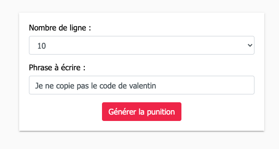

# Utiliser la session

Nous avons des informations, mais celle-ci est pour l'instant perdue « à chaque rafraichissement »… C'est dommage d'autant plus qu'en PHP sauvegarder des informations c'est simple comme bonjour.

## Introduction

En PHP l'usage de la session est transparent, c'est à dire que vous n'avez pas vraiment à vous souciez du fonctionnement de celle-ci tout ce que vous devez retenir c'est que vos valeurs sont disponible dans les tableaux :

- `$_SESSION`
- `$_COOKIE`

::: tip Super-globales ?
C'est deux variables sont des `super-globales` elle sont donc toutes les deux en permanence disponible dans votre code, et sont automatiquement rempli dès le début du chargement de votre page.
:::

La SESSION comme le COOKIE sont donc des variables « un peu magiques » qui vont vous permettre de sauvegarder des données entre chaque chargement de pages. Elles ont chacune un usage propre :

- La session servira pour des données temporaires. Les valeurs de la session sont sauvegardées **sur le serveur** (donc non modifiable par un utilisateur).
- Le cookie servira plus pour de la sauvegarde de données « plus longue durée », mais non sensible. Exemple une préférence d'affichage, ou un identifiant permettant de suivre l'activité d'un utilisateur.

## Sauvegarder dans la session

L'utilisation de la SESSION est transparente, elle ne nécessite que le démarrage de celle-ci **une seule fois** et **au début de votre page** PHP. La fonction à appeler est :

```php
session_start();
```

::: tip C'est tout
À partir de cet instant vous avez maintenant accès à la SESSION de l'utilisateur, si celle-ci n'existait pas elle a été créé pour vous. :cool:
:::

::: warning Oui mais…
Il est également possible d'arrêter la SESSION pour détruire toutes les valeurs enregistrées. Cette opération se fait avec la fonction :

```php
session_destroy();
```

Cette opération est à faire par exemple à la déconnexion de l'utilisateur sur votre site.
:::

Dans le [TP3](./tp3.md), je vous ai fait créer un « entry-point », le point d'entrée va nous servir à démarrer la SESSION vous n'aurez comme plus à vous en soucier. Maintenant que notre SESSION est créée, vous pouvez :

```php
<?php
// Écrire dedans
$phrase = 'Je ne copie pas le code de valentin.';
$_SESSION['phrase'] = $phrase;
?>

<!-- Ou la lire, par exemple -->
<input type='text' value='<?php echo $_SESSION["phrase"]; ?>' name='phrase'>

<?php
// Ou la lire, autre exemple
echo $_SESSION["phrase"]

// Ou faire des opérations algorithmiques, par exemple
if(isset($_SESSION['phrase'])){
    echo "Il y a une session";
} else {
    echo "Il n'y a pas de valeur en session";
}
```

### C'est à vous

Maintenant que nous avons revu les bases de l'utilisation de la session. Je vous propose de modifier le code que nous avons précédemment réalisé. Dans le code du [TP 2](./tp2.md) nous avons créé un formulaire :



Le formulaire est actuellement « non persisté », il est remis à zéro à chaque fois que vous accédez à votre site. C'est dommage… Je vous propose dans un premier temps de le persister via la SESSION.

_Vous devez dans un premier temps définir les variables nécessaires :_

| Variables             | Usage                                         |
| --------------------- | --------------------------------------------- |
| `$_SESSION['phrase']` | Sauvegarde la phrase saisie par l'utilisateur |
| `$_SESSION['count']`  | Sauvegarde le nombre choisi par l'utilisateur |

Maintenant que nous avons les noms de variables. Il faut trouver à quel moment sauvegarder les valeurs ?

Le bon moment est dans la page `bart.php`, cette page contient la logique d'exécution de votre code, il faudra donc dans cette page écrire quelque chose comme :

```php
$_SESSION['phrase'] = $_POST['phrase'];
$_SESSION['count'] = $_POST['count'];
```

La troisième, et dernière étape va être de relire les valeurs enregistrées dans la session afin de les utiliser dans votre formulaire, par exemple, si vous souhaitez afficher la valeur de `$_SESSION['phrase']` dans un `input`:

```php
<input type='text' value='<?php echo $_SESSION["phrase"]; ?>' name='phrase'>
```

::: tip Je vous laisse chercher pour le `select`

Pour le `select` la logique va être un peu similaire. Je vous laisse chercher comment écrire le code permettant de « pré-sélectionner » une option dans un `select`.

- [Documentation](https://developer.mozilla.org/en-US/docs/Web/HTML/Element/select)

:::

## Sauvegarder dans un cookie

Le Cookie fonctionne un peu comme la SESSION au détail près que vous enregistrez la valeur non pas sur le serveur, mais sur **le poste de l'utilisateur**. Ce détail _est important_, si vous stockez de l'information sur le poste du client, ça veut dire qu'il est possible pour lui de la modifier (nous allons voir comment ensemble).

L'autre différence entre la SESSION et les Cookies est la durée de vie de celle-ci, un cookie à une durée de vie que vous choisissez ! Ça peut aller de quelques secondes à plusieurs mois. À noter tout de même que le Cookie peut-être supprimé par le client.

Comme pour la session vous pouvez enregistrer ce que vous souhaitez dans un Cookie, cependant les données étant accessible par l'utilisateur je vous conseille de sauvegarder des informations non sensibles telles que :

- Paramétrage d'affichage.
- Identifiant de trekking (uuid).
- Données saisies par l'utilisateur (formulaire par exemple).

Vous l'avez peut-être remarqué, votre modification précédente fonctionne correctement, mais si vous attendez plus de 22 minutes vos données sont quand même perdues. Nous allons résoudre cette problématique en utilisant un Cookie plutôt.

### C'est à vous

Écrire & lire dans un cookie est très simple, tout aussi simple que dans la session. Ici pas de démarrage à faire **c'est automatique** !

```php

// Enregistre une valeur
$value = 'Valeur de test';
setcookie("monCookie", $value);
setcookie("monCookie", $value, time()+3600);  /* expire dans 1 heure */

// Récupération d'un cookie
echo $_COOKIE["monCookie"];

```

Je vous laisse modifier votre code précédent afin d'utiliser des COOKIES plutôt que la SESSION. Cette fois-ci pas d'aide, je vous laisse vous organiser.
