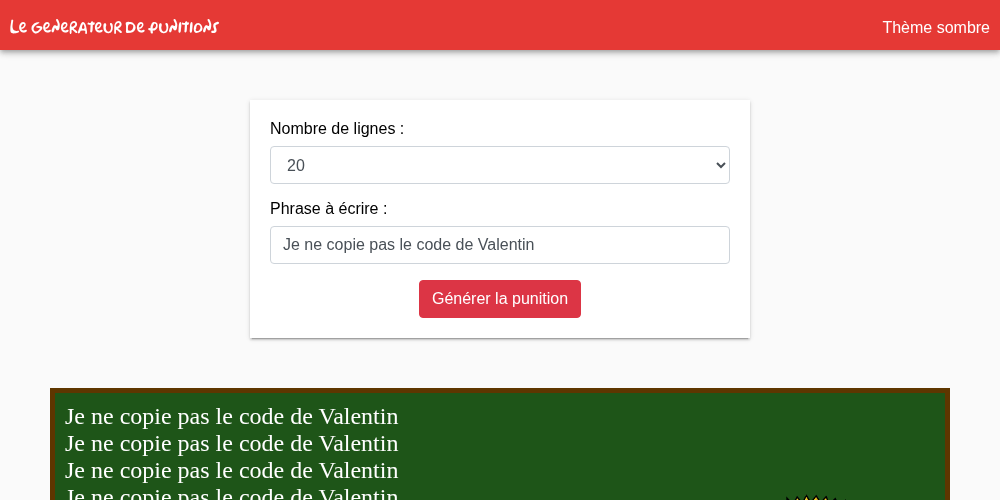
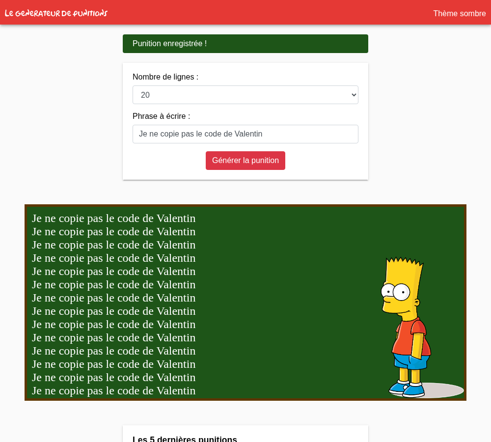
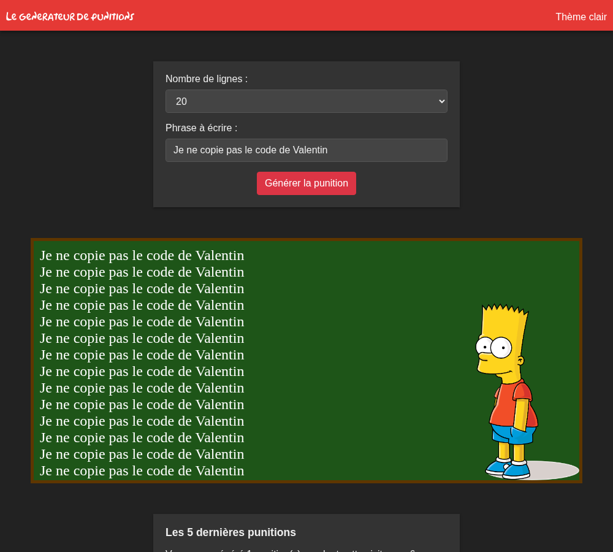

# Utiliser la session

Vos punitions sont en base de données depuis le [TP 2](./tp2.md), et votre projet est bien rangé depuis le [TP 3](./tp3.md). Il manque pourtant quelque chose : votre site ne se souvient **de rien** au sujet du visiteur. Il ne sait pas ce qu'il a choisi la dernière fois, il ne peut pas lui dire « c'est enregistré ! », et il ne sait évidemment pas qui il est.

C'est exactement le rôle de la session.

::: details Sommaire
[[toc]]
:::

Dans ce TP, je vous invite à avoir en parallèle :

- [Le complément de cours PHP](./support.md)
- [L'aide mémoire PHP](/cheatsheets/php/)

## Les slides

Avant de commencer, un tour rapide des compétences du jour : la session, le cookie, la différence entre les deux, et le message flash.

<ClientOnly>
<SlidesDeck src="php_tp4" />
</ClientOnly>

## Prérequis

- Votre projet Bart à la fin du [TP 3](./tp3.md) : le point d'entrée, la whitelist, `common/`, `pages/`, `utils/db.php`, et la base `bart`.
- XAMPP / WAMP démarré (ou le serveur PHP intégré, voir juste en dessous).

::: tip Vous n'avez pas terminé le TP 3 ?
Pas de panique, [récupérez le projet ici](/demo/php/bart/bart-form-structure-sql.zip) (le script `bart.sql` est dans l'archive, à importer dans phpMyAdmin), ou repartez de votre projet du TP 3.
:::

::: tip Vous souhaitez utiliser le serveur intégré à PHP ?

Merci ça me fait plaisir ! Du coup, c'est plutôt simple, dans un terminal (par exemple celui intégré à VSCode), placez-vous dans le dossier de votre projet puis :

```sh
# Windows (avec XAMPP)
C:/xampp/php/php -S localhost:9000

# Windows (avec WAMP)
C:/wamp64/bin/php/php8.4.0/php -S localhost:9000

# Linux / OSX
php -S localhost:9000
```

Attention, ce serveur ne vous donne que PHP : la base de données, elle, reste celle de XAMPP / WAMP.

👋 Besoin d'aide ? Je suis là !

:::

## Objectifs

À la fin de ce TP vous saurez :

- Expliquer ce que sont `$_SESSION` et `$_COOKIE`, et où sont réellement stockées leurs valeurs.
- Mémoriser **l'état du visiteur** en session (son dernier choix, un compteur), sans jamais y ranger vos données métier.
- Afficher un **message flash** après une redirection, et le supprimer une fois affiché.
- Déposer et lire un **cookie** pour une préférence d'affichage.
- Faire la différence entre ce qui survit à la fermeture du navigateur et ce qui ne survit pas.

## Étape 1 : comprendre avant de coder

En PHP, deux super-globales servent à se souvenir de quelque chose d'un chargement de page à l'autre :

- `$_SESSION` : les valeurs sont stockées **sur le serveur**. Le visiteur ne peut ni les lire ni les modifier. Il ne possède qu'un identifiant de session (un cookie `PHPSESSID`) qui permet au serveur de retrouver **son** tiroir.
- `$_COOKIE` : les valeurs sont stockées **chez le visiteur**, dans son navigateur. Il peut donc les lire, les modifier, les supprimer.

::: tip Super-globales ?
Ces deux variables sont des `super-globales` : elles sont disponibles en permanence dans votre code (dans une fonction aussi, sans le mot clé `global`), et elles sont remplies automatiquement au début du chargement de votre page.
:::

::: details Question : dans un site qui affiche votre nom en haut de page, où est stocké ce nom ?

Sur le **serveur**, en session. Le navigateur n'a reçu qu'un identifiant, du genre `PHPSESSID=8f3b2c…`, qui ne veut rien dire tout seul.

C'est la différence fondamentale : la session est une information **de confiance** (vous l'avez écrite vous-même, côté serveur), le cookie est une information **fournie par le client** (donc à traiter comme une saisie utilisateur : avec méfiance).

:::

### Une règle à retenir pour tout le TP

La session sert à mémoriser **l'état du visiteur** : ce qu'il a choisi, ce qu'on doit lui dire, et bientôt qui il est.

Elle ne sert **pas** à stocker vos données. Vos punitions, elles, sont en base depuis le TP 2, et c'est très bien comme ça : elles survivent au redémarrage du serveur, tout le monde les voit, et vous pouvez les compter, les trier, les filtrer en SQL.

### Le session_start() est déjà là

Souvenez-vous du point d'entrée écrit au TP 3 :

```php
<?php
ob_start();
session_start();
```

`session_start()` est la fonction qui ouvre (ou rouvre) le tiroir du visiteur sur le serveur. Elle doit être appelée **avant tout affichage**, et **une seule fois**. C'est précisément pour ça que nous l'avons mise dans le point d'entrée : elle est faite une fois pour tout le site, et vos pages n'ont plus à s'en soucier.

À partir de cet instant, `$_SESSION` s'utilise comme un tableau associatif tout à fait normal :

```php
// Écrire
$_SESSION['phrase'] = "Je ne copie pas le code de Valentin";

// Lire
echo $_SESSION['phrase'];

// Tester avant de lire (indispensable : au premier passage, la case n'existe pas)
if (isset($_SESSION['phrase'])) {
    echo "Je me souviens de vous.";
}

// Oublier une valeur
unset($_SESSION['phrase']);
```

## Étape 2 : se souvenir du dernier choix

Premier usage concret. Aujourd'hui, quand vous revenez sur l'accueil, le formulaire est remis à zéro. Dommage : le visiteur qui génère trois punitions de suite doit tout retaper.

Nous allons donc mémoriser en session son dernier choix, puis **pré-remplir** le formulaire avec.

Les variables à utiliser :

| Variable                   | Usage                                         |
| -------------------------- | --------------------------------------------- |
| `$_SESSION['last_phrase']` | La dernière phrase saisie par le visiteur     |
| `$_SESSION['last_count']`  | Le dernier nombre de lignes choisi            |

**À quel moment écrire ces valeurs ?** Dans `pages/bart.php` : c'est la page qui reçoit le formulaire, juste après avoir enregistré la punition en base.

```php
// L'état du visiteur : son dernier choix
$_SESSION['last_phrase'] = $phrase;
$_SESSION['last_count'] = $count;
```

**À quel moment les relire ?** Dans `pages/home.php`, au moment de construire le formulaire :

```php
// Le dernier choix du visiteur, mémorisé en session
$phrase = "Je ne copie pas le code de Valentin";
if (isset($_SESSION['last_phrase'])) {
    $phrase = $_SESSION['last_phrase'];
}

$count = 10;
if (isset($_SESSION['last_count'])) {
    $count = $_SESSION['last_count'];
}
```

Puis dans le champ texte :

```php
<input type="text" class="form-control" name="phrase" id="phrase" value="<?php echo htmlspecialchars($phrase); ?>">
```

::: details Besoin d'aide pour le select ?

Pour le `select`, c'est l'attribut `selected` qu'il faut placer sur la bonne `<option>`. Plutôt que d'écrire cinq `if`, une boucle sur les valeurs possibles fait le travail :

```php
<select name="count" id="count" class="form-control">
    <?php foreach ([10, 20, 50, 100, 1000] as $value) { ?>
        <option value="<?php echo $value; ?>" <?php if ($value == $count) { echo 'selected'; } ?>>
            <?php echo $value; ?>
        </option>
    <?php } ?>
</select>
```

:::

Le résultat attendu, après une génération, en revenant sur l'accueil :



::: tip Point de contrôle
Générez une punition avec « Je ne parle pas en classe » et 20 lignes, revenez sur l'accueil : le champ texte contient votre phrase et le `select` est positionné sur 20.
:::

## Étape 3 : le message flash

Aujourd'hui, la page `pages/bart.php` enregistre la punition **puis** affiche le tableau. Il y a un petit problème avec ça : si le visiteur recharge la page (F5), le navigateur renvoie le formulaire, et la punition est enregistrée **une deuxième fois**.

La solution est un grand classique du web : après avoir traité un formulaire, on ne répond pas par une page, on **redirige** le visiteur. Il n'a alors plus rien à renvoyer.

Mais si on redirige, comment lui dire que tout s'est bien passé ? En laissant un mot dans la session : c'est ce qu'on appelle un **message flash** (un message affiché une seule fois).

Dans `pages/bart.php`, à la place de l'affichage du tableau :

```php
// Le message à afficher sur la page suivante
$_SESSION['message'] = "Punition enregistrée !";

// Et hop, retour à l'accueil
header('location: index.php?page=home');
die();
```

Dans `pages/home.php`, tout en haut :

```php
// Le message flash : on l'affiche une fois, puis on l'oublie
if (isset($_SESSION['message'])) {
    echo '<div class="flash">' . htmlspecialchars($_SESSION['message']) . '</div>';
    unset($_SESSION['message']);
}
```

::: details Question : pourquoi supprimer le message après l'avoir affiché ?

Parce que la session **persiste**. Sans le `unset()`, la case `$_SESSION['message']` resterait remplie, et « Punition enregistrée ! » s'afficherait à chaque chargement de l'accueil, pendant toute la visite. Au bout de trois rechargements, votre visiteur ne saurait plus si sa dernière punition a été enregistrée, ou si c'est un vieux message.

Un message flash, c'est donc toujours le même trio : j'écris, j'affiche, j'oublie.

:::

::: tip Que se passe-t-il derrière avec header() et die() ?

`header('location: …')` ajoute un **en-tête HTTP** de redirection à la réponse. Deux conséquences :

- Cet en-tête ne peut pas être ajouté si l'affichage a déjà commencé. Or ici, `common/header.php` a été inclus bien avant. C'est **exactement** pour ça que le `ob_start()` du TP 3 est là : rien n'est encore réellement envoyé, la redirection reste possible.
- `header()` **n'arrête pas** le script : sans le `die()`, PHP continuerait à exécuter le reste de la page (et pourrait enregistrer, afficher, modifier des choses que vous ne voyez pas). `header()` puis `die()`, toujours les deux.

:::

Et le tableau de Bart, alors ? Il ne disparait pas : puisque la dernière phrase est en session depuis l'étape 2, affichez-le sur l'accueil, sous le formulaire.

```php
<?php if (isset($_SESSION['last_phrase'])) { ?>
    <div class="tableau">
        <?php displayPunition($_SESSION['last_phrase'], $_SESSION['last_count']); ?>
    </div>
<?php } ?>
```

Le résultat, juste après une génération :



::: tip Point de contrôle
Générez une punition : vous arrivez sur l'accueil, l'URL est bien `index.php?page=home`, le message vert s'affiche et le tableau apparait. Rechargez la page (F5) : plus de message, plus de double enregistrement, et la liste des dernières punitions n'a pas bougé.
:::

## Étape 4 : un compteur de visite

Ajoutons une petite information sur l'accueil : « vous avez généré N punitions pendant cette visite ».

Dans `pages/bart.php`, juste après l'enregistrement :

```php
// Le nombre de punitions générées pendant cette visite
if (isset($_SESSION['generated'])) {
    $_SESSION['generated'] = $_SESSION['generated'] + 1;
} else {
    $_SESSION['generated'] = 1;
}
```

Et sur l'accueil, affichez ce compteur **à côté** du total en base :

```php
$total = $pdo->query("SELECT COUNT(*) FROM phrases")->fetchColumn();
```

```php
<p>
    Vous avez généré <?php echo $generated; ?> punition(s) pendant cette visite,
    sur <?php echo $total; ?> enregistrée(s) dans la base depuis toujours.
</p>
```

::: details Question : lequel des deux survit à la fermeture du navigateur ?

Le `COUNT(*)`, évidemment : il est calculé à partir de la base de données, qui ne dépend ni du visiteur, ni de son navigateur, ni même du redémarrage du serveur.

Le compteur en session, lui, disparait à la fin de la session (fermeture du navigateur, ou expiration au bout d'une vingtaine de minutes d'inactivité). Et c'est très bien : c'est précisément ce qu'on voulait, « pendant cette visite ».

Ces deux chiffres racontent deux choses différentes. Rangez au bon endroit : **l'état du visiteur en session, les données en base**.

:::

## Étape 5 : le cookie, une préférence d'affichage

Passons au cookie. La différence avec la session, vous la connaissez : la valeur est stockée **chez le visiteur**, et vous choisissez sa durée de vie.

Écrire et lire un cookie est très simple, et il n'y a rien à démarrer :

```php
// Déposer un cookie (ici pour 30 jours)
setcookie("theme", "sombre", time() + 30 * 24 * 3600);

// Le lire, au chargement suivant
echo $_COOKIE["theme"];
```

Je vous propose d'ajouter une **préférence d'affichage** à votre site : un thème clair et un thème sombre, mémorisés dans un cookie.

Le travail à faire :

1. Une page `pages/theme.php` (à ajouter à la whitelist) qui lit le thème demandé dans `$_GET`, dépose le cookie, puis redirige vers l'accueil.
2. Dans `common/header.php`, lire `$_COOKIE['theme']` et poser une classe CSS sur le `<body>`.
3. Toujours dans le header, un lien qui permet de basculer d'un thème à l'autre.

::: details Besoin d'aide pour la page theme.php ?

```php
<?php
// La préférence choisie par le visiteur
$value = "clair";
if (isset($_GET['value']) && $_GET['value'] === "sombre") {
    $value = "sombre";
}

// Le cookie est déposé chez le visiteur, pour 30 jours
setcookie("theme", $value, time() + 30 * 24 * 3600);

// Le cookie ne sera lisible qu'au prochain chargement : on recharge la page
header('location: index.php?page=home');
die();
```

Notez le test sur la valeur reçue : elle vient de l'URL, donc du visiteur. Nous n'acceptons que « sombre » ou « clair », rien d'autre.

Et dans `common/header.php` :

```php
<?php
// La préférence d'affichage du visiteur, stockée dans un cookie
$theme = "clair";
if (isset($_COOKIE['theme'])) {
    $theme = $_COOKIE['theme'];
}
?>
…
<body class="theme-<?php echo htmlspecialchars($theme); ?>">
```

:::

::: details La partie CSS du thème sombre

```css
header nav {
  margin-left: auto;
}

header nav a {
  color: white;
  text-decoration: none;
  margin-left: 15px;
  font-family: "Segoe UI", Tahoma, Geneva, Verdana, sans-serif;
}

.flash {
  max-width: 500px;
  margin: 20px auto -30px auto;
  padding: 10px 20px;
  background-color: #1e5518;
  color: white;
  border-radius: 0.25rem;
}

body.theme-sombre {
  background-color: #222;
  color: #eee;
}

body.theme-sombre .card {
  background: #333;
  color: #eee;
}

body.theme-sombre .punitions li {
  border-bottom-color: #444;
}

body.theme-sombre .form-control {
  background-color: #444;
  color: #eee;
  border-color: #555;
}
```

:::



::: tip Que se passe-t-il derrière avec setcookie() ?

`setcookie()` n'écrit rien dans `$_COOKIE` tout de suite : elle **demande au navigateur** de conserver la valeur, via un en-tête HTTP `Set-Cookie`. Le navigateur vous la renverra au chargement **suivant**, et c'est seulement à ce moment que `$_COOKIE['theme']` existera.

C'est la raison de la redirection : on recharge la page pour lire le cookie tout juste déposé. Et comme `setcookie()` envoie un en-tête, elle a la même contrainte que `header()` : merci `ob_start()`.

:::

::: danger Jamais rien de sensible dans un cookie

Ouvrez les outils de développement de votre navigateur (F12), onglet « Application » (ou « Stockage »), section « Cookies ». Vous voyez votre cookie `theme`, et vous pouvez **le modifier à la main**.

Retenez la règle : tout ce qui est dans un cookie est lisible et modifiable par le visiteur. Donc jamais de mot de passe, jamais de « est_admin=1 », jamais un identifiant qui donne un accès. Une préférence d'affichage, oui. Une autorisation, jamais.

Et côté code : une valeur lue dans `$_COOKIE` se vérifie **exactement** comme une valeur lue dans `$_GET` ou `$_POST`.
:::

::: tip Point de contrôle
Basculez en thème sombre, fermez complètement votre navigateur, rouvrez votre site : le thème est toujours sombre (le cookie a survécu), mais le compteur « pendant cette visite » est retombé à zéro (la session, elle, est repartie de zéro).
:::

## Vous êtes en avance ?

Ajoutez une page `pages/reset.php` (whitelistée) qui remet le visiteur à neuf :

```php
<?php
// Le serveur oublie tout ce qu'il savait de ce visiteur
session_destroy();

header('location: index.php?page=home');
die();
```

Testez : le formulaire n'est plus pré-rempli, le compteur repart à zéro… mais le thème, lui, n'a pas bougé. Normal : `session_destroy()` vide le tiroir **du serveur**, pas les cookies du navigateur.

::: details Et si on voulait se souvenir de QUI est connecté ?

Bonne question, et vous avez déjà toutes les pièces : une information de confiance, stockée sur le serveur, propre à un visiteur, et qui disparait quand il s'en va. Ça ressemble furieusement à `$_SESSION['user']`, non ?

C'est tout le sujet du prochain TP.

:::

## Conclusion

Récapitulons :

- `$_SESSION` : stockée sur le serveur, de confiance, elle mémorise **l'état du visiteur** (dernier choix, message flash, compteur).
- `$_COOKIE` : stocké chez le visiteur, modifiable par lui, parfait pour une préférence d'affichage, jamais pour une autorisation.
- Vos **données** restent en base : c'est la base qui sait combien de punitions existent, pas la session.
- Après le traitement d'un formulaire : `header('location: …')` puis `die()`, avec un message flash pour prévenir le visiteur.

[Le projet complet de ce TP est téléchargeable ici](/demo/php/bart/bart-form-session-sql.zip) (le script `bart.sql` est dans l'archive).

Pour la suite, [TP 5 : protéger des pages](./tp5.md), où nous allons enfin répondre à la question « qui est connecté ? ».

👋 Si vous avez des questions, n'hésitez pas.
