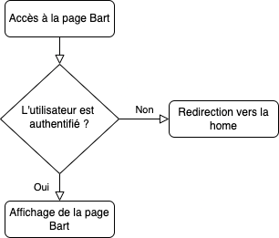

# Protéger des pages à l'aide de la session

Dans ce TP nous allons voir comment ajouter une couche d'authentification sur vos pages PHP.

::: details Sommaire
[[toc]]
:::

## Projet de référence

Pour continuer de TP, vous devez reprendre le code du [TP précédent sur l'utilisation de la Session / Cookies](./tp4.md). Ce TP va donc être découpé en plusieurs étapes :

- Création d'une page « Home » affichée à l'arrivée sur le site.
- Création d'une page « Login » qui permettra à l'utilisateur de s'authentifier.
- Gestion de l'authentification et des autorisations dans la Whitelist.

## Création de la Home

Bon ici pas d'aide, je pense que vous savez tous créer un fichier `.php`. Votre page doit être rangée correctement. En regardant le projet, vous pouvez voir que les pages sont rangées dans le dossier `pages`. Je vous laisse créer la page d'accueil de votre site.

N'oubliez pas de l'autoriser dans la blacklist. **Point important** cette page doit s'afficher lors de l'accès à votre site Internet.


::: tip N'oubliez pas

N'oubliez pas d'y inclure un lien vers votre future page de connexion.

:::

## Utiliser la session pour créer un accès protégé

Nous avons vu qu'il était possible assez simplement de sauvegarder des informations persistantes entre les rechargements avec une SESSION (ou un Cookie). Je vous propose de réfléchir à l'utilisation de la SESSION pour sauvegarder une authentification.

Nous allons sauvegarder des informations dans celle-ci pour sauvegarder la réussite d'un login utilisateur. Pour ça, je vous propose de réaliser une nouvelle page PHP, celle-ci va contenir :

- Un formulaire
- Un message indiquant « Bienvenue EMAIL » si la personne c'est connecté avec le bon « EMAIL & MOT DE PASSE ».

### Créer la page

Bon ici pas d'aide, je pense que vous savez tous créer un fichier `.php`. Votre page doit être rangée correctement. En regardant le projet, vous pouvez voir que les pages sont rangées dans le dossier `pages`.

Dans la nouvelle page, je vous propose de créer un simple formulaire. Pour le formulaire, vous pouvez de [vous inspirer de ceux proposés par Bootstrap.](https://getbootstrap.com/docs/4.0/components/forms/)

::: warning N'oubliez pas…

Pour que Bootstrap fonctionne, votre site doit avoir la librairie Bootstrap. Si ce n'est pas le cas, vous pouvez l'ajouter dans le fichier `header.php`.

::: details D'ailleurs, pourquoi dans `header.php` ?

L'organisation ! Voilà pourquoi, en organisant notre code, nous allons produire des applicatifs de « qualité » ou il sera simple d'y apporter des modifications (demain, à la fin de l'année, dans 10 ans).

:::

:::

::: tip GET ou POST ?
À votre avis ? GET ou POST pour notre formulaire ?
:::

Je vous laisse créer un formulaire similaire à :


PS: En Français dans notre cas…

### Tester votre page

Comment accéder à votre page ? Avec l'organisation proposée vous ne pouvez pas accéder directement à votre page PHP pour l'afficher. **Vous devez** passer par `l'entry-point`, c'est pour ça que les liens auront la forme suivante :

```
index.php?page=login
```

ou par exemple :

```
index.php?page=logout
```

::: tip Le point important

Ici, il est important de constater l'usage d'une variable nommée page. Celle-ci est utilisé dans le fichier `index.php` pour charger la page que l'utilisateur souhaite.

:::

### Vérifier l'authentification

La logique que nous allons mettre en place est la suivante : 



Pour vérifier l'authentification, nous allons rester simples (car ici l'objectif est de voir la SESSION, rien de plus). Je vous propose de considérer une authentification valide si :

- Email == "admin@exemple.com"
- Mot de passe == "mdp"

Si nous écrivons « l'algo » de notre vérification d'authentification, ça va donner :

```
SI email === "admin@exemple.com" ET mot_de_passe == "mdp" ALORS

    SAUVEGARDER_DANS_LA_SESSION[CONNECTE] = email

FIN SI
```

::: danger Non !
Évidemment, nous sommes d'accord **c'est nul** en termes de sécurité ! Vous ne devez JAMAIS « écrire en dur » un login de mot de passe dans votre code.

=> À votre avis pourquoi ?
:::

- C'est à vous, je vous laisse écrire le code dans la page que vous avez précédemment créée.

### Autoriser l'accès à la page de génération (ou pas)

Maintenant que nous avons sauvegardé dans la SESSION le fait que la personne est connectée, je vous propose de conditionner l'affichage du formulaire ; celui-ci ne doit pas être visible si la personne est connectée. Comment allons-nous faire ça ? En utilisant la Whiteliste évidemment !

Vous devez conditionner votre Whiteliste en fonction de l'état de connexion de votre utilisateur, exemple en `algo` :

```
$whitelist = [];

SI EST DEFINI (SAUVEGARDER_DANS_LA_SESSION[CONNECTE]) ALORS

    $whitelist = ['bart', 'home', 'logout'];

SINON SI

    $whitelist = ['login', 'home'];

FIN SI
```

::: tip prenez le temps de réfléchir et comprendre le code proposé

Avant de continuer, arrêtons-nous un instant sur le code proposé :

- Que veut-il dire ?
- Où celui-ci doit-être mis ?
- Avons-nous déjà une variable $whitelist ?

:::

Il faudra donc :

- Faire une condition (if) pour vérifier que l'élément est présent en SESSION.
    - Si présent => autoriser de la page `de génération des punitions`.
    - Si non présent => autoriser les pages dites « publiques » de la page `Home`.

### Gérer la déconnexion

À votre avis, comment allons-nous gérer la déconnexion ?

### Évolution final : Une sécurité bien gérée

Pour tester, nous avons mis un login et un mot de passe en dur. Évidemment dans la vraie vie ce n'est pas comme ça que nous procèderons. Je vous laisse créer la base de données et la table permettant de sauvegarder un mot de passe **en intégrant les notions de sécurité**.

- Le mot de passe ne doit pas être en clair.
- Ajouter dans le projet la connexion à la base de données.
  - Comment ?
  - Où ?
- Intégrer le code permettant de valider le mot de passe fourni par l'utilisateur.
- Valider le bon fonctionnement avec un jeu d'essai.
