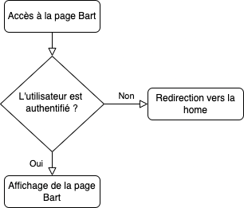
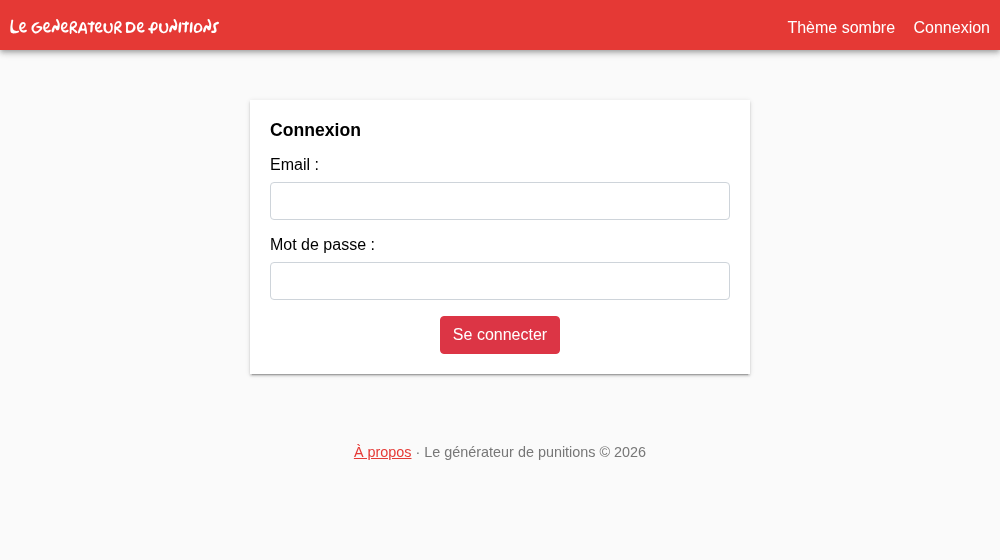
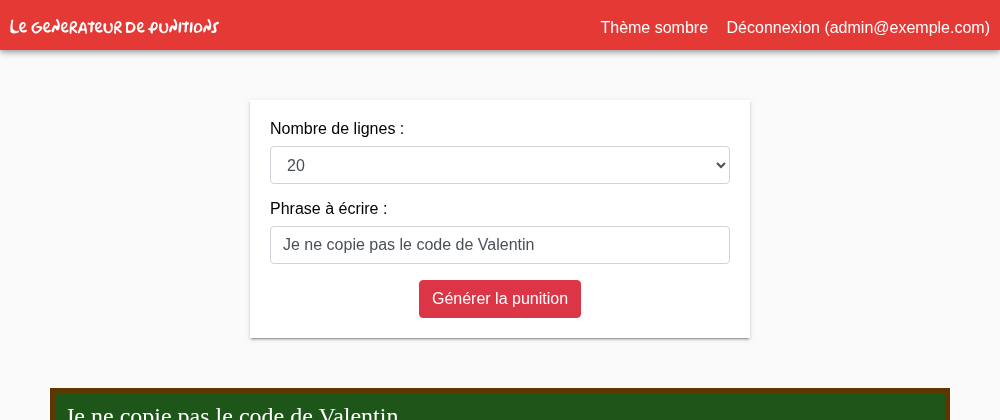

# Protéger des pages : première partie

Au [TP 4](./tp4.md), nous avons terminé sur une question : « et si on voulait se souvenir de QUI est connecté ? ». Voilà le programme du jour.

Ce TP est court (comptez 45 minutes à 1 heure) et il a un objectif unique : comprendre **le mécanisme** d'une page protégée. Pour ça, nous allons tricher sur un point, le login et le mot de passe seront écrits en dur dans le code. La vraie version, avec une table `utilisateurs` et des mots de passe hachés, c'est la seconde partie, juste après.

::: details Sommaire
[[toc]]
:::

## Les slides

Avant de commencer, un tour rapide des compétences du jour : le test de session, le flux de connexion et la redirection.

<ClientOnly>
<SlidesDeck src="php_tp5" />
</ClientOnly>

## Prérequis

- Votre projet Bart à la fin du [TP 4](./tp4.md) : le point d'entrée avec `ob_start()` et `session_start()`, la whitelist, le message flash.

::: tip Vous n'avez pas terminé le TP 4 ?
Pas de panique, [récupérez le projet ici](/demo/php/bart/bart-form-session-sql.zip) (le script `bart.sql` est dans l'archive).
:::

## Objectifs

À la fin de ce TP vous saurez :

- Écrire un formulaire de connexion et vérifier des identifiants.
- Mémoriser l'utilisateur connecté dans `$_SESSION['user']`.
- Rendre votre **whitelist conditionnelle** : les pages disponibles dépendent de l'état de connexion.
- Écrire une déconnexion propre.
- Expliquer pourquoi un identifiant écrit en dur dans le code est inacceptable en production.

## Le flux de connexion

La logique que nous allons mettre en place est la suivante :



Rien de magique : une page protégée, c'est une page normale, précédée d'un test sur la session.

## Créer la page de connexion

Créez la page `pages/login.php`, et ajoutez-la à la whitelist (sinon elle n'existe pas pour votre site). Elle contient deux choses :

- Un formulaire (email + mot de passe).
- Le traitement de ce formulaire, en haut du fichier.

::: tip GET ou POST ?
À votre avis ? GET ou POST pour ce formulaire ? Regardez à quoi ressemble l'URL après l'envoi dans chacun des cas, vous aurez la réponse.
:::

Pour la vérification, nous allons rester simples (l'objectif du jour est la session, rien d'autre). L'authentification est valide si :

- Email == `admin@exemple.com`
- Mot de passe == `mdp`

Si nous écrivons « l'algo » de notre vérification, ça donne :

```txt
SI email === "admin@exemple.com" ET mot_de_passe === "mdp" ALORS

    SAUVEGARDER_DANS_LA_SESSION[user] = email
    REDIRIGER vers l'accueil

SINON

    PREPARER un message d'erreur

FIN SI
```

::: danger Non, ça ne se fait pas

Un login et un mot de passe écrits en dur dans le code, nous sommes d'accord : **c'est nul** en termes de sécurité. Nous le faisons ici **pour comprendre le mécanisme, et seulement pour ça**.

À votre avis, pourquoi est-ce inacceptable ?

- Le mot de passe est en clair dans un fichier que tout le monde (collègues, stagiaires, et toute personne qui récupère le code) peut lire.
- Il se retrouve dans l'historique du projet, et y reste pour toujours.
- Il est le même pour tout le monde : impossible de savoir qui s'est connecté, impossible de le changer pour une seule personne.
- Il n'y a qu'un seul compte, et créer un utilisateur veut dire modifier le code.

La version correcte, c'est la seconde partie de ce TP. Promis, vous n'attendrez pas longtemps.
:::

C'est à vous, je vous laisse écrire le code de la page.

::: details Voir l'une des solutions possibles

```php
<?php
$error = "";

// Le formulaire a-t-il été envoyé ?
if (isset($_POST['email']) && isset($_POST['password'])) {
    if ($_POST['email'] === "admin@exemple.com" && $_POST['password'] === "mdp") {
        // Connexion réussie : on garde l'information en session
        $_SESSION['user'] = $_POST['email'];
        $_SESSION['message'] = "Bienvenue " . $_POST['email'];

        header('location: index.php?page=home');
        die();
    } else {
        $error = "Email ou mot de passe incorrect.";
    }
}
?>
<div class="card">
    <h2>Connexion</h2>

    <?php if ($error !== "") { ?>
        <p class="erreur"><?php echo $error; ?></p>
    <?php } ?>

    <form action="index.php?page=login" method="post">
        <div class="form-group">
            <label for="email">Email :</label>
            <input type="email" class="form-control" name="email" id="email">
        </div>

        <div class="form-group">
            <label for="password">Mot de passe :</label>
            <input type="password" class="form-control" name="password" id="password">
        </div>

        <input type="submit" value="Se connecter" class="btn btn-danger ma-auto">
    </form>
</div>
```

Vous reconnaissez le `header()` + `die()` du TP 4, ainsi que le message flash. Tout est déjà en place.

Et pour le message d'erreur, une ligne de CSS dans `public/main.css` :

```css
.erreur {
  color: #dc3545;
  font-weight: bold;
}
```

:::

Votre page doit ressembler à :



::: tip Point de contrôle
Avec un mauvais mot de passe, le message d'erreur s'affiche et vous restez sur la page. Avec les bons identifiants, vous êtes redirigé vers l'accueil, et le message « Bienvenue admin@exemple.com » s'affiche.
:::

## Autoriser l'accès à la page de génération (ou pas)

Voilà le cœur du TP. Maintenant que la session sait qui est connecté, nous allons décider **quelles pages existent** pour ce visiteur. Et pour ça, nous avons déjà l'outil parfait : la whitelist.

Jusqu'ici, elle était figée. Elle va maintenant dépendre de l'état de connexion :

```txt
$whitelist = ['home', 'about', 'theme'];

SI EST DEFINI (SAUVEGARDER_DANS_LA_SESSION[user]) ALORS

    AJOUTER 'bart' ET 'logout' à $whitelist

SINON

    AJOUTER 'login' à $whitelist

FIN SI
```

::: tip Prenez le temps de réfléchir et de comprendre le code proposé

Avant de continuer, arrêtons-nous un instant :

- Que veut-il dire ?
- Où celui-ci doit-il être mis ?
- Avons-nous déjà une variable `$whitelist` ?
- Que se passe-t-il si un visiteur non connecté demande `index.php?page=bart` ?

:::

::: details Voir l'une des solutions possibles

Dans `index.php`, à la place de votre whitelist actuelle :

```php
// Les pages autorisées dépendent maintenant de l'état de connexion du visiteur
$whitelist = ['home', 'about', 'theme'];

if (isset($_SESSION['user'])) {
    // Le visiteur est connecté
    $whitelist[] = 'bart';
    $whitelist[] = 'logout';
} else {
    // Le visiteur est anonyme
    $whitelist[] = 'login';
}
```

Un visiteur non connecté qui demande `index.php?page=bart` ne provoque aucune erreur : la page n'est tout simplement pas dans sa liste, il retombe sur l'accueil. La protection n'est pas un message, c'est une **absence**.

:::

Profitez-en pour conditionner l'affichage du formulaire sur l'accueil : inutile de proposer un bouton « Générer la punition » à quelqu'un qui n'a pas le droit d'y accéder. Affichez plutôt une invitation à se connecter.

::: warning Note pour le vous du futur

Aujourd'hui nous parlons de Whitelist, demain nous emploierons le terme de `Router`. C'est bien évidemment différent, mais le résultat sera le même :

**Seulement les pages déclarées seront accessibles**

:::

## Les liens dans le header

Dans `common/header.php`, ajoutez à côté de votre lien de thème :

- « Connexion » si personne n'est connecté.
- « Déconnexion (email) » sinon.

```php
<?php if (isset($_SESSION['user'])) { ?>
    <a href="index.php?page=logout">Déconnexion (<?php echo htmlspecialchars($_SESSION['user']); ?>)</a>
<?php } else { ?>
    <a href="index.php?page=login">Connexion</a>
<?php } ?>
```



::: details D'ailleurs, pourquoi dans header.php ?

L'organisation ! Voilà pourquoi. En rangeant ce test à un seul endroit, il s'applique à toutes les pages du site, et le jour où vous changez le libellé, vous le changez une fois. Demain, à la fin de l'année, dans 10 ans.

:::

## Gérer la déconnexion

À votre avis, comment allons-nous gérer la déconnexion ? Vous avez déjà tout ce qu'il faut.

Créez `pages/logout.php` : le site doit oublier l'utilisateur, afficher un message, et renvoyer le visiteur sur l'accueil.

::: details Voir l'une des solutions possibles

```php
<?php
// Le site oublie qui était connecté
unset($_SESSION['user']);

$_SESSION['message'] = "Vous êtes déconnecté.";

header('location: index.php?page=home');
die();
```

Pourquoi `unset($_SESSION['user'])` plutôt que `session_destroy()` ? Parce que nous voulons oublier **l'utilisateur**, pas toute la session : le message flash que nous venons d'écrire doit survivre jusqu'à la page suivante. `session_destroy()` détruirait tout, message compris.

:::

::: tip Point de contrôle

Déroulez le scénario complet :

1. Non connecté, l'accueil affiche « Connexion » et pas de formulaire de génération.
2. `index.php?page=bart` en direct : vous retombez sur l'accueil, sans erreur.
3. Connexion avec les bons identifiants : message de bienvenue, le formulaire apparait, le header affiche « Déconnexion ».
4. Une punition est générée et enregistrée normalement.
5. Déconnexion : message, et le formulaire a disparu.

:::

## Conclusion

Récapitulons :

- Une page protégée, ce n'est pas de la magie : c'est un test sur la session.
- Une connexion réussie, c'est une valeur écrite dans `$_SESSION` et une redirection.
- La **whitelist conditionnelle** est votre garde-barrière : la page interdite n'existe simplement pas.
- `header()` puis `die()`, les deux, toujours.
- Et un mot de passe en dur dans le code, c'est bon pour comprendre, pas pour la vraie vie.

Seconde partie : [TP Authentification : les bonnes pratiques](./sql/tp-authentification.md), où le login en dur est remplacé par une vraie table `utilisateurs`, des mots de passe hachés avec `password_hash()`, une inscription et une connexion en requêtes préparées.

[Le projet complet de ce TP est téléchargeable ici](/demo/php/bart/bart-form-login.zip) (le script `bart.sql` est dans l'archive).

👋 Si vous avez des questions, n'hésitez pas.
