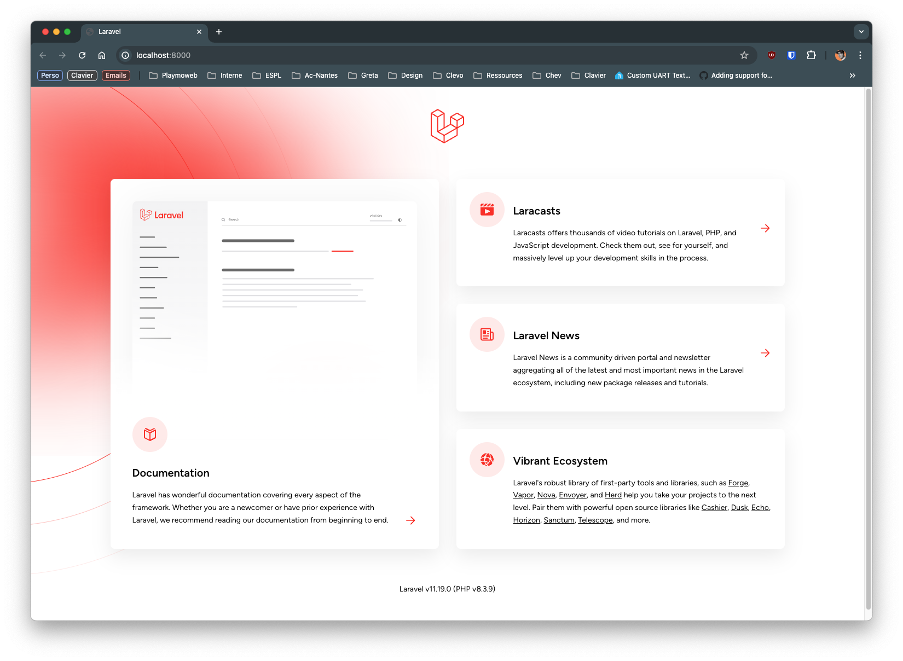

# Transition vers Laravel

Vous avez maintenant les bases en PHP pour créer des sites Web dynamiques. Vous avez vu en première année comment créer des formulaires, vous connecter à une base de données, gérer des sessions, etc. Dans ce TP nous allons voir comment un framework PHP peut vous aider à gagner du temps et à structurer votre code, en observant, et en réalisant du code dans un premier temps avec du PHP pur, puis en le transposant en Laravel.

::: details Sommaire
[[toc]]
:::

## Introduction

Ce TP servira de base à votre apprentissage du fonctionnement de **base** de Laravel. Ici, nous n'aborderons pas les notions avancées de Laravel (Base de données, Eloquent, etc.). Nous allons voir comment réaliser des équivalents de vos connaissances en PHP avec le framework Laravel.

Il y a 5 grandes catégories à traiter :

- Les liens d'accès aux pages (Routes avec Laravel) ;
- Les pages (Vues Blades avec Laravel) ;
- Les passages de données (GET) ;
- Les formulaires (POST) ;
- Les sessions.

Dans ce TP, je vous invite à avoir en parallèle :

- [Support de cours](/tp/laravel/support.md)
- [L'aide mémoire](/cheatsheets/laravel/)

::: tip Pas de panique
Laravel est un framework PHP qui se veut simple d'utilisation. Il est basé sur le principe de la programmation orientée objet, et utilise le modèle MVC (Modèle Vue Contrôleur). Vous avez déjà vu ces notions en première année, mais nous allons les revoir ici appliquées à Laravel.
:::

## Préparation

Pour pouvoir utiliser Laravel, nous allons avoir besoin de différents outils :

- PHP 8.4
- Composer

Il y a bien plus de dépendances, mais celles-ci seront récupérées automatiquement par `Composer`

### Windows

::: warning Xampp ou Wamp
Si vous utilisez Xampp aucune manipulation n’est nécessaire.
:::

Pour « installer » Laravel sous Windows, vous devez dans un premier temps installer PHP 8 sur votre machine. Dans un premier temps, installer Wamp + PHP 8 :

- [Installation de Wamp.](http://www.wampserver.com/fr/#download-wrapper)
- Installer Wamp, et vérifier que celui-ci fonctionne correctement.
- Activer l’extension `php_openssl.dll` dans la liste des extensions PHP.

#### Installer Composer

- [Télécharger Composer pour Windows](https://getcomposer.org/Composer-Setup.exe), lors de l’installation il vous sera demandé de sélectionner l’exécutable PHP. `ATTENTION:` Bien sélectionner la version 8.2 minimum de PHP.
- Vérifier que la commande est bien disponible en tapant `composer` dans un nouveau terminal.

### Linux

Pour Linux c’est plus simple, il suffit d’installer PHP 8 sur votre machine (regarder la documentation de votre distribution). Une fois que PHP est installé, il vous suffit d'installer Composer

```bash
curl -sS https://getcomposer.org/installer | php
sudo mv composer.phar /usr/local/bin/composer
chmod +x /usr/local/bin/composer
```

### macOS

Sous macOS, il est possible d’utiliser la commande `brew` pour installer PHP 8.X. Pour ça, il suffit de faire :

```bash
brew install php
```

## Créer un projet Laravel

Pour créer un projet Laravel, il suffit de taper la commande suivante :

```bash
composer create-project --prefer-dist laravel/laravel transition-php-laravel
```

::: danger Attention

Cette commande va créer un dossier `transition-php-laravel` dans le dossier courant. Faites attention à être dans le bon dossier avant de lancer la commande.

Note sur le `P:`, le P: au lycée est un lecteur réseau, même si le réseau est rapide, il est préférable de travailler sur votre disque dur local. Je vous invite donc à vous placer dans votre dossier personnel pour lancer la commande (exemple : `cd C:\Users\NomUtilisateur\Documents`).

:::

## Structure de Laravel

Laravel est un framework PHP qui suit une structure bien précise. Nous n'allons pas aujourd'hui voir l'ensemble des dossiers, mais seulement :

- `routes/web.php` : qui contient les routes de votre application (**les liens**) ;
- `resources/views` : qui contient les vues de votre application (**les pages HTML**) ;
- `app/Http/Controllers` : qui contient les contrôleurs de votre application (**votre code PHP**).

Il y évidemment d'autres dossiers, que nous verrons plus tard. L'idée ici est de vous montrer comment transposer vos connaissances en PHP pur en Laravel.

## Lancer votre projet

Contrairement à du PHP classique, Laravel est un framework qui possède un serveur intégré. Pour lancer votre projet, il suffit de taper la commande suivante :

```bash
php artisan serve
```

Cette commande va lancer un serveur local sur le port 8000. Vous pourrez donc accéder à votre projet en tapant l'adresse suivante dans votre navigateur : `http://localhost:8000`.



::: tip Astuce
Avec le serveur intégré de Laravel, vous n'avez pas besoin de lancer Xampp ou Wamp. Vous pouvez donc travailler sur votre projet dans n'importe quel dossier de votre ordinateur.
:::

## Les routes

Si vous avez accédé à votre projet, vous avez dû voir une page d'accueil. Celle-ci est générée par Laravel. Pour voir comment cela fonctionne, ouvrez le fichier `routes/web.php`. Vous devriez voir quelque chose comme ça :

```php
Route::get('/', function () {
    return view('welcome');
});
```

Ce code est une route. Une route est un lien entre une URL et une action. Ici, la route `/` est liée à une fonction anonyme qui retourne une vue. Pour créer une route, il suffit de faire :

```php
Route::get('/hello', function () {
    return "Hello World !";
});
```

Pour accéder à cette route, il suffit de taper `http://localhost:8000/hello` dans votre navigateur.

::: tip Et voilà !

Vous avez créé votre première page avec Laravel. Simple non ?

Bon… en réalité, nous allons voir comment faire bien mieux… mais c'est un bon début.

:::

### Découper les routes

En introduction, je vous ai parlé de MVC. Les routes ne sont ni des Modèles, ni des Vue… et pas vraiment des Contrôleurs. Elles sont un peu à part.

Les routes permettent juste de connecter une URL à une action. Pour les actions, nous allons voir comment les découper dans des contrôleurs.

Nous allons donc créer notre premier contrôleur :

```bash
php artisan make:controller HomeController
```

Cette commande va créer un fichier `HomeController.php` dans le dossier `app/Http/Controllers`. Nous allons remplacer nos deux routes, par des appels à des fonctions de notre contrôleur.

```php
Route::get('/', [HomeController::class, 'index']);
Route::get('/hello', [HomeController::class, 'hello']);
```

::: danger Un instant ✋

En PHP objet il y a la notion de namespace, Laravel utilise de base les namespace, ça veut dire que nous allons avoir à utiliser le mot clé `use` pour importer (include). Quand vous voulez utiliser une classe qui n'est pas dans le même fichier, il faudra déclarer l'emplacement via un `use`. Exemple, pour que `HomeController` soit accessible depuis le Routeur, il faudra :

```php
use App\Http\Controllers\HomeController;
```

- ⚠️ Si vous utilisez **PHPStorm,** cet import sera automatique.
- ⚠️ Si vous utilisez **VSCode,** il faudra passer par une extension [disponible ici](https://marketplace.visualstudio.com/items?itemName=MehediDracula.php-namespace-resolver)

Pour **PHPStorm**, alt+entrée permettra de déclencher l'ajout du use.

Pour **VSCode** je vous laisse regarder l'usage de l'extension :


Je vous invite également sur VScode à installer l'extension `PHP Intelephense` qui vous permettra d'avoir une autocomplétion plus précise et l'affichage des erreurs directement dans l'éditeur.

:::

Maintenant que nous avons nos routes, nous allons créer nos deux méthodes dans le contrôleur `HomeController`.

```php
public function index()
{
    return view('welcome');
}

public function hello()
{
    return 'Hello, World!';
}
```

Je vous laisse tester les deux routes pour voir que tout fonctionne correctement.

## Les vues

Les vues sont les pages HTML de votre application. Elles sont stockées dans le dossier `resources/views`. Pour créer une vue, il suffit de créer un fichier `.blade.php` dans ce dossier.

::: tip Pourquoi .blade.php ?

Laravel utilise un moteur de template nommé Blade. Ce moteur de template permet d'ajouter des fonctionnalités supplémentaires à vos vues. Nous verrons ça plus tard.

Mais en deux mots, Blade permet d'écrire de la logique dans vos vues. Par exemple, afficher une variable, une boucle, etc. Sans avoir à faire des `echo` à tout va. Vous verrez, c'est très pratique.

:::

### Créer une vue

Pour créer une vue, il suffit de créer un fichier `.blade.php` dans le dossier `resources/views`. Créez un fichier `hello.blade.php` avec le contenu suivant :

```html
<!DOCTYPE html>
<html lang="en">
<head>
    <meta charset="UTF-8">
    <meta name="viewport" content="width=device-width, initial-scale=1.0">
    <title>Hello world</title>
</head>
<body>
    <h1>Hello world</h1>
</body>
</html>
```

C'est tout… vous avez créé votre première vue avec Laravel (donc une page HTML). Pour que celle-ci soit accessible, il suffit de modifier la méthode `hello` de notre contrôleur `HomeController` :

```php
public function hello()
{
    return view('hello');
}
```

Qu'avons nous :

- Une route `/hello` qui pointe vers la méthode `hello` de notre contrôleur `HomeController` ;
- La méthode `hello` retourne la vue `hello` qui est stockée dans le dossier `resources/views`. L'extension `.blade.php` n'est pas nécessaire. En effet, Laravel sait que c'est une vue.

Maintenant, si vous accédez à l'URL `http://localhost:8000/hello`, vous devriez voir votre page en format HTML (et non plus du texte).

::: tip Et voilà !

Vous avez créé une route (en lien) et une vue (la page HTML). Vous avez donc déjà une base pour créer un site Web avec Laravel.

:::

## Les passages de paramètres

En PHP, vous avez vu comment passer des paramètres dans l'URL. Avec Laravel, c'est très similaire, mais nous allons avoir à utiliser une synthaxe objet.

### Le paramètre GET

Un paramètre de type GET est un paramètre que l'on retrouve dans l'URL. Par exemple, si vous avez l'URL suivante : `http://localhost:8000/hello?name=John`, le paramètre `name` est un paramètre GET.

En PHP classique, nous récupérions ce paramètre avec `$_GET['name']`. L'équivalent en Laravel est :

```php
$name = $request->input('name');
```

Ce code permet de récupérer le paramètre `name` de l'URL. Maintenant que nous savons comment récupérer un paramètre GET, nous allons voir comment l'utiliser dans notre contrôleur.

```php
public function hello(Request $request)
{
    $name = $request->input('name');
    return view('hello', ['name' => $name]);
}
```

Dans ce code, nous récupérons le paramètre `name` de l'URL, et nous le passons à notre vue `hello`. Pour afficher ce paramètre dans notre vue, il suffit de faire :

```html
<h1>Hello, {{ $name }}</h1>
```

La syntaxe `{{ $name }}` permet d'afficher la variable `$name` dans notre vue.

Je vous laisse tester en ajoutant `?name=John` à l'URL `http://localhost:8000/hello` (ou en changeant le nom).

::: tip À faire

Je vous laisse modifier le code pour afficher `World` si le paramètre `name` n'est pas présent (ou vide).

:::

### Le paramètre POST

Un paramètre de type POST est un paramètre que l'on retrouve dans le corps de la requête (exemple : un formulaire). En PHP classique, nous récupérions ce paramètre avec `$_POST['name']`. L'équivalent en Laravel est :

```php
$name = $request->input('name');
```

Ce code permet de récupérer le paramètre `name` de la requête. Maintenant que nous savons comment récupérer un paramètre POST, nous allons voir comment l'utiliser dans notre contrôleur.

```php
public function hello(Request $request)
{
    $name = $request->input('name');
    return view('hello', ['name' => $name]);
}
```

Wow ! Nous avons exactement le même code que pour un paramètre GET. C'est ça la magie de Laravel. Peu importe la source du paramètre, la récupération est la même.

Cependant, pour récupérer un paramètre POST, il faut que le formulaire soit envoyé en POST. Pour cela, nous allons créer un formulaire dans notre vue `hello.blade.php`.

```html
<form action="/hello" method="post">
    @csrf
    <input type="text" name="name" placeholder="Votre nom">
    <button type="submit">Envoyer</button>
</form>
```

Ce formulaire envoie les données en POST à la route `/hello`. Pour que Laravel accepte les requêtes POST, il faut ajouter la directive `@csrf` dans le formulaire. Cette directive permet de protéger votre formulaire contre les attaques CSRF. Il est obligatoire de l'ajouter pour que Laravel accepte les requêtes POST.

Vous vous souvenez de votre route `/hello` ? Nous allons devoir en ajouter une seconde pour que celle-ci accepte les requêtes de type POST.

```php
Route::post('/hello', [HomeController::class, 'hello']);
```

::: tip Nan mais attendez…

Vous avez vu ? Nous avons exactement la même route, mais cette fois-ci en POST. Et oui, c'est le côté pratique de Laravel, nous pensons le code autour des actions (contrôleurs) et non des liens (routes).

Il est donc possible d'avoir plusieurs routes pointant vers la même action, mais avec des méthodes HTTP différentes (GET, POST, PUT, DELETE, etc.).

:::

## Les conditions d'affichage

Sans aller trop loin, voici comment réaliser une condition d'affichage dans une vue Blade.

```html
@if (VOTRE_CONDITION)
    // Code à afficher si la condition est vraie
@else
    // Code à afficher si la condition est fausse
@endif
```

Par exemple, pour afficher un message si le paramètre `name` est vide :

```html
@if ($name == '')
    // Code à afficher si le nom est vide
@else
    // Code à afficher si le nom n'est pas vide
@endif
```

Je vous laisse modifier votre vue (page HTML) pour afficher le formulaire uniquement si le paramètre `name` est vide.

## Les sessions

Notre dernière partie va être sur les sessions. Les sessions permettent de stocker des informations entre les différentes requêtes. Par exemple, si vous vous connectez à un site, celui-ci va stocker votre identifiant de connexion dans une session.

Les sessions en PHP classique sont utilisables via `$_SESSION`, par exemple :

```php
session_start();
$_SESSION['name'] = 'John';
```

En Laravel, c'est un peu plus simple. Pour stocker une information en session, il suffit de faire :

```php
$request->session()->put('name', 'John');
```

Pour récupérer une information stockée en session, il suffit de faire :

```php
$name = $request->session()->get('name');
```

Pour supprimer une information stockée en session, il suffit de faire :

```php
$request->session()->forget('name');
```

Pour supprimer toutes les informations stockées en session, il suffit de faire :

```php
$request->session()->flush();
```

Nous allons donc sauvegarder le nom de la personne dans une session, et afficher automatiquement le nom dans le formulaire si celui-ci est présent.

Je vous laisse modifier votre contrôleur `HomeController` pour sauvegarder le nom dans une session.

👋 Des questions ? Je suis là.

## Conclusion

Nous avons vu dans ce TP les éléments de base base de Laravel, nous allons maintenant passer sur une introduction plus poussée de Laravel. Nous allons voir comment réaliser des accès à une base de données, comment réaliser des formulaires plus complexes, etc.

la suite du TP est disponible ici : [TP Laravel - Introduction](/tp/laravel/introduction.md)