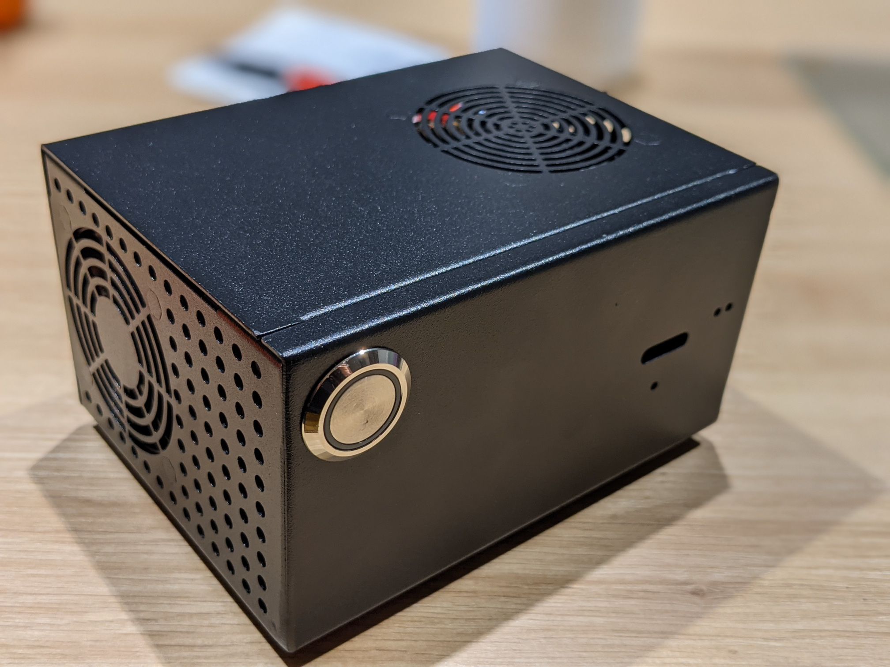
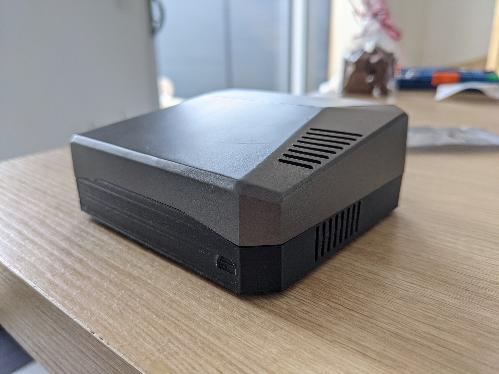
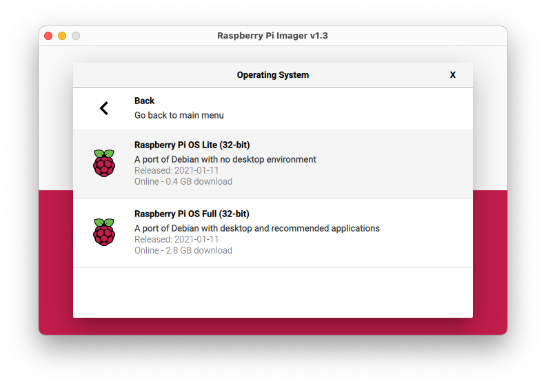

# Transformer un Raspberry Pi en server Web

::: details Sommaire
[[toc]]
:::

::: tip C'est Open-Source
La solution présentée dans cette page décrit l'installation de la solution Open-Source développée par Valentin Brosseau [disponible sur GitHub](https://github.com/c4software/rpi-docker-lamp-stack)
:::

## Introduction

Dans cette page nous allons détailler la mise en place d'un serveur web « Multi-utilisateur » / « Multi-Projets ». Ce serveur reposera sur une plateforme connue du type Raspberry Pi et sur le système de container Docker.

La solution final pourra ressembler à :

|  |  |
| -------------------------------- | -------------------------------- |


::: warning Un détail qui compte
Ce que nous allons installer n'est pas conçu pour héberger des sites publics. Pourquoi ? La configuration du serveur Apache est trop permissive et ne convient que pour du développement.

L'autre raison est le FTP, celui-ci est volontairement ouvert à toutes les connexions. Ce fonctionnement nous sera très utile pour la phase de création d'un site, mais **c'est bien évidemment à proscrire** pour une machine ouverte sur Internet.
:::

Ce que nous allons installé s'appelle une stack LAMP (Linux, Apache, MySQL, PHP) elle ne diffère pas de celle que vous pouvez installer sur votre ordinateur avec des logiciels tels que (XAMPP ou WAMP ou autres). La seule différence c'est que nous allons dédier une machine pour ça.

<center>
<iframe width="560" height="315" src="https://www.youtube-nocookie.com/embed/y7HzFidjKjs" frameborder="0" allow="accelerometer; autoplay; clipboard-write; encrypted-media; gyroscope; picture-in-picture" allowfullscreen></iframe>
</center>

## Flasher / installer le Raspberry Pi

La première étape va être d'installer le système d'exploitation de votre Raspberry Pi. Pour cette étape, il n'y a pas vraiment de règle. Personnellement j'utilise l'outil fourni par la fondation :

- [Raspberry Pi Imager](https://www.raspberrypi.org/software/)



Pour le choix de la version du système, je vous propose de partir sur celui le plus light possible à savoir « Raspberry Pi OS Lite ».

::: tip Pas de bureau
La version Lite ne contient aucun environnement de bureau. Il faudra donc activer le SSH (accès distant) avant de démarrer le Raspberry Pi. Cet accès SSH nous permettra d'effectuer les quelques commandes nécessaires au démarrage de notre future LAMP.
:::

### Activer le SSH

Avant de redémarrer le Raspberry Pi avec la carte SD inséré, nous allons activer le SSH sur le « mini-ordinateur ». Pour ça rien de bien compliqué il suffit de créer un fichier nommé `ssh` sur la partition de boot de la carte SD.

```sh
# Exemple sous mac
touch /Volumes/boot/ssh
```

Une fois le fichier créé vous pouvez retirer la Carte SD et l'insérer dans votre Raspberry Pi

## Installer Docker

Docker n'est pas disponible de base sur l'OS fourni par la fondation. Par contre il est très simple de l'installer grace au système de paquet intégré à Raspbian (pardon Raspberry Pi OS).

```sh
# Étape 1 : Mettre à jour l'OS
sudo apt-get update && sudo apt-get upgrade

# Étape 2 : Télécharger et lancer le script d'installation de Docker
curl -fsSL https://get.docker.com -o get-docker.sh && sudo sh get-docker.sh

# Étape 3 : Autoriser l'utilisateur pi (celui par défaut) à lancer la commande docker
sudo usermod -aG docker pi
```

::: warning Attention danger
De manière générale lancer **en root** un script téléchargé depuis Internet est une **très mauvaise pratique**.
:::

## Installer Docker-Compose

Docker compose est un ajout intéressant à Docker, il va nous permettre de définir des « stacks applicatives » à base de différent container Docker. Dans notre cas, ça va être très intéressant en effet un serveur LAMP est en réalité constitué de différents logiciels :

- Apache + PHP.
- MySQL.
- Un serveur FTP.

Pour l'installer, il suffit de faire :

```sh
sudo apt-get -y install libffi-dev libssl-dev python3-dev python3 python3-pip
sudo pip3 -v install docker-compose
```

::: tip
À partir de maintenant vous avez l'ensemble des outils permettant de lancer notre serveur LAMP. D'ailleurs ce que nous avons installé nous permettra de faire bien plus. Il sera possible de lancer n'importe quelle image Docker (pratique ;))
:::

## Installer la stack LAMP

Docker est maintenant disponible sur notre machine. Nous allons donc simplement récupérer les sources « de la stacks » LAMP pour la lancer sur notre Raspberry Pi. Le code est entièrement disponible sur [mon compte Github](https://github.com/c4software/rpi-docker-lamp-stack) nous allons donc avoir besoin de `git` pour le récupérer :

```sh
sudo apt install git
```

Puis

```sh
git clone git@github.com:c4software/rpi-docker-lamp-stack.git
```

::: warning
En réalisant cette commande vous allez créer dans **le dossier courant** un dossier nommé `rpi-docker-lamp-stack` celui-ci contiendra l'ensemble du code nécessaire au fonctionnement du logiciel.
:::

## Lancer la stack LAMP

Maintenant que le code est sur votre Raspberry Pi. Il suffit de le lancer pour le rendre actif. Avec Docker, pas d'icône sur le bureau! Il suffit de :

```sh
cd rpi-docker-lamp-stack
docker-compose up -d
```

::: tip Et c'est parti !
Votre stack LAMP est maintenant disponible sur votre Raspberry Pi. Vous pouvez y accéder via votre navigateur à l'adresse :

[http://raspberrypi.local/](http://raspberrypi.local/)
:::

## Fonctionnement

Vous avez donc lancé l'ensemble des services de la stack LAMP sur votre Raspberry PI. C'est terminé ! Votre serveur est prêt à recevoir vos projets ; Votre Raspberry Pi expose les services suivants :

| Service |  Port |
| ------- | ----: |
| HTTP    |    80 |
| FTP     | 20121 |
| SQL     |  3306 |

Nous avons donc :

- Un Serveur Web (Apache + PHP)
- Un Serveur SQL (MariaDB)
- Un serveur FTP (pour envoyer votre code source)

## Accès à la base de données

Pour accéder à la base de données, vous avez deux possibilités :

- Avec un logiciel depuis votre poste.
- [Via Adminer, intégré dans la stack](http://raspberrypi.local/adminer/)

Pour les login / mot de passe :

```c
host: mariadb
user: root
password: MARIADB|secret
```

## Fonctionnement du FTP intégré

Le FTP possède deux modes de fonctionnement :

- Un mode « ouvert à tous » avec des mots de passe autogénérés acceptant l'ensemble des utilisateurs présentant le bon format de mot de passe.
- Un mode classique reposant sur une liste de comptes « préalablement fournie ».

Nous avons donc un serveur FTP, celui-ci est disponible sur le port 20121 (pourquoi pas sur le port 21 ? Tout simplement pour _réduire_ un piratage…). Il fonctionne comme un FTP classique, vous devez donc utiliser un logiciel du type [Filezilla](https://filezilla-project.org/), [Cyberduck](https://cyberduck.io/).

::: danger À noter
Les deux modes sont exclusifs, si vous fournissez une liste d'utilisateurs (mode classique) celui-ci remplacera le mode automatique.
:::

### Mode 1 : Ouvert à tous.

::: tip IMPORTANT
Le FTP intégré est un peu particulier. Il est volontairement ouvert à tous, qu'est-ce que ça veut dire concrètement ?
:::

Pour le fonctionnement, celui-ci accepte n'import quel nom d'utilisateur du moment que le mot de passe fourni respecte le formalisme suivant :

```c
# Example
username: john
password: RPI|john|LAMP

# Or
username: valentin
password: RPI|valentin|LAMP

# Or
username: sample
password: RPI|sample|LAMP

# Or
username: anythingyouwant
password: RPI|anythingyouwant|LAMP

# etc.
```

Le compte de l'utilisateur est automatiquement créé lors de la première connexion. Dès l'instant que le FTP fonctionne, la partie WEB fonctionnera également 🚀.

### Mode 2 : Le mode classique

Dans le mode classique, vous devez spécifier la liste des utilisateurs ayant accès au FTP. Cette liste est au format `JSON`, le fichier est dans `ftp/users/users.json`. La liste doit-être au format JSON par exemple :

```json
{
  "votreUtilisateur": "votreMotDePasse",
  "votreUtilisateur2": "votreMotDePasse2"
}
```

## Accéder à votre Raspberry Pi

Maintenant que vous avez envoyé votre code source sur le serveur FTP celui-ci est accessible via le lien :

```c
http://raspberrypi.local/~lenomducompte
```
