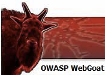

# Sécurité des développements

Le meilleurs moyen de comprendre la sécurisation d’une application / site Internet, c’est de …

* Passer des heures sur de la théorie ?
* Passer des heures sur de code à vous ?
* Passer des heures à tenter des intrusions ?
* La réponse D ?

## WebGoat



WebGoat est un outils didactique aux dimensions pédagogiques proposé par le groupe OWASP. Il s'agît d'une application WEB J2EE développée en Java et destinée à l'enseignement de manière interractive.

Elle vise à familiariser l'utilisateur aux technologies WEB (E.g: protocole HTTP, Encoding, AJAX), aux mécanismes du protocole HTTP et aux vulnérabilités qui peuvent en découler. Cet enseignement se fait au travers de différentes leçons, chacune abordant un concept particulier, détaillant un problème de sécurité donné avant de soumettre l'utilisateur à une mise en pratique immédiate. Chaque leçon (JSP) présente sur l'application comporte une vulnérabilité que l'utilisateur peut identifier et tenter d'exploiter (E.g: Injection SQL permettant de retrouver de fausses informations comme des numéros de cartes de crédit).

Voilà une liste des éléments que nous allons pouvoir « exploiter » dans WebGoat :

* Flux des contrôle d'accès et authentification
* Flux de gestion de session utilisateur
* Cross-Site Scripting (XSS)
* Injections
* Parameter and Data Tampering
* Buffer Overflows
* Configuration et stockage de données (non-sécurisée)
* Sécurité AJAX

Nous allons bien évidement pas tous les faire, l’idée est d’en faire quelques-un et si vous le souhaitez vous pourrez approfondir le sujet.


## Téléchargement

Deux versions existe :

* Le jar
* Un containeur Docker

Nous allons choisir le jar :

[Télécharger WebGoat](https://github.com/WebGoat/WebGoat/releases/download/7.1/webgoat-container-7.1-exec.jar)

## Lancement

```
java -jar webgoat-container-7.1-exec.jar
```

C’est parti, vous pouvez maintenant aller sur [http://localhost:8080/WebGoat](http://localhost:8080/WebGoat)
