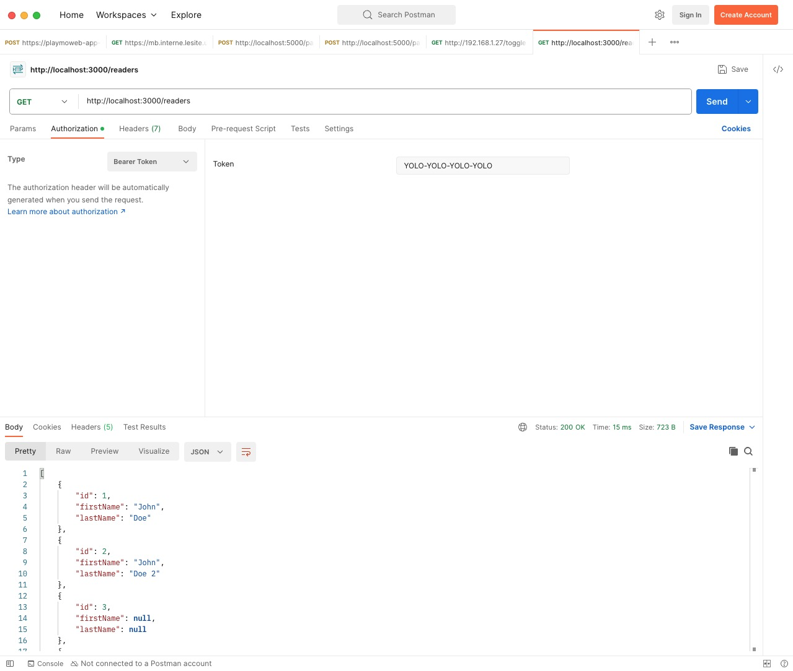

# Réaliser une API avec Bun.sh et TypeScript

Dans ce TP nous allons voir comment réaliser une API avec Bun.sh et TypeScript. Pour réaliser cette API nous nous reposerons sur les outils fournis de base par `Bun.sh` et nous utiliserons `Express` pour réaliser notre API.


::: details Sommaire
[[toc]]
:::

## Introduction

Le monde du développement Web est un univers qui va relativement vite, nous avons depuis plusieurs années un outil nommé Node qui nous permet de réaliser des applications serveurs à base de JavaScript / Typescript. Node est l'outil le plus utilisé, cependant et plutôt récemment nous avons à notre disposition de nouveaux outils très intéressants, car plus rapides et plus modernes.

Nous allons aujourd'hui utiliser [Bun.sh](https://bun.sh/), ce « nouvel outil » va nous permettre de réaliser notre application en TypeScript (et JavaScript). Le pitch de Bun.sh est simple, et est le suivant :

« Develop, test, run, and bundle JavaScript & TypeScript projects »

Cet outil est donc un « All in one », permettant de réaliser l'ensemble des tâches nécessaire à la réalisation de notre application serveur.

## Qu'allons-nous réaliser ?

Ici nous allons réaliser une API. Pour rappel, une API est une interface de programmation applicative, c'est-à-dire un ensemble de fonctions et de procédures qui permettent de réaliser des applications. Une API est donc un ensemble de fonctions et de procédures qui permettent de réaliser des applications.

Ici nous allons réaliser une API de type HTTP, c'est-à-dire que nous allons réaliser une API qui sera accessible via le protocole HTTP. Cette API sera donc accessible via une URL, et nous pourrons réaliser des requêtes HTTP sur cette API.

Les opérations seront globalement des CRUD, c'est-à-dire que nous pourrons réaliser des opérations de création, de lecture, de mise à jour et de suppression sur des données.

L'ensemble des développements seront réalisés en utilisant la méthodologie TDD (Test Driven Development), c'est-à-dire que nous allons commencer par réaliser les tests, puis nous allons coder les fonctions.

::: tip Pourquoi le TDD ?

Le TDD est une méthode de développement qui permet de réduire les erreurs de programmation et de faciliter la maintenance du code. C'est une méthode très utilisée dans le monde du développement.

:::

## Installer Bun.sh

Le guide d'installation de Bun est plutôt bien fait ([voir ici](https://bun.sh/docs/installation)), pour simplifier, voilà les commandes à exécuter :

```bash
curl -fsSL https://bun.sh/install | bash # Pour Linux / MacOS / WSL
```

Si malheusement vous êtes sous Windows et que vous n'avez pas WSL, vous pouvez utiliser npm pour installer Bun (c'est un peu étrange étant donné que Bun est un outils pour remplacer npm… mais bon, vous avez compris l'idée) :

```bash
powershell -c "irm bun.sh/install.ps1 | iex"
```

Si tout s'est bien passé, vous devriez avoir accès à la commande `bun` dans votre terminal.


## Pourquoi TypeScript ?

TypeScript est un langage de programmation qui est une surcouche du JavaScript. C'est un langage qui permet de réaliser du JavaScript, mais avec des fonctionnalités supplémentaires (comme le typage). C'est un langage qui est de plus en plus utilisé dans le monde du développement Web (Serveur et Client).

Le typage pour rappel est le fait de définir le type d'une variable (string, number, boolean…). Par exemple, en JavaScript, nous pouvons écrire :

```js
let a = 1;
a = "Hello"; // Ici nous pouvons changer le type de la variable a de number à string
```

En TypeScript, le langage va nous permettre de définir le type de la variable, et va nous empêcher de changer le type de la variable :

```ts
let a: number = 1;
a = "Hello"; // Erreur, nous ne pouvons pas changer le type de la variable a
```

Avoir un type fort est un avantage, car cela permet de réduire les erreurs de programmation (et diminuer les risques en termes de cybersécurité).

Il est également possible de typer les paramètres et les retours des fonctions :

```ts
function addition(a: number, b: number): number{
    return a + b;
}
```

Mais il est également possible de créer ces propres types :

```ts
// Définir un type Client
class Client {
    public id: number;
    public firstName: string;
    public lastName: string;
}

const client: Client = new Client(); // Ici nous créons une variable de type Client
```

## Créer un projet

Pour créer un projet Bun, il suffit d'exécuter la commande `bun init` dans un dossier vide. Bun va alors vous poser quelques questions pour créer votre projet.


::: danger Le BON dossier

Attention à bien exécuter la commande `bun init` dans un dossier vide (et non dans un dossier avec d'autres fichiers). Si vous utilisez WSL n'oubliez pas de vous placer dans votre dossier personnel en saisissant la commande `cd ~`.

:::


Qu'avons-nous ici ? 

- `Package name` : Le nom de votre projet, ici nous allons utiliser `bun-api`.
- `Entry point` : Le point d'entrée de votre projet, c'est-à-dire le fichier qui sera exécuté en premier. Ici nous allons utiliser `index.ts`.

::: tip Ça vous rappelle quelque chose ?

Et oui ! Encore un entry point… C'est normal, ça sera le cas pour beaucoup de projets Web côté serveur.

:::

### Les dossiers et fichiers

La commande `bun init` nous a créé l'ensemble des dossiers et fichiers nécessaires au bon fonctionnement de notre projet. Voici un petit récapitulatif de ce que nous avons :


- `index.ts` : Le point d'entrée de notre projet, c'est-à-dire le fichier qui sera exécuté en premier.
- `package.json` : Le fichier de configuration de notre projet, c'est ici que nous allons définir les dépendances de notre projet, les scripts, etc.
- `tsconfig.json` : Le fichier de configuration de TypeScript, c'est ici que nous allons définir les options de compilation de TypeScript.
- `node_modules` : Le dossier qui contiendra les dépendances de notre projet (les librairies que nous allons utiliser).

::: danger node_modules ? 

Et oui, `bun.sh` est rétrocompatible avec `npm`, c'est pour cela que nous avons un dossier `node_modules`. Cependant, nous n'allons pas utiliser `npm` pour installer nos dépendances, nous allons utiliser `bun add`.

:::

## Vérifier le fonctionnement

Avant de continuer, nous allons vérifier que notre projet fonctionne correctement. Pour cela, nous allons exécuter la commande `bun run index.ts` dans notre projet. Bun va alors compiler notre projet et l'exécuter.

Si tout c'est bien passé, vous devriez avoir le message suivant :

```sh
Hello via Bun!
```

<iframe src="https://giphy.com/embed/MgRKCBGvlpqTENUzWk" width="480" height="343" frameBorder="0" class="giphy-embed" allowFullScreen></iframe>

## Prise en main

Avant de réaliser votre API je vous propose de réaliser un petit exercice pour vous familiariser avec Bun.

<iframe src="https://giphy.com/embed/3oriNLx3dUqFgVi86I" width="480" height="480" frameBorder="0" class="giphy-embed" allowFullScreen></iframe>

### Modifier le message

Éditer le fichier `index.ts` et modifier le message affiché par Bun. Je vous laisse modifier le message par :

```ts
console.log("Hello via Bun, je suis un message modifié !");
```

Exécuter à nouveau votre projet avec la commande `bun run index.ts`, vous devriez voir le nouveau message s'afficher.

### Modifier la logique

Maintenant que vous savez afficher un message, je souhaite que nous ayons 100× le message affiché. Pour cela, nous allons utiliser une boucle `for`.

Éditer le fichier `index.ts` et modifier le code pour produire le message suivant :

```sh
1. Hello via Bun, je suis un message modifié !
2. Hello via Bun, je suis un message modifié !
[…]
100. Hello via Bun, je suis un message modifié !
```

::: tip Indice

Pour réaliser une boucle `for` en TypeScript, vous pouvez utiliser la syntaxe suivante :

```ts
for (let i = 0; i < 100; i++) {
  // Code à exécuter
}
```

:::

### Tester le typage des variables

En introduction, nous avons vu que le TypeScript permet de typer les variables. Nous allons maintenant tester cela.

Éditer le fichier `addition.ts` pour y mettre le code suivant :

```ts
function addition(a: number, b: number): number{
    return a + b;
}

console.log(addition(1, "test"));

export { addition }; // Exporter la fonction pour pouvoir l'utiliser dans un autre fichier
```

Votre éditeur de code devrait vous indiquer une erreur. Cette erreur nous indique que nous ne pouvons pas assigner une valeur de type `string` à une variable de type `number`. C'est exactement ce que nous souhaitions, le typage fonctionne !

Vous pouvez également lancer la commande `bun run addition.ts`.

## Mettre en place un test

La force de Bun est qu'il permet de réaliser l'ensemble des tâches nécessaires à la réalisation d'un projet et notamment les tests. Nous allons donc mettre en place un petit test pour vérifier que notre projet fonctionne correctement.

Pour rappel, un test est un ensemble de procédures qui permettent de vérifier qu'un programme fonctionne correctement.

### Créer le fichier de test

Pour créer un fichier de test, il suffit de créer un fichier avec l'extension `.test.ts`. Nous allons donc créer un fichier `addition.test.ts` dans notre projet. Vous pouvez y mettre le code suivant :

```ts
import { expect, test } from "bun:test";
import { addition } from "./addition";

test("addition 1 + 2", () => {
    expect(addition(1, 2)).toBe(3);
});

test("addition 2030 + 1020", () => {
    expect(addition(2030, 1020)).toBe(3050);
});
```

Lancer le test, pour cela exécuter la commande `bun test` dans votre projet. Vous devriez avoir le résultat suivant :

```sh
bun test
```

Cette commande va lancer l'ensemble des tests présents dans votre projet :


### Créer votre propre test

Afin de vous familiariser avec bun, je vous propose de refaire l'exercice mais pour la division. Pour cela :

- Créer un fichier `division.ts` dans votre projet.
- Créer un fichier `division.test.ts` dans votre projet.

Voici les tests que vous devez réaliser :

```ts
import { expect, test } from "bun:test";
import { division } from "./division";

test("division 1 / 2", () => {
    expect(division(1, 2)).toBe(0.5);
});

test("division 2030 / 0", () => {
    expect(division(2030, 0)).toBe(Infinity);
});
```

Je vous laisse réaliser le code de la fonction `division` (dans le fichier `division.ts`).

### Modification du test

Après réflexion, je ne souhaite plus que la fonction `division` retourne `Infinity` si le dénominateur est égal à `0`. Je souhaite que la fonction retourne une exception de type `Error` si le dénominateur est égal à `0`.

Pour cela, nous allons modifier le test :

```ts
import { expect, test } from "bun:test";
import { division } from "./division";

test("division 1 / 2", () => {
    expect(division(1, 2)).toBe(0.5);
});

test("division 2030 / 0", () => {
    expect(() => division(2030, 0)).toThrow();
});
```

Si vous lancez le test, vous devriez avoir une erreur :

```sh
bun test

division.test.ts:
✓ division 1 / 2 [0.64ms]
4 | test("division 1 / 2", () => {
5 |     expect(division(1, 2)).toBe(0.5);
6 | });
7 | 
8 | test("division 2030 / 0", () => {
9 |     expect(() => division(2030, 0)).toThrow();

error: expect(received).toThrow()
```

Je vous laisse modifier le code de la fonction `division` (dans le fichier `division.ts`). Pour lever une exception, vous pouvez utiliser le code suivant :

```ts
throw new Error("Division par 0 impossible");
```

Après correction, vous devriez avoir le résultat suivant :

```sh
bun test

division.test.ts:
✓ division 1 / 2 [0.63ms]
✓ division 2030 / 0 [0.47ms]
```

::: tip l'importance des tests

Ici nous touchons du doigts l'importance des tests. En effet, nous avons pu modifier le code de la fonction `division` sans avoir peur de casser le code.

Nous avons inversé la manière de coder, nous sommes parti de ce que nous voulions obtenir (les tests) pour ensuite coder la fonction.

Cette pratique ce nomme le TDD (Test Driven Development), c'est une pratique très utilisée dans le monde du développement Web. Elle permet de réduire les erreurs de programmation et de faciliter la maintenance du code.

:::

<iframe src="https://giphy.com/embed/dIxkmtCuuBQuM9Ux1E" width="480" height="240" frameBorder="0" class="giphy-embed" allowFullScreen></iframe>

## Place à l'API

Maintenant que nous avons vu les bases de Bun, nous allons pouvoir réaliser notre API. Pour cela, nous allons utiliser Express, une librairie qui permet de réaliser des API HTTP en JavaScript / TypeScript.

Express est un standard dans le monde du JavaScript / TypeScript. Elle est globalement très utilisé dans le dévelppement serveur. Vous ne vous tromperez pas en l'utilisant.

### Installer Express

Pour installer Express, il suffit d'exécuter la commande `bun add express` dans votre projet. Bun va alors installer Express dans votre projet.

```sh
bun add express body-parser

bun add v1.0.3 (25e69c71)
 installed express@4.18.2
 installed body-parser
```

::: tip Une erreur de permissions sous WSL avec Windows ?

Visiblement pour certains WSL sous Windows, il y a un problème de permissions. Pour corriger cela, il suffit d'exécuter la commande suivante :

```sh
bun add express body-parser --no-save
```

C'est une spécificité de WSL sous Windows au Lycée, vous n'aurez pas ce problème sous Linux ou MacOS ou sur votre Windows personnel.

:::

Cette commande ajoute dans votre projet la librairie Express, et met à jour le fichier `package.json` pour ajouter la dépendance *(pour rappel, le fichier `package.json` est le fichier de configuration de votre projet, il contient notamment les dépendances de votre projet)*.

### Créer le serveur

Maintenant que nous avons installé Express, nous allons pouvoir créer notre serveur. Pour cela, nous allons créer un fichier `server.ts` dans notre projet. Vous pouvez y mettre le code suivant :

```ts
import express from "express";

const app = express();
app.use(express.json());
app.use(express.urlencoded({ extended: true }));

app.get("/", (req, res) => {
    res.send("Hello World!");
});

app.listen(3000, () => {
    console.log("Server started on port 3000");
});
```

Ce code est relativement simple, nous créons un serveur Express, nous définissons une route `/` qui retourne `Hello World!` et nous démarrons le serveur sur le port `3000`.

Pour lancer le serveur, il suffit d'exécuter la commande `bun run server.ts` dans votre projet. Bun va alors compiler votre projet et l'exécuter.

```sh
$ bun run --watch server.ts
```

Rendez-vous sur l'URL `http://localhost:3000`, vous devriez voir le message `Hello World!`.

::: tip Pourquoi le `--watch` ?

Le `--watch` permet de relancer le serveur à chaque modification du code. C'est très pratique pour le développement.

:::

### Modifier la route

Maintenant que nous avons vu comment créer une route, nous allons modifier la route pour retourner un message plus personnalisé.

Éditer le fichier `server.ts` et modifier le code pour retourner le message suivant :

```sh
Hello via Bun, je suis une API !
```

Rendez-vous sur l'URL `http://localhost:3000`, vous devriez voir le message `Hello via Bun, je suis une API !`.

### Créer une route avec un paramètre

Maintenant que nous avons vu comment créer une route, nous allons créer une route avec un paramètre.

Éditer le fichier `server.ts` et ajouter la route suivante :

```ts
app.get("/hello/:name", (req, res) => {
    res.send(`Hello ${req.params.name}!`);
});
``` 

Rendez-vous sur l'URL `http://localhost:3000/hello/valentin`, vous devriez voir le message `Hello valentin!`.

::: tip Pourquoi `req.params.name` ?

Express permet de récupérer les paramètres de la route via `req.params`. Ici nous avons un paramètre `name`, nous pouvons donc récupérer ce paramètre via `req.params.name`.

Ça vous rappelle quelque chose ? Et oui, c'est exactement comme la structure MVC que nous avons vu en PHP.

:::

### Appeler la fonction division

Maintenant que nous avons vu comment créer une route, nous allons créer une route qui va appeler la fonction `division` que nous avons créé précédemment.

Éditer le fichier `server.ts` et ajouter la route suivante :

```ts
app.get("/division/:a/:b", (req, res) => {
    const a = parseInt(req.params.a);
    const b = parseInt(req.params.b);

    res.send(`Le résultat de la division est ${division(a, b)}`);
});
```

Rendez-vous sur l'URL `http://localhost:3000/division/10/2`, vous devriez voir le message `Le résultat de la division est 5`.

::: tip N'oubliez pas de mettre votre import

N'oubliez pas d'importer la fonction `division` dans votre fichier `server.ts` :

```ts
import { division } from "./division";
```

:::

### Gérer l'erreur « Division par 0 »

Maintenant que nous avons vu comment créer une route, nous allons créer une route qui va gérer l'erreur de type « Division par 0 ».

Éditer le fichier `server.ts` et modifier le code de la route par le code suivant :

```ts
app.get("/division/:a/:b", (req, res) => {
    const a = parseInt(req.params.a);
    const b = parseInt(req.params.b);

    try {
        res.send(`Le résultat de la division est ${division(a, b)}`);
    } catch (e) {
        res.status(400).send(e.message);
    }
});
```

Rendez-vous sur l'URL `http://localhost:3000/division/10/0`, vous devriez voir le message `Division par 0 impossible`.

::: tip qu'avons nous fait ?

Nous avons simplement ajouté un bloc `try catch` pour gérer l'erreur. Si une erreur est levée, nous retournons le code HTTP `400` avec le message de l'erreur.

**Rappel** : Le code HTTP `400` correspond à une erreur de type « Bad Request ». (voir [ici](https://developer.mozilla.org/fr/docs/Web/HTTP/Status/400)

:::

### Ajouter une route pour l'addition

Sur le même principe que la route pour la division, je vous laisse créer une route pour l'addition.

::: tip Indice

Voici la route que vous devez créer :

```ts
/addition/:a/:b"
```

:::

Je vous laisse créer la route, et tester la route.


### Et si nous souhaitions utiliser une méthode POST ?

Maintenant que nous avons vu comment créer une route, nous allons créer une route qui va gérer les requêtes POST.

Éditer le fichier `server.ts` et modifier le code de la route par le code suivant :

```ts
app.post("/addition", (req, res) => {
    const a = parseInt(req.body.a);
    const b = parseInt(req.body.b);

    res.send(`Le résultat de l'addition est ${addition(a, b)}`);
});
```

::: tip La différence avec les paramètres ?

Vous avez remarqué que nous n'avons pas utilisé `req.params` mais `req.body`. C'est normal, `req.params` permet de récupérer les paramètres de la route, `req.body` permet de récupérer les paramètres de la requête.

:::

Pour tester cette route, nous allons utiliser PostMan/HoppScotch/Bruno. PostMan/HoppScotch/Bruno sont des outils qui permettent de réaliser des requêtes HTTP. Vous pouvez les télécharger [HoppScotch](https://hoppscotch.io/), [PostMan](https://www.postman.com/), [Bruno](https://www.usebruno.com/).

HoppScotch est une alternative Gratuite et Open Source à Postman. Si vous souhaitez utiliser Postman, vous pouvez le télécharger [ici](https://www.postman.com/).

::: tip Comment utiliser HoppScotch ?

Pour que HoppScotch fonctionne, vous devez lancer votre serveur avec la commande `bun run server.ts` et avoir l'extension HoppScotch installée dans votre navigateur.

:::

Vous pouvez créer une requête POST sur l'URL `http://localhost:3000/addition` avec le champ suivant :

```
a: 10
b: 2
```


Vous devriez voir le message `Le résultat de l'addition est 12`.

### Implémenter les routes suivantes :

- `/soustraction/:a/:b`
- `/multiplication/:a/:b`

Bien entendu, vous devez gérer les erreurs.

### Conclusion de notre test

Nous avons rapidement créer une API avec Bun et Express. Nous avons vu comment créer des routes, comment gérer les erreurs, etc.

## Créer notre CRUD

Vous l'avez compris, nous allons maintenant créer notre CRUD. Pour rappel, un CRUD est un ensemble d'opérations qui permettent de manipuler des données. CRUD est l'acronyme de Create, Read, Update, Delete.

Dans un premier temps, nous allons créer la structure de notre projet. Pour cela, nous allons créer un dossier `src` dans notre projet. Ce dossier contiendra l'ensemble des fichiers de notre projet.

Notre CRUD sera assez minimaliste, nous allons créer des lecteurs et des livres. Nous aurons donc deux entités :

- `Reader` : Un lecteur, qui aura un nom et un prénom.
- `Book` : Un livre, qui aura un titre et un auteur.

### Créer les entités

Les entités sont des classes qui représentent des données. Nous allons donc créer l'entité `Reader`.

Pour cela, nous allons créer un dossier `entities` dans notre dossier `src`. Dans ce dossier, nous allons créer le fichier `Reader.ts` et `Book.ts`.

Voici le code que vous devez mettre dans les fichiers :

```ts
// Reader.ts
class Reader {
    public id: number;
    public firstName: string;
    public lastName: string;

    constructor(id: number, firstName: string, lastName: string) {
        this.id = id;
        this.firstName = firstName;
        this.lastName = lastName;
    }
}

export { Reader };

// Book.ts
class Book {
    public id: number;
    public title: string;
    public author: string;

    constructor(id: number, title: string, author: string) {
        this.id = id;
        this.title = title;
        this.author = author;
    }
}

export { Book };
```

### Créer le modèle

Les modèles seront des classes qui permettront de manipuler les entités. Nous allons donc créer le modèle `ReaderModel`

Pour cela, nous allons créer un dossier `models` dans notre dossier `src`. Dans ce dossier, nous allons créer le fichier `ReaderModel.ts`,

Voici le code que vous devez mettre dans le fichier :

```ts
// ReaderModel.ts
import Database from "bun:sqlite";
import { Reader } from "../entities/Reader.ts";

class ReaderModel {

    private db: Database;

    constructor() {
        this.db = new Database("./mydb.sqlite");
    }

    public async deleteAll(): Promise<void> {
        // TODO
    }

    public async all(): Promise<Reader[]> {
        // TODO
    }

    public async create(reader: Partial<Reader>): Promise<Number> {
        // TODO
    }

    public async read(id: number): Promise<Reader> {
        // TODO
    }

    public async update(reader: Reader): Promise<Reader> {
        // TODO
    }

    public async delete(id: number): Promise<void> {
        // TODO
    }
}

export { ReaderModel };
```

### Les tests

Vous commencez à comprendre ? Nous allons faire du TDD, nous allons donc commencer par créer les tests.

Pour cela, nous allons créer un dossier `tests` dans notre dossier `src`. Dans ce dossier, nous allons créer les fichiers `ReaderModel.test.ts`.

Voici le code que vous devez mettre dans les fichiers :

```ts
// ReaderModel.test.ts

import { expect, test, beforeAll } from "bun:test";
import { ReaderModel } from "../models/ReaderModel.ts";

beforeAll(async () => {
    // Clear the database
    const readerModel = new ReaderModel();
    await readerModel.deleteAll();
});

test("all", async () => {
    const readerModel = new ReaderModel();
    const readers = await readerModel.all();

    expect(readers).toBeInstanceOf(Array);
});

test("create", async () => {
    const readerModel = new ReaderModel();
    const id = await readerModel.create({
        firstName: "Valentin",
        lastName: "Brosseau"
    });

    expect(id).toBeGreaterThan(0);
});

test("read", async () => {
    const readerModel = new ReaderModel();
    const reader = await readerModel.read(1);

    expect(reader.id).toBe(1);
    expect(reader.firstName).toBe("Valentin");
    expect(reader.lastName).toBe("Brosseau");
});

test("update", async () => {
    const readerModel = new ReaderModel();
    const reader = await readerModel.update({
        id: 1,
        firstName: "Valentin",
        lastName: "Brosseau 2"
    });

    expect(reader.id).toBe(1);
    expect(reader.firstName).toBe("Valentin");
    expect(reader.lastName).toBe("Brosseau 2");
});

test("delete", async () => {
    const readerModel = new ReaderModel();
    await readerModel.delete(1);

    const reader = await readerModel.read(1);
    expect(reader).toBeNull();
});
```

### Jouer les tests

Maintenant que nous avons créé les tests, nous allons pouvoir les jouer. Pour cela, il suffit d'exécuter la commande `bun test` dans votre projet. Bun va alors compiler votre projet et lancer les tests.

```sh
$ bun test
```

Les tests **ne passent pas**, c'est normal, nous n'avons pas encore codé les fonctions. Nous allons donc coder les fonctions.

### Coder les méthodes

Maintenant que nous avons créé les tests, nous allons pouvoir coder les méthodes. Pour cela, nous allons modifier le fichier `ReaderModel.ts`.

::: tip Voici un exemple de code pour chaque opération :

```ts
import { Database } from "bun:sqlite";

// Référence vers la base de données
const db = new Database("mydb.sqlite");

// Lecture
const query = db.query("SELECT * FROM ma_table;");
const rows = await query.all();

// Requête préparée
const query = db.prepare("SELECT * FROM ma_table WHERE id = ?;");
const rows = await query.all(1);

// Insertion
const query = db.prepare("INSERT INTO ma_table (name) VALUES (?);");
const result = await query.run("Valentin");

// Récupération du dernier id inséré
const last_insert_rowid = db.query("SELECT last_insert_rowid() as id;");
const result_id = await last_insert_rowid.get();
console.log(result_id.id);

// Modification
const query = db.prepare("UPDATE ma_table SET name = ? WHERE id = ?;");
const result = await query.run("Valentin", 1);

// Suppression
const query = db.prepare("DELETE FROM ma_table WHERE id = ?;");
const result = await query.run(1);

// Fermeture de la base de données
db.close();
```

:::

Je vous donne le code du ReaderModel :

```ts
// ReaderModel.ts
import { Reader } from "../entities/Reader.ts";
import { Database } from "bun:sqlite";

class ReaderModel {
    db: Database;

    constructor() {
        this.db = new Database("./mydb.sqlite");
    }

    deleteAll() {
        let query = this.db.prepare("DELETE FROM readers;");
        query.run();

        let query2 = this.db.prepare("DELETE FROM sqlite_sequence WHERE name = 'readers';");
        query2.run();
    }

    public async all(): Promise<Reader[]> {
        const query = this.db.prepare("SELECT * FROM readers;");
        const rows = await query.all();

        const readers: Reader[] = [];
        for (const row of rows) {
            const reader = new Reader();
            reader.id = row.id;
            reader.firstName = row.firstName;
            reader.lastName = row.lastName;

            readers.push(reader);
        }

        return readers;
    }

    public async create(reader: Partial<Reader>): Promise<Number> {
        const query = this.db.prepare("INSERT INTO readers (firstName, lastName) VALUES (?, ?);");
        const result = await query.run(reader.firstName, reader.lastName);

        const last_insert_rowid = this.db.query("SELECT last_insert_rowid() as id;");
        const result_id = await last_insert_rowid.get();

        return result_id.id;
    }

    public async read(id: number): Promise<Reader | null> {
        const query = this.db.prepare("SELECT * FROM readers WHERE id = ?;");
        const row = await query.get(id);

        if (!row) {
            return null;
        }

        const reader = new Reader();
        reader.id = row.id;
        reader.firstName = row.firstName;
        reader.lastName = row.lastName;

        return reader;
    }

    public async update(reader: Reader): Promise<Reader> {
        const query = this.db.prepare("UPDATE readers SET firstName = ?, lastName = ? WHERE id = ?;");
        await query.run(reader.firstName, reader.lastName, reader.id);
        return reader;
    }

    public async delete(id: number): Promise<void> {
        const query = this.db.prepare("DELETE FROM readers WHERE id = ?;");
        await query.run(id);

        return Promise.resolve();
    }
}

export { ReaderModel };
```

### Fichier SQLite

Pour que notre code fonctionne, nous avons besoin d'une base de données. Pour cela, nous allons utiliser SQLite, une base de données légère qui fonctionne avec un fichier.

Vous pouvez télécharger le fichier `mydb.sqlite` <a href="/sqlite/mydb.sqlite" download>ici</a>.

Une fois le fichier téléchargé, **vous devez** le mettre dans le dossier **src** de votre projet.

::: tip Pas de panique

Le fichier ici est un fichier SQLite vide, il ne contient que la structure de la base de données. Nous allons la remplir au fur et à mesure. Vous pouvez ouvrir ce fichier avec :

- [DataGrip](https://www.jetbrains.com/datagrip/)
- [DB Browser for SQLite](https://sqlitebrowser.org/)
- [TablePlus](https://tableplus.com/)
- [SQLite pour VSCode](https://marketplace.visualstudio.com/items?itemName=alexcvzz.vscode-sqlite)

:::

### Jouer les tests

Maintenant que nous avons codé les méthodes, nous allons pouvoir jouer les tests. Pour cela, il suffit d'exécuter la commande `bun test` dans votre projet. Bun va alors compiler votre projet et lancer les tests.

```sh
$ bun test
```


Les tests devraient passer, c'est une bonne nouvelle !

### Point étape Git

Ne serait-il pas temps de faire un point étape Git ? Je vous laisse faire un commit avec le message `CRUD Reader`.

### Tests pour le modèle Book

Maintenant que nous avons créé le CRUD pour le modèle Reader, nous allons pouvoir créer le CRUD pour le modèle Book. Si vous avez bien compris, vous devriez pouvoir le faire sans aide.

Je ne vais vous donner que les tests :

```ts
// BookModel.test.ts

import { expect, test, beforeAll } from "bun:test";
import { BookModel } from "../models/BookModel.ts";

beforeAll(async () => {
    // Clear the database
    const bookModel = new BookModel();
    await bookModel.deleteAll();
});

test("all", async () => {
    const bookModel = new BookModel();
    const books = await bookModel.all();

    expect(books).toBeInstanceOf(Array);
});

test("create", async () => {
    const bookModel = new BookModel();
    const id = await bookModel.create({
        title: "Mon livre",
        author: "Valentin Brosseau"
    });

    expect(id).toBeGreaterThan(0);
});

test("read", async () => {
    const bookModel = new BookModel();
    const book = await bookModel.read(1);

    expect(book.id).toBe(1);
    expect(book.title).toBe("Mon livre");
    expect(book.author).toBe("Valentin Brosseau");
});

test("update", async () => {
    const bookModel = new BookModel();
    const book = await bookModel.update({
        id: 1,
        title: "Mon livre",
        author: "Valentin Brosseau 2"
    });
});

test("delete", async () => {
    const bookModel = new BookModel();
    await bookModel.delete(1);

    const book = await bookModel.read(1);
    expect(book).toBeNull();
});
```

C'est à vous de jouer ! Je vous laisse créer le modèle `BookModel` et faire passer les tests (vous pouvez vous inspirer du modèle `ReaderModel`). N'oubliez pas de faire un commit avec le message `CRUD Book`.

### Conclusion sur le CRUD

Créer un CRUD est un « basique » du développement. en travaillant en TDD, nous rendons notre code plus robuste et plus maintenable.

En effet, nous nous assurons que notre code fonctionne correctement quelques soit les modifications que nous apportons (les tests nous le diront).

## Créer les routes

Maintenant que nous avons créé les modèles, nous allons pouvoir créer les routes. Pour cela, nous allons créer un dossier `routes` dans notre dossier `src`. Dans ce dossier, nous allons créer les fichiers `ReaderRoute.ts` et `BookRoute.ts`.

Pourquoi découper les routes dans des fichiers différents ? Pour une question de maintenabilité. En effet, si nous avons 100 routes, nous aurons 100 routes dans un seul fichier. C'est un peu compliqué à maintenir. En découpant les routes dans des fichiers différents, nous rendons notre code plus maintenable.

### Les routes pour le modèle Reader

Nous allons commencer par créer les routes pour le modèle Reader. Pour cela, nous allons créer le fichier `ReaderRoute.ts` dans le dossier `routes`.

Voici le code que vous devez mettre dans le fichier :

```ts
// ReaderRoute.ts

import express from "express";
import { ReaderModel } from "../models/ReaderModel.ts";

const router = express.Router();

router.get("/", async (req, res) => {
    const readerModel = new ReaderModel();
    const readers = await readerModel.all();

    res.send(readers);
});

router.post("/", async (req, res) => {
    const readerModel = new ReaderModel();
    const id = await readerModel.create(req.body);

    res.send({
        id: id
    });
});

router.get("/:id", async (req, res) => {
    const readerModel = new ReaderModel();
    const reader = await readerModel.read(parseInt(req.params.id));

    if (!reader) {
        res.status(404).send("Reader not found");
        return;
    }

    res.send(reader);
});

router.put("/:id", async (req, res) => {
    const readerModel = new ReaderModel();
    const reader = await readerModel.read(parseInt(req.params.id));

    if (!reader) {
        res.status(404).send("Reader not found");
        return;
    }

    await readerModel.update({
        id: reader.id,
        firstName: req.body.firstName,
        lastName: req.body.lastName
    });

    res.send(reader);
});

router.delete("/:id", async (req, res) => {
    const readerModel = new ReaderModel();
    const reader = await readerModel.read(parseInt(req.params.id));

    if (!reader) {
        res.status(404).send("Reader not found");
        return;
    }

    await readerModel.delete(reader.id);

    res.send(reader);
});

export { router };
```

Qu'avons nous fait ? Nous avons créé le CRUD pour le modèle Reader. Nous avons donc créé les routes suivantes :

- `GET /` : Récupérer tous les lecteurs.
- `POST /` : Créer un lecteur.
- `GET /:id` : Récupérer un lecteur.
- `PUT /:id` : Mettre à jour un lecteur.
- `DELETE /:id` : Supprimer un lecteur.

::: tip Pourquoi `PUT` et non `PATCH` ?

Nous aurions pu utiliser la méthode `PATCH` pour mettre à jour un lecteur. Cependant, la méthode `PATCH` est moins utilisée que la méthode `PUT`. Nous avons donc choisi d'utiliser la méthode `PUT`.

Qu'attend la méthode `PUT` et le `POST` ? Ces méthodes attendent un objet JSON qui contient les données à mettre à jour ou ajouter. Par exemple :

```json
{
    "firstName": "Valentin",
    "lastName": "Brosseau"
}
```

:::

Pour l'instant la création seul des routes ne suffit pas, nous devons les ajouter au serveur. Sans cela, les routes (et donc votre code) ne seront pas accessible.

### Ajouter les routes au serveur

Maintenant que nous avons créé les routes, nous allons pouvoir les ajouter au serveur. Pour cela, nous allons modifier le fichier `server.ts`.

Voici le code que vous devez mettre dans le fichier :

```ts
// server.ts

import express from "express";
import { router as readerRouter } from "./routes/ReaderRoute";

const app = express();

app.use(express.json());

app.use("/readers", readerRouter);

app.listen(3000, () => {
    console.log("Server started on port 3000");
});
```

Il faut évidement laisser le code existant, ici nous ajoutons simplement les routes pour les lecteurs.

- Vous noterez que nous avons ajouté `app.use(express.json());`. Cette ligne permet de dire à Express que nous allons utiliser le format JSON pour les requêtes. Cela nous permettra de récupérer les données de la requête via `req.body`.
- Vosu noterez également que nous avons ajouté `app.use("/readers", readerRouter);`. Cette ligne permet de dire à Express que nous allons utiliser le router `readerRouter` pour la route `/readers`, les routes que nous avons créé dans le fichier `ReaderRoute.ts` seront donc accessible sous le prefix `/readers`.

Je vous laisse tester les routes avec HoppScotch (ou Postman ou Bruno)) :

- `GET /readers` : Récupérer tous les lecteurs.
- `POST /readers` : Créer un lecteur.
- `GET /readers/:id` : Récupérer un lecteur.
- `PUT /readers/:id` : Mettre à jour un lecteur.
- `DELETE /readers/:id` : Supprimer un lecteur.

Voici un exemple avec la route `GET /readers` :


Pour le POST et le PUT, n'oubliez pas de mettre le contenu de la requête en JSON, en suivant l'exemple :


### Les routes pour le modèle Book

En vous inspirant du modèle `ReaderRoute.ts`, je vous laisse créer les routes pour le modèle `Book`.

Je vous donne les routes :

- `GET /` : Récupérer tous les livres.
- `POST /` : Créer un livre.
- `GET /:id` : Récupérer un livre.
- `PUT /:id` : Mettre à jour un livre.
- `DELETE /:id` : Supprimer un livre.

### Ajouter les routes au serveur

Je vous laisse ajouter les routes au serveur en reprenant le principe du modèle `ReaderRoute.ts` (n'oubliez pas d'ajouter le prefix `/books`)

### Conclusion sur les routes

Déclarer et utiliser un routeur avec avec Express est relativement simple. Nous avons finalement que « une seule ligne à ajouter » pour déclarer un routeur. Exemple :

```ts
app.use("/readers", readerRouter);
```

- `app` : Notre serveur Express.
- `use` : Indique à express que nous allons inclure un routeur.
- `/readers` : Le prefix de la route. (exemple : `/readers/1`)
- `readerRouter` : Le routeur à inclure (notre routeur pour les lecteurs).

### Tester les routes

Nous avons l'ensemble de notre API, il est temps de la tester. Pour cela, nous allons utiliser HoppScotch/PostMan/Bruno. Dans HoppScotch/PostMan/Bruno, nous allons créer une requête pour chaque route.

Je vous laisse tester les routes avec HoppScotch :

- `GET /readers` : Récupérer tous les lecteurs.
- `POST /readers` : Créer un lecteur.
- `GET /readers/:id` : Récupérer un lecteur.
- `PUT /readers/:id` : Mettre à jour un lecteur.
- `DELETE /readers/:id` : Supprimer un lecteur.

- `GET /books` : Récupérer tous les livres.
- `POST /books` : Créer un livre.
- `GET /books/:id` : Récupérer un livre.
- `PUT /books/:id` : Mettre à jour un livre.
- `DELETE /books/:id` : Supprimer un livre.

N'oubliez pas de tester la bonne création en base de données des différents modèles.

## Conclusion

Réaliser une API avec Bun + Express est un jeu d'enfant ! Dans ce TP nous avons vu comment créer une API mais également comment **la tester**.

Et oui ! Créer une API est simple, la tester est plus compliqué. Ici nous avons coder en TDD c'est à dire en partant du test pour coder la fonction. C'est une pratique très utilisée dans le monde du développement Web.

Nous avons également créé un CRUD (Create, Read, Update, Delete) pour les lecteurs et les livres. Cette partie est très importante, c'est une partie que vous retrouverez dans tous les projets.

## Implémenter une authentification sur les routes

Difficile de faire une API sans parler d'authentification. Il existe plusieurs méthodes d'authentification :

- Basic Auth (utilisateur / mot de passe, encodé en base64 dans le header de la requête).
- Un token simple (un token généré par l'API, stocké dans la base de données).
- JWT (JSON Web Token).
- OAuth2 (utilisé par Google, Facebook, etc.).

Nous allons voir comment implémenter une authentification « simple » avec un token. Cette méthode est très limité elle ne permet pas vraiment d'authentifier un utilisateur. Cependant, elle permet de valider l'accès ou non à une ressource.

### Créer la table

Pour stocker les tokens, nous allons créer une table `tokens` dans notre base de données. Pour cela, nous allons utiliser le fichier `mydb.sqlite` que nous avons créé précédemment.

Voici le code SQL que vous devez exécuter :

```sql
CREATE TABLE tokens (
    id INTEGER PRIMARY KEY AUTOINCREMENT,
    token TEXT NOT NULL,
);
```

Cette table contient deux champs :

- `id` : L'identifiant du token.
- `token` : Le token (chaîne de caractères qui sera en réalité un UUID).

### Créer le modèle

Maintenant que nous avons créé la table, nous allons pouvoir créer le modèle. Pour cela, nous allons créer le fichier `TokenModel.ts` dans le dossier `models`.

Nous allons avoir besoin des méthodes suivantes :

- `create` : Créer un token en base de données. (retourne l'identifiant du token).
- `find` : Vérifier si un token existe (retourne `true` ou `false`).

### Ajouter un token en base de données

Maintenant que nous avons créé le modèle, nous allons pouvoir ajouter un token en base de données. Pour cela, vous pouvez créer un test dans le fichier `TokenModel.test.ts` :

```ts
// TokenModel.test.ts
import { expect, test, beforeAll } from "bun:test";
import { TokenModel } from "../models/TokenModel.ts";

beforeAll(async () => {
    // Clear the database
    const tokenModel = new TokenModel();
    await tokenModel.deleteAll();
});

test("create", async () => {
    const tokenModel = new TokenModel();
    const id = tokenModel.create("f47ac10b-58cc-4372-a567-0e02b2c3d479");

    expect(id).toBeInstanceOf(string);
});

test("read", async () => {
    const tokenModel = new TokenModel();
    const token = await tokenModel.find("f47ac10b-58cc-4372-a567-0e02b2c3d479");

    expect(token).toBe(true);
});
```

### Authentifier les requêtes (HTTP)

Maintenant que nous avons notre système de token. Nous allons pouvoir authentifier les requêtes. Pour cela, nous allons créer un middleware qui va vérifier si le token est valide à chaque demande de notre utilisateur.

::: tip Point sécurité

Ce système d'authentification est très simple, il ne doit être utilisé que dans des cas très spécifiques. En effet, il est très facile de voler un token. Il est donc très facile de se faire passer pour un autre utilisateur.

:::

Mais avant tout… Qu'est-ce qu'un middleware ? Un middleware est une fonction qui va être exécutée à chaque requête (HTTP). C'est très pratique pour ajouter des fonctionnalités à notre API.

Pour créer un middleware, nous allons créer le fichier `TokenMiddleware.ts` dans le dossier `middlewares`.

Voici le code que vous devez mettre dans le fichier :

```ts
// TokenMiddleware.ts

import { Request, Response, NextFunction } from "express";
import { TokenModel } from "../models/TokenModel.ts";

const tokenModel = new TokenModel();

const tokenMiddleware = (req: Request, res: Response, next: NextFunction) => {
    // Nous allons ici vérifier que notre requête contient bien un token et que ce token est valide.
    // Si le token est valide, nous allons appeler la fonction next() pour passer à la suite.
    // Si le token n'est pas valide, nous allons retourner une erreur 401 (Unauthorized).

    // Vérifier que la requête contient bien un token
    if(!req.headers.authorization) {
        res.status(401).send("Unauthorized");
        return;
    }

    // Vérifier que le token est valide
    const token = req.headers.authorization.replace("Bearer ", "");
    const isValid = tokenModel.find(token);

    // Si le token n'est pas valide, nous retournons une erreur 401 (Unauthorized)
    if(!isValid) {
        res.status(401).send("Unauthorized");
        return;
    }

    // Si le token est valide, nous appelons la fonction next() pour passer à la suite.
    next();
};

export { tokenMiddleware };
```

### Ajouter le middleware au serveur

Maintenant que nous avons créé le middleware, nous allons pouvoir l'ajouter au serveur. Pour cela, nous allons modifier le fichier `server.ts`.

Éditer le fichier `server.ts` et ajouter le middleware à toutes les routes, le middlware doit être ajouté avant les routes :

```ts
// […] Le reste du code
// L'import du middleware
import { tokenMiddleware } from "./middlewares/TokenMiddleware.ts";

app.use(express.json());
app.all("*", tokenMiddleware);

// […] Le reste du code
```

::: tip La documentation

Et si nous ne voulions pas ajouter le middleware à toutes les routes ?

Et bien c'est possible ! L'autre solution est d'ajouter le middleware uniquement aux routes qui nous intéressent. Pour cela, il suffit d'ajouter le middleware dans la route :

```ts
app.use("/readers", tokenMiddleware, readerRouter);
```

Ici, nous ajoutons le middleware uniquement aux routes qui commencent par `/readers`.

Vous voulez en savoir plus sur les middlewares ? Je vous invite à lire la documentation d'Express [ici](https://expressjs.com/en/guide/using-middleware.html).

:::

### Tester le bon fonctionnement

Maintenant que nous avons créé le middleware, nous allons pouvoir le tester. Pour cela, nous allons utiliser HoppScotch (ou PostMan ou Bruno). Vous ne devriez pas pouvoir accéder à une route sans token.

Une fois le Bearer Token ajouté, vous devriez pouvoir accéder à la ressource :



C'est à vous ! Je vous laisse tester le bon fonctionnement du middleware.

### Allez plus loin

La vrai bonne pratique est d'utiliser un système d'authentification plus complexe. En 2023, le système d'authentification le plus utilisé est le JWT (JSON Web Token). Je vous invite à lire la documentation [ici](https://jwt.io/introduction/).

Difficile dans un TP de tout voir. Si vous souhaitez implémenter un token JWT vous pouvez lire la ressource [disponible ici](https://www.digitalocean.com/community/tutorials/nodejs-jwt-expressjs)

### Une suite possible

Je vous laisse ajouter les routes suivantes :

- `POST /token` : Valider un token.
- `POST /tokens` : Créer un token.

Je vous laisse créer les routes et la déclaration des routes dans le serveur.

## Conclusion

Et voilà ! Vous avez créé votre première API avec Bun et Express. Vous avez vu comment créer un CRUD, comment créer des routes, comment tester une API. Ce TP est une base qui vous permettra de créer vos propres API.

Si vous souhaitez découvrir des sujets connexes, je vous invite à lire les ressources suivantes :

- NestJS : <https://nestjs.com/> (un framework pour créer des API avec ExpressJS)
- TypeORM : <https://typeorm.io/> (un ORM pour NodeJS / Bun)
- Bun : <https://bun.sh/> (le site officiel de Bun)

Ou une alternative complète pour créer des API avec GraphQL :

- Hasura : <https://hasura.io/> (un outil qui permet de créer une API GraphQL à partir d'une base de données).

<center>
<iframe src="https://giphy.com/embed/jJQC2puVZpTMO4vUs0" width="480" height="400" frameBorder="0" class="giphy-embed" allowFullScreen></iframe>
</center>
