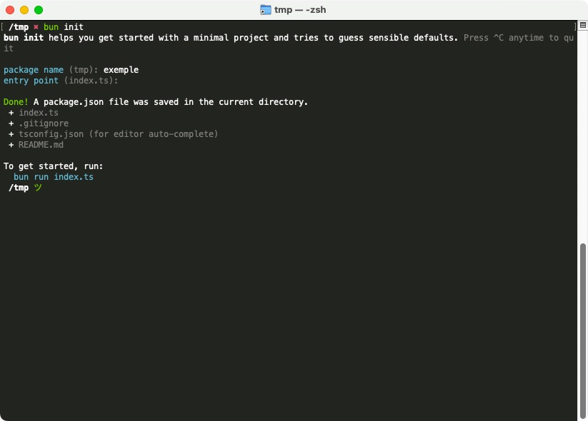
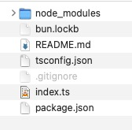
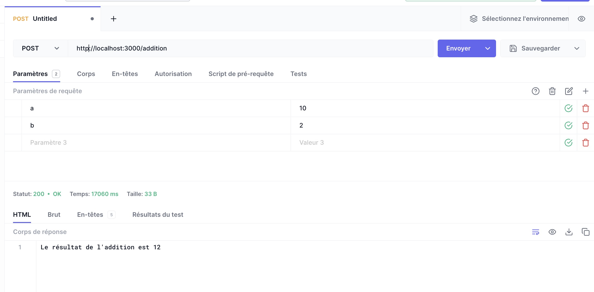
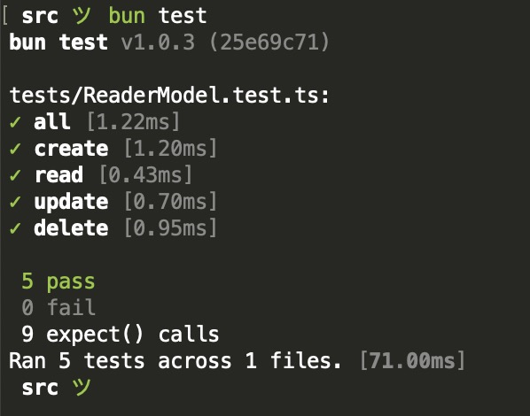

# Réaliser une API avec Bun.sh et TypeScript

Dans ce TP nous allons voir comment réaliser une API avec Bun.sh et TypeScript. Pour réaliser cette API nous nous reposerons sur les outils fournis de base par `Bun.sh` et nous utiliserons `Express` pour réaliser notre API.


::: details Sommaire
[[toc]]
:::

## Introduction

Le monde du développement Web est un univers qui va relativement vite, nous avons depuis plusieurs années un outils nommé Node qui nous permet de réaliser des applications serveurs à base de Javascript / Typescript. Node est l'outil le plus utilisé, cependant et plutôt récement nous avons à notre disposition de nouveaux outils très intéressants car plus rapide et plus moderne.

Nous allons aujourd'hui utiliser [Bun.sh](https://bun.sh/), ce « nouvel outil » va nous peremettre de réaliser notre applications en TypeScript (et JavaScript). Le pitch de Bun.sh est simple, et est le suivant :

« Develop, test, run, and bundle JavaScript & TypeScript projects »

Cette outils est donc un « All in one », permettant de réaliser l'ensemble des tâches nécessaire à la réalisation de notre application serveur.

## Qu'allons nous réaliser ?

Ici nous allons réaliser une API. Pour rappel, une API est une interface de programmation applicative, c'est à dire un ensemble de fonctions et de procédures qui permettent de réaliser des applications. Une API est donc un ensemble de fonctions et de procédures qui permettent de réaliser des applications.

Ici nous allons réaliser une API de type HTTP, c'est à dire que nous allons réaliser une API qui sera accessible via le protocole HTTP. Cette API sera donc accessible via une URL, et nous pourrons réaliser des requêtes HTTP sur cette API.

Les opérations seront globalement des CRUD, c'est à dire que nous pourrons réaliser des opérations de création, de lecture, de mise à jour et de suppression sur des données.

L'ensemble des développements seront réalisés en utilisant la métodoogie TDD (Test Driven Development), c'est à dire que nous allons commencer par réaliser les tests, puis nous allons coder les fonctions.

::: tip Pourquoi le TDD ?

Le TDD est une méthode de développement qui permet de réduire les erreurs de programmation et de faciliter la maintenance du code. C'est une méthode très utilisée dans le monde du développement.

:::

## Installer Bun.sh

Le guide d'installation de Bun est plutôt bien fait ([voir ici](https://bun.sh/docs/installation)), pour simplifier voilà les commandes à exécuter :

```bash
curl -fsSL https://bun.sh/install | bash # Pour Linux / MacOS / WSL
```

Si malheusement vous êtes sous Windows et que vous n'avez pas WSL, vous pouvez utiliser npm pour installer Bun (c'est un peu étrange étant donné que Bun est un outils pour remplacer npm… mais bon, vous avez compris l'idée) :

```bash
npm install -g bun
```

Si tout c'est bien passé vous devriez avoir accès à la commande `bun` dans votre terminal.


## Pourquoi TypeScript ?

TypeScript est un langage de programmation qui est une surcouche du JavaScript. C'est un langage qui permet de réaliser du JavaScript, mais avec des fonctionnalités supplémentaires (comme la typage). C'est un langage qui est de plus en plus utilisé dans le monde du développement Web (Serveur et Client).

Le typage pour rappel est le fait de définir le type d'une variable (string, number, boolean…). Par exemple, en JavaScript nous pouvons écrire :

```js
let a = 1;
a = "Hello"; // Ici nous pouvons changer le type de la variable a de number à string
```

En TypeScript, le langage va nous permettre de définir le type de la variable, et va nous empêcher de changer le type de la variable :

```ts
let a: number = 1;
a = "Hello"; // Erreur, nous ne pouvons pas changer le type de la variable a
```

Avoir un type fort est un avantage, car cela permet de réduire les erreurs de programmation (et diminuer les risques en terme de cybersécurité).

Il est égamement possible de typer les paramètres et les retours des fonctions :

```ts
function addition(a: number, b: number): number{
    return a + b;
}
```

Mais il est également possible de créer ces propres types :

```ts
// Définir un type Client
class Client {
    public id: number;
    public firstName: string;
    public lastName: string;
}

const client: Client = new Client(); // Ici nous créons une variable de type Client
```

## Créer un projet

Pour créer un projet Bun, il suffit d'exécuter la commande `bun init` dans un dossier vide. Bun va alors vous poser quelques questions pour créer votre projet.



Qu'avons nous ici ? 

- `Package name` : Le nom de votre projet, ici nous allons utiliser `bun-api`.
- `Entry point` : Le point d'entrée de votre projet, c'est à dire le fichier qui sera exécuté en premier. Ici nous allons utiliser `index.ts`.

::: tip Ça vous rappelle quelque chose ?

Et oui ! Encore un entry point… C'est normal, ça sera le cas pour beaucoup de projet Web côté serveur.

:::

### Les dossiers et fichiers

La commande `bun init` nous a créé l'ensemble des dossiers et fichiers nécessaires au bon fonctionnement de notre projet. Voici un petit récapitulatif de ce que nous avons :



- `index.ts` : Le point d'entrée de notre projet, c'est à dire le fichier qui sera exécuté en premier.
- `package.json` : Le fichier de configuration de notre projet, c'est ici que nous allons définir les dépendances de notre projet, les scripts, etc.
- `tsconfig.json` : Le fichier de configuration de TypeScript, c'est ici que nous allons définir les options de compilation de TypeScript.
- `node_modules` : Le dossier qui contiendra les dépendances de notre projet (les librairies que nous allons utiliser).

::: danger node_modules ? 

Et oui, `bun.sh` est rétrocompatible avec `npm`, c'est pour cela que nous avons un dossier `node_modules`. Cependant, nous n'allons pas utiliser `npm` pour installer nos dépendances, nous allons utiliser `bun add`.

:::

## Vérifier le fonctionnement

Avant de continuer, nous allons vérifier que notre projet fonctionne correctement. Pour cela, nous allons exécuter la commande `bun run index.ts` dans notre projet. Bun va alors compiler notre projet et l'exécuter.

Si tout c'est bien passé, vous devriez avoir le message suivant :

```sh
Hello via Bun!
```

## Prise en main

Avant de réaliser votre API je vous propose de réaliser un petit exercice pour vous familiariser avec Bun.

### Modifier le message

Éditer le fichier `index.ts` et modifier le message affiché par Bun. Je vous laisse modifier le message par :

```ts
console.log("Hello via Bun, je suis un message modifié !");
```

Exécuter à nouveau votre projet avec la commande `bun run index.ts`, vous devriez voir le nouveau message s'afficher.

### Modifier la logique

Maintenant que vous savez afficher un message, je souhaite que nous ayons 100× le message affiché. Pour cela, nous allons utiliser une boucle `for`.

Éditer le fichier `index.ts` et modifier le code pour produire le message suivant :

```sh
1. Hello via Bun, je suis un message modifié !
2. Hello via Bun, je suis un message modifié !
[…]
100. Hello via Bun, je suis un message modifié !
```

::: tip Indice

Pour réaliser une boucle `for` en TypeScript, vous pouvez utiliser la syntaxe suivante :

```ts
for (let i = 0; i < 100; i++) {
  // Code à exécuter
}
```

:::

### Tester le typage des variables

En introduction, nous avons vu que le TypeScript permet de typer les variables. Nous allons maintenant tester cela.

Éditer le fichier `addition.ts` pour y mettre le code suivant :

```ts
function addition(a: number, b: number): number{
    return a + b;
}

console.log(addition(1, "test"));

export { addition }; // Exporter la fonction pour pouvoir l'utiliser dans un autre fichier
```

Votre éditeur de code devrait vous indiquer une erreur. Cette erreur nous indique que nous ne pouvons pas assigner une valeur de type `string` à une variable de type `number`. C'est exactement ce que nous souhaitions, le typage fonctionne !

Vous pouvez également lancer la commande `bun run addition.ts`.

## Mettre en place un test

La force de Bun est qu'il permet de réaliser l'ensemble des tâches nécessaires à la réalisation d'un projet et notamment les tests. Nous allons donc mettre en place un petit test pour vérifier que notre projet fonctionne correctement.

Pour rappel, un test est un ensemble de procédures qui permettent de vérifier qu'un programme fonctionne correctement.

### Créer le fichier de test

Pour créer un fichier de test, il suffit de créer un fichier avec l'extension `.test.ts`. Nous allons donc créer un fichier `addition.test.ts` dans notre projet. Vous pouvez y mettre le code suivant :

```ts
import { expect, test } from "bun:test";
import { addition } from "./index";

test("addition 1 + 2", () => {
    expect(addition(1, 2)).toBe(3);
});

test("addition 2030 + 1020", () => {
    expect(addition(2030, 1020)).toBe(3050);
});

Lancer le test, pour cela exécuter la commande `bun test` dans votre projet. Vous devriez avoir le résultat suivant :

```sh
bun test
```

Cette commande va lancer l'ensemble des tests présents dans votre projet :


### Créer votre propre test

Afin de vous familiariser avec bun, je vous propose de refaire l'exercice mais pour la division. Pour cela :

- Créer un fichier `division.ts` dans votre projet.
- Créer un fichier `division.test.ts` dans votre projet.

Voici les tests que vous devez réaliser :

```ts
import { expect, test } from "bun:test";
import { division } from "./division";

test("division 1 / 2", () => {
    expect(division(1, 2)).toBe(0.5);
});

test("division 2030 / 0", () => {
    expect(division(2030, 0)).toBe(Infinity);
});
```

Je vous laisse réaliser le code de la fonction `division` (dans le fichier `division.ts`).

### Modification du test

Après réflexion, je ne souhaite plus que la fonction `division` retourne `Infinity` si le dénominateur est égal à `0`. Je souhaite que la fonction retourne une exception de type `Error` si le dénominateur est égal à `0`.

Pour cela, nous allons modifier le test :

```ts
import { expect, test } from "bun:test";
import { division } from "./division";

test("division 1 / 2", () => {
    expect(division(1, 2)).toBe(0.5);
});

test("division 2030 / 0", () => {
    expect(() => division(2030, 0)).toThrow();
});
```

Si vous lancez le test, vous devriez avoir une erreur :

```sh
bun test

division.test.ts:
✓ division 1 / 2 [0.64ms]
4 | test("division 1 / 2", () => {
5 |     expect(division(1, 2)).toBe(0.5);
6 | });
7 | 
8 | test("division 2030 / 0", () => {
9 |     expect(() => division(2030, 0)).toThrow();

error: expect(received).toThrow()
```

Je vous laisse modifier le code de la fonction `division` (dans le fichier `division.ts`). Pour lever une exception, vous pouvez utiliser le code suivant :

```ts
throw new Error("Division par 0 impossible");
```

Après correction, vous devriez avoir le résultat suivant :

```sh
bun test

division.test.ts:
✓ division 1 / 2 [0.63ms]
✓ division 2030 / 0 [0.47ms]
```

::: tip l'importance des tests

Ici nous touchons du doigts l'importance des tests. En effet, nous avons pu modifier le code de la fonction `division` sans avoir peur de casser le code.

Nous avons inversé la manière de coder, nous sommes parti de ce que nous voulions obtenir (les tests) pour ensuite coder la fonction.

Cette pratique ce nomme le TDD (Test Driven Development), c'est une pratique très utilisée dans le monde du développement Web. Elle permet de réduire les erreurs de programmation et de faciliter la maintenance du code.

:::

## Place à l'API

Maintenant que nous avons vu les bases de Bun, nous allons pouvoir réaliser notre API. Pour cela, nous allons utiliser Express, une librairie qui permet de réaliser des API HTTP en JavaScript / TypeScript.

### Installer Express

Pour installer Express, il suffit d'exécuter la commande `bun add express` dans votre projet. Bun va alors installer Express dans votre projet.

```sh
$ bun add express

bun add v1.0.3 (25e69c71)
 installed express@4.18.2
 58 packages installed [417.00ms]
```

Cette commande ajoute dans votre projet la librairie Express, et met à jour le fichier `package.json` pour ajouter la dépendance *(pour rappel, le fichier `package.json` est le fichier de configuration de votre projet, il contient notamment les dépendances de votre projet)*.

### Créer le serveur

Maintenant que nous avons installé Express, nous allons pouvoir créer notre serveur. Pour cela, nous allons créer un fichier `server.ts` dans notre projet. Vous pouvez y mettre le code suivant :

```ts
import express from "express";

const app = express();

app.get("/", (req, res) => {
    res.send("Hello World!");
});

app.listen(3000, () => {
    console.log("Server started on port 3000");
});
```

Ce code est relativement simple, nous créons un serveur Express, nous définissons une route `/` qui retourne `Hello World!` et nous démarrons le serveur sur le port `3000`.

Pour lancer le serveur, il suffit d'exécuter la commande `bun run server.ts` dans votre projet. Bun va alors compiler votre projet et l'exécuter.

```sh
$ bun run --watch server.ts
```

Rendez-vous sur l'URL `http://localhost:3000`, vous devriez voir le message `Hello World!`.

::: tip Pourquoi le `--watch` ?

Le `--watch` permet de relancer le serveur à chaque modification du code. C'est très pratique pour le développement.

:::

### Modifier la route

Maintenant que nous avons vu comment créer une route, nous allons modifier la route pour retourner un message plus personnalisé.

Éditer le fichier `server.ts` et modifier le code pour retourner le message suivant :

```sh
Hello via Bun, je suis une API !
```

Rendez-vous sur l'URL `http://localhost:3000`, vous devriez voir le message `Hello via Bun, je suis une API !`.

### Créer une route avec un paramètre

Maintenant que nous avons vu comment créer une route, nous allons créer une route avec un paramètre.

Éditer le fichier `server.ts` et ajouter la route suivante :

```ts
app.get("/hello/:name", (req, res) => {
    res.send(`Hello ${req.params.name}!`);
});
``` 

Rendez-vous sur l'URL `http://localhost:3000/hello/valentin`, vous devriez voir le message `Hello valentin!`.

::: tip Pourquoi `req.params.name` ?

Express permet de récupérer les paramètres de la route via `req.params`. Ici nous avons un paramètre `name`, nous pouvons donc récupérer ce paramètre via `req.params.name`.

Ça vous rappelle quelque chose ? Et oui, c'est exactement comme la structure MVC que nous avons vu en PHP.

:::

### Appeler la fonction division

Maintenant que nous avons vu comment créer une route, nous allons créer une route qui va appeler la fonction `division` que nous avons créé précédemment.

Éditer le fichier `server.ts` et ajouter la route suivante :

```ts
app.get("/division/:a/:b", (req, res) => {
    const a = parseInt(req.params.a);
    const b = parseInt(req.params.b);

    res.send(`Le résultat de la division est ${division(a, b)}`);
});
```

Rendez-vous sur l'URL `http://localhost:3000/division/10/2`, vous devriez voir le message `Le résultat de la division est 5`.

::: tip N'oubliez pas de mettre votre import

N'oubliez pas d'importer la fonction `division` dans votre fichier `server.ts` :

```ts
import { division } from "./division";
```

:::

### Gérer l'erreur « Division par 0 »

Maintenant que nous avons vu comment créer une route, nous allons créer une route qui va gérer l'erreur de type « Division par 0 ».

Éditer le fichier `server.ts` et modifier le code de la route par le code suivant :

```ts
app.get("/division/:a/:b", (req, res) => {
    const a = parseInt(req.params.a);
    const b = parseInt(req.params.b);

    try {
        res.send(`Le résultat de la division est ${division(a, b)}`);
    } catch (e) {
        res.status(400).send(e.message);
    }
});
```

Rendez-vous sur l'URL `http://localhost:3000/division/10/0`, vous devriez voir le message `Division par 0 impossible`.

::: tip qu'avons nous fait ?

Nous avons simplement ajouté un bloc `try catch` pour gérer l'erreur. Si une erreur est levée, nous retournons le code HTTP `400` avec le message de l'erreur.

**Rappel** : Le code HTTP `400` correspond à une erreur de type « Bad Request ». (voir [ici](https://developer.mozilla.org/fr/docs/Web/HTTP/Status/400)

:::

### Ajouter une route pour l'addition

Sur le même principe que la route pour la division, je vous laisse créer une route pour l'addition.

::: tip Indice

Voici la route que vous devez créer :

```ts
/addition/:a/:b"
```

:::


Je vous laisse créer la route, et tester la route.


### Et si nous souhaitions utiliser une méthode POST ?

Maintenant que nous avons vu comment créer une route, nous allons créer une route qui va gérer les requêtes POST.

Éditer le fichier `server.ts` et modifier le code de la route par le code suivant :

```ts
app.post("/addition", (req, res) => {
    const a = parseInt(req.body.a);
    const b = parseInt(req.body.b);

    res.send(`Le résultat de l'addition est ${addition(a, b)}`);
});
```

::: tip La différence avec les paramètres ?

Vous avez remarqué que nous n'avons pas utilisé `req.params` mais `req.body`. C'est normal, `req.params` permet de récupérer les paramètres de la route, `req.body` permet de récupérer les paramètres de la requête.

:::

Pour tester cette route, nous allons utiliser ~~Postman~~ HoppScotch. ~~Postman~~ HoppScotch est un outil qui permet de réaliser des requêtes HTTP. Vous pouvez le télécharger [ici](https://hoppscotch.io/).

HoppScotch est une alternative Gratuite et Open Source à Postman. Si vous souhaitez utiliser Postman, vous pouvez le télécharger [ici](https://www.postman.com/).

::: tip Comment utiliser HoppScotch ?

Pour que HoppScotch fonctionne, vous devez lancer votre serveur avec la commande `bun run server.ts` et avoir l'extension HoppScotch installée dans votre navigateur.

:::

Vous pouvez créer une requête POST sur l'URL `http://localhost:3000/addition` avec le champ suivant :

```
a: 10
b: 2
```



Vous devriez voir le message `Le résultat de l'addition est 12`.

### Conclusion de notre test

Nous avons rapidement créer une API avec Bun et Express. Nous avons vu comment créer des routes, comment gérer les erreurs, etc.

## Créer notre CRUD

Vous l'avez compris, nous allons maintenant créer notre CRUD. Pour rappel, un CRUD est un ensemble d'opérations qui permettent de manipuler des données. CRUD est l'acronyme de Create, Read, Update, Delete.

Dans un premier temps, nous allons créer la structure de notre projet. Pour cela, nous allons créer un dossier `src` dans notre projet. Ce dossier contiendra l'ensemble des fichiers de notre projet.

Notre CRUD sera assez minimaliste, nous allons créer des lecteurs et des livres. Nous aurons donc deux entités :

- `Reader` : Un lecteur, qui aura un nom et un prénom.
- `Book` : Un livre, qui aura un titre et un auteur.

### Créer les entités

Les entités sont des classes qui représentent des données. Nous allons donc créer l'entité `Reader`.

Pour cela, nous allons créer un dossier `entities` dans notre dossier `src`. Dans ce dossier, nous allons créer le fichier `Reader.ts`.

Voici le code que vous devez mettre dans le fichiers :

```ts
// Reader.ts
class Reader {
    public id: number;
    public firstName: string;
    public lastName: string;
}

export { Reader };

// Book.ts
class Book {
    public id: number;
    public title: string;
    public author: string;
}

export { Book };
```

### Créer les modèles

Les modèles seront des classes qui permettront de manipuler les entités. Nous allons donc créer le modèle `ReaderModel`

Pour cela, nous allons créer un dossier `models` dans notre dossier `src`. Dans ce dossier, nous allons créer le fichier `ReaderModel.ts`,

Voici le code que vous devez mettre dans les fichiers :

```ts
// ReaderModel.ts
import { Reader } from "../entities/Reader";

class ReaderModel {

    private db: Database;

    constructor() {
        this.db = new Database("./mydb.sqlite");
    }

    public async deleteAll(): Promise<void> {
        // TODO
    }

    public async all(): Promise<Reader[]> {
        // TODO
    }

    public async create(reader: Reader): Promise<Number> {
        // TODO
    }

    public async read(id: number): Promise<Reader> {
        // TODO
    }

    public async update(reader: Reader): Promise<Reader> {
        // TODO
    }

    public async delete(id: number): Promise<void> {
        // TODO
    }
}

export { ReaderModel };
```

### Les tests

Vous commencez à comprendre ? Nous allons faire du TDD, nous allons donc commencer par créer les tests.

Pour cela, nous allons créer un dossier `tests` dans notre dossier `src`. Dans ce dossier, nous allons créer les fichiers `ReaderModel.test.ts`.

Voici le code que vous devez mettre dans les fichiers :

```ts
// ReaderModel.test.ts

import { expect, test, beforeAll } from "bun:test";
import { ReaderModel } from "../models/ReaderModel.ts";

beforeAll(async () => {
    // Clear the database
    const readerModel = new ReaderModel();
    await readerModel.deleteAll();
});

test("all", async () => {
    const readerModel = new ReaderModel();
    const readers = await readerModel.all();

    expect(readers).toBeInstanceOf(Array);
});

test("create", async () => {
    const readerModel = new ReaderModel();
    const id = await readerModel.create({
        firstName: "Valentin",
        lastName: "Brosseau"
    });

    expect(id).toBeGreaterThan(0);
});

test("read", async () => {
    const readerModel = new ReaderModel();
    const reader = await readerModel.read(1);

    expect(reader.id).toBe(1);
    expect(reader.firstName).toBe("Valentin");
    expect(reader.lastName).toBe("Brosseau");
});

test("update", async () => {
    const readerModel = new ReaderModel();
    const reader = await readerModel.update({
        id: 1,
        firstName: "Valentin",
        lastName: "Brosseau 2"
    });

    expect(reader.id).toBe(1);
    expect(reader.firstName).toBe("Valentin");
    expect(reader.lastName).toBe("Brosseau 2");
});

test("delete", async () => {
    const readerModel = new ReaderModel();
    await readerModel.delete(1);

    const reader = await readerModel.read(1);
    expect(reader).toBeNull();
});
```

### Jouer les tests

Maintenant que nous avons créé les tests, nous allons pouvoir les jouer. Pour cela, il suffit d'exécuter la commande `bun test` dans votre projet. Bun va alors compiler votre projet et lancer les tests.

```sh
$ bun test
```

Les tests ne passent pas, c'est normal, nous n'avons pas encore codé les fonctions. Nous allons donc coder les fonctions.

### Coder les méthodes

Maintenant que nous avons créé les tests, nous allons pouvoir coder les méthodes. Pour cela, nous allons modifier le fichier `ReaderModel.ts`.

::: tip Voici le code pour chaque opération :

```ts
import { Database } from "bun:sqlite";

// Référence vers la base de données
const db = new Database("mydb.sqlite");

// Lecture
const query = db.query("SELECT * FROM ma_table;");
const rows = await query.all();

// Requête préparée
const query = db.prepare("SELECT * FROM ma_table WHERE id = ?;");
const rows = await query.all(1);

// Insertion
const query = db.prepare("INSERT INTO ma_table (name) VALUES (?);");
const result = await query.run("Valentin");

// Récupération du dernier id inséré
const last_insert_rowid = db.query("SELECT last_insert_rowid() as id;");
const result_id = await last_insert_rowid.get();
console.log(result_id.id);

// Modification
const query = db.prepare("UPDATE ma_table SET name = ? WHERE id = ?;");
const result = await query.run("Valentin", 1);

// Suppression
const query = db.prepare("DELETE FROM ma_table WHERE id = ?;");
const result = await query.run(1);

// Fermeture de la base de données
db.close();
```

:::

Je vous donne le code du ReaderModel, à vous de faire les autres :

```ts
// ReaderModel.ts
import { Reader } from "../entities/Reader";
import { Database } from "bun:sqlite";

class ReaderModel {
    db: Database;

    constructor() {
        this.db = new Database("./mydb.sqlite");
    }

    deleteAll() {
        let query = this.db.prepare("DELETE FROM readers;");
        query.run();

        let query2 = this.db.prepare("DELETE FROM sqlite_sequence WHERE name = 'readers';");
        query2.run();
    }

    public async all(): Promise<Reader[]> {
        const query = this.db.prepare("SELECT * FROM readers;");
        const rows = await query.all();

        const readers: Reader[] = [];
        for (const row of rows) {
            const reader = new Reader();
            reader.id = row.id;
            reader.firstName = row.firstName;
            reader.lastName = row.lastName;

            readers.push(reader);
        }

        return readers;
    }

    public async create(reader: Reader): Promise<Number> {
        const query = this.db.prepare("INSERT INTO readers (firstName, lastName) VALUES (?, ?);");
        const result = await query.run(reader.firstName, reader.lastName);

        const last_insert_rowid = this.db.query("SELECT last_insert_rowid() as id;");
        const result_id = await last_insert_rowid.get();

        return result_id.id;
    }

    public async read(id: number): Promise<Reader | null> {
        const query = this.db.prepare("SELECT * FROM readers WHERE id = ?;");
        const row = await query.get(id);

        if (!row) {
            return null;
        }

        const reader = new Reader();
        reader.id = row.id;
        reader.firstName = row.firstName;
        reader.lastName = row.lastName;

        return reader;
    }

    public async update(reader: Reader): Promise<Reader> {
        const query = this.db.prepare("UPDATE readers SET firstName = ?, lastName = ? WHERE id = ?;");
        await query.run(reader.firstName, reader.lastName, reader.id);
        return reader;
    }

    public async delete(id: number): Promise<void> {
        const query = this.db.prepare("DELETE FROM readers WHERE id = ?;");
        await query.run(id);

        return Promise.resolve();
    }
}

export { ReaderModel };
```

### Fichier SQLite

Pour que notre code fonctionne, nous avons besoin d'une base de données. Pour cela, nous allons utiliser SQLite, une base de données légère qui fonctionne avec un fichier.

Vous pouvez télécharger le fichier `mydb.sqlite` [ici](/sqlite/mydb.sqlite).

Une fois le fichier téléchargé, **vous devez** le mettre dans le dossier src de votre projet.

### Jouer les tests

Maintenant que nous avons codé les méthodes, nous allons pouvoir jouer les tests. Pour cela, il suffit d'exécuter la commande `bun test` dans votre projet. Bun va alors compiler votre projet et lancer les tests.

```sh
$ bun test
```



Les tests devraient passer, c'est une bonne nouvelle !