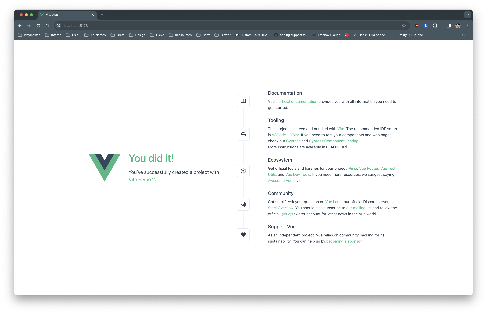
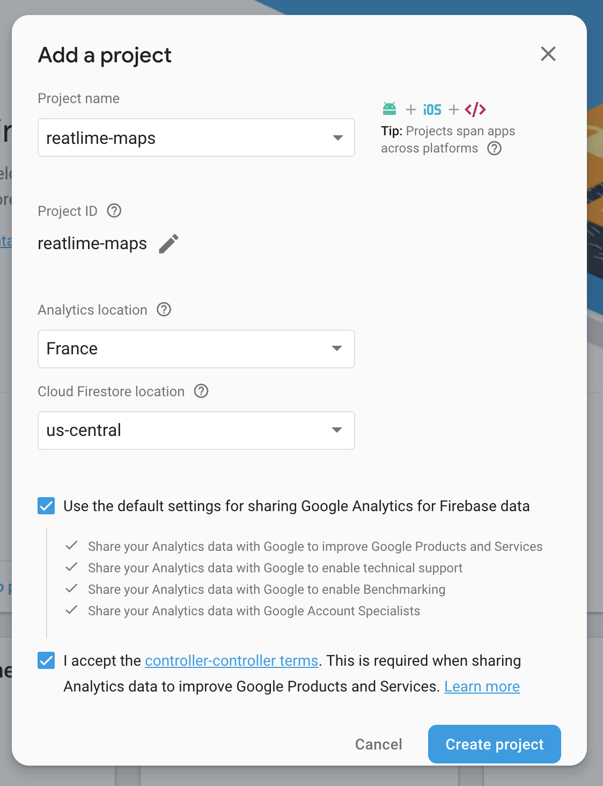
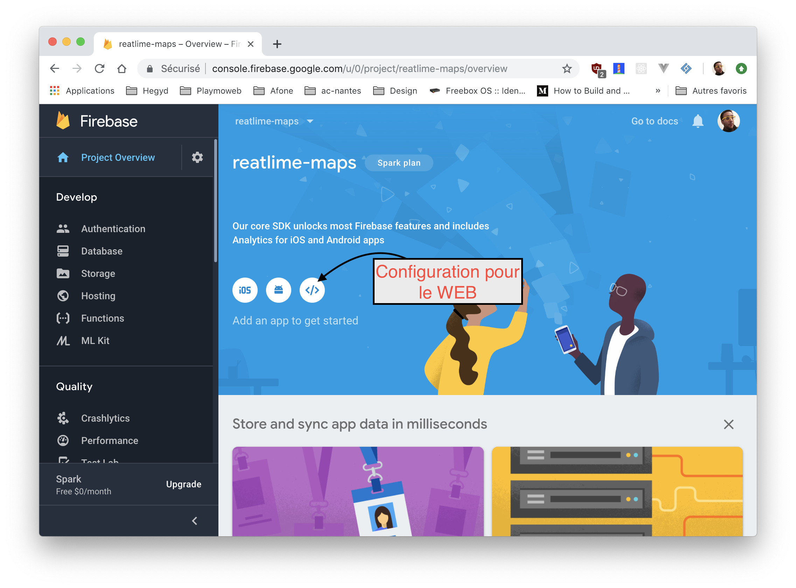

# Firebase + Vuejs

Dans ce TP nous allons découvrir Firebase RealtimeDB (base de données temps réel). Nous allons coupler cette base de données temps réel à la puissance de VueJS pour obtenir en un rien de temps une WebApplication surpuissante.

## La mise en place

Nous allons utiliser VueCLI pour initialiser le projet, première étape l'installation

### Installer NodeJS + VueCLI

Avant de commencer nous allons avoir besoin de plusieurs outils :

- NodeJS
- Vue-cli

### NodeJS

La première étape va être l’installation de NodeJS, la démarche est différente en fonction de votre environnement, mais pour résumer [sous Windows c’est ici](https://nodejs.org/en/download/) prendre la version CURRENT, sous OSX le plus simple c’est via Brew `brew install nodejs`, et sous Linux c’est via le gestionnaire de paquet `apt install nodejs`

Une fois installé, vous êtes prêt, votre PC est prêt à accueillir l’outil VueCLI

### Vue-cli

Vue-cli est un outil qui simplifie la création d’un nouveau projet Vue-JS à partir de template fourni par la communauté.

Dans un terminal lancer la commande suivante dans le `Node.js Command Prompt` :

```shell
npm install -g @vue/cli
```

Maintenant que vue-cli est installé, vous avez à votre disposition sur votre ordinateur une nouvelle commande, la commande `vue`

Pour créer un nouveau projet, c’est simple il suffit de lancer la commande suivante dans le `Node.js Command Prompt`

### Initialiser le projet

La création d'un nouveau projet est très simple. Il suffit de rentrer la commande suivante :

```js
vue-cli create firebase-vuejs
```

Choisir l'option « Default ».

⚠️ Le projet est créé dans le dossier courant. Veuillez à saisir la commande dans un dossier vide.

🤓 git est déjà initialisé, vous pouvez en profiter pour pusher votre code sur Github.

#### Questions

- Pourquoi git est déjà analysé ?
- Allez jeter un coup d'oeil au fichier `.gitignore`

### Tester

Le projet initialisé par `vue-cli` est imédiatement fonctionnel. Tester le en saisissant :

```js
npm run serve
```



## Les dépendances

Maintenant que notre projet est « initialisé », nous allons avoir besoin de quelques dépendances NPM pour faire fonctionner notre projet. Notre projet va utiliser les technologies suivantes :

- firebase
- leaflet

Firebase comme vous le savez va nous servir de système de base de données. [Leaflet](http://leafletjs.com/) quand à lui est une librairie qui vas nous permettre d'afficher très rapidement une carte sur notre site internet.

### Ajouter les dépendances

Les deux outils / librairie que nous allons utiliser sont disponible via NPM, nous allons donc les installer / ajouter au projet via les commandes suivantes :

```bash
npm install firebase vue2-leaflet --save
```

#### Questions

- Pourquoi vue2-leaflet et pas juste leaflet ?
- Quel est l'avantage ?

### Dépendance supplémentaire

Le gros avantage de NPM (et NodeJS) c'est la quantitié de librairie disponible pour répondre à un besoin, nous allons donc profiter de celle-ci pour gagner du temps dans notre réalisation.

Firebase est plutôt simple à utiliser, mais nativement celle-ci ne s'intégre pas directement avec le « state » d'un composant VueJS! Mais grace à d'excellent développeur c'est maintenant possible et très simplement. Pour ça nous allons utiliser :

- [Vuefire](https://github.com/vuejs/vuefire/tree/v1)

```bash
npm install vuefire --save
```

⚠️ Dans une prochaine étape nous allons configurer vuefire. Pour l'instant le package est disponible mais non actif.

🤓 Je vous invite quand même à aller voir [la documentation](https://github.com/vuejs/vuefire/tree/v1) de VueFire pour voir de quoi il en retourne !

### Configuration des dépendances

Voilà ! Notre projet est maintenant prêt, il faut maintenant adapter la structure de base fourni par Vue-Cli pour y inclure les librairie que nous avons précédement installé.

TODO

### Création du projet sur Firebase

Maintenant que nos dépendances sont installés et que notre projet est initialisé, nous allons configurer le projet sur Firebase :

Première étape [créer le projet sur le site de Firebase](https://console.firebase.google.com/u/0/)



Maintenant que le projet est créé, nous allons récupérer la configuration :



Nous allons récupérer une partie du code fourni… Nous allons prendre la configuration (dans mon cas)

```js
// Initialize Firebase
var config = {
  apiKey: "✋-CHANGE-CHANGE-CHANGE-CHANGE-✋",
  authDomain: "reatlime-maps.firebaseapp.com",
  databaseURL: "https://reatlime-maps.firebaseio.com",
  projectId: "reatlime-maps",
  storageBucket: "reatlime-maps.appspot.com",
  messagingSenderId: "✋✋✋✋✋✋✋✋"
};

export default config;
```

Nous allons mettre le code dans le fichier `config/firebase.js` ⬅️

⚠️ ✋ Attention à bien changer la valeur de `apiKey` et `messagingSenderId`. ✋ ⚠️

BRAVO ! Votre projet est maintenant capable de parler avec Firebase !

#### Questions

- Et la sécurité ? À votre avis comment ça fonctionne ?
- Est-il possible de faire autrement ?

### Création de la première vue

TODO
