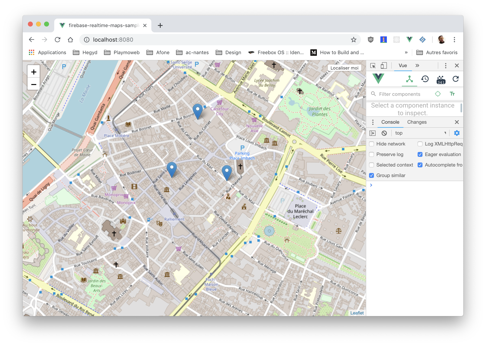
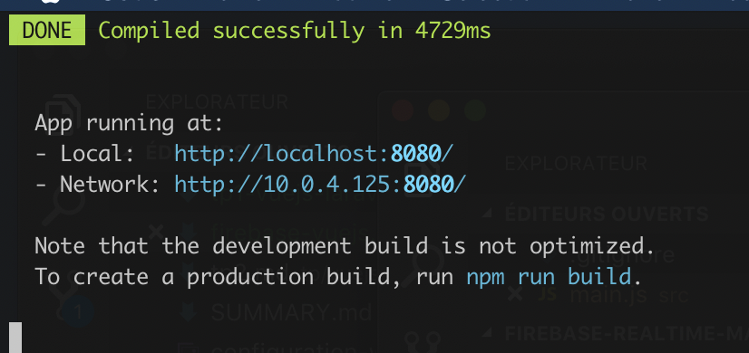
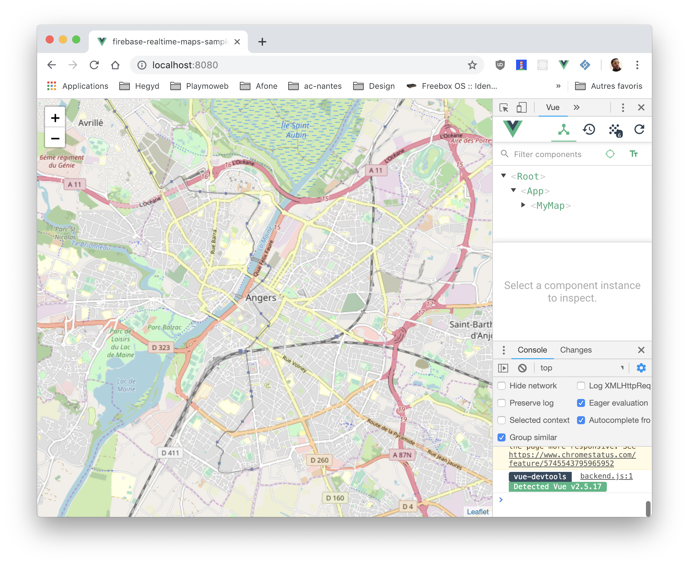

# Firebase + Vuejs

Dans ce TP nous allons découvrir Firebase RealtimeDB (base de données temps réel). Nous allons coupler cette base de données temps réel à la puissance de VueJS pour obtenir en un rien de temps une WebApplication surpuissante.

## Introduction

Dans ce TP nous allons mettre en place une carte du monde qui affiche en temps réel l'emplacement des utilisateurs présent sur votre site.



## La mise en place

Nous allons utiliser VueCLI pour initialiser le projet, première étape l'installation.

## Installer NodeJS + VueCLI

Avant de commencer nous allons avoir besoin de plusieurs outils :

- NodeJS
- VueCli

## NodeJS

La première étape va être l’installation de NodeJS, la démarche est différente en fonction de votre environnement, mais pour résumer [sous Windows c’est ici](https://nodejs.org/en/download/) prendre la version CURRENT, sous OSX le plus simple c’est via Brew `brew install nodejs`, et sous Linux c’est via le gestionnaire de paquet `apt install nodejs`

Une fois installé, vous êtes prêt, votre PC est prêt à accueillir l’outil Vue-Cli.

## Vue-Cli

Vue-Cli est un outil qui simplifie la création d’un nouveau projet Vue-JS à partir de template fourni par la communauté.

Dans un terminal lancer la commande suivante dans le `Node.js Command Prompt` :

```bash
npm install -g @vue/cli
```

Maintenant que vue-cli est installé, vous avez à votre disposition sur votre ordinateur une nouvelle commande, la commande `vue`.

Pour créer un nouveau projet, c’est simple il suffit de lancer la commande suivante dans le `Node.js Command Prompt`.

## Initialiser le projet

La création d'un nouveau projet est très simple. Il suffit de rentrer la commande suivante :

```js
vue create firebase-vuejs
```

Choisir l'option « Default ».

⚠️ Le projet est créé dans le dossier courant. Veillez à saisir la commande dans un dossier vide.

🤓 git est déjà initialisé, vous pouvez en profiter pour pusher votre code sur Github / Gitlab.

### Questions

- Pourquoi git est déjà analysé ?
- Allez jeter un coup d'œil au fichier `.gitignore`

## Tester

Le projet initialisé par `Vue-Cli` est imédiatement fonctionnel. Testez-le en saisissant :

```js
npm run serve
```


## Les dépendances

Maintenant que notre projet est « initialisé », nous allons avoir besoin de quelques dépendances NPM pour faire fonctionner notre projet. Notre projet va utiliser les technologies suivantes :

- firebase
- leaflet

Firebase comme vous le savez va nous servir de système de base de données. [Leaflet](http://leafletjs.com/) quant à lui est une librairie qui va nous permettre d'afficher très rapidement une carte sur notre site internet.

### Ajouter les dépendances

Les deux outils / librairies que nous allons utiliser sont disponibles via NPM, nous allons donc les installer / ajouter au projet via les commandes suivantes :

```bash
npm install firebase vue2-leaflet --save
```

### Configuration de la dépendance carte

Certains plugins nécessitent de la configuration supplémentaire, ça sera le cas pour Vue2-Leaflet (et Firebase). Comme vous, je ne connais pas la configuration de l'ensemble des dépendances existantes. Première étape :

- [Lire la documentation sur le site de Vue2-Leaflet](https://korigan.github.io/Vue2Leaflet/#/quickstart.md)

Maintenant que nous avons vu comment s'intègre le Leaflet, refléchissons comment intégrer ça dans notre projet :

- À l'arrache dans le fichier `main.js` ? ✋ => NON
- Dans un dossier `plugins` => 👍 Oui

À votre avis pourquoi ?

### Création de la partie plugin

Créer le fichier `src/plugins/vue2-leaflet.js` y mettre dedans :

```js
import { L } from "vue2-leaflet";
import "leaflet/dist/leaflet.css";

// this part resolve an issue where the markers would not appear
delete L.Icon.Default.prototype._getIconUrl;

L.Icon.Default.mergeOptions({
  iconRetinaUrl: require("leaflet/dist/images/marker-icon-2x.png"),
  iconUrl: require("leaflet/dist/images/marker-icon.png"),
  shadowUrl: require("leaflet/dist/images/marker-shadow.png")
});
```

- D'où vient le code ?

### Déclarer le plugin

Maintenant que la configuration du « plugin » est effective nous devons le déclarer dans notre fichier `main.js` pour ça rien de compliquer.

Ajouter l'import :

```js
import "./plugins/vue2-leaflet";
```

🤓 Avec les autres imports déjà existant.

### Questions

- Pourquoi l'import est-il nécéssaire ?
- Pourquoi vue2-leaflet et pas juste leaflet ?
- Quel est l'avantage ?

### Dépendance supplémentaire

Le gros avantage de NPM (et NodeJS) c'est la quantité de librairies disponibles pour répondre à un besoin, nous allons donc en profiter pour gagner du temps dans notre réalisation.

Firebase est plutôt simple à utiliser, mais nativement celle-ci ne s'intègre pas directement avec le « state » d'un composant VueJS! Mais grâce à d'excellents développeurs c'est maintenant possible et très simplement. Pour ça nous allons utiliser :

- [Vuefire](https://github.com/vuejs/vuefire/tree/v1)

```bash
npm install vuefire --save
```

⚠️ Dans une prochaine étape nous allons configurer vuefire. Pour l'instant le package est disponible mais non actif.

🤓 Je vous invite quand même à aller voir [la documentation](https://github.com/vuejs/vuefire/tree/v1) de VueFire pour voir de quoi il en retourne !

## Création du projet sur Firebase

Maintenant que nos dépendances sont installées et que notre projet est initialisé, nous allons configurer le projet sur Firebase :

Première étape [créer le projet sur le site de Firebase](https://console.firebase.google.com/u/0/)


Maintenant que le projet est créé, nous allons récupérer la configuration :


Nous allons récupérer une partie du code fourni… Nous allons prendre la configuration (dans mon cas) :

```js
// Initialize Firebase
var config = {
  apiKey: "✋-CHANGE-CHANGE-CHANGE-CHANGE-✋",
  authDomain: "reatlime-maps.firebaseapp.com",
  databaseURL: "https://reatlime-maps.firebaseio.com",
  projectId: "reatlime-maps",
  storageBucket: "reatlime-maps.appspot.com",
  messagingSenderId: "✋✋✋✋✋✋✋✋"
};

export default config;
```

Nous allons mettre le code dans le fichier `src/config/firebase.js` ⬅️

⚠️ ✋ Attention à bien changer la valeur de `apiKey` et `messagingSenderId`. ✋ ⚠️

BRAVO ! Votre projet est maintenant capable de « se connecter » avec Firebase !

### Questions

- Et la sécurité ? À votre avis comment ça fonctionne ?
- Est-il possible de faire autrement ?

## Activer la Realtime DB

Dans l'interface de Firebase activer la Realtime DB.

## Modification du code pour inclure la configuration Firebase

Maintenant que nous avons ajouté la configuration, nous devons la déclarer dans notre code. Comme pour Vue2-Leaflet nous allons ajouter un fichier de « configuration du plugin » dans le dossier `src/plugins/` ajouter un fichier nommé `firebase.js` avec le contenu suivant :

```js
import firebaseConfig from "../config/firebase";
import firebase from "firebase/app";
import "firebase/database";
import Vue from "vue";

const firebaseApp = firebase.initializeApp(firebaseConfig);
const db = firebaseApp.database();

Vue.prototype.$db = db;
```

Comme pour leaflet, ajouter un import dans le fichier `main.js` pour référencer notre « configuration de plugin » :

```js
import "./plugins/firebase";
```

### Questions

- Que fait le code ?
- Comment connaitre les autres options ?
- Vue.prototype ? Kézako ? On en parle !

## Testons

Bien maintenant, que nous avons mis en place les bases de notre projet, testons si celui-ci fonctionne correctement. Pour ça (dans un terminal) :

```bash
npm run serve
```

Après quelques secondes de compilation (pré-processing) vous devriez avoir sur votre écran :



Et dans votre navigateur toujours la même chose à savoir :


## Création de notre première vue / composant.

Notre projet est maintenant prêt à recevoir son premier `.vue` bien à vous. Toujours dans le but d'organiser son travail nous allons commencer par créer un dossier :

- `src/views/`

Ce dossier nous servira à ranger l'ensemble de nos vues, pour l'instant nous allons créer une vue nommée `map.vue` ce fichier contiendra le code source de notre carte.

Créer le fichier `src/views/map.vue` avec le contenu suivant :

```vue
<template>
  <l-map id="map" :zoom="zoom" :center="center">
    <l-tile-layer :url="url"></l-tile-layer>
  </l-map>
</template>

<script>
import { LMap, LTileLayer, LMarker, LControl } from "vue2-leaflet";

export default {
  name: "myMap",
  data() {
    return {
      url: "http://{s}.tile.osm.org/{z}/{x}/{y}.png",
      zoom: 13,
      center: [47.472092, -0.550589]
    };
  },
  components: {
    LMap,
    LTileLayer,
    LMarker,
    LControl
  },
  methods: {}
};
</script>

<style scoped>
#map {
  height: 100%;
  width: 100%;
}
</style>
```

✋ D'où vient le code ? Tout simplement une adaptation du [code de démonstration fourni par Vue2-Leaflet](https://korigan.github.io/Vue2Leaflet/#/components/l-map/)

## Utiliser notre première vue

Créer la vue ne déclenche rien, il faut maintenant l'importer. Comme vu en cours, la « base » de notre application est répartie entre deux fichiers :

- le main.js : qui contient les imports de base et la déclaration de notre objet `.vue`.
- l'App.vue : qui contient la « racine » de notre HTML (c'est dans celui-ci que nous allons référencer notre nouvelle vue / composant).

Modifier le `App.vue` par :

```vue
<template>
  <myMap />
</template>

<script>
import myMap from "./view/map.vue";

export default {
  name: "app",
  components: {
    myMap
  }
};
</script>

<style>
html,
body {
  margin: 0;
  padding: 0;
  height: 100%;
  width: 100%;
}
</style>
```

### Questions

- Quelles sont les différences ?
- Pourquoi le CSS n'est pas `scoped` ?
- À quoi correspond `components` ?

## Tester

Votre projet doit maintenant afficher une carte, tester rapidement via la commande :

```bash
npm run serve
```



## Configurer VueFire

Comme pour Vue2-Leaflet et firebase, vuefire nécéssite une déclaration pour être utilisé dans le projet.

- [Lire la documentation](https://github.com/vuejs/vuefire/tree/v1).
- Créer le fichier dans le dossier `plugins`.
- Réaliser l'import dans le fichier `main.js`.

🤓 C'est la 3ème fois de ce TP que vous le faites, vous devez être capable de le faire de vous même.

<Reveal text="Voir la solution">

`src/plugins/vuefire.js`

```js
import Vue from "vue";
import VueFire from "vuefire";

Vue.use(VueFire);
```

`main.js`

```js
// […]
import "./plugins/vuefire";

// […]
```

</Reveal>

## Connecter firebase à notre vue

Grace au plugin l'intégration de Firebase va être très simplifié. Déjà vous avez mis en place Firebase et injecter le connecteur de base de données grace au « plugin » et « Vue.prototype », nous allons devoir l'utiliser. Pour ça modifier le fichier `maps.vue` pour ajouter (après name) :

```js
firebase: function() {
    return {
      markerList: this.$db.ref("/markerList/")
    };
  },
```

### Questions :

- D'où vient `this.$db` ?
- À quoi correspond le `/markerList/` ?

Et c'est tout ! Vous avez maintenant dans votre objet vue une nouvelle variable de disponible `markerList` celle-ci est synchronisée avec votre base de données temps réel (Firebase RealtimeDB).

## Ajouter un marker

Pour ajouter un marker sur la carte nous allons utiliser la directive `@stop` sur l'objet `l-map` :

- Ajouter sur l'objet `<l-map>` la directive suivante `@click="addMarker"`.
- Ajouter la méthode `addMarker` dans votre objet VueJS `addMarker(marker){…}` .
- À votre avis à quoi doit ressembler le code ?
  - Ajouter un `console.log(marker)` avez-vous une propriété `latlng` ?

<Reveal text="Voir la solution">

```js
addMarker(position) {
  this.$firebaseRefs.markerList.push([
    position.latlng.lat,
    position.latlng.lng
  ]);
},
```

</Reveal>

## Tester

- Ouvrer la [console de Firebase](https://firebase.google.com) rendez-vous dans la partie `Database`.
- Lancer votre projet local `npm run serve`.
- Cliquer sur la carte.
- Que constatez-vous ?

## Afficher les markers

Les markers ne s'affichent pas ? C'est normal! Pour l'instant nous n'avons pas mis le code permettant de les afficher. C'est l'étape à laquelle nous sommes.

La logique va être simpliste, nous devons afficher TOUS les éléments contenus dans la variable `markerList` déclarée précédemment.

Les étapes :

- Utilisation de [l-marker](https://korigan.github.io/Vue2Leaflet/#/components/l-marker/)
- Le mettre en place dans le `l-map` en suivant la documentation.
- Mise en place d'une boucle v-for.
- et… c'est tout
- Essayer sans regarder la solution.

<Reveal text="Voir la solution">

Le marker est à mettre dans le `l-map`.

```html
<l-marker
  v-for="marker in markerList"
  :key="marker['.key']"
  :lat-lng="marker['.value']"
>
</l-marker>
```

</Reveal>

## Tester

`npm run serve` normalement des markers doivent s'afficher. Tenter d'en ajouter d'autre.

## Suppression d'un marker

Bon maintenant qu'il y a plein de marker partout nous allons mettre en place le code pour les supprimer ! Voilà la procédure à suivre :

- Ajout d'une méthode `removeMarker`

```js
removeMarker(markerKey) {
  this.$firebaseRefs.markerList.child(markerKey).remove();
},
```

- Ajouter la directive sur `l-marker` :

```html
@click="() => removeMarker(marker['.key'])"
```

## Tester

`npm run serve` tenter de supprimer un marker en cliquant dessus.

## Tester à plusieurs

Accéder à plusieurs au même projet (via votre IP) pour tester la synchronisation.

## Amélioration 1 : centrer la carte sur votre position

Profitons des nouvelles fonctionnalités de nos navigateurs pour améliorer notre carte. Actuellement la carte est centrée sur Angers… C'est pratique… Si on se trouve à Angers… dans tous les autres cas c'est pas forcément adapté. Nous allons donc utiliser l'API `geolocation` de notre navigateur.

Celle-ci permet de localiser une personne en fonction de sa connexion internet (ou GPS / Réseau téléphonique si disponible)

- [Documentation de l'API geolocation](https://developer.mozilla.org/en-US/docs/Web/API/Geolocation_API).
- Ajouter une méthode dans le code dans le composant `map.vue`.
- La méthode doit mettre à jour le `this.center = [lat, lng]`.
- La méthode doit être appelé via un clique utilisateur [Documentation de LControl](https://korigan.github.io/Vue2Leaflet/#/components/l-control/)

<Reveal text="Voir la solution">

template :
Dans le `l-map`

```html
<l-control> <button @click="getUserLocation">Localisez-moi</button> </l-control>
```

methods :

```js
getUserLocation() {
      if ("geolocation" in navigator) {
        navigator.geolocation.getCurrentPosition(
          position => {
            this.center = [position.coords.latitude, position.coords.longitude];
          },
          error => {
            console.error(error);
          }
        );
      }
    }
```

</Reveal>
