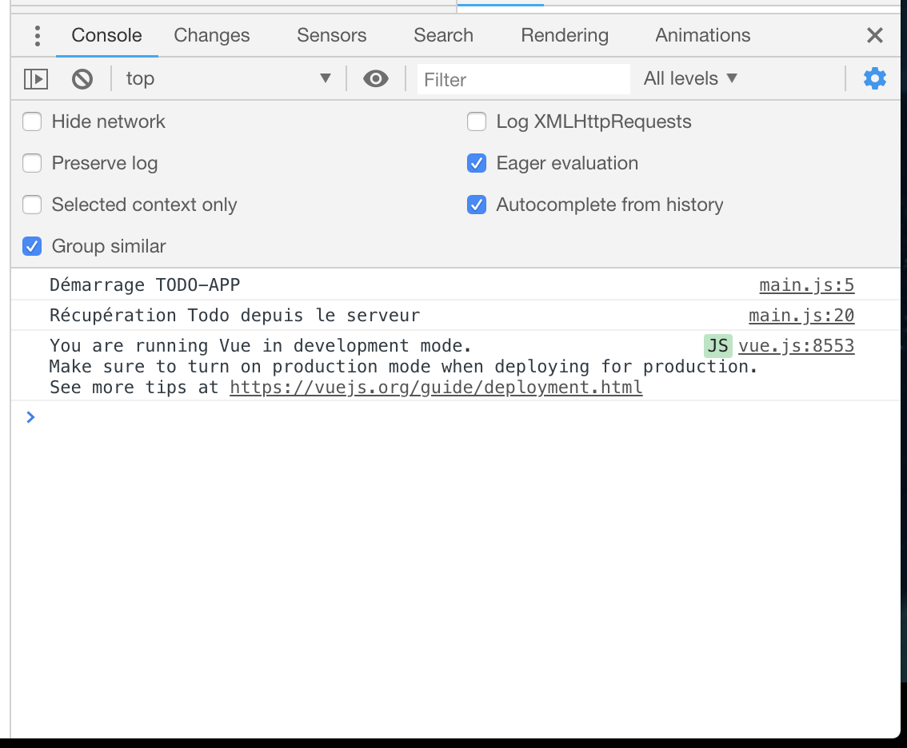
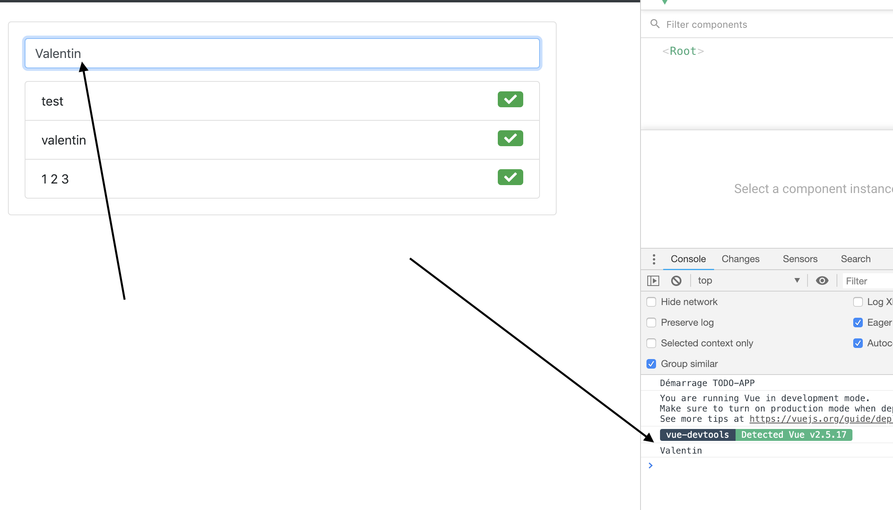

# Ajouter VueJS dans un site existant

Dans le cadre du TP, vous allez devoir « moderniser » une application simple. L’application à migrer était réalisée dans le cadre de la démonstration.

L’application existante est une « TodoList » codée avec le Framework Laravel.

## Les API

Dans ce TP nous allons transformer « entièrement » votre ancien site codé en Laravel par « un équivalent » qui va fonctionner avec des API.

🤓 Nous n'allons donc plus utiliser la puissance de Blade, mais celle de VueJS 🚀.

### Création des API

La « nouvelle version » de notre page, va utiliser des API (et de l'ajax), ça va fondamentalement changer le fonctionnement de votre application. Il faut donc dans un premier temps créer les API qui seront nécessaire au bon fonctionnement (asynchrone) de votre page Web.

- Lister les éléments dans la TodoList.
- Ajouter un nouvel élément dans la TodoList.
- Marquer un élément comme terminé.
- Supprimer un élément.

✋ En tant que développeur vous devez être malin (et fénéant…). Pour écrire les autres API ne tenter pas de réinventer la poudre, nous allons utiliser le même code que le controlleur actuel !

Les seules différence seront :

- ```view([…], […]Todo::all()[…])``` remplacé par ```return response()->json(Todo::all());```
- Et pour une simple réponse de réussite (exemple remove ou done) ```return response()->json(array("status" => 1))```

#### Création du contrôleur pour les API

Nous allons donc créer un nouveau controleur qui va gérer la partie API de notre application (les appels « client »). Nous allons simplement l'appeler « api ».

Pour le créer il faut utiliser la commande ```make:controller```


```sh
php artisan make:controller api
```


Un nouveau contrôleur vide vient d'être créé, il faut maintenant déclarer l'ensemble de nos méthodes.

##### Définition des méthodes nécéssaire

Avant de commencer la partie code, voilà la liste des ```Routes``` -> ```Méthode``` nécéssaire au bon fonctionnement de notre API :

| Route           | Méthode               | Paramêtre     | Type   |
| --------------- |:---------------------:|:-------------:| ------:|
| /api/           | list()                |               | GET    |
| /api/add        | add(Request $request) | Request       | POST   |
| /api/done/{id}  | done($id)             | id            | PATCH  |
| /api/delete/{id}| remove($id)           | id            | DELETE |

🔥 Pour la suite vous référez à ce tableau pour les nom de méthode ainsi que les paramètres 🔥

##### La liste

Dans le fichier ```app/Http/Controllers/api.php``` ajouter une méthode méthode ```list```. Celle-ci doit contenir le code suivant :

```php
    return response()->json(Todos::all());
```

⚠️ Bien évidement je vous laisse écrire le reste du code. Vous pouvez vous inspirer du code du premier TP.

##### L'ajout

Pour l'ajout, le code va être **identique** à celui de premier TP, la seul différence c'est que celui-ci doit retourner 1 ou 0 en fonction de la réussite ou non :

```php
  return response()->json(array("status" => "1"));
```

⚠️ Je vous laisse écrire le reste du code !

##### Marquer comme terminé

Comme pour l'ajout, le code va être identique au TP précédent à l'exception du retour :

```php
  return response()->json(array("status" => "1"));
  // Ou en en cas échec
  return response()->json(array("status" => "0"));
```

##### Suppression

Comme pour l'ajout, le code va être identique au TP précédent à l'exception du retour :

```php
  return response()->json(array("status" => "1"));
  // Ou en en cas échec
  return response()->json(array("status" => "0"));
```

##### Perdu ?

Normalement vous avez l'ensembles des informations pour y arriver seul, si vous bloquez voila :



```php
<?php

namespace App\Http\Controllers;

use App\Todos;
use Illuminate\Http\Request;

class api extends Controller
{
    public function list(){
    }

    public function add(Request $request){
    }

    public function done($id){
    }

    public function remove($id){
    }
}
```


✋ Je vous laisse écrire le code des méthodes seul, rappel il est presque identique à celui du premier TP.

##### Les routes

Le code étant « finalisé ». Il faut maintenant indiquer à Laravel les routes d'accès aux différentes méthodes.

Dans le fichier ```routes/api.php``` ajouter le contenu suivant :

```php
Route::get('/', "api@list")->name("api.list");
Route::post('/add', "api@add")->name('api.add');
Route::patch('/done/{id}', "api@done")->name('api.done');
Route::delete('/delete/{id}', "api@delete")->name('api.delete');
```

✋ Comme vous pouvez le voir le ```/api/…``` n'est pas spécifié… Pourquoi ? Simplement avec Laravel toutes les routes dans le fichier ```routes/api.php``` sont automatiquement préfixé par ```/api/```

Vous API sont maintenant accessibles.

##### Validation des API

Valider que vos API fonctionne correctement grâce à l'outil [Postman](https://www.getpostman.com/).

🤓 Commencez par la plus simple, par exemple ```/api/``` qui doit normalement lister votre actuelle TodoList.
✋ Tester l'ensemble de vos API avant de continuer.


## Ajout de VueJS

VueJS étant une librairie (comme jquery par exemple), il faut l'importer pour l'utiliser dans votre projet.

Laravel intègre un gestionnaire de dépendances « client » nommé ```npm``` (normalement celui-ci est déjà installé sur votre poste, si ce n'est pas le cas [rendez-vous ici](https://nodejs.org/en/download/current/)).

La première étape est donc d'indiquer que nous souhaitons avoir ```VueJS``` dans notre projet. Ça se fait via la ligne de commande (ou via l'édition manuel du fichier ```package.json```).

```sh
npm install --save vue
```

Patientez quelques instant la dépendance est maintenant ajoutée.

✋ Votre dépendance est installée oui ! Mais celle-ci n'est pas inclus pour votre client.

Ajouter VueJS dans le fichier ```resources/js/app.js``` ajouter à la fin de celui-ci :

```js
require("vue/dist/vue");
```

Maintenant que votre Librairie est ajouté, il faut indiquer à ```Laravel-mix``` que votre fichier à changé pour ça :

```sh
$ npm run production
DONE  Compiled successfully in 17210ms
…
```

Voilà ! VueJS est maintenant disponible dans votre projet.





### Ajouter VueJS sans NPM

NPM n'est pas la seul solution d'installer VueJS, si votre projet n'avais pas eu ```npm``` de configuré vous auriez pu simplement ajouter dans le header de votre site via une balise script :

Via un CDN

```html
<script src="https://cdn.jsdelivr.net/npm/vue@2.5.17/dist/vue.js"></script>
```

En téléchargant la librairie :

[Disponible ici](https://vuejs.org/v2/guide/installation.html#Direct-lt-script-gt-Include)

### Questions

- À votre avis, qu'elle solution est la meilleur ?
- Pourquoi dans notre cas, j'ai privilégié ```npm``` ?
- Quel sont les dangers du CDN ?



### Création d'un nouveau template

Pour la démonstration nous allons créer un nouveau template, il sera ```@extends``` de ```template.blade.php``` que vous avez précédement créé.

Créér un nouveau fichier ```resources/views/homevue.blade.php``` et y mettre le contenu suivant :

```html
@extends("template")

@section("title", "Todo List - Version VueJS")

@section("content")
  <div class="container">
    <div class="card">
      <div class="card-body">
        <!-- Action -->
        <div class="add">
          <div class="input-group">
            <input type="text" class="form-control" placeholder="Prendre une note…" v-model="text" />
          </div>
        </div>

        <!-- Liste des Todos -->

      </div>
    </div>
  </div>
@endsection
```

Le code précédent contient quelques élément de VueJS, lequels ?

### Accéder à la page

Maintenant que notre template est créé, nous allons pouvoir l'utiliser.

Pour l'utiliser il faut créer **2 choses**

- Une méthode dans le contrôleur ```TodosController.php```.



Le code de la méthode est :

```php
public function homevue(){
  return view("homevue");
}
```



- Une route (exemple ```/vue```) dans le fichier ```routes/web.php```.

🔥 Maintenant que votre code est prêt tester votre application :

- Démarrer votre serveur de test (```php artisan serve```).
- Accéder à la page [http://127.0.0.1:8000/vue](http://127.0.0.1:8000/vue)
- Normalement le formulaire d'ajout s'affiche… Rien dans la liste? Pas de panique le code n'est pas encore présent.

### Liste des todos

Même si pour l'instant nous n'avons pas encore fait le code pour appeler les API, ajouter le code HTML suivant après ```<!-- Liste des todos -->``` présent dans le fichier ```homevue.blade.php```:

```html
<ul class="list-group pt-3">
    <li class="list-group-item" v-for="todo in todos">
        <span>@{{ todo.texte }}</span>
        <div class="pull-right action">
            <span v-if="todo.termine !== '1'" class="btn btn-success"><i class="fas fa-check"></i></span>
            <span v-else class="btn btn-danger"><i class="fas fa-trash"></i></span>
        </div>
    </li>
    <li v-if="todos.length === 0" class="list-group-item text-center">C'est vide !</li>
</ul>
```

- Quels sont les éléments spécific à VueJS?

🔥 Tester à nouveau, votre liste doit s'afficher… Mais pas de la façon attendu… C'est normal, nous devons maintenant écrire le code VueJS correspondant à votre application (à savoir Liste, Ajout, Marquer comme terminé, et supprimer)

### @ ? Hey ! 

- ```@``` À quoi correspond le ```@``` ?
- Tenter de le retirer pour voir ce qui ce passe ?
- Pourquoi ça ne fonctionne plus?

### Asynchrone

L’ensemble de l’application va devenir « asynchrone », vous allez vite vous rendre compte que la migration va nécessiter quelques appels en Ajax. Pour faire nos appels nous utiliserons l’API « Fetch » des navigateurs, celle-ci est intégrée dans l’ensemble des navigateurs récents, le bon réflexe est quand même d’allez voir le support de Fetch sur  ([Can i use](https://caniuse.com/#search=fetch)).

### Découverte de Fetch

L'API Fetch fournit une interface JavaScript pour l'accès et la manipulation des parties de la pipeline HTTP, comme les requêtes et les réponses. Cela fournit aussi une méthode globale fetch() qui procure un moyen facile et logique de récupérer des ressources à travers le réseau de manière asynchrone.

Ce genre de fonctionnalité était auparavant réalisé avec XMLHttpRequest. Fetch fournit une meilleure alternative qui peut être utilisée facilement par d’autres technologies comme Service Workers. Fetch fournit aussi un endroit unique et logique pour la définition d'autres concepts liés à HTTP comme CORS et les extensions d'HTTP.

(Source: MDM)

Le support de l'API Fetch peut être détecté en vérifiant l'existance de Headers, Request, Response ou fetch() sur la portée de Window ou de Worker.
Par exemple, vous pouvez faire cela dans votre script:

```javascript
if(self.fetch) {
  // Le support de Fetch est présent
}else{
  // Gérer le cas du non support de fetch.
  // Pour réduire le nombre de cas possible vous pouvez ajouter : https://github.github.io/fetch/ à votre projet
}
```

### Tester Fetch

Avant d'intégrer Fetch dans notre code client (le site web Javascript), nous allons le **TESTER** dans notre navigateur, voici un exemple de code :

```javascript
fetch('api/', {method: "GET", credentials: 'same-origin'})
.then(function(response){
  // On décode le JSON, et on continue
  return response.json();
})
.then(function(response) {
  // Votre retour est ICI
  console.log(response);
})
.catch(function(error) {
  console.log('Récupération impossible: ' + error.message);
});
```

⚠️ Que veux dire ```credentials: 'same-origin'```?

Par défaut, Fetch n’utilise pas les Cookies, vous pouvez forcer l’utilisation des cookies en indiquant ```credentials: 'same-origin'```. Si vous ne le faites pas votre ```$_SESSION``` ne sera pas sauvegardées ⚠️

#### Comment tester

Pour valider le bon fonctionnement nous allons utiliser la « Console développeur » de votre navigateur.

Fetch est une librairie très complète, pour aller plus loin dans l’utilisation de Fetch, je vous recommande la lecture de [la documentation complète (gestion des headers, paramètres, mode, etc)](https://developer.mozilla.org/fr/docs/Web/API/Fetch_API/Using_Fetch)

Tester de récupérer vos « todos » depuis votre console.

## La structure du code javascript

Maintenant que nos API sont terminés et que notre appels via Fetch fonctionne nous allons écrire le code Javascript (VueJS) qui va gèrer notre application.

Nous allons utiliser massivement la gestion d'évènement de VueJS, Pour rappel n’hésitez pas à consulter le [cycle de vie des composants](https://vuejs.org/images/lifecycle.png))

### La liste

La liste des tâches va être la première chose que nous allons charger. Cette « liste » sera chargé lors de l'événement ```beforeMount```.

### Les actions

Les actions (done, remove, add) seront appelés lors de la vie de notre application, elle vont être déclaré dans la partie ```methods``` de l'objet VueJS et seront appelé via des ```v-on:…``` de votre code HTML.

Complexe ? Pas tant que ça… Vous allez voir que c'est beaucoup plus simple que du code Javascript classique.

## Structure de base

Créer un nouveau fichier nommé ```main.js```. Ce fichier doit être créé dans ```public/js``` (ou ```ressources/js``` pour ceux utilisant NPM). Une fois créé nous allons y ajouter le minimum pour que votre application fonctionne :

```js
var app = new Vue({
    el: '.container',
    created: function () {
        // Code appelé à la création de votre application
        console.log("Démarrage TODO-APP");
    },
    data: function() {
        return {
            todos: [],
            text: "",
        }
    },
    beforeMount: function() {
        // Code appelé juste avant l'affichage de votre application
        this.list();
    },
    methods: {
        list: function(){
            // Récupération des Todos
            console.log("Récupération Todo depuis le serveur");
        },
        add: function(){},
        done: function(todo){},
        delete: function(todo){},
    }
})
```

Voilà la base de notre objet VueJS.

### Ajouter votre script

Pour ajouter votre script nous allons faire simple, nous allons « juste » l'ajouter à la fin de notre template ```homevue```. Éditer le fichier ```homevue.blade.php``` pour y ajouter la balise ```script``` suivante juste avant ```@endsection``` :

```html
<script type="text/javascript" src="{{ asset('js/main.js') }}"></script>
```

✋ Pour ceux utilisant NPM ce n'est pas nécéssaire.

Tester d'accéder à nouveau à votre site web, vous devez maintenant voir dans ```la console de développeur``` de votre navigateur le texte suivant :



Pas de liste de todo dans votre page ? C'est normal ! Nous allons maintenant ajouter l'appel « Fetch ».

#### Questions

- À quoi correspond ```asset``` ?
- À quoi correspond ```el: '.container',``` pourquoi est-ce très important ?

### Récupérer les Todos

Maintenant que nous avons la base de notre application, nous allons pouvoir compléter les « trous ». La première méthode à faire est la récupération de la liste.

Cette méthode est ```list()```, pour l'instant elle ne comporte qu'un console.log. Nous allons la complèter pour ajouter un appel Ajax avec la méthode Fetch comme vu précédement.

Les étapes vont être les suivantes :

- Construction de l'appel réseau (ajax) via Fetch.
- Mise en place de code à la place du ```console.log``` dans la méthode liste.
- Tester

1/ Appel réseau

Nous allons donc devoir faire un appel réseau vers l'url ```api/```. L'appel est le même que le code précédement testé, pour rappel :

```js
fetch('api/', {method: "GET", credentials: 'same-origin'})
.then(function(response){
  return response.json();
})
.then(function(response) {
  app.todos = response;
})
.catch(function(error) {
  console.log('Récupération impossible: ' + error.message);
});
```

2/ Remplacer le code de la méthode ```list``` par l'appel réseau
3/ Recharger la page.
4/ Valider le bon fonctionnement sur votre Page Web.

#### Questions

- À quoi fait référence ```app``` dans le code ```app.todos``` ?
- Pourquoi plusieurs ```then``` ?
- Dans quel cas pouvons nous passer dans le ```catch```?

### Ajout d'une TODO

Maintenant que notre liste est correctement construite, nous allons pouvoir faire la partie Ajout. Pour l'ajout la procédure va être la suivante :

- Ajout de l'attribut ```v-on:keyup.enter="add"``` sur l'élément HTML ```class="form-control"``` du fichier ```resources/views/homevue.blade.php```.
- Ajout d'un ```console.log(app.text)``` dans la méthode ```add``` du JS pour valider le bon fonctionnement.



Bien ! Maintenant que votre ```console.log``` s'affiche nous allons pouvoir faire la partie appel Ajax. Pour rappel votre appel doit être du type ```POST```, nous allons donc devoir écrire un appel Ajax / Fetch également de type POST :

```js
let formData = new FormData();
formData.append("texte", app.text);

fetch('api/add', {method: "POST", body: formData})
    .then(function () {
        app.text = ""; // On remet à Zéro l'input utilisateur
        app.list(); // On raffraîchit la liste.
    });
```

Quelques explications :

- Le formData va permettre d'envoyer des valeurs en ```POST``` à notre API.
- Le code dans le ```then``` va :
  - Vider la saisie utilisateur.
  - Raffraichir la liste.

🤓 Valider votre code en testant l'ajout d'une nouvelle TODO.

### Marquer comme terminé

Maintenant que nous pouvons ajouter, il faut pouvoir marquer comme « Terminer ». Nous allons donc devoir complèter le code de la méthode ```done(todo)```. Pour ça :

- Ajouter une action ```v-on:click="done(todo)"``` sur le bon élément HTML.
- Compléter le code de ```done(todo)``` avec le bon Appel Fetch

#### Aide

Votre API attend un appel de type ```PATCH``` :

```js
fetch('…', {method: "PATCH"})
```

Votre API attend le paramètre ```ID``` directement dans l'URL :

```js
fetch('api/done/' + todo.id, {method: "PATCH"})
```

Pensez à bien rafraichir la liste dans le ```then```.

🔥 Prendre exemple sur le code précédent pour compléter la méthode ```done```

### Suppression

La logique pour la partie suppression va être identique à la partie ```done```. Je vous laisse la réaliser seul.

#### Aide

Votre API attend un appel de type ```PATCH``` :

```js
fetch('…', {method: "DELETE"})
```

Votre API attend le paramètre ```ID``` directement dans l'URL :

```js
fetch('api/delete/' + todo.id, {method: "DELETE"})
```

Pensez à bien rafraichir la liste dans le ```then```.

### Et voilà !

Vous avez fait le tour de la migration de votre version Laravel.


```js
let app = new Vue({
    el: '.container',
    created: function () {
        // Code appelé à la création de votre application
        console.log("Démarrage TODO-APP");
    },
    data: function() {
        return {
            todos: [],
            text: "",
        }
    },
    beforeMount: function() {
        // Code appelé juste avant l'affichage de votre application
        this.list();
    },
    methods: {
        list: function(){
            fetch('api/', {method: "GET"})
                .then(function(response){
                    return response.json();
                })
                .then(function(response) {
                    app.todos = response;
                })
                .catch(function(error) {
                    console.log('Récupération impossible: ' + error.message);
                });
        },
        add: function() {
            let formData = new FormData();
            formData.append("texte", app.text);

            fetch('api/add', {method: "POST", body: formData})
                .then(function () {
                    app.text = ""; // On remet à Zéro l'input utilisateur
                    app.list(); // On raffraîchit la liste.
                });
        },
        done: function(todo){
            fetch(`api/done/${todo.id}`, {method: "PATCH"})
                .then(function(){
                    app.list();
                })
        },
        remove: function(todo){
            fetch(`api/delete/${todo.id}`, {method: "DELETE"})
                .then(function(){
                    app.list();
                })
        },
    }
});
```

