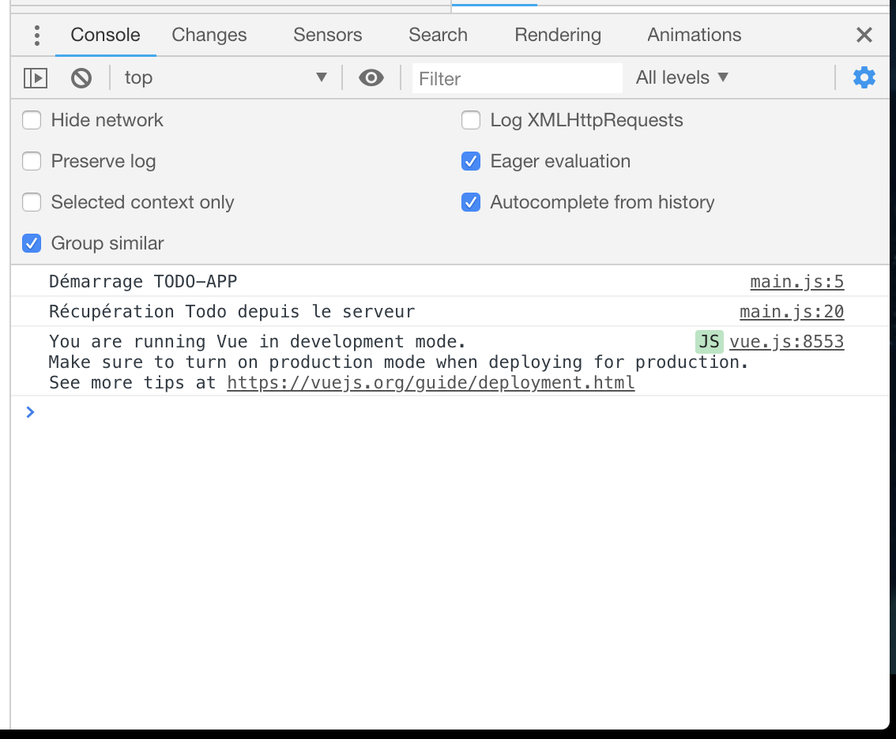
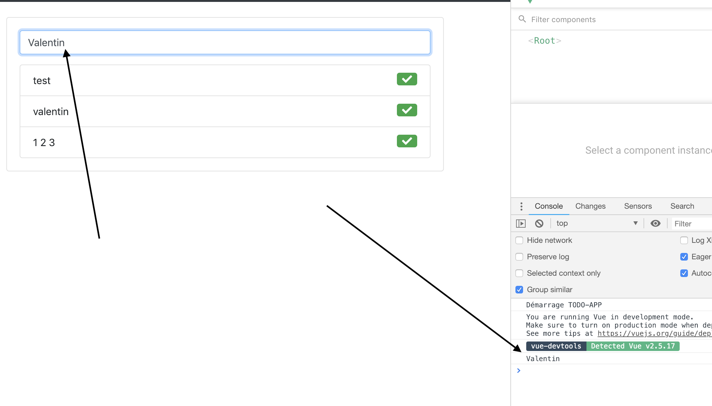

# Ajouter VueJS 2.0 + Laravel

::: warning Ce contenu est conservé à titre d'archive
Ce TP repose sur VueJS 2, qui n'est plus maintenu depuis fin 2023. Pour apprendre Vue aujourd'hui, suivez plutôt [les TP VueJS 3](/pages/categories/les-tp-javascript.md).
:::

Dans le cadre du TP, vous allez devoir « moderniser » une application simple. L’application à migrer a été réalisée dans le cadre de la démonstration.

::: details Table des matières
[[toc]]
:::

L’application existante est une « TodoList » codée avec le Framework Laravel. Le TP en question est [disponible ici](/tp/laravel/application_todo_list.md)

## Les API

Dans ce TP nous allons transformer « entièrement » votre ancien site codé en Laravel par « un équivalent » qui va fonctionner avec des API.

🤓 Nous n'allons donc plus utiliser la puissance de Blade, mais celle de VueJS 🚀.

### Création des API

La « nouvelle version » de notre page va utiliser des API (et de l'Ajax), ça va fondamentalement changer le fonctionnement de votre application. Il faut donc dans un premier temps créer les API qui seront nécessaires au bon fonctionnement (asynchrone) de votre page Web.

- Lister les éléments dans la TodoList.
- Ajouter un nouvel élément dans la TodoList.
- Marquer un élément comme terminé.
- Supprimer un élément.

✋ En tant que développeur vous devez être malin (et fainéant…). Pour écrire les autres API ne tentez pas de réinventer la roue, nous allons utiliser le même code que le contrôleur actuel !

Les seules différences seront :

- `view([…], […]Todo::all()[…])` remplacé par `return response()->json(Todo::all());`
- Et pour une simple réponse de réussite (exemple remove ou done) `return response()->json(array("status" => 1))`

#### Création du contrôleur pour les API

Nous allons donc créer un nouveau contrôleur qui va gérer la partie API de notre application (les appels « client »). Nous allons simplement l'appeler « api ».

Pour le créer, il faut utiliser la commande `make:controller`

<Reveal text="Voir la solution">

```sh
php artisan make:controller api
```

</Reveal>

Un nouveau contrôleur vide vient d'être créé, il faut maintenant déclarer l'ensemble de nos méthodes.

##### Définition des méthodes nécessaires

Avant de commencer la partie code, voilà la liste des `Routes` -> `Méthode` nécessaires au bon fonctionnement de notre API :

| Route            |        Méthode         | Paramètre |   Type |
| ---------------- | :--------------------: | :-------: | -----: |
| /api/            |         list()         |           |    GET |
| /api/add         | add(Request \$request) |  Request  |   POST |
| /api/done/{id}   |       done(\$id)       |    id     |  PATCH |
| /api/delete/{id} |      remove(\$id)      |    id     | DELETE |

🔥 Pour la suite référez-vous à ce tableau pour les noms de méthode ainsi que les paramètres 🔥

##### La liste

Dans le fichier, `app/Http/Controllers/api.php` ajoutez une méthode nommée `list`. Celle-ci doit contenir le code suivant :

```php
    return response()->json(Todos::all());
```

⚠️ Bien évidemment je vous laisse écrire le reste du code. Vous pouvez vous inspirer du code du premier TP.

##### L'ajout

Pour l'ajout, le code va être **identique** à celui du premier TP, la seule différence c'est que celui-ci doit retourner 1 ou 0 en fonction de la réussite ou non :

```php
  return response()->json(array("status" => "1"));
```

⚠️ Je vous laisse écrire le reste du code !

##### Marquer comme terminé

Comme pour l'ajout, le code va être identique au TP précédent à l'exception du retour :

```php
  return response()->json(array("status" => "1"));
  // Ou en cas d'échec
  return response()->json(array("status" => "0"));
```

##### Suppression

Comme pour l'ajout, le code va être identique au TP précédent à l'exception du retour :

```php
  return response()->json(array("status" => "1"));

  // Ou en cas d'échec il faudra retourner
  return response()->json(array("status" => "0"));
```

⚠️ Attention à faire correctement le test !

##### Perdu

Normalement vous avez l'ensemble des informations pour y arriver seul. Si vous bloquez, voilà :

<Reveal text="Voir la définition des méthodes">

```php
<?php

namespace App\Http\Controllers;

use App\Todos;
use Illuminate\Http\Request;

class api extends Controller
{
    public function list(){
    }

    public function add(Request $request){
    }

    public function done($id){
    }

    public function remove($id){
    }
}
```

</Reveal>

✋ Je vous laisse écrire le code des méthodes seul, rappel, il est presque identique à celui du premier TP.

##### Les routes

Le code étant « finalisé ». Il faut maintenant indiquer à Laravel les routes (chemin / URL) d'accès aux différentes méthodes.

Dans le fichier, `routes/api.php` ajoutez le contenu suivant :

```php
Route::get('/', "api@list")->name("api.list");
Route::post('/add', "api@add")->name('api.add');
Route::patch('/done/{id}', "api@done")->name('api.done');
Route::delete('/delete/{id}', "api@remove")->name('api.remove');
```

✋ Comme vous pouvez le voir le `/api/…` n'est pas spécifié… Pourquoi ?

Simplement avec Laravel toutes les routes dans le fichier `routes/api.php` sont automatiquement préfixées par `/api/`. 🤯

Vos API sont maintenant accessibles.

##### Validation des API

Valider que vos API fonctionnent correctement grâce à l'outil [Postman](https://www.getpostman.com/).

(Pssst ! La création de compte **n'est pas obligatoire**) <-- ⚠️⚠️

🤓 Commencez par la plus simple, par exemple `/api/` qui doit normalement lister votre TodoList actuelle.

✋ Tester l'ensemble de vos API avant de continuer.

### Utiliser VueJS sans NPM

`npm` n'est pas la seule solution pour installer VueJS, si votre projet n'utilise pas `npm` vous pouvez l'utiliser simplement en l'ajoutant dans le header de votre site via une balise script :

Via un CDN :

```html
<script src="https://cdn.jsdelivr.net/npm/vue@2.5.17/dist/vue.js"></script>
```

ou en téléchargeant la librairie :

[Disponible ici](https://vuejs.org/v2/guide/installation.html#Direct-lt-script-gt-Include)

```html
<script src="CHEMIN_PUBLIC_A_VOUS/vue.js"></script>
```

### Questions

- Qu'est-ce qu'un CDN ?
- À votre avis pourquoi n'avons-nous pas utilisé npm et la gestion des dépendances de Laravel ?
- Quels sont les dangers du CDN ?

### Création d'un nouveau template

Pour la démonstration nous allons créer un nouveau template, il sera `@extends` de `template.blade.php` que vous avez précédemment créé.

Créer un nouveau fichier `resources/views/homevue.blade.php` et y mettre le contenu suivant :

```html
@extends("template") @section("title", "Todo List - Version VueJS")
@section("content")
<div class="container">
  <div class="card">
    <div class="card-body">
      <!-- Action -->
      <div class="add">
        <div class="input-group">
          <input
            type="text"
            class="form-control"
            placeholder="Prendre une note…"
            v-model="text"
          />
        </div>
      </div>

      <!-- Liste des Todos -->
    </div>
  </div>
</div>
@endsection
```

- Avez-vous vu des éléments propres à VueJS ?

### Accéder à la page

Maintenant que notre template est créé, nous allons pouvoir l'utiliser.

Pour l'utiliser, il faut créer **2 choses** :

- Une méthode dans le contrôleur `TodosController.php`.
- Une route (exemple `/vue`) dans le fichier `routes/web.php`.

<Reveal text="Un doute sur le code de la méthode ?">

Le code de la méthode est :

```php
public function homevue(){
  return view("homevue");
}
```

</Reveal>

🔥 Maintenant que votre code est prêt, tester votre application :

- Démarrer votre serveur de test (`php artisan serve`).
- Accéder à la page [http://127.0.0.1:8000/vue](http://127.0.0.1:8000/vue)
- Normalement le formulaire d'ajout s'affiche… Rien dans la liste ? Pas de panique, le code n'est pas encore présent.

### Liste des todos

Même si pour l'instant nous n'avons pas encore fait le code pour appeler les API, ajouter le code HTML suivant après `<!-- Liste des Todos -->` présent dans le fichier `homevue.blade.php` :

```html
<ul class="list-group pt-3">
  <li class="list-group-item" v-for="todo in todos">
    <span>@{{ todo.texte }}</span>
    <div class="pull-right action">
      <span v-if="todo.termine !== '1'" class="btn btn-success"
        ><i class="fas fa-check"></i
      ></span>
      <span v-else class="btn btn-danger"><i class="fas fa-trash"></i></span>
    </div>
  </li>
  <li v-if="todos.length === 0" class="list-group-item text-center">
    C'est vide !
  </li>
</ul>
```

- Quels sont les éléments spécifiques à VueJS ?

🔥 Tester à nouveau, votre liste doit s'afficher… Mais pas de la façon attendue… C'est normal, nous devons maintenant écrire le code VueJS correspondant à votre application (à savoir Liste, Ajout, marquer comme terminé, et supprimer).

### @ ? Hey !

- À quoi correspond le `@` ? (Pssst, c'est en lien avec Laravel)
- Tenter de le retirer pour voir ce qui se passe.
- Pourquoi ça ne fonctionne plus ?

### Asynchrone

L’ensemble de l’application va devenir « asynchrone », vous allez vite vous rendre compte que la migration va nécessiter quelques appels en Ajax. Pour faire nos appels, nous utiliserons l’API « Fetch » des navigateurs, celle-ci est intégrée dans l’ensemble des navigateurs récents, le bon réflexe est quand même d’aller voir le support de Fetch sur ([Can i use](https://caniuse.com/#search=fetch)).

### Découverte de Fetch

L'API Fetch fournit une interface JavaScript pour l'accès et la manipulation des parties du pipeline HTTP, comme les requêtes et les réponses. Cela fournit aussi une méthode globale fetch() qui procure un moyen facile et logique de récupérer des ressources à travers le réseau de manière asynchrone.

Ce genre de fonctionnalité était auparavant réalisé avec XMLHttpRequest. Fetch fournit une meilleure alternative qui peut être utilisée facilement par d’autres technologies comme Service Workers. Fetch fournit aussi un endroit unique et logique pour la définition d'autres concepts liés à HTTP comme CORS et les extensions d'HTTP.

(Source : MDN)

Le support de l'API Fetch peut être détecté en vérifiant l'existence de Headers, Request, Response ou fetch() sur la portée de Window ou de Worker.
Par exemple, vous pouvez faire cela dans votre script :

```javascript
if (self.fetch) {
  // Le support de Fetch est présent
} else {
  // Gérer le cas du non support de fetch.
  // Pour réduire le nombre de cas possible vous pouvez ajouter : https://github.github.io/fetch/ à votre projet (Yeah finit l'Ajax compliqué 😎)
}
```

### Tester Fetch

Avant d'intégrer Fetch dans notre code client (le site web VueJS), nous allons le **TESTER** dans notre navigateur, voici un exemple de code :

```javascript
fetch("api/", { method: "GET", credentials: "same-origin" })
  .then((response) => {
    // On décode le JSON, et on continue
    return response.json();
  })
  .then((response) => {
    // Votre retour est ICI
    console.log(response);
  })
  .catch((error) => {
    console.log("Récupération impossible: " + error.message);
  });
```

⚠️ Que veut dire `credentials: 'same-origin'` ?

Par défaut, Fetch n’utilise pas les Cookies, vous pouvez forcer l’utilisation des cookies en indiquant `credentials: 'same-origin'`. Si vous ne le faites pas, votre `$_SESSION` ne sera pas sauvegardée ⚠️.

#### Comment tester

Pour valider le bon fonctionnement, nous allons utiliser la « Console développeur » de votre navigateur.

Fetch est une librairie très complète, pour aller plus loin dans l’utilisation de Fetch, je vous recommande la lecture de [la documentation complète (gestion des headers, paramètres, mode, etc.)](https://developer.mozilla.org/fr/docs/Web/API/Fetch_API/Using_Fetch).

Essayer de récupérer vos « todos » depuis votre console.

## La structure du code JavaScript

Maintenant que nos API sont terminées et que notre appel via Fetch fonctionne, nous allons écrire le code JavaScript (VueJS) qui va gérer notre application.

Nous allons utiliser massivement la gestion d'évènement de VueJS.

Pour rappel, n’hésitez pas à consulter le [cycle de vie des composants](https://vuejs.org/images/lifecycle.png).

### La liste

La liste des tâches va être la première chose que nous allons charger. Cette « liste » sera chargée lors de l'évènement `beforeMount`.

### Les actions

Les actions (done, remove, add) seront appelées lors de la vie de notre application, elles vont être déclarées dans la partie `methods` de l'objet VueJS et seront appelées via des attributs spéciaux préfixés par `v-on:…` de votre code HTML.

Complexe ? Pas tant que ça… Vous allez voir que c'est beaucoup plus simple que du code JavaScript classique.

## Structure de base

Créer un nouveau fichier nommé `main.js`. Ce fichier doit être créé dans `public/js`. Une fois créé, nous allons y ajouter le minimum pour que votre application fonctionne :

```js
var app = new Vue({
  el: ".container",
  created() {
    // Code appelé à la création de votre application
    console.log("Démarrage TODO-APP");
  },
  data() {
    return {
      todos: [],
      text: "",
    };
  },
  beforeMount() {
    // Code appelé juste avant l'affichage de votre application
    this.list();
  },
  methods: {
    list() {
      // Récupération des Todos
      console.log("Récupération Todo depuis le serveur");
    },
    add() {},
    done(todo) {},
    remove(todo) {},
  },
});
```

Voilà la base de notre objet VueJS.

### Ajouter votre script

Pour ajouter votre script, nous allons faire simple, nous allons « juste » l'ajouter à la fin de notre template `homevue`. Éditer le fichier `homevue.blade.php` pour y ajouter la balise `script` suivante juste avant `@endsection` :

```html
<script type="text/JavaScript" src="{{ asset('js/main.js') }}"></script>
```

Accéder à nouveau à votre site web, vous devez maintenant voir dans `la console de développeur` de votre navigateur le texte suivant :



Pas de liste de todo dans votre page ? C'est normal ! Nous allons maintenant ajouter l'appel « Fetch ».

#### Questions

- À quoi correspond `asset` ?
- À quoi correspond `el: '.container'` ? Pourquoi est-ce très important ?

### Récupérer les Todos

Maintenant que nous avons la base de notre application, nous allons pouvoir compléter les « trous ». La première méthode à faire est la récupération de la liste.

Cette méthode est `list()`, pour l'instant, elle ne comporte qu'un console.log. Nous allons la compléter pour ajouter un appel Ajax avec la méthode Fetch comme vu précédemment.

Les étapes vont être les suivantes :

- Construction de l'appel réseau (Ajax) via Fetch.
- Mise en place de code à la place du `console.log` dans la méthode liste.
- Tester

1/ Appel réseau

Nous allons donc devoir faire un appel réseau vers l'URL `api/`. L'appel est le même que le code précédemment testé, pour rappel :

```js
fetch("api/", { method: "GET", credentials: "same-origin" })
  .then((response) => {
    return response.json();
  })
  .then((response) => {
    app.todos = response;
  })
  .catch((error) => {
    console.log("Récupération impossible: " + error.message);
  });
```

2/ Remplacer le code de la méthode `list` par l'appel réseau
3/ Recharger la page.
4/ Valider le bon fonctionnement sur votre Page Web.

#### Questions

- À quoi fait référence `app` dans le code `app.todos` ?
- Pourquoi plusieurs `then` ?
- Dans quel cas pouvons-nous passer dans le `catch`?

### Ajout d'une TODO

Maintenant que notre liste est correctement construite, nous allons pouvoir faire la partie Ajout. Pour l'ajout la procédure va être la suivante :

- Ajout de l'attribut `v-on:keyup.enter="add"` sur l'élément HTML `class="form-control"` du fichier `resources/views/homevue.blade.php`.
- Ajout d'un `console.log(app.text)` dans la méthode `add` du JS pour valider le bon fonctionnement.



Bien ! Maintenant que votre `console.log` s'affiche, nous allons pouvoir faire la partie appel Ajax. Pour rappel votre appel doit être du type `POST`, nous allons donc devoir écrire un appel Ajax / Fetch également de type POST :

```js
let formData = new FormData();
formData.append("texte", app.text);

fetch("api/add", { method: "POST", body: formData }).then(() => {
  app.text = ""; // On remet à Zéro l'input utilisateur
  app.list(); // on rafraichit la liste.
});
```

Quelques explications :

- Le formData va permettre d'envoyer des valeurs en `POST` à notre API.
- Le code dans le `then` va :
  - Vider la saisie utilisateur.
  - Rafraichir la liste.

🤓 Valider votre code en testant l'ajout d'une nouvelle TODO.

### Marquer comme terminé

Maintenant que nous pouvons ajouter, il faut pouvoir « Marquer comme terminé ». Nous allons donc devoir compléter le code de la méthode `done(todo)`. Pour ça :

- Ajouter une action `v-on:click="done(todo)"` sur le bon élément HTML.
- Compléter le code de `done(todo)` avec le bon appel Fetch.

#### Aide

Votre API attend un appel de type `PATCH` :

```js
fetch("…", { method: "PATCH" });
```

Votre API attend le paramètre `ID` directement dans l'URL :

```js
fetch("api/done/" + todo.id, { method: "PATCH" });

// ou encore mieux les Strings Templates
fetch(`api/done/${todo.id}`, { method: "PATCH" });
```

Pensez à bien rafraichir la liste dans le `then`.

🔥 Prendre exemple sur le code précédent pour compléter la méthode `done`

### Suppression

La logique pour la partie suppression va être identique à la partie `done`. Je vous laisse la réaliser seul.

#### Aide

Votre API attend un appel de type `DELETE` :

```js
fetch("…", { method: "DELETE" });
```

Votre API attend le paramètre `ID` directement dans l'URL :

```js
fetch("api/delete/" + todo.id, { method: "DELETE" });

// ou encore mieux les Strings Templates
fetch(`api/delete/${todo.id}`, { method: "DELETE" });
```

Pensez à bien rafraichir la liste dans le `then`.

### Et voilà !

Vous avez fait le tour de la conversion de votre site « version Laravel » en site « version VueJS ».

<Reveal text="Voir le code complet">

```js
let app = new Vue({
  el: ".container",
  created() {
    // Code appelé à la création de votre application
    console.log("Démarrage TODO-APP");
  },
  data() {
    return {
      todos: [],
      text: "",
    };
  },
  beforeMount() {
    // Code appelé juste avant l'affichage de votre application
    this.list();
  },
  methods: {
    list() {
      fetch("api/", { method: "GET" })
        .then((response) => {
          return response.json();
        })
        .then((response) => {
          app.todos = response;
        })
        .catch((error) => {
          console.log("Récupération impossible: " + error.message);
        });
    },
    add() {
      let formData = new FormData();
      formData.append("texte", app.text);

      fetch("api/add", { method: "POST", body: formData }).then(() => {
        app.text = ""; // On remet à Zéro l'input utilisateur
        app.list(); // On rafraichit la liste.
      });
    },
    done(todo) {
      fetch(`api/done/${todo.id}`, { method: "PATCH" }).then(() => {
        app.list();
      });
    },
    remove(todo) {
      fetch(`api/delete/${todo.id}`, { method: "DELETE" }).then(() => {
        app.list();
      });
    },
  },
});
```

</Reveal>

### Amélioration 1

Ajouter une confirmation avant de supprimer une TODO. En utilisant par exemple [VueJS Dialog](https://github.com/Godofbrowser/vuejs-dialog).

✋ Attention, nous n'utilisons pas NPM dans le projet. Vous devez importer manuellement les librairies.

### Amélioration 2

Reformater le code pour créer une fonction permettant d'utiliser Fetch (et donc de ne pas avoir plusieurs fois la partie `Fetch(…)` dans votre code).

Aide : Créer une librairie (`utils.js`) qui contiendra le code nécessaire.

### Amélioration 3

Afficher des messages d'erreurs en cas de `catch` lors des appels réseau.

### Partager les TODOS au monde !

Depuis quelque temps, Chrome propose une nouvelle API nommée « Web Share API ». Cette API permet de déclencher « le Partage » d’une information en utilisant les possibilités natives du téléphone. Comme cette API n’est disponible que sur un téléphone et uniquement en HTTPS, vous devez tester si celle-ci est disponible via :

```JavaScript
if (navigator.share) {
}
```

[Voir le support de Share](https://caniuse.com/#search=Web%20Share%20Api)

Mais comme nous sommes avec VueJS, nous allons gérer ça avec le MVVM (Modèle Vue, Vue-Modèle), ça va nous permettre d’injecter une variable à la création de l’objet `app` pour connaitre si le partage est disponible. Exemple :

```javascript
var app = new Vue({
  el: '.container',
  created() {
    console.log("Démarrage TODO-APP");
  },
  data: {
      todos: [],
      isShare: navigator.share?true:false
  },
  […]
```

Une fois fait, vous avez une variable `isShare` qui sera `true` ou `false` en fonction du support du navigateur. Maintenant que le booléen est disponible, vous pouvez ajouter un élément cliquable pour déclencher l’action (prendre exemple sur la suppression ou le marquer comme terminé). Exemple de code pour déclencher le partage :

```javascript
[…]
methods:{
    share: function(todo){
      navigator.share({
        title: 'VueJS-Todo',
        text: todo.text,
        url: ""
        })
        .then(() => {
          // Afficher une confirmation.
        })
        .catch(() => {
          // Afficher un message d'erreur à votre utilisateur.
        })
    },
[…]
```

C’est à vous !

### Migrer vers Bootstrap VueJS

Dans les exemples précédents, nous avons utilisé VueJS pour « améliorer » l'interface de notre site web existant. Mais avec VueJS il est possible d'aller beaucoup plus loin. Il est possible de réécrire l'ensemble pour utiliser des composants fournis par la communauté.

Je vous propose donc de réécrire la page que vous avez ajoutée en utilisant [Bootstrap VueJS](https://bootstrap-vue.js.org/) :

- Réécrire l'interface.
- Utiliser les composants pour les boutons.
- Utiliser « le composant » alert.
