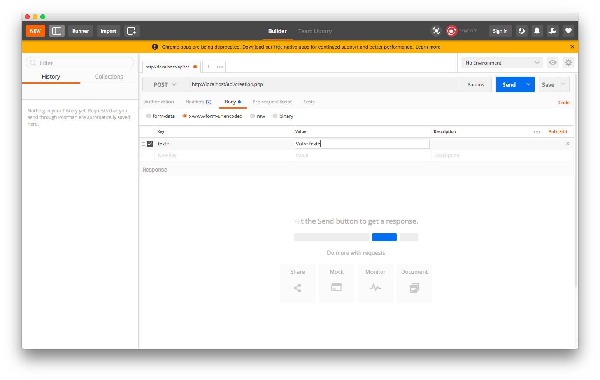
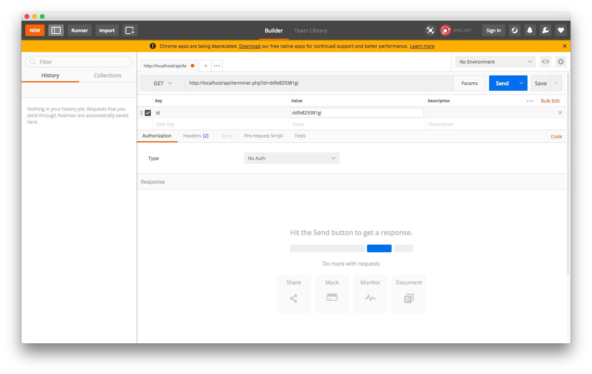
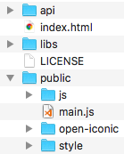

# Ajouter VueJS dans une application existante

Dans le cadre du TP, vous allez devoir « moderniser » une application simple. L’application à migrer a été réalisée dans le cadre de la démonstration _uniquement_.

L’application existante est une « todo liste » codée en PHP + HTML.

## Récupération et installation des sources

Avant de commencer à travailler, il faut récupérer le code source de l’application existante. Le projet est disponible sur Github : [télécharger les sources](https://github.com/c4software/php-todo/archive/v1.1.zip)

- Faire « fonctionner » l’application en local, une fois installée, celle-ci doit ressembler à :


- Étudier le fonctionnement du code source actuel. (créer des tâches, etc.)

## Liste des fonctionnalités

Voilà la liste des fonctionnalités de l’application existante :

- Liste des tâches.
- Ajout de tâche.
- Suppression de tâche.
- Marquer comme terminé une tâche.

## Stockage

Lors de votre étude du code, vous avez dû vous rendre compte que l’application utilisait la variable `$_SESSION` pour stocker les « tâches ».

La SESSION étant non persistante, dans du vrai code il ne faut en `aucun cas` stocker des données comme des tâches dedans (au risque de tout perdre…).

🔎 Au passage, regarder le fonctionnement de la SESSION en utilisant plusieurs navigateurs.

## Moderniser avec VueJS

Dans ce TP nous allons parcourir les différentes étapes de la migration de l’application (site web) « classique » en version « moderne » à savoir avec VueJS

## Création des API

Quand on réalise une application « moderne », il est très difficile d’échapper au client-serveur. Dans notre cas la partie serveur va être réalisée en PHP, mais il est possible de la faire dans n’importe quel langage. En entreprise vous serez souvent confronté à du PHP/Java/Python/RoR. Mais la liste est infinie. Il est même possible de faire des API en Bash… Bref le choix est infini.

### Les API

Notre cas étant simple, chaque API sera en réalité un fichier PHP qui se chargera de faire l’action voulue. Exemple :

- liste.php
- creation.php
- suppression.php
- terminer.php

Dans un nouveau dossier (version VueJS du site Web), ajouter un dossier `api` puis créer les `4` fichiers dans le dossier, nous les complèterons dans la suite du TP.

### L’API pour lister les tâches : liste.php

L’API « liste » doit retourner un JSON. Le JSON retourné est une représentation au format texte des valeurs contenues dans la variable `$_SESSION["todos"]`.

Exemple de retour :

```JSON
[
  {"contenu": "Démo", "termine": true},
  {"contenu": "Exemple", "termine": false}
]
```

Voilà un exemple de code pour réaliser un fichier JSON en PHP :

```php
<?php
  session_start();
  header("content-type: application/json");
  // Vérifier si en $_SESSION["todos"] est bien un tableau
  if(is_array($_SESSION["todos"])){
    echo json_encode($_SESSION["todos"]);
  }else{
    echo json_encode(array());
  }
?>
```

Rappel: Avant de pouvoir utiliser la session, vous devez faire un `session_start();`

C’est à vous, réaliser votre première API.

### Comment procéder pour les prochaines API

✋ En tant que développeur vous devez être malin (et fainéants…). Pour écrire les autres API, ne tentez pas de réinventer la poudre, utiliser les exemples fournis dans le code actuel (dans le dossier `actions` par exemple).

### L’API de création: creation.php

L’API « creation.php » va permettre la création de nouvelles « tâches », une fois l’ajout réalisé, celle-ci doit retourner un JSON permettant de savoir dans votre application si le traitement s’est bien passé. Cette API ne doit fonctionner qu’en POST.

Paramètre d’entrée :

| Nom   |  Type  | Méthode |
| ----- | :----: | ------: |
| texte | string |    POST |

Voici un exemple de code PHP :

```php
<?php
session_start();
header("content-type: application/json");

// Dans le cadre du traitement, vérifier si $_SESSION["todos"] est bien un tableau (is_array…)
if(!isset($_SESSION["todos"]) || !is_array($_SESSION["todos"])){
  $_SESSION["todos"] = array();
}

if(isset($_POST["texte"]) && $_POST["texte"] != ""){
  $todo = array("id" => uniqid(), "texte" => $_POST["texte"], "date" => time(), "termine" => false);
  // Sauvegarder dans la Session.
  $_SESSION["todos"][$todo["id"]] = $todo;
  // Afficher un JSON
  echo json_encode(array("success" => true));
}else{
  echo json_encode(array("success" => false));
}

?>
```

Retour :

Par exemple :

```json
{ "success": true }
```

Vous pouvez également utiliser les codes de retour HTTP pour indique l’état du résultat. [Documentation](https://developer.mozilla.org/en-US/docs/Web/HTTP/Status)

### L’API pour marquer une tâche comme terminée : terminer.php

L’API « terminer.php » va changer l’état du flag « termine ». Vous devez retourner un JSON permettant à votre future application de s’avoir si le traitement c’est bien déroulé.

Paramètre d’entrée :

| Nom |  Type  | Méthode |
| --- | :----: | ------: |
| id  | string |     GET |

### L’API de suppression : suppression.php

L’API « suppression » va permettre la suppression de la « tâche » passée en paramètre, **_uniquement_** les tâches dont le paramètre `termine == true` peuvent être terminée, dans tous les cas l’API doit retourner un JSON permettant de savoir dans votre application si le traitement c’est bien passé. L’API doit fonctionner en GET et en POST.

Contraintes :

- L’API doit fonctionner en GET et en POST.
- Il est impossible de supprimer une tâche non terminée. `termine == true`

Paramètre d’entrée :

| Nom |  Type  | Méthode |
| --- | :----: | ------: |
| id  | string |     GET |

Par exemple :

```json
{ "success": true }
```

### Valider le fonctionnement : Postman

Pour tester vos traitements, vous avez la possibilité d’utiliser le logiciel PostMan. PostMan va vous permettre de tester vos API simplement avec une interface graphique.

Téléchargez-le [ici](https://www.getpostman.com/)

Une fois installé, tester les appels à vos APIs pour valider le bon fonctionnement

- Valider le fonctionnement à chaque étape (Création, liste, terminer, suppression).

#### Pour l’API création

Petite subtilité, pour l’API de création vous devez faire une requête en POST. Vous devez donc régler PostMan comme ça :



#### Pour les autres API

Pour les autres API (sauf liste), vous allez devoir envoyer un `id` en paramètre, avec PostMan c’est simple, voilà la configuration que vous allez devoir faire :



### Optimisation du code

Après avoir réalisé vos 4 API, vous devez certainement avoir du code « dupliqué ». Modifier vos API pour créer des fonctions « utilitaires » permettant de réduire la duplication de code.

- Comment procédez-vous ?
- Tester le fonctionnement à nouveau.

## Intégration de VueJS

Maintenant que nous avons créé les API nous allons pouvoir nous intéresser à la partie « J’intègre VueJS ».

Le déroulement des prochaines étapes va être le suivant :

- Intégrer la librairie VueJS dans le code existant.
- Créer « un composant / objet » global qui va gérer l’application.
- « Convertir » le code existant en code « VueJS » (le Foreach par exemple).

Ne vous inquiétez pas, tout est détaillé dans les prochaines étapes :

Pour réaliser la suite du TP, nous allons avoir besoin des ressources suivantes :

- [VueJS](https://vuejs.org)
- [CanIUse](https://caniuse.com)

### Création de la structure de « futur » projet

Maintenant que nous avons les API, nous allons pouvoir créer la structure de la « V2 ». La suite du TP va détailler le processus, mais voilà le rendu du projet que vous allez obtenir:



Vous pouvez dès à présent déplacer les différents fichiers, pour obtenir la même chose (surtout pour le dossier `public`)

### Conversion du template existant

La première étape est de convertir le fichier `index.php`. Notre application 2.0, ne sera plus une application PHP classique, mais une application reposant sur un modèle Client <-> Serveur. Pour ça vous devez procéder à quelques ajustements dans le site Internet :

- Supprimer le fichier index.php (il n’est plus nécessaire).
- Déplacer le template (dans le dossier template à la racine).
- Renommer le template que vous avez déplacé en « index.html », ça va être la base de notre application.

### Ajout de la librairie VueJS

L’ajout de la librairie VueJS est simple, il suffit d’ajouter dans le « head » du index.html :

```html
<script src="https://unpkg.com/vue"></script>
```

Valider le fonctionnement grâce à la « Console de Développement » de votre Navigateur (touche F12 en général).

⚠️ Dans une optique développement sécurisé, il est préférable d’intégrer VueJS dans vos sources plutôt que de « linker » directement depuis Internet.

- Comment validez-vous le fonctionnement ?
- Changer les sources, pour intégrer la librairie en local.

#### Ajouter un script pour le JS

Ajouter avant la balise `</body>` de l’index.html un nouveau script `main.js`, il contiendra le code nécessaire au fonctionnement de notre site Web.

#### Déclarer votre premier composant

Pour déclarer votre premier composant / objet VueJS, c’est simple il suffit de mettre dans le fichier `main.js` le code suivant :

```javascript
var app = new Vue({
  el: ".container",
  created() {
    console.log("Démarrage TODO-APP");
  },
});
```

- Vérifier le bon fonctionnement en regardant la « Console de Développement ». Le « log » est-il visible ?

### Migration des fonctionnalités

Maintenant que nous avons notre base, nous allons pouvoir convertir l’application pour cela nous allons procéder par étape, chaque étape est directement liée aux différentes API que vous avez pu précédemment écrite.

L’ensemble de l’application va devenir « asynchrone », vous allez vite vous rendre compte que la migration va nécessiter beaucoup d’Ajax. Pour faire nos appels, nous utiliserons l’API « Fetch », celle-ci est intégrée dans l’ensemble des navigateurs récents, le bon réflexe est quand même d’aller voir le support de Fetch sur ([Can i use](https://caniuse.com/#search=fetch)).

#### Découverte de Fetch

L'API Fetch fournit une interface JavaScript pour l'accès et la manipulation des parties du pipeline HTTP, comme les requêtes et les réponses. Cela fournit aussi une méthode globale fetch() qui procure un moyen facile et logique de récupérer des ressources à travers le réseau de manière asynchrone.

Ce genre de fonctionnalité était auparavant réalisé avec XMLHttpRequest. Fetch fournit une meilleure alternative qui peut être utilisée facilement par d’autres technologies comme Service Workers. Fetch fournit aussi un endroit unique et logique pour la définition d'autres concepts liés à HTTP comme CORS et les extensions d'HTTP.

(Source: MDM)

Le support de l'API Fetch peut être détecté en vérifiant l'existence de Headers, Request, Response ou fetch() sur la portée de Window ou de Worker.
Par exemple, vous pouvez faire cela dans votre script:

```javascript
if (self.fetch) {
  // Le support de Fetch est présent
} else {
  // Gérer le cas du non-support de fetch.
  // Pour réduire le nombre de cas possible vous pouvez ajouter : https://github.github.io/fetch/ à votre projet
}
```

Voici un EXEMPLE d’utilisation de Fetch :

```javascript
fetch("api/liste.php", { method: "GET", credentials: "same-origin" })
  .then((response) => {
    // On décode le JSON, et on continue
    return response.json();
  })
  .then((response) => {
    // Votre retour est ICI
    console.log(response);
  })
  .catch((error) => {
    console.log("Récupération impossible: " + error.message);
  });
```

⚠️ Que veux dire `credentials: 'same-origin'`? Par défaut, Fetch n’utilise pas les Cookies, vous pouvez forcer l’utilisation des cookies en indiquant `credentials: 'same-origin'`. Si vous ne le faites pas vos `$_SESSION` ne seront pas sauvegardées ⚠️

Tester le code précédent dans :

- Tester dès à présent cet appel dans la « Console développeur »

Pour aller plus loin dans l’utilisation de Fetch, je vous recommande la lecture de [la documentation complète (gestion des headers, paramètres, mode, etc.)](https://developer.mozilla.org/fr/docs/Web/API/Fetch_API/Using_Fetch)

#### Liste des tâches

La liste des tâches est chargée dès l’arrivée sur la page « principale ». Vous devez donc écrire du code dans l’évènement « beforeMount » (pour rappel n’hésitez pas à consulter le [cycle de vie des composants](https://vuejs.org/images/lifecycle.png))

- Dans le fichier main.js, ajouter à l’objet Vue `beforeMount`

```javascript
var app = new Vue({
  el: ".container",
  created() {
    console.log("Démarrage TODO-APP");
  },
  beforeMount() {
    // C’est ici que le traitement doit être fait
  },
});
```

- Ajouter le code suivant dans la partie `beforeMount`

```javascript
fetch("api/liste.php", { method: "GET", credentials: "same-origin" })
  .then((response) => {
    return response.json();
  })
  .then((response) => {
    app.taches = response;
  })
  .catch((error) => {
    console.log("Récupération impossible: " + error.message);
  });
```

- Initialiser la variable taches dans l’objet VueJS, Exemple :

```javascript
var app = new Vue({
  el: '.container',
  data: {
      taches: []
  }
  […]
```

- Ajouter l’affichage dans le « template ». Dans la page HTML vous allez devoir utiliser l’attribut `v-for`. Exemple :

```html
<ul>
  <li v-for="tache in taches">{{tache.texte}}</li>
</ul>
```

Adapter l’exemple précédant pour afficher les tâches comme ils l’étaient dans la page en version PHP.

[Plus de détail sur la partie « rendu des listes »](https://fr.vuejs.org/v2/guide/list.html)

- L’affichage est-il le même ?
- Comment gérer le cas du chargement ? (dans le monde réel Internet peut-être lent…)
- Comment gérer le cas de la liste vide ?

#### Optimisation.

Déplacer le code actuellement dans `beforeMount` dans une nouvelle méthode appelée `recupererListe` :

```javascript
var app = new Vue({
  […]
  methods: {
    recupererListe() {
      // …
    }
  }
```

Remplacer le code dans le `beforeMount` pour appeler la méthode `recupererListe`.

```javascript
var app = new Vue({
  el: ".container",
  created() {
    console.log("Démarrage TODO-APP");
  },
  beforeMount() {
    app.recupererListe();
  },
});
```

#### Ajout d’une tâche

Maintenant que la liste est affichée, vous allez pouvoir gérer le cas de l’ajout d’une nouvelle tâche. L’ajout va également être fait via un appel Ajax.

- Créer une méthode JavaScript, réalisant l’appel de l’API.

⚠️ Attention: L’utilisateur devant être prévenu de l’aspect obligatoire du contenu, vous devez rendre la saisie obligatoire (contrôle de saisie, et/ou via [librairie Sweetalert](https://sweetalert.js.org/)) ⚠️

```javascript
var app = new Vue({
  […]
  methods: {
    ajout() {
      var contenu = document.getElementById("texte").value;
      if(contenu == ""){
        swal("Oops","Vous devez spécifier du texte…" , "error" );
      }else{
        // Appel de l’API avec Fetch (Ajax)
      }
    }
  }
  […]
```

- Créer l’appel à l’API

```javascript
var form = new FormData();
form.append("texte", contenu);
fetch("api/creation.php", {
  method: "POST",
  body: form,
  credentials: "same-origin",
})
  .then((response) => {
    return response.json();
  })
  .then((response) => {
    if (response.success) {
      app.recupererListe();
    } else {
      // Gérer le cas d'erreur. Par exemple, afficher une Sweetalert pour le client.
    }
  })
  .catch((error) => {
    console.log("Récupération impossible: " + error.message);
  });
```

- Rafraichir la liste des tâches, pour ça vous allez créer une 2nd méthode qui réalise l’appel Ajax de récupération de la liste. Une fois cette méthode faite, appeler la dans la partie `// traiter le retour`.
- Optimiser votre code en remplaçant le code dans le `beforeMount` par un appel à la méthode que vous avez créée.

Votre objet VueJS doit ressembler à quelque chose comme ça :

```javascript
var app = new Vue({
  el: ".container",
  created() {
    console.log("Démarrage TODO-APP");
  },
  data: {
    taches: [],
  },
  beforeMount() {
    app.recupererListe();
  },
  methods: {
    ajout() {},
    recupererListe() {},
  },
});
```

- Appel de votre code dans le template. Maintenant que votre code est prêt, vous allez pouvoir l’appeler depuis votre template. Pour faire ça, vous allez utiliser [la gestion des évènements de VueJS](https://vuejs.org/v2/guide/events.html) Exemple :

```html
<form v-on:submit.prevent="ajout()"></form>
```

- Tester votre code.
- Tester l’ajout de tâche.
- Tenter d’injecter du code. Que se passe-t-il ?

#### Marquer une tâche comme terminée

Pour marquer une tâche comme terminée, vous allez devoir appeler l’api « terminer.php ». Cette API doit être appelée lors du clic sur l’icône qui a comme class « oi oi-check ».

- Utilisez-le [v-on:click](https://fr.vuejs.org/v2/guide/events.html)
- Remplacer :

```html
<a href="./actions/done.php?id={id}" class="btn btn-success"
  ><span class="oi oi-check"></span
></a>
```

Par

```html
<span class="oi oi-check" v-on:click="terminer(todo.id)"></span>
```

- Déclarer la méthode « terminer » dans votre objet VueJS. Faites l’appel à votre API.
- L’objet VueJS doit maintenant ressemble à quelque chose comme ça :

```javascript
var app = new Vue({
  el: ".container",
  created() {
    console.log("Démarrage TODO-APP");
  },
  data: {
    taches: [],
  },
  beforeMount() {
    app.recupererListe();
  },
  methods: {
    ajout() {},
    recupererListe() {},
    terminer(id) {},
  },
});
```

- Ajouter le [v-if](https://fr.vuejs.org/v2/guide/conditional.html) nécessaire à la règle suivante « uniquement les tâches non terminées peuvent être marquées comme terminées »
- Tester le fonctionnement.
- Valider que seulement les tâches marquées comme « non terminées » peuvent être terminées.

#### Suppression d’une tâche

La suppression d’une tâche est très similaire à l’action « terminer.php ». Je vous laisse appliquer la méthodologie précédente.

Ne pas oublier la règle de gestion : « Une tâche non marquée comme terminée ne peut être supprimée. »

L’objet doit maintenant ressembler à (Le code que vous avez écrit en moins):

```javascript
var app = new Vue({
  el: ".container",
  created() {
    console.log("Démarrage TODO-APP");
  },
  data: {
    taches: [],
  },
  beforeMount() {
    app.recupererListe();
  },
  methods: {
    ajout() {},
    recupererListe() {},
    terminer(id) {},
    supprimer(id) {},
  },
});
```

#### Optimisation

Comme vous l’avez certainement constaté, les deux dernières actions sont très similaires. Faites fusionner les deux actions en ajoutant par exemple un paramètre « action ». Ce paramètre vous permettra de savoir dans quel cas vous vous trouvez, je vous laisse écrire le code.

## Allez plus loin

Quelques pistes pour aller plus loin dans le code :

### Ajouter des confirmations

Ajout des confirmations avant les actions « marquer comme terminé » et l’action suppression.

### Utiliser l'API de partage

Depuis quelques mois Chrom(e|ium) propose une nouvelle API nommée « Web Share Api », Cette API permet de déclencher « le Partage » d’une information en utilisant les possibilités natives du Téléphone. Comme cette API n’est disponible que sur un téléphone et uniquement en HTTPS vous devez tester si celle-ci est présente avec

```javascript
if (navigator.share) {
}
```

[Voir le support de Share](https://caniuse.com/#search=Web%20Share%20Api)

Mais comme nous sommes avec VueJS nous allons gérer ça avec le MVVM (Modèle Vue, Vue-Modèle), ça va nous permettre d’injecter une variable à la création de l’objet `app` pour connaitre si le partage est disponible. Exemple :

```javascript
var app = new Vue({
  el: '.container',
  created() {
    console.log("Démarrage TODO-APP");
  },
  data: {
      taches: [],
      isShare: navigator.share?true:false
  },
  […]
```

Une fois fait, vous avez une variable `isShare` qui sera `True` Ou `False` en fonction du support du navigateur. Maintenant que le booléen est disponible vous pouvez ajouter un élément cliquable pour déclencher l’action (prendre exemple sur la suppression ou le marquer comme terminé). Exemple de code pour déclencher le partage :

```javascript
[…]
methods:{
    share(texte){
      navigator.share({
        title: 'VueJS-Todo',
        text: texte,
        url: ""})
        .then(() => {
          // TODO
        })
        .catch(() => {
          // TODO
        })
    },
[…]
```

C’est à vous !

### Ajouter des règles de réécriture

Ajouter des règles de réécriture via un fichier .htaccess

Le fichier `.htaccess` exemple :

```apacheconf
RewriteEngine On
RewriteRule ^api/ajouter$ api/ajouter.php [L,QSA]
```

Une fois les règles de réécriture faites, modifier les différents chemins (appel d’API) dans votre fichier JavaScript.
