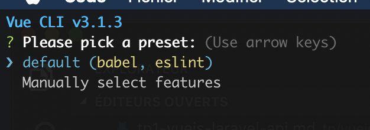
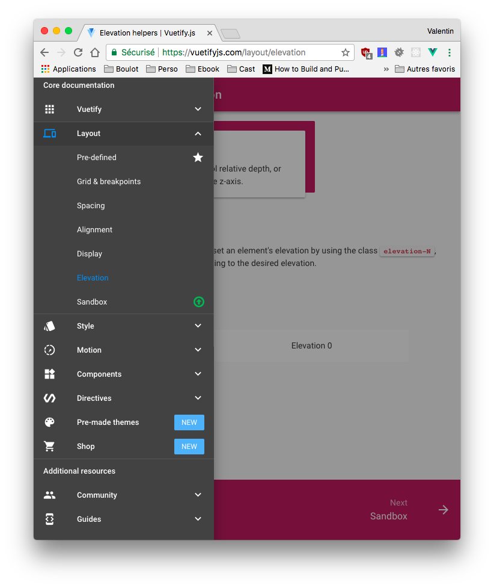
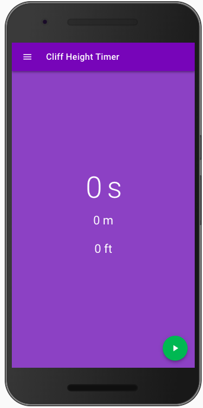
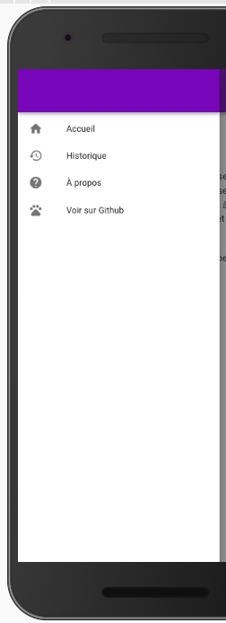

# Réaliser une application avec VueJS

Dans ce TP nous allons utiliser une autre façon d’utiliser VueJS, une façon plus moderne, celle qui utilise à 100% le modèle MVVM (Modèle Vue, Vue-Modèle) ainsi que la puissance de VueJS (```.vue```, VueCli, ES5)


## MVVM en quelques mots

Non mais moi je connais que MVC, C’est quoi MVVM ?

MVVM est un design pattern, souvent utilisé par les bibliothèques Javascript moderne (Ionic, VueJS, ReactJS). A l’origine, MVVM à été introduit par Microsoft.

Ce pattern a spécialement été conçu pour améliorer la séparation entre les données et la vue qui les affichent. Le lien entre la vue et le modèle de données est fait par des mécanismes de binding. Le binding est un mécanisme qui permet de faire des liaisons entre des données de manière dynamiques. Ce qui veut dire que si A et B sont lié, le fait de modifier A va être répercuté sur B et inversement.

- Model : le modèle contient les données.
- View : la vue correspond à ce qui est affiché. C’est notre site Web
- ViewModel : ce composant fait le lien entre le modèle et la vue. Il s’occupe de gérer les liaisons de données et les éventuelles conversions. C’est ici qu’intervient le binding.

L’important avec MVVM c’est que ***la vue ne doit jamais traiter de données***. Elle s’occupe uniquement de les afficher. Le View-Model aura en charge les conversions et les accès au modèle de données.


## Introduction

Maintenant que vous savez ce que c’est le MVVM, nous allons attaquer le TP pour de vrai. Nous allons réaliser « une application » à l’aide de VueJS. Cette application est purement pour la démonstration, Cette application calculera la hauteur d’une falaise (ou de n’importe que de suffisamment haut) en fonction du temps chute d’un objet jeter du haut de celle-ci.


## Initialisation du projet

Avant de commencer nous allons avoir besoin de plusieurs outils :

- NodeJS
- Vue-cli

### NodeJS

La première étape, vas être l’installation de NodeJS, la démarche est différente en fonction de votre environnement, mais pour résumer [sous Windows c’est ici](https://nodejs.org/en/download/), sous OSX le plus simple c’est via Brew ```brew install nodejs```, et sous Linux c’est via le gestionnaire de paquet ```apt install nodejs```

Une fois installé, vous êtes prêt, votre PC est prêt à accueillir l’outil VueCLI

### Vue-cli

Vue-cli est un outil qui simplifie la création d’un nouveau projet Vue-JS à partir de template fourni par la communauté.

Dans un terminal lancer la commande suivante :

```bash
npm install -g vue-cli
```

Maintenant que vue-cli est installé, vous avez à votre disposition sur votre ordinateur une nouvelle commande, la commande ```vue```

Vue-Cli intègre plusieurs template :

- webpack : A full-featured Webpack + vue-loader setup with hot reload, linting, testing & css extraction.
- webpack-simple : A simple Webpack + vue-loader setup for quick prototyping.
- browserify : A full-featured Browserify + vueify setup with hot-reload, linting & unit testing.
- browserify-simple : A simple Browserify + vueify setup for quick prototyping.
- pwa : PWA template for vue-cli based on the webpack template
- simple : The simplest possible Vue setup in a single HTML file

Pour notre exemple nous allons prendre le Webpack, il contient tous les éléments qui seront intéressant pour réaliser notre application.

Pour créer un nouveau projet, c’est simple il suffit de lancer la commande suivante :

```bash
vue init webpack cliff-height-timer
```

⚠️ Attention, la commande créer le projet dans le dossier courant ! ⚠️

Le Vue-Cli est interactif il va vous posez des question permettant de configurer votre projet :



Voilà notre projet est maintenant prêt. Place à la suite.

## Installation des librairies (du projet)

Le projet que vous avez initialisé est « vide », c’est-à-dire que dans l’état il n’est pas fonctionnel. Avant de pouvoir l’afficher vous allez devoir installer les librairies (VueJS, WebPack, …). Cette étape n’est à faire qu’une seul fois sur votre poste, en effet en général on ne commit pas les fichier « librairies » qui sont présent dans le future dossier ```node_module``` pour la simple et bonne raison que celui-ci est gros et rempli de pleins de petits fichiers (et qu’en plus ça se re-télécharge facilement depuis Internet).

Pour l’installation la procédure est la suivante :

```bash
cd cliff-height-timer/
npm install
```

⚠️ L’installation risque de prendre plusieurs secondes (enfin 1 ou 2 minutes).

Dans mon cas :

```
added 1070 packages in 49.404s
```

Une fois terminé votre projet est prêt à être lancé.

## Premier lancement (l’exemple)

Les librairies étant maintenant disponible, nous allons pouvoir lancer l’exemple fourni par Vue-Cli, pour ça rien de plus simple

```bash
npm run dev
```

une fois cette commande lancée, votre navigateur va s’ouvrir sur un nouvel onglet contenant « l’application » de démonstration fournie par le template


## Le serveur de développement

Comme vous avez pu le constater dans votre invite de commande (terminal), vous avez un serveur qui tourne. Ce serveur est un peut particulier, il n’est utilisé que dans la phase de développement il incorpore plusieurs outils permettant de simplifier la création d’application Javascript :

- Redémarrage à chaud, comprendre ici, qu’il va « patcher » votre code pour intégrer vos dernières modifications sans que vous n’ayez rien à faire (GÉNIAL !)
- Lint, analyse du code pour vous remontez les erreurs avant l’execution.
- Gestion des .vue (avec vue-loader)

Et si vous avez les outils sur votre machine il peu également :

- Créer la CSS à partir du SCSS présent dans le .vue
- Et plein d’autres usage car Webpack c’est un outil qui permet l’assemblage de différent outils


## Le code source

Les sources de l’application sont dans le dossier ```src/``` il contient l’ensemble du code source de votre application. Pour l’instant nous avons le code fourni par VueJS, au fur et à mesure des futures étapes nous allons le modifier pour le transformer dans l’application « cliff height timer ». Avant de « presque » tout remplacer nous allons modifier celui fourni pour nous familiariser avec « le serveur de dévoloppement »

### L’IDE

Pour faire du VueJS le mieux c’est d’avoir un bon IDE. Au revoir Notepad++ (qui d’ailleurs au passage est rarement un bon choix pour faire du code de qualité), bonjour WebStorm? Malheureusement WebStorm est payant, si vous avez une licence tant mieux (pour les étudiants c’est gratuit).

Pour ceux qui n’ont pas de licence je vous propose d’utiliser [Visual Studio Code](https://code.visualstudio.com) et d’ajouter le plugin ```Vetur``` pour pouvoir éditer les ```.vue``` dans de bonne condition.

### Éditer le App.vue

Pour commencer simple nous allons éditer le fichier ```components/HelloWord.vue```, ce fichier est la « page d’accueil » de l’application fourni (nous allons verront comment dans les prochaines étapes)

Apporter des modifications dans le fichier :

- Modifier le code HTML de la page, par exemple le ```h2```
- Modifier le contenue de la variable (dans la partie data)
- Modifier la CSS en bas du ```.vue```, par exemple la couleur pour les ```a```

## Ajout de VuetifyJS dans le projet

Nous allons commencer notre projet en intégrant [VuetifyJS](https://vuetifyjs.com/). Pour rappel VuetifyJS est un ensemble de composants respectant les guidelines Material Design.



### Ajout de la dépendances

Comme vue en cours VueJS repose sur NodeJS, nous avons donc la possibilité de gérer nos dépendances avec npm. La première étape est donc d’ajouter la dépendance à notre projet :

```bash
npm install vuetify
```

PS: Si vous allez voir un peu le site de VuetifyJS vous allez rapidement voir qu’il existe des « templates » VuetifyJS pour VueCLI. Dans ce TP découverte j’ai volontairement fait le choix de ne pas les utiliser pour que vous découvriez un peu plus en détails la construction d’une application VueJS.

### Déclarer et utiliser VuetifyJS

Maintenant que la dépendance est installé nous allons pouvoir l’utiliser.

Première étape modifier le fichier ```main.js``` pour ajouter le code suivant :

```javascript
require('vuetify/dist/vuetify.min.css');
import Vuetify from 'vuetify'
Vue.use(Vuetify);
```

⚠️ Ajouter le code **avant** :

```javascript
Vue.config.productionTip = false
```

Voilà ! Votre application utilise maintenant VuetifyJS. Cependant, aucune de vos ```.vue``` n’utilises de composants fourni vous. Pour l’instant aucune différences donc ;). Pour l’instant…

Un petit détail, pour que tout soit parfait ajouter le code suivant dans le ```head``` du fichier ```index.html``` à la racine:

```html
<link href='https://fonts.googleapis.com/css?family=Roboto:300,400,500,700|Material+Icons' rel="stylesheet">
```
Cette CSS est la déclaration de la « font » Roboto (font par défaut) d’Android.

### Activer le Responsive

Pour que le responsive fonctionne correctement, il faut ajouter les bon viewport grace à la ```meta``` suivante :

```html
<meta name="viewport" content="width=device-width, initial-scale=1">
```

Ajouter la dans le fichier ```index.html``` à la racine.

### Transformer le template de base

Maintenant que VuetifyJS est complètement disponible vous allez pouvoir utiliser vos premiers composants

Pour débuter nous allons remplacer le contenu du fichier ```App.vue``` pour déclarer le gabarit principale de l’application :

```html
<template>
  <v-app toolbar fill-height>
    <myToolbar />
    <main>
      <v-container fluid pa-0>
        <router-view></router-view>
      </v-container>
    </main>
  </v-app>
</template>

<script>
import myToolbar from "@/components/MyToolbar"

export default {
  name: 'app',
  components: {myToolbar},
}
</script>
```

⚠️ Pour l’instant le code que vous avez remplacer n’est pas fonctionnel, pour la simple et bonne raison qu’il fait référence à un composant que vous n’avez pas encore écrit ```myToolbar```

### Déclaration de myToolbar

Créer un nouveau fichier nommé ```MyToolbar.vue``` dans le dossier ```components```

```javascript
<template>
  <div>
    <v-toolbar class="primary deep-purple" fixed >
      <v-toolbar-side-icon dark @click.stop="drawer = !drawer"></v-toolbar-side-icon>
      <v-toolbar-title @click="goHome" class="white--text">Cliff height timer</v-toolbar-title>
    </v-toolbar>
  </div>
</template>

<script>
export default {
  name: "myToolbar",
  data: function() {
    return {
      drawer: false
    }
  },
  methods: {
    goHome (){
      window.location.hash = "/";
    }
  }
}
</script>
```

### Voir le changement

Voilà, vous avez atteint la première étape. Vous pouvez lancer votre application en faisant :

```bash
npm run dev
```

TODO IMAGE

## Le Routeur

Votre application est maintenant fonctionnel cependant comme vous le constater vous n’avez pour l’instant qu’une « seule page », le fichier ressemble à quelques chose comme ça :

```javascript
import Vue from 'vue'
import Router from 'vue-router'
import Home from '@/views/Home'

Vue.use(Router);

export default new Router({
  routes: [
    {
      path: '/',
      name: 'Home',
      component: Home
    }
  ]
})
```

⚠️ Ne copiez pas le contenu garder le votre ⚠️

C’est dans le tableau « routes » que vous allez ajouter les différents « chemin » qui conduiront à vos différentes pages. Pour l’instant la seul qui existe c’est la « home ».

## Ajout du multilangues (i18n)

Quand on conçoit un application il est important de gérer certains points dès le début, le multilangues est est l’un de c’est points.  Dans le développement le multilangues s’appel « internationalisation » abrégé en i18n, où 18 représente le nombre de caractères entre le i et le n dans « internationalisation »)

Pour gérer l’internationalisation VueJS propose une librairie appelée ```vue-i18n```, avant de pouvoir l’utiliser il faut l’installer via :

```shell
npm install vue-i18n --save
```

Une fois installé, nous allons pouvoir gérer nos textes en plusieurs langues (et sans se prendre la tête).

### Ajout du fichier de langue

Nous allons maintenant ajouter notre code qui gèrera le i18n. Pour ça nous allons créer un dossier ```i18n``` dans le dossier ```src```

```shell
mkdir src/i18n
```

Puis dans le dossier, nous allons ajouter le fichier ```index.js``` suivant :

```javascript
import VueI18n from 'vue-i18n'
import Vue from 'vue'
Vue.use(VueI18n);

const messages = {
    en: {
    },
    fr: {
    }
};

export const i18n = new VueI18n({
    locale: getLanguage(),
    fallbackLocale: 'en',
    messages,
});

function getLanguage() {
    try {
        let l = navigator.language.split("-");
        return l[0];
    }catch(err){
        return navigator.language;
    }
}
```

ℹ️ Étudier le code précédent :

- ```messages``` contiendra vos prochains textes dans les différentes langues.
- ```getLanguage``` est une fonction qui retourne la langue actuellement définie pour le poste de client.
- ```i18n``` est l’objet représentant la fonctionnalité i18n.

### Déclarer à notre application la présence du i18n

Maintenant que nous avons créer notre « module » i18n, nous devons indiquer à notre application qu’elle doit s’en servir. Pour ça nous allons éditer le fichier ```src/main.js```

Pour ajouter :

```javascript
[…]
import {i18n} from './i18n' // <== ICI
[…]
  router,
  i18n, // <== ICI
  template: '<App/>',
[…]
```

J’ai volontairement ellipsé le code source… Je ne vais pas tout vous dire…

### Déclarer un nouveau texte

Notre internationalisation est maintenant prête à être utilisée. Nous allons l’utiliser dès maintenant dans le fichier  ```/components/MyToolbar```

- Remplacer la chaine ```Cliff height timer``` par => ```{{ $t("title") }}```
- Déclarer « title » dans ```i18n/index.js```

ℹ️ $t est un objet qui permet d’accéder aux textes actuellement chargé pour la langue de l’utilisateur.

### Tester

Vérifier en relançant votre application que votre titre est toujours présent :

```shell
npm run dev
```

## Les .vues

Maintenant que nous avons la base de notre projet, nous allons commencer à créer les différents fichiers Vue’s

Contrairement à l’exemples par défaut, nous allons mettre nos fichiers ```.vue``` dans un nouveau dossier ```src/views```. Première étape créer le dossier :

```
mkdir src/views/
```

Profitons en également pour supprimer le fichier ```src/components/HelloWorld.vue``` qui est maintenant inutile

### La « page » Accueil

Nous allons commencer par la page d’accueil, celle-ci doit ressembler à :



Pour faite cette vue, vous allez avoir besoin des éléments suivants :

- [FAB](https://vuetifyjs.com/components/floating-action-buttons)
- [Les variables computed](https://vuejs.org/v2/guide/computed.html)
- [v-bind:class](https://vuejs.org/v2/guide/class-and-style.html)
- [Afficher une variables](https://vuejs.org/v2/guide/syntax.html)
- [Centrer verticalement](https://gist.github.com/c4software/b9fe4cd06e99d3bff16a09260b03e149)

Étape de la création :

- Créer le fichier ```Home.vue``` dans le dossier ```src/views/```
- Créer la structure de votre Vue :

```javascript
<template>
  // Votre template ici.
</template>

<script>
export default {
    name: 'home',
    data: () => {
        return {
            running: false,
            time: 0,
            m: "0",
            ft: "0"
        }
    },
    computed:{
      state_icon() {
        // Retourne l’icone utilisé pour le FAB
      },
      state_class() {
        // Retourne la couleur du FAB
      }
    },
    methods:{
        action(){
          // Action au click sur le FAB « start / stop »
        },
        compute(){
          // Méthode qui calcul la hauteur par rapport au temps de chute.

          let fallTime = new Date().getTime() - this.start;
          let height = 16*Math.pow((fallTime/1000), 2);
          let numberDigits = 1;

          if(height < 1){
              numberDigits = 2;
          }

          this.time   = (fallTime/1000).toFixed(2);
          this.ft     = height.toFixed(numberDigits);
          this.m      = (height/3.2808).toFixed(numberDigits);
        }
    }
}
</script>

<style scoped>
  // CSS du composant
</style>
```

- Déclarer la vue dans votre ```router/index.js```. Retirer la vue ```/``` existante pour y mettre la votre. Exemple :

```javascript
[…]
import Home from '@/views/Home'
[…]
    {
      path: '/',
      name: 'Home',
      component: Home
    }
[…]
```
- Tester votre code :

```shell
npm run dev
```

### La « page » À Propos

Voilà le rendu de « la page » que vous devez réaliser :


- Créer le fichier ```src/views/About.vue```

```javascript
<template>
    <v-container>
    […]
    </v-container>
</template>

<script>
    export default {
        name: 'about'
    }
</script>
```

⚠️ N’oubliez pas tous les textes doivent-être dans le fichier ```i18n/index.js``` et être utiliser via ```{{$t("label")}}```

- Ajouter dans ```router/index.js``` le code pour pouvoir accèder à votre Vue.

✋ Vous avez ajouter votre nouveau fichier, mais pour l’instant votre application ne contient pas de menu. Nous allons en ajouter un pour pouvoir naviguer entre les pages.

### Ajout du « Drawer »

Dans le monde « mobile », un menu s’appel un Drawer (un tirroir). Nous allons donc créer un Drawer. Pour ça nous allons avoir besoin des ressources suivantes:

- [v-toolbar](https://vuetifyjs.com/components/toolbars)
- [v-list](https://vuetifyjs.com/components/lists)
- [Vue-i18n](https://kazupon.github.io/vue-i18n/en/)



Création :

- Pour ça, créer le fichier ```/src/components/Drawer.vue```

```javascript
<template>
  <div>
    <v-toolbar class="primary deep-purple" />
    <v-list dense>
      <template v-for="(item, i) in items">
        <v-divider dark v-if="item.divider" :key="i"></v-divider>
        <v-list-tile :href="item.action" :key="i" v-else>
          <v-list-tile-action>
            <v-icon>{{ item.icon }}</v-icon>
          </v-list-tile-action>
          <v-list-tile-content>
            <v-list-tile-title>
              {{ item.text }}
            </v-list-tile-title>
          </v-list-tile-content>
        </v-list-tile>
      </template>
    </v-list>
  </div>
</template>

<script>
export default {
  name: "drawer",
  data: function() {
    return {
      items: [
        { icon: 'home', text: this.$t("drawer.home"), action: '#/' }
        { icon: 'help', text: this.$t("drawer.about"), action: '#/about' },
        { divider: true },
        { icon: 'pets', text: this.$t('see_on_github'), action: '#' },
      ]
    }
  }
}
</script>
```

- Déclarer les différents textes dans le fichier ```i18n/index.js```

Maintenant que notre composant est terminé, nous devons l’utiliser. Nous allons l’utiliser dans le premier composant que nous avons écrit ```src/components/MyToolbar.vue```, modifier le pour intégrer les modifications suivantes :

```javascript
<template>
  <div>
    // Nouveau
    <v-navigation-drawer v-model="drawer" temporary>
      <myContentDrawer />
    </v-navigation-drawer>
    // Reste du code déjà présent
[…]
<script>
import myContentDrawer from "@/components/Drawer" // <== Nouveau

export default {
  name: "myToolbar",
  components: {myContentDrawer}, // <== Nouveau
[…]
```

- Tester votre application :

```shell
npm run dev
```

### La « page » historique

Notre application est maintenant fonctionnelle. Nous avons la capacité de calculer des chutes, d’afficher le informations sur l’application, et bonus dans plusieurs langues !

Mais je pense qu’une application n’est jamais vraiment complète sans une  notion d’historique. Pour ça nous allons créer une nouvelle « vue »

- Créer le fichier ```src/views/History.vue```
- Créer la correspondance entre la Vue et le chemin dans le fichier  ```router/index.js```
- N’oubliez pas également d’ajouter l’élément dans le menu Drawer.
- Les textes doivent également être mis dans la partie i18n

Pour réaliser la vue Historique nous allons devoir sauvegarder les différents résultat. Pour ça nous allons utiliser le ```Localstorage```, avant d’allez plus loin je vous propose un peu de lecture sur le Localstorage :

> La propriété localStorage vous permet d'accéder à un objet local Storage. Le localStorage est similaire au sessionStorage. La seule différence : les données stockées dans le localStorage n'ont pas de délai d'expiration, alors que les données stockées dans le sessionStorage sont nettoyées quand la session navigateur prend fin — donc quand on ferme le navigateur.
Source: https://developer.mozilla.org/fr/docs/Web/API/Window/localStorage

⚠️ Petite subtilitée, vous ne pouvez pas stocker de tableau (array) dans le localStorage nous allons devoir utiliser un JSON.

#### Sauvegarder un élément dans le localStorage

```javascript
localStorage.setItem('historique', JSON.stringify([]));
```

#### Lire un élément dans le localStorage

```javascript
JSON.parse(localStorage.getItem("history"));
```

#### Démarche

- Adapter le code de ```Home.vue``` pour sauvegarder le résultat dans un tableau d’historique à chaque fois que l’utilisateur enregistre une nouvelle chute.
- Écrire le code de la page ```History.vue``` pour afficher les valeurs enregistrées.

Ressources utiles :

- [Liste Vuetify](https://vuetifyjs.com/components/lists)
- [JSON](https://developer.mozilla.org/fr/docs/Web/JavaScript/Reference/Objets_globaux/JSON)
- [Tester si tableau](https://www.w3schools.com/jsref/jsref_isarray.asp)

Vu que c’est la 3ème vue que vous faites, je pense qu’il n’est plus nécéssaire que je vous fournisse du code.

## Distribuer vos sources
