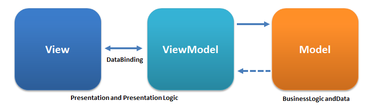
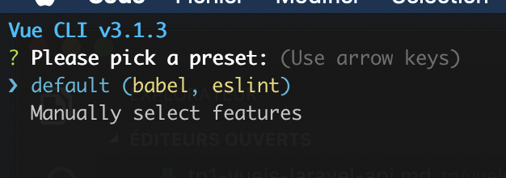
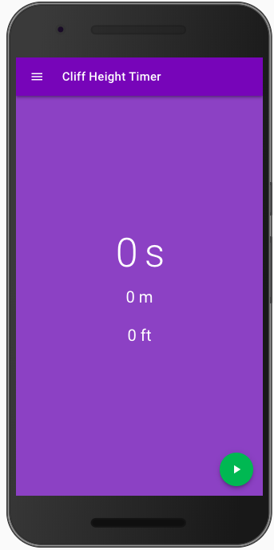
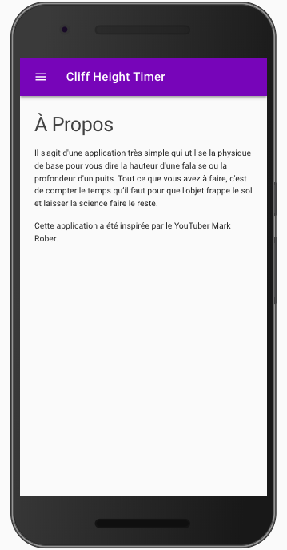
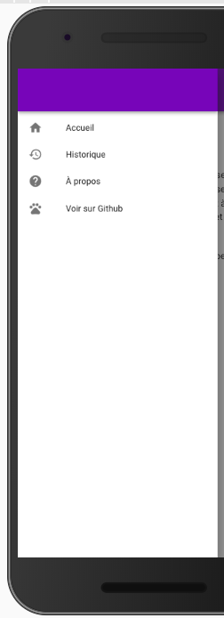

# Réaliser une application avec VueJS 2.0

::: warning Ce contenu est conservé à titre d'archive
Ce TP repose sur VueJS 2, qui n'est plus maintenu depuis fin 2023. Pour apprendre Vue aujourd'hui, suivez plutôt [les TP VueJS 3](/pages/categories/les-tp-javascript.md).
:::

Dans ce TP nous allons voir une autre façon d’utiliser VueJS, une façon plus moderne, celle qui utilise à 100% le modèle MVVM (Modèle Vue, Vue-Modèle) ainsi que la puissance de VueJS (`.vue`, VueCli, ES5).



::: details Table des matières
[[toc]]
:::

## MVVM en quelques mots

Non, mais moi je connais que MVC, c’est quoi MVVM ?

MVVM est un design pattern, souvent utilisé par les bibliothèques JavaScript modernes (Ionic, VueJS, ReactJS). À l’origine, MVVM a été introduit par Microsoft.

Ce pattern a spécialement été conçu pour améliorer la séparation entre les données et la vue qui les affiche. Le lien entre la vue et le modèle de données est fait par des mécanismes de binding. Le binding est un mécanisme qui permet de faire des liaisons entre des données de manière dynamique. Ce qui veut dire que si A et B sont liés, le fait de modifier A va être répercuté sur B et inversement.

- Model : le modèle contient les données.
- View : la vue correspond à ce qui est affiché. C’est notre site Web.
- ViewModel : ce composant fait le lien entre le modèle et la vue. Il s’occupe de gérer les liaisons de données et les éventuelles conversions. C’est ici qu’intervient le binding.

L’important avec MVVM c’est que **_la vue ne doit jamais traiter de données_**. Elle s’occupe uniquement de les afficher. Le View-Model aura en charge les conversions et les accès au modèle de données.

## Introduction

Maintenant que vous savez ce qu’est le MVVM, nous allons attaquer le TP pour de vrai. Nous allons réaliser « une application » à l’aide de VueJS. Cette application est purement démonstrative. Cette application calculera la hauteur d’une falaise (ou de n’importe quoi de suffisamment haut) en fonction du temps de chute d’un objet jeté du haut de celle-ci.


## Initialisation du projet

Avant de commencer, nous allons avoir besoin de plusieurs outils :

- NodeJS
- Vue-cli

### NodeJS

La première étape va être l’installation de NodeJS, la démarche est différente en fonction de votre environnement, mais pour résumer [sous Windows c’est ici](https://nodejs.org/en/download/) prendre la version CURRENT, sous OSX le plus simple c’est via Brew `brew install nodejs`, et sous Linux c’est via le gestionnaire de paquets `apt install nodejs`.

Une fois installé, votre PC est prêt à accueillir l’outil VueCLI.

### Vue-cli

Vue-cli est un outil qui simplifie la création d’un nouveau projet Vue-JS à partir de templates fournis par la communauté.

Dans un terminal, lancer la commande suivante dans le `Node.js Command Prompt` :

```bash
npm install -g @vue/cli
```

Maintenant que vue-cli est installé, vous avez à votre disposition sur votre ordinateur une nouvelle commande, la commande `vue`.

Pour créer un nouveau projet, c’est simple, il suffit de lancer la commande suivante dans le `Node.js Command Prompt` :

```bash
vue create cliff-height-timer
```

⚠️ Attention, la commande crée le projet dans le dossier courant ! ⚠️

Le Vue-Cli est interactif, il va vous poser des questions permettant de configurer votre projet :



Voilà, notre projet est maintenant prêt. Place à la suite.

## Installation des librairies (du projet)

Le projet que vous avez initialisé est « prêt pour être utilisé ».

Si vous changez d'ordinateur, il faudra réinstaller les librairies NodeJS. Cette étape n’est à faire qu’une seule fois sur votre poste, en effet en général on ne commite pas les fichiers « librairies » qui sont présents dans le futur dossier `node_modules` pour la simple et bonne raison que celui-ci est gros et rempli de plein de petits fichiers (et qu’en plus ça se retélécharge facilement depuis Internet).

Pour l’installation la procédure est la suivante :

```bash
cd cliff-height-timer/
npm install
```

⚠️ L’installation risque de prendre plusieurs secondes (enfin 1 ou 2 minutes).

Une fois terminé, votre projet est prêt à être lancé. Au passage vous pouvez vérifier que le dossier `node_modules` est bien dans le `.gitignore`.

## Premier lancement (l’exemple)

Les librairies étant maintenant disponibles, nous allons pouvoir lancer l’exemple fourni par Vue-Cli, pour ça rien de plus simple :

```bash
npm run serve
```

Une fois cette commande lancée, vous pouvez ouvrir un onglet dans votre navigateur : `http://127.0.0.1:8080`


## Le serveur de développement

Comme vous avez pu le constater dans votre invite de commande (terminal), vous avez un serveur qui tourne. Ce serveur est un peu particulier, il n’est utilisé que dans la phase de développement, il incorpore plusieurs outils permettant de simplifier la création d’application JavaScript :

- Redémarrage à chaud, comprendre ici, qu’il va « patcher » votre code pour intégrer vos dernières modifications sans que vous n’ayez rien à faire (GÉNIAL !)
- Lint, analyse du code pour vous remonter les erreurs avant l’exécution.
- Gestion des .vue (avec vue-loader)

Et si vous avez les outils sur votre machine il peut également :

- Créer la CSS à partir du SCSS présent dans le .vue
- Et plein d’autres usages, car Webpack c’est un outil qui permet l’assemblage de différents outils

## Le code source

Les sources de l’application sont dans le dossier `src/` il contient l’ensemble du code source de votre application. Pour l’instant nous avons le code fourni par VueJS, au fur et à mesure des futures étapes, nous allons le modifier pour le transformer dans l’application « Cliff Height Timer ». Avant de « presque » tout remplacer, nous allons modifier celui fourni pour nous familiariser avec « le serveur de développement ».

### L’IDE

Pour faire du VueJS le mieux, c’est d’avoir un bon IDE. Au revoir Notepad++, bonjour WebStorm ? Malheureusement WebStorm est payant, si vous avez une licence tant mieux (pour les étudiants c’est gratuit 💰).

Pour ceux qui n’ont pas de licence, je vous propose d’utiliser [Visual Studio Code](https://code.visualstudio.com) et d’ajouter le plug-in `Vetur` pour pouvoir éditer les `.vue` dans de bonnes conditions.

### Installation des plug-ins

Comme vu en cours l'avantage de Vue-Cli c'est qu'il intègre un système de plug-in, nous allons nous en servir pour ajouter :

- vue-i18n
- vue-router
- vuetify

Certains plug-ins modifient plus ou moins votre projet. Vuetify par exemple altère de manière importante votre projet. Nous allons donc l'ajouter en premier. Dans un terminal :

```sh
$ vue add vuetify

📦  Installing vue-cli-plugin-vuetify...

+ vue-cli-plugin-vuetify@0.4.6
added 1 package from 1 contributor and audited 15083 packages in 8.485s
found 0 vulnerabilities

✔  Successfully installed plugin: vue-cli-plugin-vuetify

? Choose a preset: Default (recommended)

🚀  Invoking generator for vue-cli-plugin-vuetify...
📦  Installing additional dependencies...

added 11 packages from 49 contributors and audited 15119 packages in 9.41s
found 0 vulnerabilities

⚓  Running completion hooks...

✔  Successfully invoked generator for plugin: vue-cli-plugin-vuetify
```

Maintenant que Vuetify est présent, ajoutons Vue-Router :

```sh
$ vue add router

? Use history mode for router? (Requires proper server setup for index fallback in production) Yes

🚀  Invoking generator for core:router...
📦  Installing additional dependencies...

added 1 package from 1 contributor and audited 15120 packages in 9.021s
found 0 vulnerabilities

✔  Successfully invoked generator for plugin: core:router
```

Et maintenant Vue-i18n (pour l'internationalisation) :

```sh
$ vue add i18n

📦  Installing vue-cli-plugin-i18n...

+ vue-cli-plugin-i18n@0.5.1
added 7 packages from 7 contributors and audited 15129 packages in 8.638s
found 0 vulnerabilities

✔  Successfully installed plugin: vue-cli-plugin-i18n

? The locale of project localization. fr
? The fallback locale of project localization. en
? The directory where store localization messages of project. Stored under src directory. locales
? Enable locale messages in Single file components ? No

🚀  Invoking generator for vue-cli-plugin-i18n...
📦  Installing additional dependencies...

audited 15130 packages in 7.792s
found 0 vulnerabilities

⚓  Running completion hooks...

✔  Successfully invoked generator for plugin: vue-cli-plugin-i18n
   The following files have been updated / added:
```

Voilà les plug-ins sont maintenant installés, de base ils ne sont pas configurés. Nous allons faire ça dans les prochaines étapes.

::: danger Pas d'icônes ? Pas de fonts ? Pas de problème !
Comme Bootstrap (ou d'autres) vuetify intègre un système permettant d'intégrer simplement des icônes. Malheureusement celui-ci ne fonctionne pas juste après l'installation du paquet.

Pour le rendre fonctionnel, vous devez éditer votre `index.html` afin d'ajouter :

```html
<link
  href="https://fonts.googleapis.com/css?family=Roboto:100,300,400,500,700,900"
  rel="stylesheet"
/>
<link
  href="https://cdn.jsdelivr.net/npm/@mdi/font@4.x/css/materialdesignicons.min.css"
  rel="stylesheet"
/>
```

:::

### La structure

L'ensemble du code que vous devez écrire va se trouver dans `src`

- `assets/` : Les images / ressources static.
- `components/` : Les composants réutilisables.
- `locales/` : Vos textes rangés par langues.
- `plug-ins/` : La configuration de vos plug-ins.
- `views/` : Les pages de votre site.
- `App.vue` : Le template / base / point d'entrée de vos vues.
- `i18n.js` : La configuration de Vue-i18n.
- `main.js` : Le point d'entrée JavaScript de votre projet.
- `router.js` : La configuration de vos routes.

⚠️ Je vous invite à regarder le contenu de l'ensemble des fichiers et dossiers avant de continuer.

### Lancer le projet

Le projet est actuellement non fonctionnel, principalement à cause de Vuetify et Vue Router qui de base configurent le projet différemment.

Pour regarder le souci, lancez le projet et testez-le :

```sh
npm run serve
```

### Transformer le template de base

Maintenant que VuetifyJS est complètement disponible, vous allez pouvoir utiliser vos premiers composants.

Pour débuter, nous allons remplacer le contenu du fichier `App.vue` pour déclarer le gabarit principal de l’application :

```html
<template>
  <v-app>
    <myToolbar />

    <v-main>
      <v-slide-y-transition mode="out-in">
        <router-view />
      </v-slide-y-transition>
    </v-main>
  </v-app>
</template>

<script>
  import myToolbar from "@/components/MyToolbar";
  export default {
    name: "app",
    components: { myToolbar },
  };
</script>
```

⚠️ Pour l’instant le code que vous avez remplacé ne compile plus, pour la simple et bonne raison qu’il fait référence à un composant que vous n’avez pas encore écrit : `myToolbar`

### Création de myToolbar

Créer un nouveau fichier nommé `MyToolbar.vue` dans le dossier `components` :

```javascript
<template>
  <div>
    <v-app-bar dark color="deep-purple" clipped-left app>
      <v-app-bar-nav-icon @click.stop="drawer = !drawer"></v-app-bar-nav-icon>
      <v-toolbar-title @click="goHome" class="white--text">Cliff height timer</v-toolbar-title>
    </v-app-bar>
  </div>
</template>

<script>
export default {
  name: 'myToolbar',
  data: function () {
    return {
      drawer: false
    }
  },
  methods: {
    goHome () {
      this.$router.replace('/')
    }
  }
}
</script>
```

### Modifier la « home »

Avant d'aller plus loin, modifier le fichier, `src/views/Home.vue` remplacez le contenu par ce que vous souhaitez.

N'oubliez pas de retirer l'import qui est maintenant inutile dans le fichier `src/views/Home.vue`

### Voir le changement

Voilà, vous avez atteint la première étape. Vous pouvez lancer votre application en faisant :

```bash
npm run serve
```

## Le Routeur

Votre application est maintenant fonctionnelle cependant comme vous le constatez, vous n’avez pour l’instant qu’une « seule page »… Enfin qu'une seule d'accessible !

Allons faire un tour dans le fichier `router/index.js`. Celui-ci contient déjà quelques routes :

```js
import Vue from "vue";
import Router from "vue-router";
import Home from "./views/Home.vue";

Vue.use(Router);

export default new Router({
  mode: "history",
  base: process.env.BASE_URL,
  routes: [
    {
      path: "/",
      name: "home",
      component: Home,
    },
    {
      path: "/about",
      name: "about",
      component: () =>
        import(/* webpackChunkName: "about" */ "./views/About.vue"),
    },
  ],
});
```

Modifiez-le, et **retirez** toute la partie `/about` :

```js
{
  path: "/about",
  name: "about",
  component: () =>
    import(/* webpackChunkName: "about" */ "./views/About.vue")
}
```

### Déclarer du texte dans Vue-i18n

Au début du TP, nous avons installé Vue-i18n, nous allons maintenant configurer nos premiers textes. Dans le dossier `src/locales/` vous avez deux fichiers `json` :

- `en.json` : Les textes anglais.
- `fr.json` : Les textes français.

**Ajouter** dans les deux fichiers JSON une nouvelle clé :

```json
{
  "title": "Cliff Height Timer"
}
```

### Déclarer un nouveau texte

Notre internationalisation est maintenant prête à être utilisée. Nous allons l’utiliser dès maintenant dans le fichier `/components/MyToolbar.vue`.

Remplacer le texte `Cliff height timer` par :

<code v-pre>`{{$t("title")}}`</code>

Le titre doit maintenant s’afficher. Et c’est normal, la clé « title » est déjà présente dans le fichier `i18n/index.js` : modifier le titre pour la langue « fr ».

ℹ️ `$t` est un objet qui permet d’accéder aux textes actuellement chargés pour la langue de l’utilisateur.

### Tester

Vérifier en relançant votre application que le titre a bien été modifié :

```bash
npm run serve
```

## Les .vues

Maintenant que nous avons la base de notre projet, nous allons commencer à créer les différents fichiers `.vue`.

✋ Un peu de ménage s'impose. Avant de continuer, supprimer le fichier `About.vue`, celui-ci ne nous sera pas utile.

### La page : Accueil

Nous allons commencer par la page d’accueil, celle-ci doit ressembler à :



Pour faire cette vue, vous allez avoir besoin des éléments suivants :

- [FAB](https://vuetifyjs.com/components/floating-action-buttons)
- [Les variables computed](https://vuejs.org/v2/guide/computed.html)
- [v-bind:class](https://vuejs.org/v2/guide/class-and-style.html)
- [Afficher une variable](https://vuejs.org/v2/guide/syntax.html)
- [Centrer verticalement](https://gist.github.com/c4software/b9fe4cd06e99d3bff16a09260b03e149)

Étape de la création :

- Modifier le fichier `Home.vue` dans le dossier `src/views/`
- Le contenu de la Vue sera la suivante :

```javascript
<template>
  <v-container fluid fill-height class="d-flex deep-purple lighten-1">
    <div class="home">
      <h1>{{ time }} s</h1>
      <h3>{{ m }} m</h3>
      <h3>{{ ft }} ft</h3>
    </div>

    <v-btn v-on:click="action" v-bind:class="state_class" dark fixed bottom right fab>
      <v-icon>{{ state_icon }}</v-icon>
    </v-btn>
  </v-container>
</template>

<script>
export default {
  name: 'home',
  data: () => {
    return {
      running: false,
      time: 0,
      m: '0',
      ft: '0'
    }
  },
  computed: {
    state_icon () {
      // Retourne l’icone pour le FAB
      if (this.running) {
        return 'stop'
      } else {
        return 'play_arrow'
      }
    },
    state_class () {
      // Retourne la class pour le FAB
      if (this.running) {
        return 'red'
      } else {
        return 'green'
      }
    }
  },
  methods: {
    action () {
      // Gestion du start / stop
      this.start = new Date().getTime()

      if (!this.running) {
        this.running = true
        this.timerId = setInterval(() => {
          this.compute()
        }, 10)
      } else {
        this.running = false
        clearInterval(this.timerId)
        this.saveHistory({time: this.time, m: this.m, ft: this.ft})
      }
    },
    saveHistory (item) {
      // Sauvegarde dans l’historique
      let history = JSON.parse(localStorage.getItem('history'))
      if (!Array.isArray(history)) {
        history = []
      }
      history.unshift(item)
      localStorage.setItem('history', JSON.stringify(history))
    },
    compute () {
      let fallTime = new Date().getTime() - this.start
      let height = 16 * Math.pow((fallTime / 1000), 2)
      let numberDigits = 1
      if (height < 1) {
        numberDigits = 2
      }

      this.time = (fallTime / 1000).toFixed(2)
      this.ft = height.toFixed(numberDigits)
      this.m = (height / 3.2808).toFixed(numberDigits)
    }
  }
}
</script>

<style scoped>
  .home{
    margin: auto;
    text-align: center;
  }
  .home > h1, .home > h2, .home > h3 {
    color: white;
  }
</style>
```

- Vérifier la déclaration de votre Vue dans `router.js`. Un code similaire à celui-ci doit être présent :

```javascript
[…]
import Home from '@/views/Home'

[…]
  // Code existant
  },
  {
    path: '/',
    name: 'Home',
    component: Home
  }
]
```

- Tester votre code :

```bash
npm run serve
```

### La page : À Propos

Voilà le rendu de « la page » que vous devez réaliser :



- Créer le fichier `src/views/About.vue`

```javascript
<template>
  <v-container>
  […]
  </v-container>
</template>

<script>
  export default {
    name: 'about'
  }
</script>
```

⚠️ N’oubliez pas que **l'ensemble des textes** doit être dans le fichier `locales/fr.json` et dans `locales/en.json`, et être utilisé avec par exemple :

<code v-pre>{{ $t("label") }}</code>

- Ajouter dans `router.js` le code pour pouvoir accéder à votre Vue.

✋ Vous avez ajouté votre nouveau fichier, mais pour l’instant votre application ne contient pas de menu. Nous allons en ajouter un pour pouvoir naviguer entre les pages.

### Ajout du : Drawer

Dans le monde « mobile », un menu s’appelle un Drawer (un tiroir). Nous allons donc créer un Drawer. Pour ça nous allons avoir besoin des ressources suivantes :

- [v-toolbar](https://vuetifyjs.com/components/toolbars)
- [v-list](https://vuetifyjs.com/components/lists)
- [Vue-i18n](https://kazupon.github.io/vue-i18n/en/)



Création :

- Pour ça, créer le fichier `/src/components/Drawer.vue`

```javascript
<template>
  <div>
    <v-toolbar class="deep-purple" />
    <v-list dense>
      <template v-for="(item, i) in items">
        <v-divider dark v-if="item.divider" :key="i"></v-divider>
        <v-list-item ripple :to="item.action" :key="i" v-else>
          <v-list-item-action>
            <v-icon>{{ item.icon }}</v-icon>
          </v-list-item-action>
          <v-list-item-content>
            <v-list-item-title class="body-2">{{ item.text }}</v-list-item-title>
          </v-list-item-content>
        </v-list-item>
      </template>
    </v-list>
  </div>
</template>

<script>
export default {
  name: 'drawer',
  data: function () {
    return {
      items: [
        { icon: 'home', text: this.$t('drawer.home'), action: '/' },
        { icon: 'history', text: this.$t('drawer.history'), action: '/history' },
        { icon: 'help', text: this.$t('drawer.about'), action: '/about' },
      ]
    }
  }
}
</script>
```

- Déclarer les différents textes dans les fichiers `fr.json` et `en.json`.

Maintenant que notre composant est terminé, nous devons l’utiliser. Nous allons l’utiliser dans le premier composant que nous avons écrit `src/components/MyToolbar.vue`, modifiez-le pour intégrer les modifications suivantes :

```javascript
<template>
  <div>
    // Nouveau
    <v-navigation-drawer v-model="drawer" clipped fixed app>
      <myContentDrawer />
    </v-navigation-drawer>

    // Reste du code déjà présent
</template>

<script>
import myContentDrawer from "@/components/Drawer" // <== Ajouter l’import

export default {
  name: "myToolbar",
  components: {myContentDrawer}, // <== Ajouter la déclaration du composant
[…]
```

🤓 Nous venons de déclarer un nouveau composant dans notre Vue. Simple, non ? Il suffit d'importer le composant et de l'ajouter dans l'attribut `components` de notre objet.

- Tester votre application :

```bash
npm run serve
```

### La page : Historique

Notre application est maintenant fonctionnelle. Nous avons la capacité de calculer des chutes, d’afficher les informations sur l’application, et bonus dans plusieurs langues !

Mais je pense qu’une application n’est jamais vraiment complète sans une notion d’historique. Pour ça nous allons créer une nouvelle « vue ».

- Créer le fichier `src/views/History.vue`
- Créer la correspondance entre la Vue et le chemin dans le fichier `router/index.js`
- N’oubliez pas également d’ajouter l’élément dans le menu Drawer.
- Les textes doivent également être mis dans la partie i18n

Pour réaliser la vue historique, nous allons devoir sauvegarder les différents résultats. Pour ça nous allons utiliser le `localStorage`, avant d’aller plus loin je vous propose un peu de lecture sur le localStorage :

> La propriété localStorage vous permet d'accéder à un objet local Storage. Le localStorage est similaire au sessionStorage. La seule différence : les données stockées dans le localStorage n'ont pas de délai d'expiration, alors que les données stockées dans le sessionStorage sont nettoyées quand la session du navigateur prend fin, donc quand on ferme le navigateur.

Source: [https://developer.mozilla.org/fr/docs/Web/API/Window/localStorage](https://developer.mozilla.org/fr/docs/Web/API/Window/localStorage)

⚠️ Petite subtilité, vous ne pouvez pas stocker de tableau (array) dans le localStorage, nous allons devoir utiliser du JSON.

#### Sauvegarder un élément dans le localStorage

```javascript
localStorage.setItem("historique", JSON.stringify([]));
```

#### Lire un élément dans le localStorage

```javascript
JSON.parse(localStorage.getItem("history"));
```

#### Démarche

- Adapter le code de `Home.vue` pour sauvegarder le résultat dans un tableau d’historique à chaque fois que l’utilisateur enregistre une nouvelle chute.
- Écrire le code de la page `History.vue` pour afficher les valeurs enregistrées.
- Utiliser les variables computed de VueJS pour retourner la liste de l’historique ([exemple](https://vuejs.org/v2/guide/computed.html#Basic-Example)).

Ressources utiles :

- [Liste Vuetify](https://vuetifyjs.com/components/lists)
- [JSON](https://developer.mozilla.org/fr/docs/Web/JavaScript/Reference/Objets_globaux/JSON)
- [Tester si tableau](https://www.w3schools.com/jsref/jsref_isarray.asp)

Vu que c’est la 3ème vue que vous faites, je pense qu’il n’est plus nécessaire que je vous fournisse du code.

## Ajouter une page permettant un ajout manuel

Ajouter une nouvelle page, celle-ci permettra d'ajouter une entrée manuellement dans l'historique.

### Démarche

- Création du `.vue`.
- Créer un formulaire (v-form).
- Ajouter le lien dans le `Drawer.vue`.
- Ajouter la route.

## Distribuer vos sources

Voilà, votre application est maintenant terminée, bravo 👏👏. Cependant vous ne savez pas encore comment packager / distribuer votre application. Pour ça rien de plus simple, il vous suffit de faire :

```bash
npm run build
```

Cette commande va compiler votre application et vous fournir une version que vous allez pouvoir héberger comme n’importe quel site Internet (sur un serveur Apache par exemple).

Le résultat de la compilation est dans le dossier `dist/`.

- Héberger le résultat sur un serveur Apache (wamp).

## Ajouter un manifest

Nous allons maintenant ajouter la dernière pierre à notre édifice, le fichier Manifest. Ce fichier décrit le fonctionnement du site Web en tant « qu’application », une fois que ce fichier est en place, votre navigateur le lira et adaptera son fonctionnement pour qu’il se rapproche d’une application (comme une APK).

Pour ça nous allons utiliser deux sites :

- [Un générateur de fichier Manifest](https://app-manifest.firebaseapp.com/)
- [Un générateur d’icône](https://romannurik.github.io/AndroidAssetStudio/icons-launcher.html)

> Le manifest d'une application web fournit des informations concernant celle-ci (comme son nom, son auteur, une icône et une description) dans un document texte JSON. Le but du manifeste est d'installer des applications sur l'écran d'accueil d'un appareil, offrant aux utilisateurs un accès plus rapide et une expérience plus riche.
>
> Les manifests font partie d'un ensemble de technologies appelées les applications web progressives (progressive web apps). Il s'agit d'applications web qui peuvent être installées sur la page d'accueil d'un appareil sans que l'utilisateur ait à se rendre dans une boutique d'applications. De plus, une fois installées, elles peuvent être utilisées sans connexion internet et sont capables de recevoir des notifications push.

Source : Mozilla.org

- Générer les icônes ainsi que le fichier Manifest.
- Télécharger le manifest.json et le mettre dans le dossier `static/`, faire la même chose pour les icônes.
- Éditer le fichier `index.html` du dossier public pour y ajouter :

```html
<link rel="manifest" href="./static/manifest.json" />
```

- Vous pouvez builder votre application et la mettre à jour sur votre serveur Web.

```bash
npm run build
```

- Tester l’application depuis votre téléphone Android / iOS.

### Ajouter Firebase

Dans le précédent TP, nous avons ajouté Firebase pour synchroniser les éléments sur une carte. C'était un exemple très visuel, mais il est évidemment possible de faire bien plus.

Nous allons nous servir de Firebase dans ce projet pour synchroniser « l'historique » avec l'ensemble des utilisateurs. Je vous propose donc de vous inspirer du précédent TP, et d'ajouter les dépendances :

- Vuefire.
- Firebase.

L'affichage doit être identique à la version actuelle de votre application.
