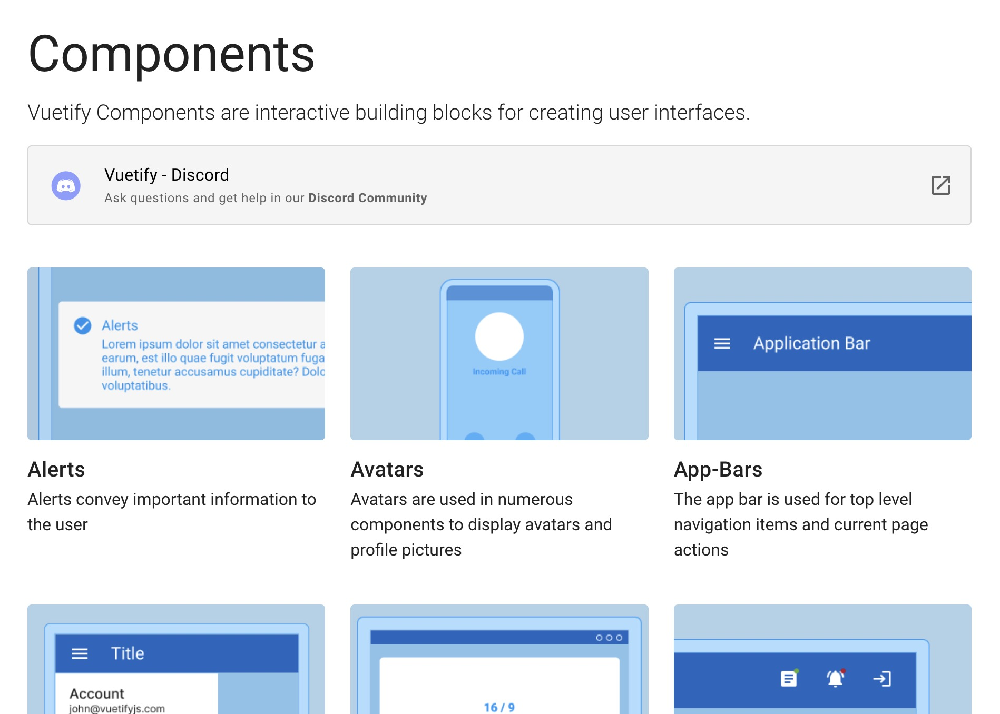
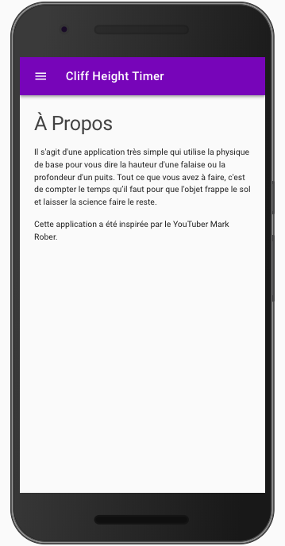

# Créer une application Web avec VueJS 3

Nous avons vu dans les TP précédents comment utiliser VueJS 3 pour :

- Moderniser une application Web existante.
- Créer un site Web (avec un routeur).
- Appeler des API Rest en Ajax (en utilisant Fetch).

Dans ce TP nous allons aller plus loin en créant une application Web complète.

Dans ce TP nous allons voir une autre façon d’utiliser VueJS, une façon plus moderne, celle qui utilise à 100% le modèle MVVM (Modèle Vue, Vue-Modèle) ainsi que la puissance de VueJS (.vue, TypeScript, Composition API).


::: details Table des matières
[[toc]]
:::

## Une application Web ?

Une application Web ou un site Web ? Quelle est la différence ? C'est une bonne question, la nuance est faible. Mais, une application Web, c'est en quelque sorte comme une application classique (celle que vous avez sur votre ordinateur), mais qui est accessible depuis un navigateur Web.

Cette application aura donc le comportement d'une application classique à savoir :

- Une interface graphique (avec des boutons, des menus, des listes, des formulaires, etc.).
- Une logique métier (qui permet de faire des calculs, de gérer des données, etc.).
- Un fonctionnement hors ligne (si l'utilisateur n'a pas de connexion Internet).
- Sera installable sur un appareil (smartphone, tablette, etc.).

C'est ce que l'on nomme une Progressive Web App (PWA). Cette application Web reprendra les codes d'une application classique (Navbar, Sidebar, etc.).

::: tip Un exemple ?

Le bon exemple est le site de Twitter qui est une application Web. Vous pouvez l'installer sur votre smartphone et l'utiliser comme une application classique. Vous pouvez même l'utiliser sans connexion Internet. ([Voir le site](https://twitter.com/))

Et pourtant ça reste un site Web, codé en HTML, CSS et JavaScript (qui utilise ReactJS).

:::

## MVVM en quelques mots

Non, mais moi je connais que MVC, c’est quoi MVVM ?

MVVM est un design pattern, souvent utilisé par les bibliothèques JavaScript modernes (Ionic, VueJS, ReactJS). À l’origine, MVVM a été introduit par Microsoft.

Ce pattern a spécialement été conçu pour améliorer la séparation entre les données et la vue qui les affichent. Le lien entre la vue et le modèle de données est fait par des mécanismes de binding. Le binding est un mécanisme qui permet de faire des liaisons entre des données de manière dynamiques. Ce qui veut dire que si A et B sont liés, le fait de modifier A va être répercuté sur B et inversement.

- Model : le modèle contient les données.
- View : la vue correspond à ce qui est affiché. C’est notre site Web.
- ViewModel : ce composant fait le lien entre le modèle et la vue. Il s’occupe de gérer les liaisons de données et les éventuelles conversions. C’est ici qu’intervient le binding.

L’important avec MVVM c’est que **_la vue ne doit jamais traiter de données_**. Elle s’occupe uniquement de les afficher. Le View-Model aura en charge les conversions et les accès au modèle de données.

## Introduction

Maintenant que vous savez ce que c’est le MVVM, nous allons attaquer le TP pour de vrai. Nous allons réaliser « une application » à l’aide de VueJS. Cette application est purement démonstrative. Cette application calculera la hauteur d’une falaise (ou de n’importe quoi de suffisamment haut) en fonction du temps chute d’un objet jeter du haut de celle-ci.


## Créer le projet

Pour commencer, nous allons créer un nouveau projet avec VueJS 3. Nous allons utiliser la ligne de commande pour créer notre nouveau projet :

```bash
npm create vite@latest
```

Paramètres à choisir :

- nom du projet : cliff-height-timer-vuejs
- framework : vue
- Langage : TypeScript

### Lancer le projet

Avant d'aller plus loin, je vous invite à lancer le projet pour voir ce que ça donne :

```bash
cd cliff-height-timer-vuejs
npm install
npm run dev
```

Le site de démonstration devrait s'ouvrir dans votre navigateur par défaut.

## Le code source

Les sources de l’application sont dans le dossier `src/` il contient l’ensemble du code source de votre application. Pour l’instant nous avons le code fourni par VueJS, au fur et à mesure des futures étapes, nous allons le modifier pour le transformer dans l’application « Cliff Height Timer ».

## L’IDE

Pour faire du VueJS le mieux, c’est d’avoir un bon IDE. Au revoir, Notepad++, bonjour WebStorm? Malheureusement WebStorm est payant, si vous avez une licence tant mieux (pour les étudiants c’est gratuit 💰).

Pour ceux qui n’ont pas de licence, je vous propose d’utiliser [Visual Studio Code](https://code.visualstudio.com) et d’ajouter le plug-in `Volar` pour pouvoir éditer les `.vue` dans de bonnes conditions.

::: tip Le choix de l’IDE est important

En effet, même si vous n'en avez pas l'impression. Votre IDE est une partie importante de votre développement. Il vous permet de gagner du temps et de vous concentrer sur le code. 

:::

## Les plug-ins

Nous l'avons vu dans les autres TP, mais l'écosystème VueJS est très riche, et propose de nombreux plug-ins. Faire un choix de plug-ins est donc important, dans ce TP nous allons utiliser des plug-ins qui vont nous permettre de gagner du temps, et surtout de réaliser une application qui respecte les bonnes pratiques. Les plug-ins que nous allons utiliser sont :

- [Vue Router](https://router.vuejs.org) : pour gérer les routes de notre application.
- [Vuetify](https://next.vuetifyjs.com/en/) : pour avoir des composants UI.

### Installation de Vue Router

Vue Router est un package NPM qui permet de gérer les routes (comme dans Laravel par exemple) de notre application. Pour l'installer, il suffit d'utiliser la commande suivante :

```sh
npm install vue-router@4
```

::: tip Que fait la commande ?

La commande `npm install` va télécharger les dépendances du projet. Ici nous téléchargeons la dépendance `vue-router` en version 4. Cette dépendance va être ajoutée dans le fichier `package.json` et dans le fichier `package-lock.json`.

Elle va aussi créer un dossier `node_modules` qui va contenir les dépendances du projet.

Rappel: Ce dossier ne doit pas être versionné.

:::

### Installation de Vuetify

Vuetify est un framework UI pour VueJS. Il permet de créer des applications rapidement et simplement. Pour l'installer, il suffit d'utiliser la commande suivante :

```sh
npm install vuetify@^3.0.6
npm install @mdi/font -D
```

Que font ces deux commandes ?

- La première commande va télécharger le package `vuetify` en version 3.0.6.
- La deuxième commande va télécharger le package `@mdi/font` en version 5.9.55. Ce package va nous permettre d'utiliser les icones de [Material Design Icons](https://materialdesignicons.com/). Le `-D` signifie que le package ne sera pas utilisé en production.



#### Avant d'aller plus loin

Utiliser un framework UI est une bonne chose. En effet, un framework UI va vous permettre de créer rapidement une application : 

- Vous n'avez pas à créer vos propres composants.
- Vous n'avez pas à créer vos propres styles.
- Vous n'avez pas à créer vos propres animations.

Bref, vous n'avez pas à réinventer la roue. Vuetify est un framework UI qui est très complet, et qui propose de nombreux composants :

- [Vuetify - Composants](https://next.vuetifyjs.com/en/components/all/)
- [Boutons](https://next.vuetifyjs.com/en/components/buttons/)
- [Cards](https://next.vuetifyjs.com/en/components/cards/)
- [Dialogs](https://next.vuetifyjs.com/en/components/dialogs/)
- [Forms](https://next.vuetifyjs.com/en/components/forms/)
- [Tabs](https://next.vuetifyjs.com/en/components/tabs/)
- [Tables](https://next.vuetifyjs.com/en/components/tables/)

Je vous laisse découvrir les composants ci-dessus, mais ne vous limitez pas à ceux-ci. Il y en a beaucoup d'autres. Comment la documentation fonctionne ? 

- Vous avez une démo d'utilisation du composant.
- Et avec l'icône `<>` vous avez le code source du composant.

## La structure du projet

Nous allons maintenant initialiser la structure de notre projet. Notre projet va être composé de plusieurs pages :

- Le `<el-header></el-header>` : qui va contenir le titre de l'application.
- Le `<el-main></el-main>` : qui va contenir le contenu de la page.

### Le fichier `App.vue`

Nous allons commencer par modifier le fichier `App.vue` qui est le composant principal de notre application. Ce composant est le composant racine de notre application. Il va contenir le `<router-view></router-view>` qui va permettre d'afficher les composants des routes.

```vue
<template>
  <v-layout>
    <v-main>
      <v-container>
        <router-view></router-view>
      </v-container>
    </v-main>
  </v-layout>
</template>

<script setup lang="ts"></script>
```

::: tip Que fait le code ?

Nous avons ici la structure de base d'une application Vuetify. Nous avons un layout, un main et un container. Le `<router-view></router-view>` va permettre d'afficher les composants des routes.

Nous ajouterons au fur et à mesure les routes et les composants nécessaires au bon fonctionnement de notre application.

:::

### Le fichier `main.ts`

Pour que Vuetify fonctionne, nous allons devoir l'importer dans le fichier `main.ts`. Pour cela, nous allons ajouter les lignes suivantes :

```ts
import { createApp } from 'vue'
import App from './App.vue'

// Vuetify
import 'vuetify/styles'
import { createVuetify } from 'vuetify'
import * as components from 'vuetify/components'
import * as directives from 'vuetify/directives'

const vuetify = createVuetify({
    components,
    directives,
})

createApp(App)
    .use(vuetify)
    .mount('#app')

```

Par rapport au code déjà présent, nous avons ajouté les lignes suivantes :

```ts
// Vuetify
import 'vuetify/styles'
import '@mdi/font/css/materialdesignicons.css'
import { createVuetify } from 'vuetify'
import * as components from 'vuetify/components'
import * as directives from 'vuetify/directives'
import { aliases, mdi } from 'vuetify/iconsets/mdi'


const vuetify = createVuetify({
    components,
    directives,
    icons: {
        defaultSet: 'mdi',
        aliases,
        sets: {
            mdi,
        }
    }
})
```

ainsi que :

```ts
.use(vuetify)
```

## Vue Router

Nous avons configuré Vuetify, nous allons maintenant configurer Vue Router.

Notre application va être composée de 3 pages :

- La page d'accueil : Celle qui va calculer la hauteur.
- La page historique : Celle qui va afficher l'historique des calculs.
- La page à propos : Celle qui va afficher les informations à propos de l'application.

Nous allons donc créer 3 composants :

- `Home.vue`
- `History.vue`
- `About.vue`

Les fichiers `Home.vue`, `History.vue` et `About.vue` sont des écrans VueJS. Ils sont créés dans le dossier `src/screens`.

::: tip C'est à vous de jouer

Créez les fichiers `Home.vue`, `History.vue` et `About.vue` dans le dossier `src/screens`.

:::

### Le fichier `router.ts`

Le fichier `router.ts` va contenir la configuration de Vue Router. Nous allons ajouter les lignes suivantes :

```ts
import { createRouter, createWebHistory } from 'vue-router'
import Home from './screens/Home.vue'
import History from './screens/History.vue'
import About from './screens/About.vue'

const routes = [
  {
    path: '/',
    name: 'Home',
    component: Home
  },
  {
    path: '/history',
    name: 'History',
    component: History
  },
  {
    path: '/about',
    name: 'About',
    component: About
  }
]

const router = createRouter({
  history: createWebHistory(),
  routes
})

export default router
```

### Ajouter le vue router dans l'application

Nous allons maintenant ajouter le vue router dans l'application. Pour cela, nous allons modifier le fichier `main.ts`. Nous allons ajouter les lignes suivantes :

```ts
import router from './router' // <--- import router
```

et :

```ts
.use(router) // <--- use router
```

::: tip C'est à vous de jouer

Je vous laisse ajouter les lignes ci-dessus dans le fichier `main.ts`. Et vérifier que tout fonctionne en utilisant la commande :

```bash
npm run dev
```

:::

## Prêt ? 

C'est parti, nous allons maintenant construire l'application en partant de la structure de base (layout) jusqu'aux différents écrans.

## Le layout

### Transformer le template de base

Maintenant que VuetifyJS est complètement disponible, vous allez pouvoir utiliser vos premiers composants.

Pour débuter, nous allons remplacer le contenu du fichier `App.vue` pour déclarer le gabarit principal de l’application :

```vue
<template>
  <v-layout full-height>
    <myToolbar />
    <v-main>
        <router-view></router-view>
    </v-main>
  </v-layout>
</template>

<script setup lang="ts">
import myToolbar from "./components/MyToolbar.vue";

</script>

<style>
body, #app {
  height: 100vh;
}
</style>
```

⚠️ Pour l’instant le code que vous avez remplacé ne compile plus, pour la simple et bonne raison qu’il fait référence à un composant que vous n’avez pas encore écrit : `myToolbar`

### Création de myToolbar

Créer un nouveau fichier nommé `MyToolbar.vue` dans le dossier `components` :

```vue
<template>
    <v-app-bar dark color="deep-purple" clipped-left app>
        <v-app-bar-nav-icon @click.stop="drawer = !drawer"></v-app-bar-nav-icon>
        <v-toolbar-title @click="goHome" class="white--text pointer">Cliff height timer</v-toolbar-title>
    </v-app-bar>
</template>

<script lang="ts" setup>
import { ref } from 'vue'
import { useRouter } from 'vue-router'

const drawer = ref(false)
const $router = useRouter()

function goHome() {
    $router.replace('/')
}
</script>

<style scoped>
.pointer {
    cursor: pointer;
}
</style> 
```

Quelques explications :

- Le composant `v-app-bar-nav-icon` qui va permettre d'afficher le menu de navigation.
- Le composant `v-toolbar-title` qui va permettre d'afficher le titre de l'application.
- Le composant `v-app-bar` qui va permettre d'afficher la barre de navigation.
- `useRouter` est un hook qui va permettre d'accéder à l'objet `router` de Vue Router.
- `goHome` est une fonction qui va permettre de rediriger l'utilisateur vers la page d'accueil.
- Le `scoped` dans le tag `style` permet de limiter la portée du style à ce composant uniquement.

## La page : Accueil

Nous allons commencer par la page d’accueil, celle-ci doit ressembler à :


Pour faire cette vue, vous allez avoir besoin des éléments suivants :

- [FAB](https://next.vuetifyjs.com/components/floating-action-buttons)
- [v-bind:class](https://vuejs.org/guide/essentials/class-and-style.html)
- [Afficher une variable](https://vuejs.org/guide/essentials/template-syntax.html)
- [Centrer verticalement](https://gist.github.com/c4software/b9fe4cd06e99d3bff16a09260b03e149)

Étape de la création :

- Modifier le fichier `Home.vue` dans le dossier `src/screens/`
- Le contenu de la Vue sera la suivante :

```vue
<template>
    <v-container fluid class="d-flex fill-height bg-deep-purple lighten-1">
        <div class="home">
            <h1>{{ time }} s</h1>
            <h3>{{ m }} m</h3>
            <h3>{{ ft }} ft</h3>
        </div>
        
        <v-btn @click="action" :class="state_class" icon fixed bottom right>
            <v-icon>{{ state_icon }}</v-icon>
        </v-btn>
    </v-container>
</template>

<script lang="ts" setup>
import { ref, computed } from 'vue'

let start = ref(0)
let timerId = ref(0)
let running = ref(false as boolean)
let time = ref('0')
let m = ref('0')
let ft = ref('0')

const state_icon = computed(() => {
    // Retourne l’icone pour le FAB
    if (running.value) {
        return 'mdi-stop'
    } else {
        return 'mdi-play'
    }
})

const state_class = computed(() => {
    // Retourne la class pour le FAB
    if (running.value) {
        return 'fab red'
    } else {
        return 'fab green'
    }
})

function action() {
    // Gestion du start / stop
    start.value = new Date().getTime()
    
    if (!running.value) {
        running.value = true
        timerId.value = setInterval(() => {
            compute()
        }, 10)
    } else {
        running.value = false
        clearInterval(timerId.value)
        saveHistory({ time: time.value, m: m.value, ft: ft.value })
    }
}

function saveHistory(item: { time: string, m: string, ft: string }) {
    // Sauvegarde dans l’historique
    let history = JSON.parse(localStorage.getItem('history'))
    if (!Array.isArray(history)) {
        history = []
    }
    history.unshift(item)
    localStorage.setItem('history', JSON.stringify(history))
}

function compute() {
    let fallTime = new Date().getTime() - start.value
    let height = 16 * Math.pow((fallTime / 1000), 2)
    let numberDigits = 1
    if (height < 1) {
        numberDigits = 2
    }
    
    time.value = (fallTime / 1000).toFixed(2)
    ft.value = height.toFixed(numberDigits)
    m.value = (height / 3.2808).toFixed(numberDigits)
}
</script>

<style scoped>
.home {
    margin: auto;
    text-align: center;
}

.home>h1,
.home>h2,
.home>h3 {
    color: white;
}

.fab {
    position: absolute;
    bottom: 35px;
    right: 35px;
    transition: background-color 0.3s;
}

.fab.red{
    background-color: #f44336;
}

.fab.green{
    background-color: #4caf50;
}

</style>
```

- Tester votre code :

```bash
npm run dev
```

### La page : À Propos

Voilà le rendu de « la page » que vous devez réaliser :



- Créer le fichier `src/screens/About.vue`

```vue
<template>
  <v-container>
  […]
  </v-container>
</template>

<script lang="ts" setup></script>
```

✋ Vous avez ajouté votre nouveau fichier, mais pour l’instant votre application ne contient pas de menu. Nous allons en ajouter un pour pouvoir naviguer entre les pages.

### Ajout du : Drawer

Dans le monde « mobile », un menu s’appelle un Drawer (un tiroir). Nous allons donc créer un Drawer. Pour ça nous allons avoir besoin des ressources suivantes:

- [v-toolbar](https://next.vuetifyjs.com/components/toolbars)
- [v-list](https://next.vuetifyjs.com/components/lists)


Création :

- Pour ça, créer le fichier `/src/components/Drawer.vue`

```vue
<template>
    <v-toolbar class="bg-deep-purple" />
    <v-list dense>
        <template v-for="(item) in items">
            <v-list-item ripple :to="item.action">
                <template v-slot:prepend>
                    <v-icon :icon="item.icon"></v-icon>
                </template>

                <v-list-item-title v-text="item.text"></v-list-item-title>
            </v-list-item>
        </template>
    </v-list>
</template>

<script lang="ts" setup>
import { ref } from 'vue'

const items = ref([
    { icon: 'mdi-home', text: "Accueil", action: '/' },
    { icon: 'mdi-history', text: "Historique", action: '/history' },
    { icon: 'mdi-help', text: "À propos", action: '/about' },
])
</script>
```

Maintenant que notre composant est terminé, nous devons l’utiliser. Nous allons l’utiliser dans le premier composant que nous avons écrit `src/components/MyToolbar.vue`, modifiez-le pour intégrer les modifications suivantes :

```javascript
<template>
    // Nouveau code
    <v-navigation-drawer v-model="drawer" clipped fixed app>
        <myContentDrawer />
    </v-navigation-drawer>
    

    // Reste du code déjà présent
</template>

<script lang="ts" setup>
import myContentDrawer from "./Drawer.vue" // <== Ajouter l’import

// Reste du code déjà présent
</script>
```

Qu'avons-nous fait ?

- Nous avons ajouté un composant `v-navigation-drawer` qui contient notre composant `Drawer.vue`
- Nous avons ajouté notre composant `Drawer.vue` dans le composant `MyToolbar.vue`. Celui-ci est maintenant présent sur toutes les pages de notre application. Il sera affiché lors du clic sur le bouton « Menu ».

Nous avons maintenant un menu qui fonctionne. Celui-ci est présent sur toutes les pages de notre application. 

- Tester votre application :

```bash
npm run dev
```

### La page : Historique

Notre application est maintenant fonctionnelle. Nous avons la capacité de calculer des chutes, d’afficher les informations sur l’application, et bonus dans plusieurs langues !

Mais je pense qu’une application n’est jamais vraiment complète sans une notion d’historique. Pour ça nous allons créer une nouvelle « vue »

- Créer le fichier `src/screen/History.vue`
- Vérifier la route dans votre Router.
- N’oubliez pas également d’ajouter l’élément dans le menu Drawer.

Pour réaliser la vue historique, nous allons devoir sauvegarder les différents résultats. Pour ça nous allons utiliser le `Localstorage`, avant d’allez plus loin je vous propose un peu de lecture sur le localStorage :

> La propriété localStorage vous permet d'accéder à un objet local Storage. Le localStorage est similaire au sessionStorage. La seule différence : les données stockées dans le localStorage n'ont pas de délai d'expiration, alors que les données stockées dans le sessionStorage sont nettoyées quand la session du navigateur prend fin — donc quand on ferme le navigateur.

Source: [https://developer.mozilla.org/fr/docs/Web/API/Window/localStorage](https://developer.mozilla.org/fr/docs/Web/API/Window/localStorage)

::: tip Un instant
⚠️ Petite subtilité, vous ne pouvez pas stocker de tableau (array) dans le localStorage nous allons devoir utiliser un JSON.
:::

#### Sauvegarder un élément dans le localStorage

Voilà comment il est possible de sauvegarder un élément dans le localStorage :

```javascript
localStorage.setItem("historique", JSON.stringify([]));
```

Ici nous avons utilisé la méthode `setItem` pour sauvegarder un élément dans le localStorage. Nous avons utilisé la méthode `JSON.stringify` pour convertir notre tableau en JSON.

#### Lire un élément dans le localStorage

Pour lire un élément dans le localStorage, nous allons utiliser la méthode `getItem` :

```javascript
let histories = JSON.parse(localStorage.getItem("history"));
```

Ici nous avons utilisé la méthode `getItem` pour récupérer un élément dans le localStorage. Nous avons utilisé la méthode `JSON.parse` pour convertir notre JSON en tableau.

La variable `histories` contient maintenant un tableau d’historique.

#### Démarche

- Adapter le code de `Home.vue` pour sauvegarder le résultat dans un tableau d’historique à chaque fois que l’utilisateur enregistre une nouvelle chute.
- Écrire le code de la page `History.vue` pour afficher les valeurs enregistrées.
- Utiliser les variables computed de VueJS pour retourner la liste de l’historique (<https://vuejs.org/guide/essentials/computed.html#basic-example>)


::: tip Exemple de l'utilisation de la variable computed:

```javascript
// a computed ref
const historiquePrecedent = computed(() => {
  return JSON.parse(localStorage.getItem("history"));
})
```

Dans cet exemple, la variable `historiquePrecedent` est une variable computed. Elle est définie par une fonction fléchée. Cette fonction fléchée retourne le résultat de la méthode `JSON.parse` appliquée sur la méthode `getItem` appliquée sur le localStorage. Concrètement, la variable `historiquePrecedent` contiendra la totalité de l'historique dans un tableau. (que vous pourrez afficher avec un `v-for`).

:::

Ressources utiles :

- [Liste Vuetify](https://next.vuetifyjs.com/components/lists)
- [JSON](https://developer.mozilla.org/fr/docs/Web/JavaScript/Reference/Objets_globaux/JSON)
- [Tester si tableau](https://www.w3schools.com/jsref/jsref_isarray.asp)

Vu que c’est la 3ème vue que vous faites, je pense qu’il n’est plus nécessaire que je vous fournisse du code.

## Ajouter une page permettant un ajout manuel

Ajouter une nouvelle page, celle-ci permettra d'ajouter une entrée manuellement dans l'historique.

### Démarche

- Création du `.vue`.
- Créer un formulaire (v-form).
- Ajouter le lien dans le `Drawer.vue`.
- Ajouter la route.

## Distribuer vos sources

Voilà votre application est maintenant terminée, bravo 👏👏. Cependant vous ne savez pas encore comment packager/distribuer votre application. Pour ça rien de plus simple il vous suffit de faire

```bash
npm run build
```

Cette commande va compiler votre application et vous fournir une version que vous allez pouvoir héberger comme n’importe quel site Internet (sur un serveur Apache par exemple).

Le résultat de la compilation est dans le dossier `dist/`

- Héberger le résultat sur un serveur Apache (wamp).

## Ajouter un manifest

Nous allons maintenant ajouter la dernière pierre à notre édifice, le fichier Manifest. Ce fichier décrit le fonctionnement du site Web en tant « qu’application », une fois que ce fichier est en place, votre navigateur le lira et adaptera son fonctionnement pour qu’il se rapproche d’une application (comme une APK).

Pour ça nous allons utiliser deux sites :

- [Un générateur de fichier Manifest](https://app-manifest.firebaseapp.com/)
- [Un générateur d’icône](https://romannurik.github.io/AndroidAssetStudio/icons-launcher.html)

> Le manifest d'une application web fournit des informations concernant celle-ci (comme son nom, son auteur, une icône et une description) dans un document texte JSON. Le but du manifeste est d'installer des applications sur l'écran d'accueil d'un appareil, offrant aux utilisateurs un accès plus rapide et une expérience plus riche.
>
> Les manifests font partie d'un ensemble de technologies appelées les applications web progressives (progressive web apps). Il s'agit d'applications web qui peuvent être installées sur la page d'accueil d'un appareil sans que l'utilisateur ait à se rendre dans une boutique d'applications. De plus, une fois installées, elles peuvent être utilisées sans connexion Internet et sont capables de recevoir des notifications push.

Source: Mozilla.org

- Générer les icônes ainsi que le fichier Manifest
- Télécharger le manifest.json et le mettre dans le dossier `static/` faire la même chose pour les icônes.
- Éditer le fichier `index.html` du dossier public pour y ajouter :

```html
<link rel="manifest" href="./static/manifest.json" />
```

- Vous pouvez builder votre application et la mettre à jour sur votre serveur Web.

```bash
npm run build
```

- Tester l’application depuis votre Téléphone Android / iOS.

## Conclusion

Dans ce TP nous avons vu comment VueJS pouvait vous aider à créer un site web ressemblant à une application mobile. Nous avons vu comment utiliser le localStorage pour sauvegarder des données. Nous avons vu comment utiliser le router pour créer des pages.

Les composants du type :

- Drawer
- Appbar
- Card

Sont des éléments des plus courants dans les applications mobiles, les avoirs dans votre boîte à outils vous permettront de créer des applications mobiles rapidement en utilisant les technologies web (VueJS, Vuetify, etc.)

## Resources

- [Vuetify](https://next.vuetifyjs.com/en/)
- [VueJS](https://vuejs.org/)
- [Vue Router](https://router.vuejs.org/)
- [Vite](https://vitejs.dev/)