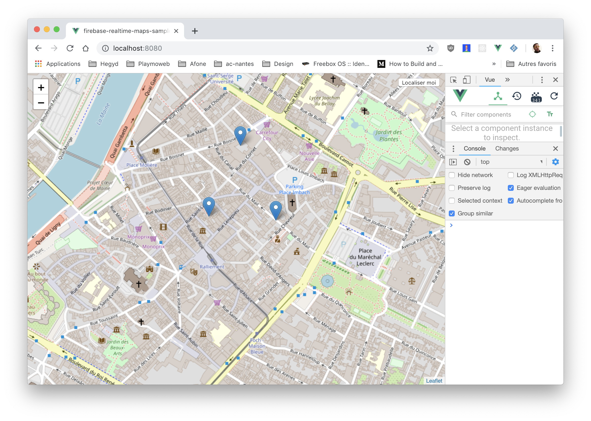
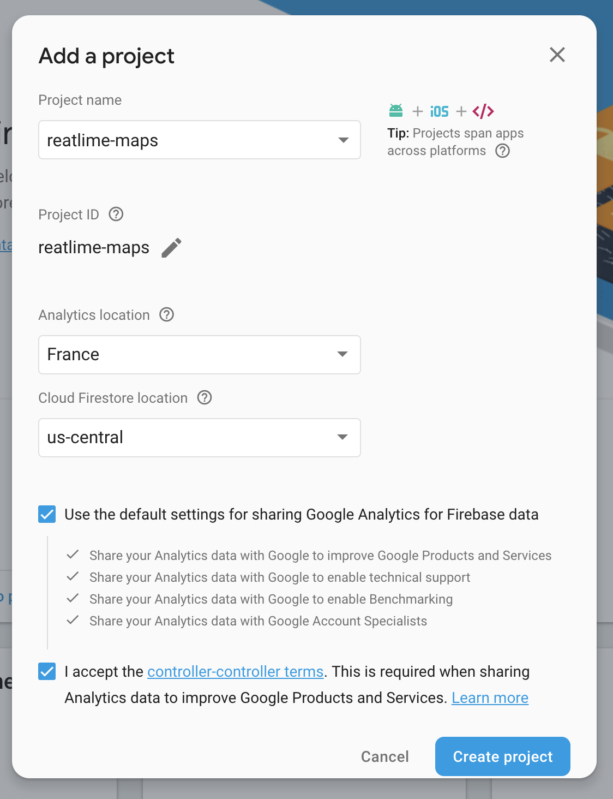
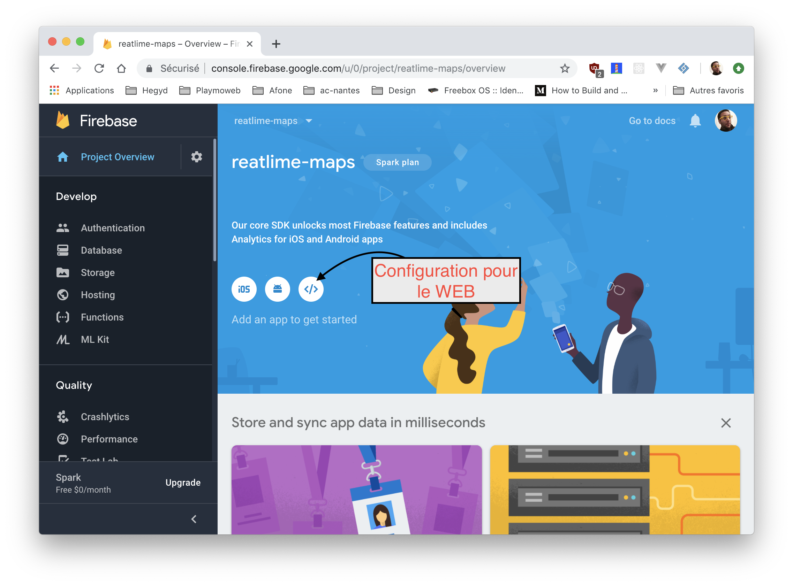
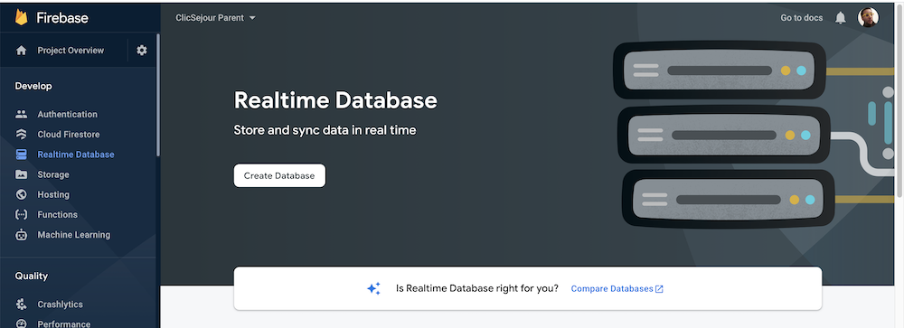
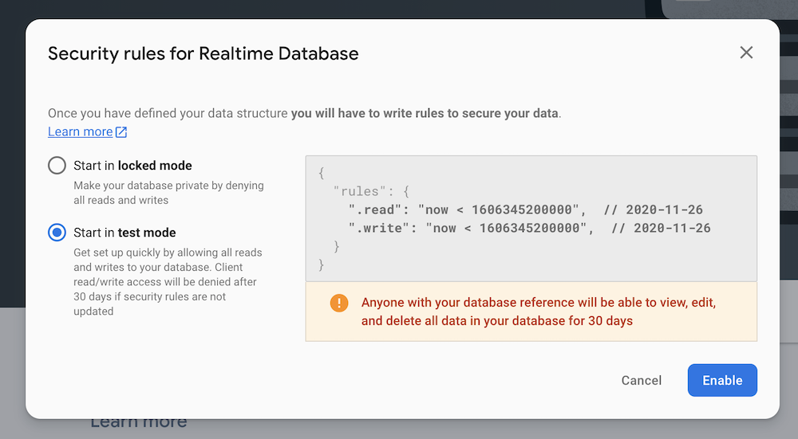
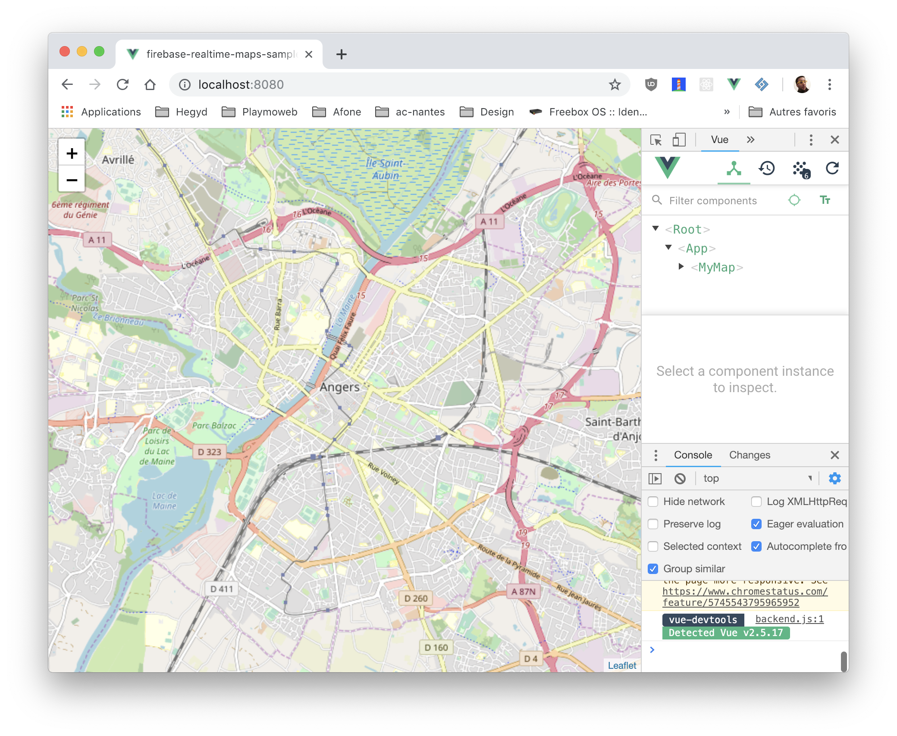

# Firebase + VueJS 3

::: details Sommaire
[[toc]]
:::

## Introduction

Dans ce TP nous allons découvrir Firebase Realtime Database (base de données temps réel). Nous allons coupler cette base de données temps réel à la puissance de VueJS 3 pour obtenir en un rien de temps une application web surpuissante.

Concrètement, nous allons mettre en place une carte du monde qui affiche en temps réel l'emplacement des utilisateurs qui interagissent avec la carte. Un clic sur la carte ajoute un marqueur, et ce marqueur apparaît instantanément chez tous les utilisateurs connectés. Sans écrire une seule ligne de code serveur.

Firebase est une plateforme de développement d'applications web et mobiles proposée par Google. Elle propose des services de base de données, d'authentification, de stockage, de messagerie et de notifications. Elle est disponible gratuitement pour un usage limité. Dans ce TP nous allons utiliser la base de données temps réel et uniquement celle-ci.



## Prérequis

Pour réaliser ce TP, vous devez avoir :

- NodeJS (version 18 minimum) et NPM installés sur votre machine.
- Un compte Google (pour accéder à la console Firebase).
- Suivi le [TP de découverte de ViteJS](./vite.md) (ou au minimum savoir créer un projet avec Vite).
- Des bases sur VueJS 3 et la composition API (`<script setup>`).

::: details Vous n'avez pas suivi les TP précédents ?
Pas de panique. Le TP est réalisable en autonomie, mais je vous invite fortement à lire au moins le [TP ViteJS](./vite.md) pour comprendre la structure d'un projet Vue moderne. Les autres notions seront expliquées au fil de l'eau.
:::

## Objectifs

À la fin de ce TP vous saurez :

- Créer un projet Firebase et activer la Realtime Database.
- Connecter une application VueJS 3 à Firebase avec le SDK modulaire.
- Afficher une carte interactive avec Leaflet.
- Écrire des données dans une base temps réel (`push`).
- Écouter les changements de la base en temps réel (`onValue`) pour synchroniser tous les clients.

## Étape 1 : créer le projet Vue

Comme dans les TP précédents, nous allons utiliser Vite pour initialiser notre projet :

```bash
npm create vite@latest
```

Paramètres à choisir :

- Nom du projet : `firebase-vuejs`
- Framework : `Vue`
- Langage : `TypeScript`

Puis, comme indiqué par la ligne de commande :

```bash
cd firebase-vuejs
npm install
npm run dev
```

🤓 N'oubliez pas d'initialiser votre Git (`git init` puis un premier commit).

::: tip Point de contrôle
Votre navigateur affiche la page de démonstration de Vite + Vue sur [http://localhost:5173](http://localhost:5173). Si ce n'est pas le cas, ne continuez pas : vérifiez votre installation de NodeJS avant d'aller plus loin.
:::

## Étape 2 : installer les dépendances

Notre projet va utiliser deux librairies :

- `firebase` : le SDK officiel qui va nous permettre de communiquer avec la Realtime Database.
- `leaflet` : une librairie qui permet d'afficher très rapidement une carte interactive sur un site web (c'est elle qui est derrière de très nombreuses cartes sur Internet).

```bash
npm install firebase leaflet
npm install --save-dev @types/leaflet
```

::: details Pourquoi `@types/leaflet` en plus ?
Leaflet est écrit en JavaScript « classique », sans typage. Le package `@types/leaflet` fournit les définitions TypeScript de la librairie : votre IDE pourra ainsi vous proposer l'autocomplétion et détecter vos erreurs. Le `--save-dev` indique que cette dépendance n'est utile qu'en développement, elle ne sera pas embarquée dans la version de production.
:::

Une question pour vous : dans le TP en VueJS 2, nous devions installer une version précise de Firebase (`firebase@7.24.0`) à cause d'une librairie intermédiaire. Ici nous installons la dernière version, sans intermédiaire. À votre avis, pourquoi est-ce possible ?

::: details Voir la réponse
Depuis la version 9, Firebase propose un SDK dit « modulaire » : on importe uniquement les fonctions dont on a besoin (`initializeApp`, `getDatabase`, `push`…). Ce SDK s'intègre naturellement avec la composition API de VueJS 3, sans avoir besoin d'une librairie de liaison comme Vuefire. Moins de dépendances, moins de contraintes de versions.
:::

## Étape 3 : créer le projet sur Firebase

Nous allons maintenant créer le projet côté Firebase. Rendez-vous sur [la console Firebase](https://console.firebase.google.com/) (connexion avec votre compte Google) et créez un nouveau projet :



::: tip L'interface évolue
Les captures d'écran datent un peu, Google fait régulièrement évoluer sa console. Les étapes restent les mêmes : créer un projet, lui donner un nom, refuser Google Analytics (inutile pour ce TP). Pas de panique si les écrans ne sont pas identiques.
:::

Une fois le projet créé, ajoutez une application de type **Web** (icône `</>`) pour récupérer la configuration :



Firebase vous fournit alors un objet de configuration. Nous allons le ranger dans un fichier dédié. Créez le fichier `src/config/firebase.ts` :

```ts
// src/config/firebase.ts
export default {
  apiKey: "✋-A-REMPLACER-PAR-VOTRE-CLE-✋",
  authDomain: "votre-projet.firebaseapp.com",
  databaseURL: "https://votre-projet-default-rtdb.europe-west1.firebasedatabase.app",
  projectId: "votre-projet",
  storageBucket: "votre-projet.appspot.com",
  messagingSenderId: "✋✋✋✋✋✋",
  appId: "✋✋✋✋✋✋",
};
```

⚠️ ✋ Attention à bien remplacer **toutes** les valeurs par celles fournies par **votre** console Firebase. ✋ ⚠️

Quelques questions de réflexion :

- Cette configuration contient une `apiKey`. Est-ce grave de la retrouver dans le code envoyé au navigateur ?
- Comment Firebase protège-t-il alors les données ?

::: details Voir la réponse
Contrairement à ce que son nom laisse penser, l'`apiKey` de Firebase n'est pas un secret : elle sert uniquement à identifier votre projet, pas à autoriser l'accès. Elle sera de toute façon visible dans le code JavaScript envoyé au navigateur.

La sécurité repose sur les **règles de sécurité** (Security Rules) définies côté Firebase, et éventuellement sur l'authentification des utilisateurs. Dans ce TP nous utiliserons le « mode test », qui laisse la base ouverte : acceptable pour un TP, inacceptable en production.
:::

## Étape 4 : activer la Realtime Database

Toujours dans la console Firebase, activez la **Realtime Database** (menu « Créer », ou « Build » en anglais) :



Au moment de choisir les règles de sécurité, sélectionnez le **mode test** :



::: warning Mode test = base ouverte
En mode test, tout le monde peut lire et écrire dans votre base (et Firebase la verrouille automatiquement au bout de 30 jours). C'est parfait pour ce TP, mais gardez en tête que pour un vrai projet il faudra écrire de vraies règles de sécurité.
:::

🤓 Pensez à récupérer l'URL de votre base (visible en haut de l'onglet « Données »), c'est la valeur `databaseURL` de votre fichier de configuration. Vérifiez qu'elle est bien renseignée dans `src/config/firebase.ts`.

## Étape 5 : brancher Firebase dans le projet

Nous avons la configuration, il faut maintenant initialiser Firebase dans notre application. Plutôt que de mettre ce code « à l'arrache » dans un composant, nous allons le ranger dans un dossier `plugins`. Créez le fichier `src/plugins/firebase.ts` :

```ts
// src/plugins/firebase.ts
import { initializeApp } from "firebase/app";
import { getDatabase } from "firebase/database";
import firebaseConfig from "../config/firebase";

const firebaseApp = initializeApp(firebaseConfig);

// L'objet « db » représente notre Realtime Database.
// Nous l'exporterons pour l'utiliser dans nos composants.
export const db = getDatabase(firebaseApp);
```

À votre avis, pourquoi séparer la **configuration** (`config/firebase.ts`) de l'**initialisation** (`plugins/firebase.ts`) ?

::: details Voir la réponse
La configuration est une donnée (des identifiants propres à votre projet), l'initialisation est du code. En les séparant :

- Vous pouvez changer de projet Firebase sans toucher au code.
- Le fichier de configuration peut être exclu du versionnement (ou remplacé par des variables d'environnement) sans casser le reste.
- Chaque fichier a une responsabilité unique, c'est plus lisible et plus maintenable.
:::

::: tip Que se passe-t-il derrière ?
`initializeApp` ne fait pas encore de requête réseau : il enregistre simplement votre configuration. C'est `getDatabase` qui prépare la connexion. La connexion réelle (un WebSocket vers les serveurs de Google) ne sera ouverte qu'au premier accès aux données. Ce WebSocket restera ouvert et c'est lui qui permettra à Firebase de « pousser » les changements vers votre navigateur en temps réel.
:::

## Étape 6 : afficher la carte avec Leaflet

Place à la carte ! Leaflet a besoin d'un peu de configuration avec Vite : les images des marqueurs ne sont pas trouvées automatiquement par le bundler. Comme pour Firebase, nous allons ranger cette configuration dans un plugin. Créez le fichier `src/plugins/leaflet.ts` :

```ts
// src/plugins/leaflet.ts
import L from "leaflet";
import "leaflet/dist/leaflet.css";

// Ces imports permettent à Vite de trouver les images des marqueurs.
import markerIcon2x from "leaflet/dist/images/marker-icon-2x.png";
import markerIcon from "leaflet/dist/images/marker-icon.png";
import markerShadow from "leaflet/dist/images/marker-shadow.png";

L.Icon.Default.mergeOptions({
  iconRetinaUrl: markerIcon2x,
  iconUrl: markerIcon,
  shadowUrl: markerShadow,
});
```

Puis déclarez ce plugin dans votre `src/main.ts` (avec les imports déjà présents) :

```ts
import "./plugins/leaflet";
```

Pourquoi cet import est-il nécessaire alors que nous n'utilisons « rien » du fichier ?

::: details Voir la réponse
Un fichier qui n'est jamais importé n'est jamais exécuté (et n'est même pas inclus dans le bundle final). En important le fichier, nous exécutons son contenu : le CSS de Leaflet est chargé et les icônes des marqueurs sont configurées, une fois pour toute l'application.
:::

### Le composant carte

Créez maintenant le dossier `src/views/` puis le fichier `src/views/Map.vue` :

```vue
<script setup lang="ts">
import { onMounted } from "vue";
import L from "leaflet";

onMounted(() => {
  // Création de la carte, centrée sur Angers.
  const map = L.map("map").setView([47.472092, -0.550589], 13);

  // Le fond de carte (les « tuiles » OpenStreetMap).
  L.tileLayer("https://tile.openstreetmap.org/{z}/{x}/{y}.png", {
    attribution: "© OpenStreetMap",
  }).addTo(map);
});
</script>

<template>
  <div id="map"></div>
</template>

<style scoped>
#map {
  height: 100vh;
  width: 100%;
}
</style>
```

Deux questions avant de continuer :

- Pourquoi le code de création de la carte est-il dans `onMounted` et pas directement dans le `<script setup>` ?
- Que se passerait-il si la `div` n'avait pas de hauteur définie en CSS ?

::: details Voir la réponse
- Le code du `<script setup>` s'exécute **avant** que le HTML du composant ne soit inséré dans la page. Or `L.map("map")` cherche un élément avec l'id `map` dans le DOM. `onMounted` garantit que le template est bien présent dans la page au moment où Leaflet en a besoin.
- Sans hauteur, la `div` mesure 0 pixel de haut : la carte serait créée, mais invisible. C'est LE piège classique de Leaflet, retenez-le.
:::

### Utiliser le composant

Remplacez le contenu de `src/App.vue` :

```vue
<script setup lang="ts">
import Map from "./views/Map.vue";
</script>

<template>
  <Map />
</template>

<style>
html,
body,
#app {
  margin: 0;
  padding: 0;
  height: 100%;
  width: 100%;
}
</style>
```

🤓 Vous pouvez également supprimer le contenu de `src/style.css` (le style de démonstration de Vite) s'il perturbe l'affichage.

::: tip Point de contrôle
Lancez `npm run dev` : vous devez voir une carte pleine page, centrée sur Angers, que vous pouvez déplacer et zoomer.



Si la carte est grise ou coupée, relisez la partie CSS (hauteur de la `div`) et vérifiez l'import du plugin Leaflet dans `main.ts`.
:::

## Étape 7 : écrire dans la base au clic

Nous avons une carte, nous avons une base de données : connectons les deux. Objectif : à chaque clic sur la carte, la position cliquée est enregistrée dans Firebase.

Avec le SDK modulaire, l'écriture se fait avec deux fonctions de `firebase/database` :

- `ref(db, "chemin")` : désigne un « emplacement » dans la base (la Realtime Database est un grand arbre JSON).
- `push(reference, valeur)` : ajoute la valeur à cet emplacement, avec une clé unique générée automatiquement.

Modifiez le `<script setup>` de `Map.vue` :

```vue
<script setup lang="ts">
import { onMounted } from "vue";
import L from "leaflet";
import { ref as dbRef, push } from "firebase/database";
import { db } from "../plugins/firebase";

// Référence vers la liste des marqueurs dans la base.
const markerListRef = dbRef(db, "markerList");

onMounted(() => {
  const map = L.map("map").setView([47.472092, -0.550589], 13);

  L.tileLayer("https://tile.openstreetmap.org/{z}/{x}/{y}.png", {
    attribution: "© OpenStreetMap",
  }).addTo(map);

  // À chaque clic sur la carte : on enregistre la position dans Firebase.
  map.on("click", (event) => {
    push(markerListRef, [event.latlng.lat, event.latlng.lng]);
  });
});
</script>
```

::: tip Un instant, `ref as dbRef` ?
VueJS possède déjà une fonction `ref` (pour les variables réactives), et Firebase en possède une autre (pour désigner un chemin dans la base). Pour éviter la collision de noms, nous renommons celle de Firebase en `dbRef` au moment de l'import. C'est une fonctionnalité standard de JavaScript (`import { x as y }`).
:::

::: tip Point de contrôle
- Ouvrez la [console Firebase](https://console.firebase.google.com/), rubrique Realtime Database, onglet « Données ».
- Cliquez à plusieurs endroits de votre carte.
- Vous devez voir apparaître **en direct** un nœud `markerList` qui se remplit de coordonnées, sans recharger la page de la console.

C'est votre premier aperçu du « temps réel » de Firebase 🎉
:::

Que remarquez-vous sur les clés générées par `push` ?

::: details Voir la réponse
Chaque `push` génère une clé unique du type `-Nxf3aB…`. Ces clés sont générées **côté client** (pas besoin d'aller-retour serveur) et sont triables chronologiquement : deux clients peuvent écrire en même temps sans conflit. C'est l'équivalent d'un auto-incrément, version base distribuée.
:::

## Étape 8 : afficher les marqueurs en temps réel

Les données sont en base, mais rien ne s'affiche sur la carte. C'est l'étape la plus intéressante du TP, et cette fois c'est à vous de jouer !

L'idée : écouter la liste `markerList` avec la fonction `onValue` de `firebase/database`. Firebase appellera votre fonction **à chaque changement** des données (y compris une première fois avec le contenu actuel). À chaque appel, vous redessinez les marqueurs.

La démarche :

- Importez `onValue` depuis `firebase/database`.
- Côté Leaflet, créez un `L.layerGroup().addTo(map)` : un « calque » qui contiendra tous les marqueurs et que l'on peut vider d'un coup avec `clearLayers()`.
- Appelez `onValue(markerListRef, (snapshot) => { … })` dans le `onMounted` (après la création de la carte).
- Dans la fonction de rappel : videz le calque, puis parcourez le snapshot avec `snapshot.forEach((child) => { … })`. La valeur d'un enfant s'obtient avec `child.val()`, sa clé avec `child.key`.
- Pour chaque enfant, ajoutez un marqueur : `L.marker([lat, lng]).addTo(monCalque)`.

Essayez d'abord sans regarder la solution. Pas de panique, toutes les briques sont listées ci-dessus.

::: details Besoin d'aide pour démarrer ?
Le squelette de la partie temps réel, à compléter :

```ts
const markersLayer = L.layerGroup().addTo(map);

onValue(markerListRef, (snapshot) => {
  markersLayer.clearLayers();
  snapshot.forEach((child) => {
    // À vous : récupérer les coordonnées et ajouter le marqueur.
  });
});
```
:::

::: details Voir l'une des solutions possibles

```vue
<script setup lang="ts">
import { onMounted } from "vue";
import L from "leaflet";
import { ref as dbRef, push, onValue } from "firebase/database";
import { db } from "../plugins/firebase";

const markerListRef = dbRef(db, "markerList");

onMounted(() => {
  const map = L.map("map").setView([47.472092, -0.550589], 13);

  L.tileLayer("https://tile.openstreetmap.org/{z}/{x}/{y}.png", {
    attribution: "© OpenStreetMap",
  }).addTo(map);

  map.on("click", (event) => {
    push(markerListRef, [event.latlng.lat, event.latlng.lng]);
  });

  // Le calque qui contiendra tous les marqueurs.
  const markersLayer = L.layerGroup().addTo(map);

  // Appelé à chaque changement des données (et une fois au chargement).
  onValue(markerListRef, (snapshot) => {
    markersLayer.clearLayers();
    snapshot.forEach((child) => {
      const [lat, lng] = child.val();
      L.marker([lat, lng]).addTo(markersLayer);
    });
  });
});
</script>
```

:::

::: tip Que se passe-t-il derrière ?
`onValue` ne fait pas de « polling » (interrogation répétée du serveur). Le SDK maintient un WebSocket ouvert avec Firebase : quand une donnée change, le serveur pousse la modification vers tous les clients abonnés, qui déclenchent alors votre fonction de rappel. C'est pour cela que la latence est de l'ordre de quelques dizaines de millisecondes.
:::

::: tip Point de contrôle
Le vrai test : ouvrez votre application dans **deux navigateurs côte à côte** (ou partagez votre IP avec un voisin pour tester à plusieurs). Un clic dans l'un fait apparaître le marqueur dans l'autre, instantanément. Vous venez d'écrire une application temps réel multi-utilisateurs sans une seule ligne de code serveur 🚀
:::

## Étape 9 : supprimer un marqueur

Bon, maintenant qu'il y a des marqueurs partout, il serait bien de pouvoir les supprimer ! Objectif : un clic sur un marqueur le supprime de la base (et donc de la carte de tout le monde, temps réel oblige).

Cette fois, je vous donne uniquement les pistes :

- La fonction `remove` de `firebase/database` supprime les données d'une référence.
- Une référence vers **un** marqueur précis se construit avec son chemin complet : `dbRef(db, "markerList/" + cle)`.
- La clé d'un enfant est disponible via `child.key` au moment où vous créez le marqueur dans le `onValue`.
- Un marqueur Leaflet peut réagir au clic : `L.marker(…).on("click", () => { … })`.

C'est à vous de jouer !

::: details Voir l'une des solutions possibles

Dans le `onValue`, remplacez la création du marqueur par :

```ts
snapshot.forEach((child) => {
  const [lat, lng] = child.val();
  L.marker([lat, lng])
    .on("click", () => {
      remove(dbRef(db, "markerList/" + child.key));
    })
    .addTo(markersLayer);
});
```

Sans oublier d'ajouter `remove` à l'import de `firebase/database`.

:::

## Pour aller plus loin

Vous avez de l'avance ? Voici quelques évolutions, par difficulté croissante. Cette fois, aucune solution : à vous de chercher dans les documentations.

### Centrer la carte sur votre position

La carte est centrée sur Angers. C'est pratique… si vous êtes à Angers. Utilisez l'[API Geolocation du navigateur](https://developer.mozilla.org/fr/docs/Web/API/Geolocation_API) et un bouton pour recentrer la carte sur l'utilisateur (`map.setView(…)`).

### Ajouter une confirmation de suppression

Un clic malheureux et le marqueur disparaît pour tout le monde. Ajoutez une confirmation avant la suppression (un simple `confirm(…)` pour commencer, ou une vraie boîte de dialogue en composant Vue pour les plus motivés).

### Personnaliser les marqueurs

Et si chaque utilisateur avait sa propre couleur de marqueur ? Réfléchissez à ce que cela implique :

- Dans la base de données (que faut-il stocker en plus des coordonnées ?).
- Dans le code (regardez `L.icon` dans la documentation Leaflet).

### Sécuriser la base

Le mode test expire au bout de 30 jours. Regardez les [règles de sécurité de la Realtime Database](https://firebase.google.com/docs/database/security) : comment limiter l'écriture à un format valide (un tableau de deux nombres) ? Comment n'autoriser que les utilisateurs authentifiés ?

## Conclusion

Dans ce TP nous avons vu :

- La création d'un projet Firebase et l'activation de la Realtime Database en mode test.
- La connexion d'une application VueJS 3 (Vite + TypeScript) à Firebase avec le SDK modulaire (`initializeApp`, `getDatabase`).
- L'affichage d'une carte interactive avec Leaflet (et le piège de la hauteur CSS).
- L'écriture de données temps réel avec `push` et leur lecture avec `onValue`.
- La synchronisation instantanée entre plusieurs utilisateurs, sans écrire de serveur.

N'oubliez pas de **commiter votre projet** (sans le dossier `node_modules`, et idéalement sans votre configuration Firebase).

La base de données temps réel ouvre beaucoup de possibilités : afficher en direct les visiteurs présents sur votre portfolio, un chat, un tableau blanc collaboratif, un suivi de livraison… Le motif est toujours le même : `push` d'un côté, `onValue` de l'autre. Je vous laisse imaginer la suite.

👋 Si vous avez des questions, n'hésitez pas.

## Ressources

- [Documentation Firebase Realtime Database (Web)](https://firebase.google.com/docs/database/web/start)
- [Documentation Leaflet](https://leafletjs.com/)
- [VueJS 3](https://vuejs.org/)
- [Vite](https://vitejs.dev/)
