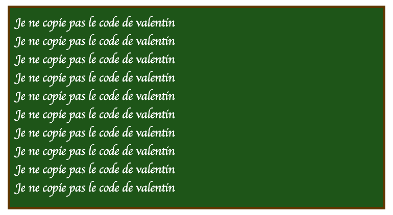

# Petite Vue : La réactivité simplifiée

Comme nous l'avons vu en cours, VueJS est un framework permettant deux utilisations différentes. La première est celle conçue et pensée pour les SPA (Single Page Application), dans cette approche vous avez l'ensemble de votre code en JavaScript et celui-ci grâce à un routeur (ou pas) gère l'ensemble des pages et également la génération du code HTML affiché dans le navigateur.

La seconde approche, celle que nous allons voir maintenant est pensée pour l'amélioration progressive. VueJS permet déjà ce genre de fonctionnement (avec VueJS 2, mais également VueJS 3). Cependant VueJS est une grosse librairie permettant de faire beaucoup de choses, le créateur de VueJS Evan You a annoncé la création d'une microlibrairie dérivée de VueJS nommée « Petite Vue ».

Cette microlibrairie offre les mêmes fonctionnalités que VueJS, mais en se limitant à un usage « en tant que librairie », avec comme objectif de s'intégrer dans une application **déjà écrite** ; donc avec une application ne reposant pas sur une génération complètement côté client.

::: details Sommaire
[[toc]]
:::

## Introduction

Alors, avant d'aller plus loin, je vous préviens ; [Petite Vue](https://github.com/vuejs/petite-vue#comparison-with-standard-vue) c'est vraiment tout neuf. Nous en avons parlé précédemment, le monde du JavaScript va vite, les librairies intéressantes arrivent rapidement. C'est dans cette optique que je vous présente Petite Vue, c'est récent, mais très intéressant.

Les présentations faites, je vous propose d'entrer directement dans le vif du sujet.

## Ce que nous allons obtenir

Voilà le rendu du projet final :

<Sample src="petitevue"/>

<center>
    <b>👋 C'est interactif. Alors là vous vous dites, non, mais ça va être dur… Mais non non, vous allez voir c'est ultra simple.</b>
</center>

::: tip Vous allez voir c'est magique
Comme VueJS, Petite Vue est une librairie plutôt magique. Là où pour avoir une page interactive nous devions créer tous les éléments à la main. Avec Petite Vue, nous allons avoir accès à une syntaxe particulière (nommée template) ; celle-ci permet de rendre dynamique une page, sans écrire une seule ligne de JavaScript 🧙.
:::

## Le code d'exemple

Petite Vue étant une librairie, il vous faut un code existant. Je vous propose de repartir du code de Bart. Nous allons créer un BartJS, mais ultra-réactif avec une syntaxe très simple à prendre en main.

Voilà le code de base de notre application. Pour l'instant rien à part le tableau.

```html
<!DOCTYPE html>
<html lang="en">
  <head>
    <meta charset="UTF-8" />
    <meta name="viewport" content="width=device-width, initial-scale=1.0" />
    <title>BartJS − Version Petite Vue</title>
    <link
      rel="stylesheet"
      href="https://stackpath.bootstrapcdn.com/bootstrap/4.3.1/css/bootstrap.min.css"
      integrity="sha384-ggOyR0iXCbMQv3Xipma34MD+dH/1fQ784/j6cY/iJTQUOhcWr7x9JvoRxT2MZw1T"
      crossorigin="anonymous"
    />

    <style>
      #tableau {
        background-color: #1e5518;
        color: white;
        border: 5px solid #5e3600;
        padding: 10px;
        max-width: 900px;
        margin: auto;
        height: 400px;
        overflow: auto;
        font-family: cursive;
        font-size: x-large;
      }

      [v-cloak] {
        display: none;
      }
    </style>
  </head>

  <body>
    <div id="tableau"></div>
  </body>
</html>
```

- Je vous laisse créer une page `index.html` sur votre ordinateur. C’est cette page qui nous servira de base.

## Ajout de Petite Vue

L'ajout de Petite Vue va se faire en deux temps :

- Ajouter la librairie et lui dire de se « monter » / « s'initialiser ».
- Déclarer les variables nécessaires au bon fonctionnement de notre application.

Dans notre cas, nous avons besoin de deux variables :

- La phrase
- Le nombre de lignes à écrire

Ce qui donnera :

```html
<script type="module">
  import { createApp } from "https://unpkg.com/petite-vue?module";
  createApp({
    phrase: "Je ne copie pas le code de valentin",
    count: 10,
  }).mount();
</script>
```

- Je vous laisse ajouter le code dans votre page.

**À cet instant**, votre navigateur va exécuter le code, **mais** évidemment ça ne fera rien… À votre avis pourquoi ?

## Déclarer le template

Eh oui, comme avec VueJS classique, pas de magie, nous devons déclarer où sera notre template. Cette déclaration se fait par l'ajout de l'attribut `v-scope` sur l'élément **parent qui contiendra** votre code HTML dynamique. Dans notre cas :

```html
<div v-scope v-cloak>
  <div id="tableau">
    <div v-for="i in count" :key="i">{{phrase}}</div>
  </div>
</div>
```

::: tip v-cloak ?
`v-cloak` est un attribut qui permettra de cacher le contenu tant que Petite Vue (VueJS) n'est pas complètement chargé.
:::

Pour l'instant vous devez avoir :



::: warning La syntaxe

Pour la partie template, la syntaxe reste identique à ce que nous avons vu [ensemble avec VueJS](/cheatsheets/vuejs/#les-directives).

Ici, l'astuce est donc l'utilisation du `v-for` pour répéter la `phrase` autant de fois que `count`.
:::

## La réactivité c'est ici 🚀

Bon alors, pour l'instant l'intérêt est plutôt limité… Nous avons généré une page OK ! Mais comment rendre tout ça dynamique et surtout **réactif**.

Eh bien, comme avec VueJS classique nous allons connecter des champs de saisie, des éléments graphiques, etc. à ces variables pour les manipuler à la volée.

Je vous donne un exemple :

```html
<div v-scope>
  <div>
    <div class="form-group">
      <label>Phrase</label>
      <input class="form-control" type="text" v-model="phrase" />
    </div>

    <div class="form-group mt-2">
      <label>Nombre de phrase : {{count}}</label>
      <input
        min="5"
        max="100"
        class="form-control"
        type="range"
        v-model.number="count"
      />
    </div>
  </div>

  <div id="tableau">
    <div v-for="i in count" :key="i">{{phrase}}</div>
  </div>
</div>
```

Ici, les inputs deviennent réactifs grâce à `v-model="phrase"` qui permet de **connecter** l'input et la variable phrase **en temps réel**.

::: tip Et c'est tout…
Et voilà, vous avez recréé le code de BartJS avec seulement 5 lignes de JavaScript. Et bonus c'est « temps réel » sans se prendre la tête.

J'ai détaillé plus que nécessaire… En réalité il était possible de faire la même chose sans même écrire de JavaScript, mais pour le point suivant il était intéressant d'écrire un peu de JS.
:::

### Vous voulez voir la version sans écrire de JS ?

Ça me semble important de vous montrer la version « sans écrire » de JavaScript. La voici :

```html
<!DOCTYPE html>
<html lang="en">
  <head>
    <meta charset="UTF-8" />
    <meta name="viewport" content="width=device-width, initial-scale=1.0" />
    <title>BartJS − Version Petite Vue</title>
    <link
      rel="stylesheet"
      href="https://stackpath.bootstrapcdn.com/bootstrap/4.3.1/css/bootstrap.min.css"
      integrity="sha384-ggOyR0iXCbMQv3Xipma34MD+dH/1fQ784/j6cY/iJTQUOhcWr7x9JvoRxT2MZw1T"
      crossorigin="anonymous"
    />
    <script src="https://unpkg.com/petite-vue" defer init></script>

    <style>
      #tableau {
        background-color: #1e5518;
        color: white;
        border: 5px solid #5e3600;
        padding: 10px;
        max-width: 900px;
        margin: auto;
        height: 400px;
        overflow: auto;
        font-family: cursive;
        font-size: x-large;
      }

      [v-cloak] {
        display: none;
      }
    </style>
  </head>

  <body
    v-scope="{phrase: 'Je ne copie pas le code de valentin', count: 10}"
    v-cloak
  >
    <div>
      <div class="form-group">
        <label>Phrase</label>
        <input class="form-control" type="text" v-model="phrase" />
      </div>

      <div class="form-group mt-2">
        <label>Nombre de phrase : {{count}}</label>
        <input
          min="5"
          max="100"
          class="form-control"
          type="range"
          v-model.number="count"
        />
      </div>
    </div>

    <div id="tableau">
      <div v-for="i in count" :key="i">{{phrase}}</div>
    </div>
  </body>
</html>
```

Aucune différence en termes de fonctionnement 👌.

::: tip « Sans JavaScript »

Évidemment, le code n'est pas sans JavaScript. **Vous** n'avez pas écrit de JavaScript, celui-ci a été écrit par quelqu'un d'autre dans la librairie.

:::

## Allez plus loin, l'Ajax version simple !

Nous avons réalisé un exemple plutôt simple, en réalité, utiliser Petite Vue va être très intéressant quand il s'agit de faire de l'Ajax.

**Pourquoi ?** Tout simplement, car ça va nous permettre de rendre dynamique la page sans créer des éléments à la volée.

**Comment ?** Tout simplement en créant un tableau et en répétant autant de fois que nécessaire l'information.

**Un exemple ?** Oui je pense que c'est nécessaire…

<Sample src="petitevue_ajax" />

Nous avons donc une page qui va récupérer du contenu depuis une API (`https://jsonplaceholder.typicode.com/todos/`). Nous avons précédemment réalisé cet exemple. Mais vous allez voir qu'ici il n'y aura vraiment pas beaucoup de code.

Je vous donne le code. Nous allons en parler :

```html
<!DOCTYPE html>
<html lang="en">
  <head>
    <meta charset="UTF-8" />
    <meta name="viewport" content="width=device-width, initial-scale=1.0" />
    <title>Fetch API − Version Petite Vue</title>
    <link
      rel="stylesheet"
      href="https://stackpath.bootstrapcdn.com/bootstrap/4.3.1/css/bootstrap.min.css"
      integrity="sha384-ggOyR0iXCbMQv3Xipma34MD+dH/1fQ784/j6cY/iJTQUOhcWr7x9JvoRxT2MZw1T"
      crossorigin="anonymous"
    />

    <style>
      #tableau {
        background-color: #1e5518;
        color: white;
        border: 5px solid #5e3600;
        padding: 10px;
        max-width: 900px;
        margin: auto;
        height: 400px;
        overflow: auto;
        font-family: cursive;
        font-size: x-large;
      }

      [v-cloak] {
        display: none;
      }
    </style>
  </head>

  <body>
    <div v-scope v-cloak>
      <button
        :disabled="datas.length > 0"
        type="button"
        class="my-5 mx-auto d-block btn btn-primary"
        @click="fetchData"
      >
        Récupérer les TODOS
      </button>
      <div id="tableau">
        <ul>
          <li v-for="element in datas">{{element['title']}}</li>
        </ul>
      </div>
    </div>

    <script type="module">
      import { createApp } from "https://unpkg.com/petite-vue?module";
      createApp({
        datas: [],
        fetchData() {
          fetch("https://jsonplaceholder.typicode.com/todos/")
            .then((r) => r.json())
            .then((r) => (this.datas = r));
        },
      }).mount();
    </script>
  </body>
</html>
```

Comment procéder pour analyser le code :

- Est-ce que vous avez des éléments connus ?
- Que comprenez-vous du code `script` ?
- Comment sont récupérés les TODOS ?

::: tip Je vous laisse regarder

Je vous laisse regarder et tester le code, **mais également** modifier le code.

Parlons-en dès que vous avez fait le tour 🤓.

:::

## Charger les données au chargement de votre page

Actuellement, l'utilisateur doit cliquer sur un bouton pour déclencher le chargement du contenu. Dans la vraie vie, il est souvent préférable de charger une première fois les données. Avec Petite-Vue, pour répondre à cette problématique nous allons utiliser la directive `@mounted` qui sera déclenchée au chargement de notre code.

Cette directive est à ajouter directement dans le HTML au même endroit que v-scope.

Dans mon exemple ça donne :

```html
<!-- … Reste du code … -->
<div @mounted="fetchData()" v-scope v-cloak>
  <!-- … Reste du code … -->
</div>
```

Comme vous pouvez le constater, il suffit de spécifier dans le `@mounted` la méthode à appeler.
