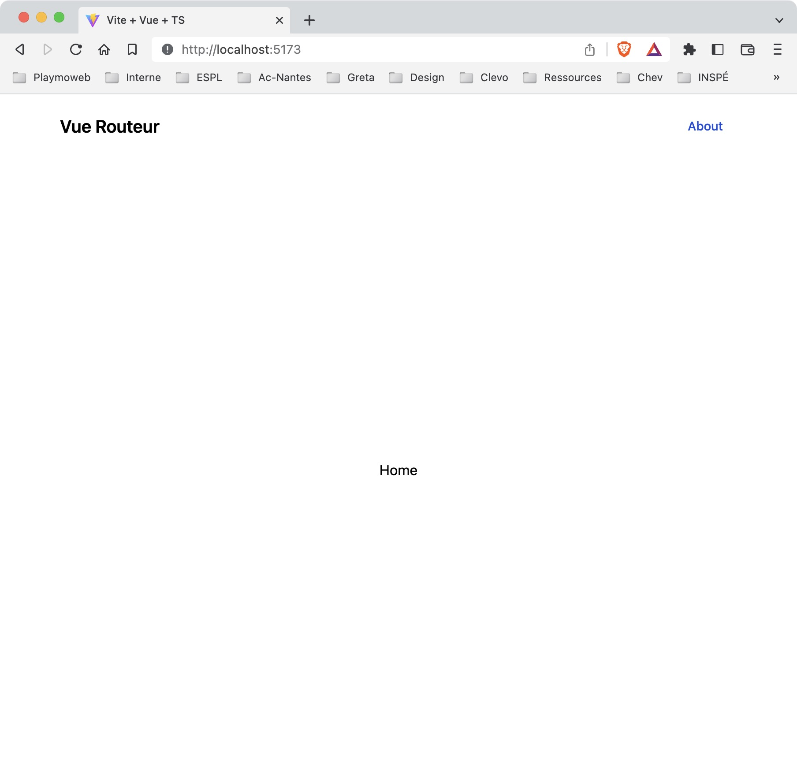
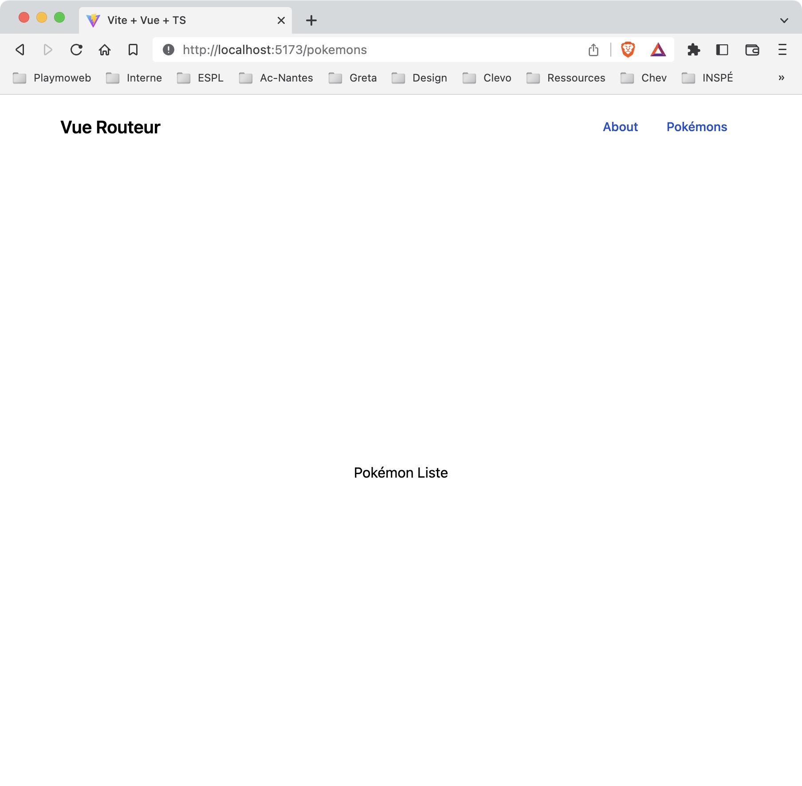

# VueJS 3 et un routeur

## Introduction

Dans ce TP, nous allons voir comment utiliser un routeur avec VueJS 3. Nous utiliserons le routeur officiel de VueJS 3 : [Vue Router](https://router.vuejs.org/).

::: details Table des matières
[[toc]]
:::

## Rappel sur les routes / routeur

Un routeur est un composant qui va permettre de gérer les routes de notre application. Une route est une URL qui va permettre d'accéder à une page de notre application.

Par exemple, si nous avons une application qui permet de gérer des tâches, nous aurrons plusieurs routes :

- Une route pour afficher la liste des tâches
- Une route pour afficher le détail d'une tâche
- Une route pour créer une tâche
- Une route pour modifier une tâche
- etc.

Le routeur va permettre de gérer ces routes et de faire le lien entre une URL et un composant. Par exemple, si l'utilisateur tape l'URL `http://localhost:8080/tasks`, le routeur va afficher le composant qui affiche la liste des tâches.

Rien de bien nouveau, vous avez déjà utilisé des routeurs avec Laravel, ici nous allons voir comment faire avec VueJS.

## Création du projet

Pour tester le routeur nous allons créer un nouveau projet VueJS 3. 

```sh
npm create vite@latest
```

Nous allons créer un projet avec VueJS 3 et TypeScript.

Je vous laisse choisir le nom du projet.

## Installation des dépendances

Avant d'ajouter le routeur assurez vous que votre projet fonctionne correctement.

```sh
cd le-nom-du-projet
npm install
npm run dev
```

Vous devriez voir l'application VueJS 3 par défaut.

## Ajout du routeur

Pour ajouter le routeur, nous allons utiliser la commande `npm` :

```sh
npm install vue-router@4
```

::: tip Que fait la commande ?

La commande `npm install` va télécharger les dépendances du projet. Ici nous téléchargeons la dépendance `vue-router` en version 4. Cette dépendance va être ajoutée dans le fichier `package.json` et dans le fichier `package-lock.json`.

Elle va aussi créer un dossier `node_modules` qui va contenir les dépendances du projet. 

Rappel: Ce dossier ne doit pas être versionné.

:::

## Nettoyage du projet

Nous allons supprimer le composant `HelloWorld.vue` pour ne garder que le composant `App.vue` par défaut. En effet, nous allons utiliser le routeur pour afficher les composants.

Une fois réalisé vous devriez avoir un fichier `App.vue` qui ressemble à ça :

```vue
<script setup lang="ts">

</script>

<template>
  <!-- Nous ajouterons notre routeur ici -->
</template>

<style scoped>

</style>
```

::: tip C'est l'invonvénient d'un projet avec du code de base

Nous allons devoir supprimer le code de base pour pouvoir utiliser le routeur. C'est un peu dommage, mais c'est le prix à payer quand on souhaite un effet wahou dès le début.

:::

## Création des composants / vues de notre application

De base le routeur ne fait rien. Nous allons donc le configurer pour qu'il affiche un composant par défaut. 

Pour cela, nous allons créer un composant `Home.vue` dans le dossier `src/views` :

```vue
<template>
  <div>
    <h1>Home</h1>
  </div>
</template>
```

Nous allons ensuite créer un composant `NotFound.vue` dans le dossier `src/views` :

```vue
<template>
  <div>
    <h1>Not Found</h1>
  </div>
</template>
```

::: tip Pourquoi un composant NotFound ?
Le routeur va afficher le composant NotFound si aucune route ne correspond à l'URL. C'est une 404 en version VueJS.
:::

Nous allons créer également un composant `About.vue` dans le dossier `src/views` :

```vue
<template>
  <div>
    <h1>About</h1>
  </div>
</template>
```

Nous avons maintenant tous les vues / composant dont nous avons besoin pour configurer le routeur :

- Home: Sera affiché par défaut, il s'agit de la page d'accueil de notre application.
- NotFound: Sera affiché si aucune route ne correspond à l'URL.
- About: Sera affiché si l'utilisateur tape l'URL `/about`.

::: tip Pourquoi des vues dans un dossier `views` ?
Nous avons créé un dossier `views` pour y mettre les composants qui correspondent à des vues. C'est une bonne pratique pour séparer les composants qui sont des vues des composants qui sont des éléments de vues.
:::

C'est à vous, je vous laisse créer les différentes vues de votre application, en reprenant les exemples ci-dessus.

Nous allons maintenant configurer le routeur pour qu'il affiche ces composants.

## Paramétrage du routeur

Nous allons maintenant configurer le routeur pour qu'il affiche les composants que nous venons de créer. L'ensemble de la configuration sera réalisé directement en TypeScript.

Nous allons créer un fichier `router.ts` dans le dossier `src` :

```ts
import { createRouter, createWebHistory } from 'vue-router'

import Home from './views/Home.vue'
import NotFound from './views/NotFound.vue'
import About from './views/About.vue'

const routes = [
  {
    path: '/',
    name: 'Home',
    component: Home
  },
  {
    path: '/about',
    name: 'About',
    component: About
  },
  {
    path: '/:pathMatch(.*)*',
    name: 'NotFound',
    component: NotFound
  }
]

export default createRouter({
  history: createWebHistory(),
  routes
});

```

Qu'est ce que nous avons fait ?

- Nous avons importé les fonctions `createRouter` et `createWebHistory` qui vont nous permettre de créer le routeur.
- Nous avons importé les composants que nous avons créé précédemment.
- Nous avons créé un tableau `routes` qui contient les routes de notre application.
- Nous avons créé le routeur avec la fonction `createRouter` en lui passant en paramètre le tableau `routes`.
- Nous avons exporté le routeur pour pouvoir l'utiliser dans notre application.
- Nous avons ajouté la propriété `history` à notre routeur pour lui dire d'utiliser l'historique du navigateur.

::: tip C'est à vous de jouer

Je vous laisse créer le fichier `router.ts` et de le remplir avec le code ci-dessus.

:::

## Initialisation du routeur

Nous allons maintenant initialiser le routeur dans notre application. Pour cela, nous allons ajouter le routeur dans le composant `main.ts` :

```ts
import "./style.css"
import { createApp } from 'vue'
import App from './App.vue'
import router from './router'

createApp(App).use(router).mount('#app')
```

Vous avez déjà une partie de ce code dans le fichier `main.ts` de votre application. 

Ce que vous devez faire c'est :

- Importer le routeur : `import router from './router'`
- L'ajouter à l'application : `….use(router).…`

::: tip C'est à vous de jouer

Je vous laisse ajouter le routeur dans le composant `main.ts`. Ici pas de magie, le code est fourni directement sur le site de VueRouter : [https://router.vuejs.org/guide/#javascript](https://router.vuejs.org/guide/#javascript)

:::

## Utilisation du routeur

Nous allons maintenant utiliser le routeur dans notre application. Pour cela, nous allons ajouter le routeur dans le composant `App.vue` :

```vue
<template>
  <router-view />
</template>
```

Nous avons importé le routeur dans le composant `App.vue` et nous l'avons ajouté dans le template. Nous avons également ajouté la balise `<router-view />` qui va afficher le composant correspondant à l'URL.

::: tip C'est à vous de jouer
Je vous laisse ajouter le routeur dans le composant `App.vue`.
:::

Heu, c'est tout ? Oui, c'est tout. Nous avons configuré le routeur et nous l'avons ajouté dans notre application. Nous pouvons maintenant lancer notre application pour voir si tout fonctionne correctement.

## Lancement de l'application

Nous allons maintenant lancer notre application pour voir si tout fonctionne correctement. Pour cela, nous allons lancer la commande `npm run serve` :

```bash
npm run serve
```

Vous devriez voir l'application s'afficher dans votre navigateur :


Les liens accessibles sont :

- [http://localhost:4000/](http://localhost:4000/) : affiche le composant `Home.vue`
- [http://localhost:4000/about](http://localhost:4000/about) : affiche le composant `About.vue`
- [http://localhost:4000/autre](http://localhost:4000/autre) : affiche le composant `NotFound.vue`

## Et le style ?

Pour l'instant nous avons une application qui affiche les composants que nous avons créé. C'est bien, mais c'est moche. Nous allons donc ajouter du style à notre application.

Vous l'aurez compris, nous allons utiliser TailwindCSS. Nous allons donc ajouter TailwindCSS à notre application.

## Installation de TailwindCSS

Nous allons maintenant ajouter TailwindCSS à notre application. Pour cela, nous allons utiliser la commande `npm install` :

```bash
npm install tailwindcss@latest postcss@latest autoprefixer@latest
npx tailwindcss init -p
```

Nous allons maintenant créer un fichier `tailwind.config.cjs` à la racine de notre application :

```js
/** @type {import('tailwindcss').Config} */
module.exports = {
  content: [
    "./index.html",
    "./src/**/*.{vue,js,ts,jsx,tsx}",
  ],
  theme: {
    extend: {},
  },
  plugins: [],
}
```

Nous allons maintenant créer un fichier `postcss.config.cjs` à la racine de notre application :

```js
module.exports = {
  plugins: {
    tailwindcss: {},
    autoprefixer: {},
  }
}
```

Nous allons maintenant modifier le fichier `style.css` dans le dossier `src` :

```css
@tailwind base;
@tailwind components;
@tailwind utilities;
```

::: tip Un instant

Ici nous ajoutons TailwindCSS dans notre CSS. Le `@tailwind` est une directive qui permet à postcss de comprendre que nous voulons utiliser TailwindCSS. Les directives `@tailwind` sont :

- `@tailwind base` : ajoute les styles de base de TailwindCSS
- `@tailwind components` : ajoute les styles des composants de TailwindCSS
- `@tailwind utilities` : ajoute les styles des utilitaires de TailwindCSS

Je vous laisse regarder le code source de votre page généré pour voir comment celui-ci est injecté dans votre page.

:::

Puis modifier le fichier `App.vue` pour qu'il utilise TailwindCSS :

```vue
<template>
  <div class="container mx-auto">
    <router-view />
  </div>
</template>
```

Aucun changement ? Oui, c'est normal. Nous n'avons pas encore ajouté TailwindCSS à notre application. Nous allons maintenant le faire.

## Ajouter une navbar

Vue que nous sommes des gens bien, nous allons ajouter une navbar à notre application, celle-ci permettra de naviguer entre les différentes pages de notre application :

- La page d'accueil: `/`
- La page `About`: `/about`

Vue que nous sommes organisés, nous allons créer un composant `Navbar.vue` dans le dossier `src/components`. Celui-ci contiendra le code HTML + CSS de notre navbar.

```vue
<template>
    <nav class="bg-white border-gray-200 px-2 sm:px-4 py-2.5 rounded dark:bg-gray-900">
        <div class="container flex flex-wrap items-center justify-between mx-auto">
            <a href="/" class="flex items-center">
                <span class="self-center text-xl font-semibold whitespace-nowrap dark:text-white">Vue Routeur</span>
            </a>

            <div class="hidden w-full md:block md:w-auto" id="navbar-default">
                <ul class="flex flex-col p-4 mt-4 border border-gray-100 rounded-lg bg-gray-50 md:flex-row md:space-x-8 md:mt-0 md:text-sm md:font-medium md:border-0 md:bg-white dark:bg-gray-800 md:dark:bg-gray-900 dark:border-gray-700">
                    <li>
                        <a href="/about" class="block py-2 pl-3 pr-4 text-white bg-blue-700 rounded md:bg-transparent md:text-blue-700 md:p-0 dark:text-white" aria-current="page">About</a>
                    </li>
                </ul>
            </div>
        </div>
    </nav>
</template>
```

Pour réaliser cette navbar, nous avons utilisé le framework CSS [TailwindCSS](https://tailwindcss.com/). J'ai également utilisé le site [Flowbite](https://flowbite.com/) pour générer le code HTML + CSS de la navbar.

## Ajouter la navbar dans l'application

Nous allons maintenant ajouter le composant `Navbar.vue` dans le composant `App.vue` :

```vue
<script lang="ts" setup>
import Navbar from "./components/Navbar.vue";
</script>

<template>
    <div class="flex flex-col h-screen">
      <Navbar />

      <div class="flex justify-center items-center flex-grow flex-col">
        <router-view />
      </div>
    </div>    
</template>
```

Normalement la navbar devrait s'afficher, et ressembler à ça :



::: tip Cette fois-ci je vous ai aidé

Du code comme celui-ci ça ne s'invente pas. Je vous ai donc aidé en vous donnant le code HTML + CSS de la navbar. Vous pouvez bien sûr modifier le code pour qu'il corresponde à vos attentes.

:::

## Tester votre application

Je vous laisse tester la navigation entre les différentes pages de votre application.

## Ajouter une page listant les pokémons

Nous allons maintenant ajouter une page listant les pokémons. Pour cela, nous allons utiliser l'API [PokéAPI](https://pokeapi.co/). En utilisant le code du TP précédent, nous allons créer un composant `PokemonList.vue` dans le dossier `src/views`.

Avant de continuer, je vous laisse créer la page `PokemonList.vue` et tester que vous pouvez y accéder. Voici les étapes à suivre :

- Créer le fichier `PokemonList.vue` dans le dossier `src/views`
- Ajouter le composant `PokemonList.vue` dans le fichier `router.ts`
- Tester que vous pouvez accéder à la page `/pokemons`
- Modifier votre navbar pour ajouter un lien vers la page `/pokemons`

::: tip Et pour le contenu ?
Pour l'instant vous n'avez pas de contenu. Je vous laisse mettre un simple `h1` dans le composant `PokemonList.vue`.

Je vous aide, voici la base de votre composant `PokemonList.vue` :

```vue
<script setup lang="ts">
// À l'étape suivante vous allez ajouter le code pour récupérer la liste des pokémons
</script>

<template>
  <h1>Pokémons Liste</h1>
</template>

<style scoped>
</style>
```

:::

## Modifier votre navbar

Avant de continuer, je vous invite à modifier votre navbar pour ajouter un lien vers la page `/pokemons`. Une fois ajouté, vérifiez que vous pouvez accéder à la page `/pokemons` en cliquant sur le lien dans votre navbar.

Vous devriez avoir quelque chose comme ça :



## Afficher la liste

Je vous propose de reprendre le système de Card que nous avons utilisé dans le TP Précédent. Mais comme nous sommes des gens bien, nous allons créer un composant `Card.vue` dans le dossier `src/components` et l'utiliser dans notre composant `PokemonList.vue`.

### Créer un composant `Card.vue`

Je vous invite également vivement à créer un composant `Card` dans le dossier `src/components` et à l'utiliser dans votre composant `PokemonList.vue`. Comme toujours le découpage en composant est une bonne pratique.

Code du composant `Card.vue` :

```vue
<script setup lang="ts">
</script>

<template>
    <div class="m-6 block max-w-md p-6 bg-white border border-gray-200 rounded-lg shadow-md hover:bg-gray-100 dark:bg-gray-800 dark:border-gray-700 dark:hover:bg-gray-700">
        <p class="font-normal">
            <slot />
        </p>
    </div>
</template>
```

Avec du contenu voilà à quoi ça ressemble :


::: tip Un instant !
D'où vient le code ? [Flowbite](https://flowbite.com/) et plus particulièrement la page Card : [https://flowbite.com/docs/components/card/](https://flowbite.com/docs/components/card/).
:::

### Afficher la liste des pokémons

Pour afficher la liste des pokémons nous avons besoin de récupérer la liste des pokémons depuis l'API. Pour cela, nous allons utiliser la fonction `fetch` de JavaScript.

L'appel à l'API va être réalisé dans la partie `<script setup>` du composant `PokemonList.vue`. Nous allons donc créer une variable `pokemons` qui contiendra la liste des pokémons.

```vue
<script setup lang="ts">
import { ref } from 'vue'

const pokemons = ref([])

// À l'étape suivante vous allez ajouter le code pour récupérer la liste des pokémons
</script>
```

### Appeler l'API

Pour appeler l'API, nous allons utiliser la fonction `fetch` de JavaScript. Cette fonction permet d'appeler une API et de récupérer les données en JSON.

```js
function getPokemons() {
  fetch('https://pokeapi.co/api/v2/pokemon?limit=151')
    .then(response => response.json())
    .then(data => {
      pokemons.value = data.results
    })
}
```

Je vous laisse ajouter cette fonction dans le composant `PokemonList.vue` et tester que vous récupérez bien votre liste. Vous pouvez également afficher les données dans la console avec `console.log(pokemons)` dans le `then`.

**N'oubliez pas l'appel à la fonction `getPokemons` dans le composant `PokemonList.vue`**, sinon vous n'aurez pas de données. Vous pouvez appeler la fonction à la fin de votre `<script lang="ts" setup>`.

::: tip C'est à vous !

Je vous laisse terminer la page liste, elle doit afficher l'ensemble des données dans des Card. Vous utilisez le composant `Card.vue` que vous avez créé précédemment.

Pas de panique, ici vous devez utiliser ce que vous avez appris dans les TP précédents, à savoir :

- Utiliser un v-for pour afficher une liste.
- Utiliser le composant `Card.vue` pour afficher les données. (n'oubliez pas de l'importer `import Card from '@/components/Card.vue'`).

Voilà à quoi ça peut ressembler :


:::

::: details Une solution possible pour la vue

```vue
<template>
    <div>
        <h1>
            Pokémon Liste 
        </h1>
    </div>
    
    <div>
        <div class="grid grid-cols-4 gap-4">
            <div v-for="(pokemon, index) in pokemons" :key="pokemon.name">
                <Card>
                    <div class="text-center">{{ pokemon.name }}</div>
                </Card>
            </div>
        </div>
    </div>
</template>
```

:::

## Ajouter une page pour afficher les détails

Nous avons créé la page listant toutes les données récupérées depuis l'API. L'API nous propose également de récupérer les détails d'un élément, nous allons maintenant ajouter une page pour afficher les détails d'un pokémon. Comme pour la page liste, nous allons dans un premier temps créer la page et ensuite ajouter le lien vers cette page.

Pour cela, nous allons créer une nouvelle vue nommée `PokemonDetails.vue`. Cette vue va afficher les détails d'un pokémon. Pour cela, nous allons utiliser l'ID du pokémon dans l'URL.

### Ajouter la page

Nous allons ajouter la page `PokemonDetails.vue` dans le dossier `src/views`. Le contenu de la page est à vous de le définir, mais la structure de la page doit être la suivante :

```vue
<script setup lang="ts">
</script>

<template>
<!-- Visuel de votre vue -->
</template>
```

### Ajouter le lien dans le router

Par rapport aux liens précédents, nous allons avoir un lien dynamique. Pour cela, nous allons utiliser les paramètres de route. Pour cela, nous allons utiliser les `:` dans l'URL.

```js
{
  path: '/pokemon/:id',
  name: 'PokemonDetails',
  component: PokemonDetails
}
```

Ajouter le code précédent dans le fichier `router.js` et tester que vous pouvez accéder à la page `/pokemon/1`.

::: tip Que signifie le `:id` ?

Le `:id` signifie que l'URL peut contenir un paramètre. Dans notre cas, l'URL peut contenir un paramètre `id`. Nous allons pouvoir récupérer ce paramètre dans le composant `PokemonDetails.vue`.

C'est un peu comme si nous avions une variable `id` dans l'URL, comme nous pouvions le faire en PHP. Exemple :

- `/pokemon/1` => `id = 1`
- `/pokemon/2` => `id = 2`
- …

:::

### Créer un lien vers la page de détails

Nous allons maintenant créer un lien vers la page de détails. Pour cela, nous allons utiliser le composant `router-link` de Vue Router. Ce composant permet de créer un lien vers une route. Pour cela, nous allons utiliser la propriété `to` qui prend en paramètre l'URL de la route, ici `/pokemon/:id`.

```vue
    <router-link :to="`/pokemon/${index + 1}`">
    // ...
    </router-link>
```

### La vue de détails

Nous avons défini le lien qui permettra d'accéder à la page de détails ainsi qu'une vue pour l'instant vide  Nous allons maintenant afficher les détails d'un pokémon. Pour cela, nous allons utiliser l'ID présent dans l'URL.

Pour récupérer l'ID, nous allons utiliser le code suivant `this.$route.params.id`. Cet ID nous servira ensuite lors de l'appel à l'API pour récupérer les détails de l'ID passé en paramètre. Comme toujours nous allons utiliser la fonction `fetch` de JavaScript.

Voici le code à mettre dans votre setup de votre page `PokemonDetails.vue` :

```ts
<script setup lang="ts">
import { ref } from 'vue'
import { useRoute } from 'vue-router'

const pokemonId = useRoute().params.id
const pokemon = ref(null)

function fetchPokemon() {
    fetch(`https://pokeapi.co/api/v2/pokemon/${pokemonId}`)
        .then(response => response.json())
        .then(data => {
            pokemon.value = data
        })
}

fetchPokemon()
</script>
```

Quelques explications :

- `pokemonId` : récupère l'ID dans l'URL, récupéré avec `useRoute().params.id`.
- `pokemon` : variable qui va contenir les détails du pokémon
- `fetchPokemon` : fonction qui va appeler l'API pour récupérer les détails du pokémon
- `fetchPokemon()` : appel de la fonction `fetchPokemon` pour récupérer les détails.

Je vous laisse ajouter ce code dans le composant `PokemonDetails.vue` et tester que vous récupérez bien les détails du pokémon. Vous pouvez également afficher les détails du pokémon dans la console avec `console.log(this.pokemon)` dans le `then`.

::: tip Que contient la variable `pokemon` ?

Vous pouvez regarder la structure de la variable `pokemon` dans la console. Vous pouvez également regarder la documentation de l'API : [https://pokeapi.co/docs/v2#pokemon-section](https://pokeapi.co/docs/v2#pokemon-section) :

- `pokemon.sprites` : contient les sprites du pokémon (les images)
- `pokemon.name` : contient le nom du pokémon
- `pokemon.types` : contient les types du pokémon
- `pokemon.stats` : contient les statistiques du pokémon
- …

:::

### La vue de détails

Maintenant que nous avons récupéré les données, nous allons pouvoir les afficher dans la page `PokemonDetails.vue`. Je vous laisse ajouter le code HTML + CSS pour afficher les détails.

Exemple de template affichant les détails :

```html
<template>
  <div class="flex flex-col items-center" v-if="pokemon">
    <div class="flex flex-col items-center">
      
      <h1 class="text-2xl font-bold">{{ pokemon.name }}</h1>
    </div>
    <div class="flex flex-col items-center">
      <h2 class="text-xl font-bold">Types</h2>
      <div class="flex flex-row">
        <span v-for="type in pokemon.types" :key="type.type.name" class="bg-gray-200 rounded-full px-3 py-1 text-sm font-semibold text-gray-700 mr-2">
          {{ type.type.name }}
        </span>
      </div>
    </div>
  </div>
</template>
```

Une fois réalisé vous devriez voir :


## Ajouter une page `contact`

En reprenant la logique vue précédemment, ajoutez une page `contact` qui contient un formulaire de contact. 

- Créez une page `contact` avec un formulaire de contact.
- Ajoutez un lien vers cette page dans le menu.
- Ajoutez une route vers cette page.
- Le formulaire doit contenir les champs suivants :
  - Nom
  - Prénom
  - Email
  - Message
- Le formulaire doit être stylisé. (Vous pouvez vous inspirer de [https://flowbite.com/blocks/marketing/contact/](https://flowbite.com/blocks/marketing/contact/])

::: tip Comment récupérer les données du formulaire ?

Vous pouvez récupérer les données du formulaire avec la fonction `onSubmit` :

```html
<form @submit.prevent="onSubmit">
  <input type="text" v-model="name" />
  <input type="text" v-model="firstname" />
  <input type="text" v-model="email" />
  <textarea v-model="message"></textarea>
  <button type="submit">Envoyer</button>
</form>
```

```ts
<script setup lang="ts">
import { ref } from 'vue'

const name = ref('')
const firstname = ref('')
const email = ref('')
const message = ref('')

function onSubmit() {
  console.log(this.name)
  console.log(this.firstname)
  console.log(this.email)
  console.log(this.message)
}
</script>
```

::::

## Évolution de l'application

Je vous laisse travailler sur le style de l'application pour que celle-ci soit plus jolie. Vous pouvez également ajouter des fonctionnalités comme :

- Ajouter un bouton pour revenir à la liste.
- Ajouter un bouton pour aller au suivant.
- Ajouter un bouton pour aller au précédent.
- Afficher un pokémeon en aléatoire. (`math.random…`).

- Vous n'oublierez pas de compléter la page `about` avec des informations sur l'application.
- Vous n'oublierez pas de compléter la page `home`, celle-ci doit inviter l'utilisateur à aller sur la page `pokemons`.

## Conclusion

Nous avons vu comment créer une application VueJS avec TailwindCSS. Nous avons également vu comment créer des pages et des composants. Nous avons également vu comment récupérer des données depuis une API.

Le découpage de l'application en vue est primordial pour la maintenabilité de l'application. Même si votre site est développé en JavaScript / Typescript, il est important de séparer les différentes parties de l'application. C'était important en PHP avec Laravel et en MVC ça l'ait toujours en JavaScript avec VueJS.

## Ressources

- [https://v3.vuejs.org/](https://v3.vuejs.org/)
- [https://tailwindcss.com/](https://tailwindcss.com/)
- [https://flowbite.com/](https://flowbite.com/)
- [VueJS Dev Tools Chrome](https://chrome.google.com/webstore/detail/vuejs-devtools/nhdogjmejiglipccpnnnanhbledajbpd)
- [VueJS Dev Tools Firefox](https://addons.mozilla.org/fr/firefox/addon/vue-js-devtools/)
- [https://pokeapi.co/](https://pokeapi.co/)
