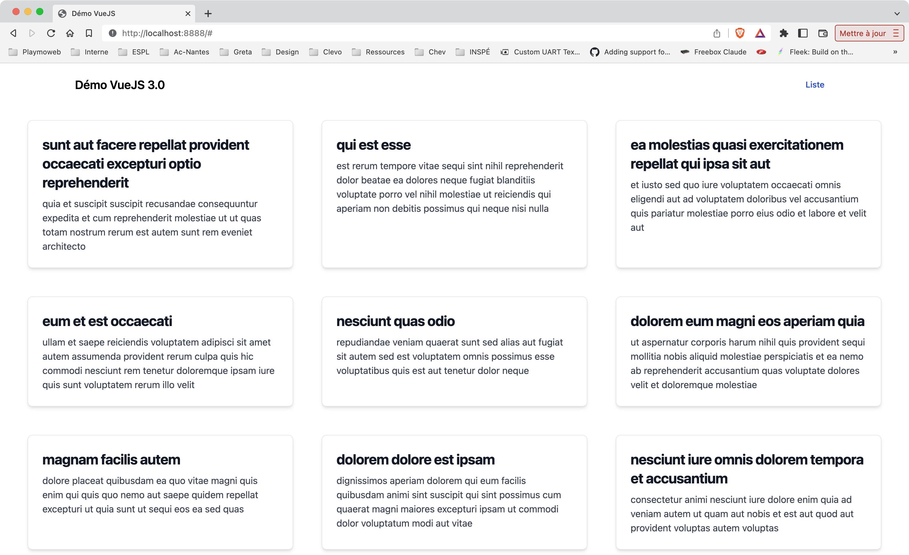

# Suite prise en main de VueJS 3

Dans ce TP nous allons découvrir l'utilisation de VueJS sans bundler. Nous allons donc utiliser directement le CDN de VueJS.

::: details Table des matières
[[toc]]
:::

## Introduction

Dans le premier TP nous avons vu comment créer une page HTML et y ajouter VueJS. Nous avons également vu comment créer une instance de VueJS et comment lier une donnée à un élément du DOM.

Ici nous allons voir comment utiliser VueJS pour simplifier la récupération de données depuis une API.

## Création de notre page

Pour commencer, créer un fichier `index.html` puis insérer à l'intérieur « une structure HTML 5 »

::: tip
Si vous utilisez Visual Studio Code, vous pouvez faire html:5<kbd>Tab</kbd> une structure HTML sera automatiquement écrite.
:::

```html
<!DOCTYPE html>
<html lang="fr">
  <head>
    <meta charset="UTF-8" />
    <meta name="viewport" content="width=device-width, initial-scale=1.0" />
    <title>Démo VueJS</title>
  </head>
  <body>
    <div id="app"></div>
  </body>
</html>
```

Pour ajouter VueJS dans la page ? Il faut juste ajouter la balise script suivante dans le « head » de votre page :

```html
<script src="https://unpkg.com/vue@3/dist/vue.global.js"></script>
```

## Déclarer notre script VueJS

Pour déclarer notre script VueJS, il faut ajouter une balise script dans le body de notre page :

```html
<script>
    const { createApp } = Vue

    createApp({
        mounted() {
            console.log('Application montée')
        },
        data() {
            return {
                items: []
            }
        }
    }).mount('#app')
</script>
```

Pour l'instant rien ne se passe, c'est normal. Nous allons maintenant ajouter un template, avant d'aller plus loin, je vous invite à regarder la console de votre navigateur. Vous devriez voir le message `Application montée`.

## l'API

Pour récupérer les données depuis l'API, nous allons utiliser la fonction `fetch` de JavaScript. Cette fonction permet de faire des requêtes HTTP. 

Rappel sur `fetch`, cette fonction prend en paramètre l'URL de l'API et retourne une promesse. Cette promesse contient la réponse de l'API. Pour récupérer les données, il faut utiliser la méthode `json()` de la réponse.

Exemple :

```js
fetch('https://jsonplaceholder.typicode.com/posts')
    .then(response => response.json())
    .then(data => console.log(data))
```

Comment lire le code ci-dessus ? 

- On fait une requête HTTP vers l'URL `https://jsonplaceholder.typicode.com/posts`
- On récupère la réponse de l'API.
- On récupère les données de la réponse.
- On affiche les données dans la console.

::: tip Tester

Vous pouvez tester ce code dans la console de votre navigateur. Vous devriez voir les données de l'API dans la console.

:::

## Appel de l'API depuis VueJS

Pour appeler l'API depuis VueJS, nous allons utiliser la fonction `mounted` de VueJS. Cette fonction est appelée lorsque l'instance de VueJS est montée.

::: tip mounted

La fonction `mounted` est appelée lorsque l'instance de VueJS est montée. C'est-à-dire lorsque le DOM est prêt, et que l'instance de VueJS est liée à un élément du DOM. 

:::

Pour appeler l'API, nous allons utiliser la fonction `fetch` de JavaScript. Pour récupérer les données, nous allons utiliser la fonction `json()` de la réponse de l'API. Une fois les données récupérées, nous allons les stocker dans la propriété `items` de notre instance de VueJS.

```js
mounted() {
    fetch('https://jsonplaceholder.typicode.com/posts')
        .then(response => response.json())
        .then(data => this.items = data)
}
```

Où est la propriété `items` ? Celle-ci est déclarée dans la fonction `data` de notre instance de VueJS. Cette fonction retourne un objet qui contient les données de notre instance de VueJS.

### Méthode ou directement dans Mounted ?

Ici nous avons deux choix, soit nous déclarons une fonction qui va appeler l'API, soit nous appelons directement l'API dans la fonction `mounted`.

À votre avis, laquelle est la meilleure solution ?

::: tip Le découpage est toujours la meilleure solution

Dans ce cas, la meilleure solution est de déclarer une fonction qui va appeler l'API. Cela permet de découper le code et de le rendre plus lisible.

:::

Je vous laisse créer une méthode qui va appeler l'API.

- N'oubliez pas de l'appeler dans la fonction `mounted`.
- Vous avez un exemple d'appel à fetch un peu plus haut.

::: details Besoin d'aide ?

👋 Évidemment, le code ne remplace pas le code que vous avez déjà écrit. Il faut le compléter.

```vue
mounted() {
    this.fetchData()
},
methods: {
    fetchData() {
        fetch('https://jsonplaceholder.typicode.com/posts')
            .then(response => response.json())
            .then(data => this.items = data)
    }
}
```

:::

## Afficher les données

Pour afficher les données, nous allons utiliser la directive `v-for` de VueJS. Cette directive permet de répéter un élément du DOM pour chaque élément d'un tableau.

```html
<div id="app">
    <ul>
        <li v-for="item in items" :key="item.id">
            {{ item.title }}
        </li>
    </ul>
</div>
```

::: tip :key

La directive `v-for` de VueJS nécessite une clé unique pour chaque élément. C'est pour cela que nous avons ajouté l'attribut `:key` sur la balise `li`. Cette clé est utilisée par VueJS pour optimiser le rendu du DOM.

:::

Je vous laisse tester le code ci-dessus. Vous devriez voir la liste des posts de l'API.

### Évolution du code

Pour l'instant, nous avons une liste de posts. Nous allons maintenant afficher les détails d'un post. En effet si vous avez regardé l'API, vous avez vu que chaque post contient un `id`, un `title` et un `body`.

C'est à vous modifier le code de votre application pour afficher le `title` et le `body` d'un post.

## Et le visuel ?

Pour l'instant votre application n'a pas de visuel. Enfin si, mais c'est du simple HTML. Nous allons maintenant ajouter du CSS à notre application.

## Bootstrap ou TailwindCSS ?

Pour l'instant, nous n'avons pas mis de CSS. C'est à vous de mettre du CSS dans votre application. Pour ça deux options :

- Soit vous utilisez Bootstrap.
- Soit vous utilisez TailwindCSS.

::: tip Ma préférence ?

J'utilise TailwindCSS. C'est une bibliothèque CSS qui permet de créer des interfaces rapidement. C'est une bibliothèque qui est très simple à utiliser. Je vous invite à regarder la documentation de TailwindCSS :

[Consultez la documentation de TailwindCSS](https://tailwindcss.com/docs)

:::

## Ajouter TailwindCSS

Pour ajouter Tailwind nous allons utiliser le CDN. Celui-ci est un peu particulier car il ne s'agit pas d'un fichier CSS. Il s'agit d'un fichier JavaScript qui va ajouter du CSS à notre application.

Pour ajouter TailwindCSS, nous allons ajouter le CDN dans le fichier `index.html` de notre application.

```html
<script src="https://cdn.tailwindcss.com"></script>
```

::: tip CDN

Un CDN est un réseau de distribution de contenu. Il permet de distribuer des fichiers à travers le monde.

:::

## Styliser votre site Internet

Maintenant que TailwindCSS est ajouté à votre application, vous pouvez styliser votre site Internet. Nous allons légèrement modifier le code de notre application pour que celle-ci ressemble à :



Pour réaliser ce rendu vous pouvez utiliser les classe de TailwindCSS :

- Grid : [https://tailwindcss.com/docs/grid-template-columns](https://tailwindcss.com/docs/grid-template-columns)
- Navbar : [https://flowbite.com/docs/components/navbar/](https://flowbite.com/docs/components/navbar/)
- Card : [https://flowbite.com/docs/components/card/](https://flowbite.com/docs/components/card/)

Je vous laisse réaliser ce rendu.

::: details Complètement bloqué ?

Attendez un instant… Vous avez vraiment envie de voir le code ? 🤔

::: details Non vraiment ? 🤔

```html
<!-- Tailwind Navbar -->
<nav class="bg-white border-gray-200 px-2 sm:px-4 py-2.5 rounded dark:bg-gray-900">
    <div class="container flex flex-wrap items-center justify-between mx-auto">
        <a href="/" class="flex items-center">
            <span class="self-center text-xl font-semibold whitespace-nowrap dark:text-white">Démo VueJS 3.0</span>
        </a>

        <div class="hidden w-full md:block md:w-auto" id="navbar-default">
            <ul class="flex flex-col p-4 mt-4 border border-gray-100 rounded-lg bg-gray-50 md:flex-row md:space-x-8 md:mt-0 md:text-sm md:font-medium md:border-0 md:bg-white dark:bg-gray-800 md:dark:bg-gray-900 dark:border-gray-700">
                <li>
                    <a href="/" class="block py-2 pl-3 pr-4 text-white bg-blue-700 rounded md:bg-transparent md:text-blue-700 md:p-0 dark:text-white" aria-current="page">Liste</a>
                </li>
            </ul>
        </div>
    </div>
</nav>


<!-- La liste des posts -->
<div class="flex flex-wrap justify-center">
    <a v-for="item in items" href="#" class="m-6 block max-w-md p-6 bg-white border border-gray-200 rounded-lg shadow-md hover:bg-gray-100 dark:bg-gray-800 dark:border-gray-700 dark:hover:bg-gray-700">
        <h5 class="mb-2 text-2xl font-bold tracking-tight text-gray-900 dark:text-white">{{item.title}}</h5>
        <p class="font-normal text-gray-700 dark:text-gray-400">{{item.body}}</p>
    </a>
</div>
```

:::

## Ajouter une action dans la navbar

Pour l'instant, nous avons une navbar avec un lien vers la liste des posts. Je vous laisse écrire le code permettant d'ajouter un lien qui va permettre de recharger la liste des posts.

::: tip Rappel

Pour recharger la liste des posts, vous pouvez utiliser la fonction `fetchData()`. Avec vueJS pour rendre un élément cliquable, vous pouvez utiliser la directive `@click` suivie de la fonction à appeler. Par exemple :

```html
<button @click="fetchData()">Recharger</button>
```

:::

## Filtrer les posts

Pour compléter notre application, nous allons ajouter un champs de recherche. Ce champs va filtrer les posts en fonction d'une saisie utilisateur.

### Le champs de recherche

Pour ajouter le champs de recherche, nous allons utiliser la directive `v-model` de VueJS. Cette directive permet de lier un champs de formulaire à une variable. Par exemple :

```html
<input type="text" v-model="search">
```

::: tip N'oubliez pas
Pour que la variable `search` soit disponible dans votre application, vous devez l'ajouter dans le `data()` de votre application. Exemple :

```js
data() {
    return {
        items: [],
        search: ''
    }
}
```

:::

Je vous laisse ajouter le champs de recherche et le JS dans votre application.

### Les `computed` : Filtrer les posts

Pour filtrer les posts, nous allons utiliser une fonction de VueJS nommé `computed`. Cette fonction permet de créer une variable qui est calculée à partir d'autres variables. Par exemple :

```js
computed: {
    filteredItems() {
        return this.items.filter(item => item.title.includes(this.search))
    }
}
```

::: Comment ça marche ?
La variable `filteredItems` est calculée à partir de la variable `items` et de la variable `search`. À chaque fois que le tableau `items` ou la variable `search` est modifié, la variable `filteredItems` est recalculée. C'est très pratique !

La ligne `return this.items.filter(item => item.title.includes(this.search))` permet de filtrer le tableau `items` en ne gardant que les éléments dont le titre contient la valeur de la variable `search`. C'est possible grace à la fonction `includes()` qui permet de savoir si une chaine de caractère est incluse dans une autre chaine de caractère ([documentée ici](https://developer.mozilla.org/fr/docs/Web/JavaScript/Reference/Objets_globaux/String/includes)).
:::

Pour afficher les posts filtrés, il suffit de remplacer la variable `items` par la variable `filteredItems` dans le code HTML (dans la boucle `v-for`)

```html
<a v-for="item in filteredItems" href="#" class="m-6 block max-w-md p-6 bg-white border border-gray-200 rounded-lg shadow-md hover:bg-gray-100 dark:bg-gray-800 dark:border-gray-700 dark:hover:bg-gray-700">
```

Je vous laisse **modifier votre code HTML** tel que décrit ci-dessus.

## Conclusion

Nous avons vu comment créer une application VueJS 3.0. Nous avons surtout vu comment VueJS simplifiait l'appel à une API. Ce genre de fonctionnement est le coeur de beaucoup de site internet moderne qui utilisent des API pour récupérer des données :

- Les réseaux sociaux.
- Les Webmail.
- …

Ils ont tous la même logique :

- Récupérer des données au chargement de la page.
- Décoder les données souvent au format JSON.
- Les afficher dans la page en les stylisant.
- Permettre à l'utilisateur de recharger les données.

::: tip Pour aller plus loin

L'usage de VueJS en mode CDN est intéressant pour des petits projets. Pour des projets plus importants, je vous invite à utiliser VueJS en mode CLI.

En effet, le mode CLI permet de créer des applications plus complexes. Il permet également de créer des applications avec des fonctionnalités avancées comme :

- Le routeur
- La gestion de l'état.
- Les composants.

Bref, tout ce qui est nécessaire pour créer des applications web modernes.

Vous avez envie de découvrir VueJS en mode CLI ? Je vous invite à lire le TP suivant : [ViteJS](./vite.md).

:::

## Ressources

- [https://v3.vuejs.org/](https://v3.vuejs.org/)
- [https://tailwindcss.com/](https://tailwindcss.com/)
- [https://flowbite.com/](https://flowbite.com/)
- [VueJS Dev Tools Chrome](https://chrome.google.com/webstore/detail/vuejs-devtools/nhdogjmejiglipccpnnnanhbledajbpd)
- [VueJS Dev Tools Firefox](https://addons.mozilla.org/fr/firefox/addon/vue-js-devtools/)