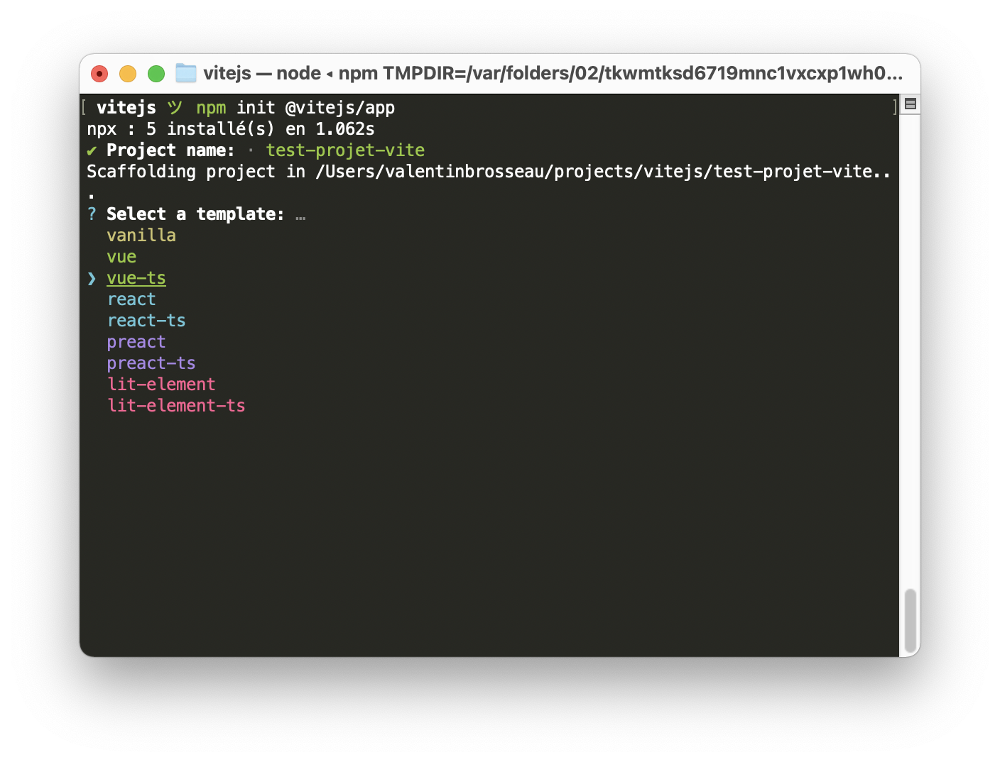
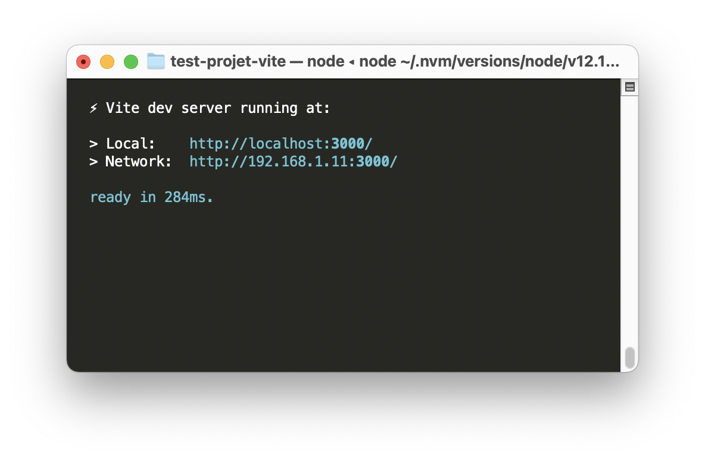

# Découverte de VueJS 3.0 (avec ViteJS)

[[toc]]

## Introduction

ViteJS est une des nouvelles façons de créer un projet « moderne » avec VueJS (mais pas que). L'objectif est la création de projets « rapide » permettant au développeur de créer des projets avec une structure simple et moderne. Cette organisation repose sur quatre éléments :

- Un serveur web de développement qui utilise les modules EcmaScript intégrant un Hot Reload très rapide des ressources modifiées.
- Une commande de compilation, préconfigurée pour optimiser les ressources pour la production en utilisant [Rollup](https://rollupjs.org/) et non pas WebPack
- Un système reposant sur des plug-ins permettant des projets personnalisés si besoin.
- Intègre nativement le support du [TypeScript](https://www.typescriptlang.org/)

L'ensemble du fonctionnement est détaillé sur [la documentation officielle](https://vitejs.dev/)

## Installation / Création du projet

Contrairement aux anciens outils fonctionnement avec VueJS, ViteJS ne nécessite rien d'autre que d'avoir sur votre ordinateur `NodeJS` (minimum 12) et `NPM`. Si c'est le cas pour vous, il vous suffit de saisir dans votre terminal :

```sh
npm init @vitejs/app
```

::: tip C'est interactif !
L'ensemble du processus est interactif ; il vous suffit donc de suivre les étapes pour créer un projet.

**Attention quand même**, le projet que vous allez créer sera situé dans le dossier courant.
:::



::: warning plusieurs choix !
Vous avez le choix du type de projet ; nous allons choisir **vue-ts**. Cette sélection du type de projet est la vraie force de ViteJS, grâce à son système de plug-in ViteJS est complètement agnostique il est donc complètement possible de faire autre chose que du VueJS (et ça, c'est cool).
:::

## Lancer le projet

Votre projet est maintenant « configuré » / « initialisé ». Pour la suite des opérations, il suffit de suivre ce qu'a indiqué votre ligne de commande à savoir :

```sh
cd test-projet-vite
npm install
npm run dev
```

🚀 Et ça va vite ! Très vite. Attention les yeux 🚀



Vous pouvez tester la page dans [votre navigateur](http://localhost:3000).

## Regardons la structure

Le projet que vous avez initialisé a une structure particulière que vous devez respecter :

## VueJS 2.0 -> VueJS 3.0

Entre VueJS 2.0 et VueJS 3.0, il y a quelques nuances, mais dans l'idée le fonctionnement d'un composant est très proche. Les composants VueJS peuvent maintenant fonctionner de deux façons différentes :

- « À l'ancienne » avec une déclaration des variables « d'état » dans la méthode `data(){return {}}`.
- Via l'API de `composition`. C'est-à-dire via des déclarations dans la méthode Setup. Cette méthode est en quelques sortes un mélange entre le `mounted()` et le `data()`. Vous allez pouvoir définir dedans les `variables réactives` mais également du code partagé définissant le comportement entre les composants (exemple surveillance du scroll de la souris)

::: tip Vous avez le choix
Les deux façons sont **toutes aussi valides l'une que l'autre**. C'est à vous de voir en fonction de vos préférences.
:::

### setup()

Le code de la méthode `setup()` est semblable à n'importe quelles méthodes. Vous écrivez **votre code**, **votre logique** la seule subtilité est que vous allez devoir indiquer à VueJS les variables qu'il va devoir observer.

Cette déclaration sera aussi simple que d'écrire `ref()`. La fonction / méthodes `ref()` prend un paramètre, celui-ci est la valeur par d'initialisation de la variable.

Un exemple sera bien plus parlant :

```typescript
setup: () => {
  // Déclaration d'une variable « observé » de type Int
  const count = ref(0);

  // Déclaration d'une seconde variable « observé » de type String
  const title = ref("Ceci est un titre");

  // Ne pas oublier de retourner les observations afin que VueJS réagisse au changement des variables en question.
  return { count, title };
};
```

::: danger le return est important
N'oubliez surtout pas le `return` sinon votre observation ne fonctionnera pas. Bien évidemment vous ne devez avoir qu'un seul `setup` par composant.
:::

La force de cette nouvelle façon de faire? La possibilité d'installer des « plugins » / « extensions » nous permettant d'observer diverses valeurs de votre navigateur (la position de la souris, le thème sombre, etc.).

Par exemple l'excellent [vueuse](https://github.com/vueuse/vueuse)

```typescript
import { useMouse, usePreferredDark, useLocalStorage } from '@vueuse/core'

export default {
  setup() {
    // tracks mouse position
    const { x, y } = useMouse()

    // is user prefers dark theme
    const isDark = usePreferredDark()

    // persist state in localStorage
    const store = useLocalStorage(
      'my-storage',
      {
        name: 'Apple',
        color: 'red',
      },
    )

    return { x, y, isDark, store }
  }
})
```

::: tip Astuce de chef!
Rien de magique ! [vueuse](https://github.com/vueuse/vueuse) est « juste » un raccourci à ce que l'on peut faire en JavaScript.
:::

## C'est du TypeScript

Contrairement à ce que nous avons vu précédemment la structure n'est pas en JavaScript. Celle-ci est en Typescript fondamentalement ça ne change pas grand-chose… La seule différence pour l'instant (pour ce qui nous intéresse) dans le fond, c'est qu'il est possible d'ajouter des types sur les données.

::: warning Des différences oui
Nous allons voir des différences oui… mais elles seront principalement dues au fait que nous migrons de VueJS 2.0 à VueJS 3.0.
:::

Un détail, contrairement à ce que nous avons vu précédemment, en TypeScript nous déclarons les composants différemment au lieu d'un simple `export default {}` nous allons faire `export default defineComponent({})`. La différence ? La fonction `defineComponent` est directement fournie par les développeurs de `VueJS`. Elle permet au langage TypeScript de comprendre le type des données défini dans le composant en lui-même.

Le `TypeScript` est également activé grâce à la définition du langage `<script lang="ts">` dans la balise script du composant.

::: tip Pourquoi privilégier le TypeScript ?
Nous pourrions très bien utiliser uniquement le JavaScript même avec VueJS 3.0, mais je pense que nous sommes à un tournant du développement client ou il est **impossible** de ne pas aborder le TypeScript. Le voir à travers un Framework comme VueJS est un très bon moyen de le voir.
:::

## Testons une modification

- Tester la modification de valeur avec l'inspecteur.
- Proposer l'ajout d'une `ref`.
- Ajouter du code « interactif » (simple, ref + actions)
- Utiliser exemple position de la souris [vueuse](https://github.com/vueuse/vueuse)

## Créer un composant « 2.0 » dans une structure « 3.0 »

TODO

## Ajouter Vue-Bootstrap

TODO
