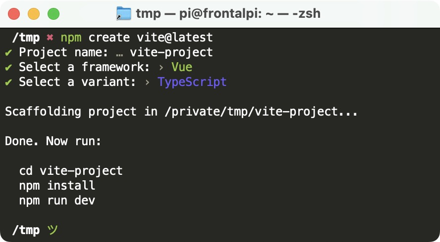
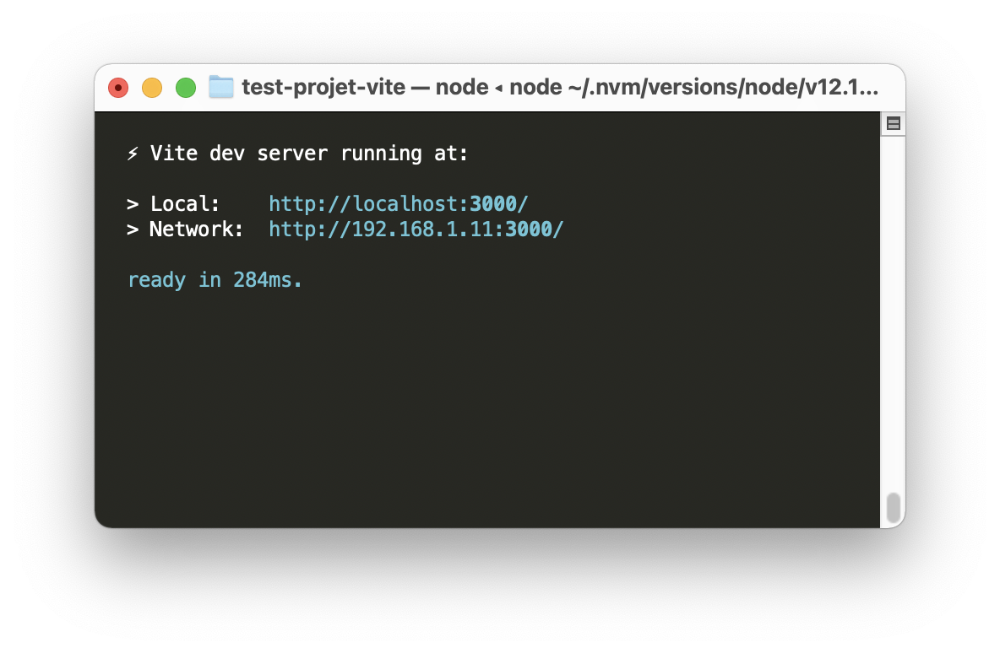

# Découverte de ViteJS

::: details Table des matières
[[toc]]
:::

## Introduction

ViteJS est une des nouvelles façons de créer un projet « moderne » avec VueJS (mais pas que). L'objectif est la création de projets « rapide » permettant au développeur de créer des projets avec une structure simple et moderne. Cette organisation repose sur quatre éléments :

- Un serveur web de développement qui utilise les modules EcmaScript intégrant un Hot Reload très rapide des ressources modifiées.
- Une commande de compilation, préconfigurée pour optimiser les ressources pour la production en utilisant [Rollup](https://rollupjs.org/) et non pas WebPack.
- Un système reposant sur des plug-ins permettant des projets personnalisés si besoin.
- Intègre nativement le support du [TypeScript](https://www.typescriptlang.org/)

L'ensemble du fonctionnement est détaillé sur [la documentation officielle](https://vitejs.dev/)

::: danger ViteJS est rapide oui…
Vite est très rapide… mais contrairement à `vue-cli`, `ViteJS` n'a pas pour objectif de faire du code compatible avec les vieux navigateurs (avant ES2015) ; dans la plupart des cas, ça ne pose vraiment aucun problème…

Cependant attention, si vous souhaitez supporter d'anciens navigateurs (au hasard IE11), `ViteJS` ne sera pas le bon outil.
:::

## Installation / Création du projet

Contrairement aux anciens outils fonctionnant avec VueJS, ViteJS ne nécessite rien d'autre que d'avoir sur votre ordinateur `NodeJS` (minimum 12) et `NPM`. Si c'est le cas pour vous, il vous suffit de saisir dans votre terminal :

```sh
npm create vite@latest
```

::: tip C'est interactif !
L'ensemble du processus est interactif ; il vous suffit donc de suivre les étapes pour créer un projet.

**Attention quand même**, le projet que vous allez créer sera situé dans le dossier courant.
:::



::: warning plusieurs choix !
Vous avez le choix du type de projet ; nous allons choisir **Vue** puis **Typescript**. Cette sélection du type de projet est la vraie force de ViteJS, grâce à son système de plug-in, ViteJS est complètement agnostique, il est donc complètement possible de faire autre chose que du VueJS (et ça, c'est cool).
:::

## Lancer le projet

Votre projet est maintenant « configuré » / « initialisé ». Pour la suite des opérations, il suffit de suivre ce qu'a indiqué votre ligne de commande à savoir :

```sh
cd vite-project
npm install
npm run dev
```

🚀 Et ça va vite ! Très vite. Attention les yeux 🚀



Vous pouvez tester la page dans [votre navigateur](http://127.0.0.1:5173/).

## Regardons la structure

Le projet que vous avez initialisé a une structure particulière que vous devez respecter :

- `index.html` : le point d'entrée de votre application. C'est lui qui charge le fichier `src/main.ts`.
- `src/main.ts` : le fichier qui initialise VueJS et « monte » l'application dans la page.
- `src/App.vue` : le composant racine de votre application.
- `src/components/` : le dossier qui contient vos composants.
- `src/assets/` : les ressources (images, CSS…) utilisées par vos composants.
- `public/` : les fichiers statiques servis tels quels (favicon…).
- `vite.config.ts` : la configuration de ViteJS.

Prenez quelques minutes pour ouvrir ces fichiers et regarder leur contenu.

## VueJS 2.0 -> VueJS 3.0

Entre VueJS 2.0 et VueJS 3.0, il y a quelques nuances, mais dans l'idée le fonctionnement d'un composant est très proche. Les composants VueJS peuvent maintenant fonctionner de deux façons différentes :

- « À l'ancienne » avec une déclaration des variables « d'état » dans la méthode `data(){return {}}`.
- Via l'API de `composition`. C'est-à-dire via des déclarations dans la méthode Setup. Cette méthode est en quelque sorte un mélange entre le `mounted()` et le `data()`. Vous allez pouvoir définir dedans les `variables réactives` mais également du code partagé définissant le comportement entre les composants (exemple surveillance du scroll de la souris)

::: tip Vous avez le choix
Les deux façons sont **toutes aussi valides l'une que l'autre**. C'est à vous de voir en fonction de vos préférences.
:::

### La nouveauté : la composition API

La composition API est une nouvelle façon de déclarer les variables d'état d'un composant. Cette déclaration est faite dans la méthode `setup()`. Le code de la méthode `setup()` est semblable à n'importe quelle méthode. Vous écrivez **votre code**, **votre logique** la seule subtilité est que vous allez devoir indiquer à VueJS les variables qu'il va devoir observer ainsi que des méthodes « à ajouter à l'instance ».

Cette déclaration sera aussi simple que d'écrire `ref()`. La fonction / méthode `ref()` prend un paramètre, celui-ci est la valeur d'initialisation de la variable.

Un exemple sera bien plus parlant :

```vue
<script setup lang="ts">
import { ref } from 'vue'

defineProps<{ msg: string }>()

// Déclaration d'une variable « observée » de type Int
const count = ref(0)

// Déclaration d'une variable « observée » de type String
const input = ref('Votre nom')
</script>
```

Étudions le code ci-dessus :

- La première ligne importe la fonction `ref()` de VueJS. Cette fonction permet de déclarer une variable réactive.
- La deuxième ligne permet de déclarer les propriétés du composant. C'est-à-dire les propriétés que vous allez pouvoir passer à votre composant. Dans notre exemple, nous avons déclaré une propriété `msg` de type `string`.
- La troisième ligne déclare une variable `count` de type `ref` (référence) de type `number` initialisée à `0`.
- La quatrième ligne déclare une variable `input` de type `ref` (référence) de type `string` initialisée à `Votre nom`.

::: tip Un instant
```<script setup lang="ts">``` ? Késako ? 

Ici nous utilisons la syntaxe recommandée de VueJS 3 (stable depuis la version 3.2). Elle permet de déclarer les variables d'état d'un composant de manière plus concise.

Nous indiquons à VueJS que nous souhaitons utiliser la syntaxe `setup` en indiquant `setup` dans la balise script.
:::

### Testons ensemble

Avant de continuer, nous allons tester ensemble ce que nous venons de voir. Pour cela, nous allons créer un nouveau composant `HelloWorld.vue` dans le dossier `src/components`.

```vue
<script setup lang="ts">
import { ref } from 'vue'

defineProps<{ msg: string }>()

// Déclaration d'une variable « observée » de type Int
const count = ref(0)

// Déclaration d'une variable « observée » de type String
const input = ref('Votre nom')
</script>

<template>
  <h1>{{ msg }}</h1>

  <div class="card">
    <button type="button" @click="count--">--</button>
    <button type="button">{{ count }}</button>
    <button type="button" @click="count++">++</button>
  </div>

  <div class="card">
    <h2>hello « {{ input }} »</h2>
    <input v-model="input" />
  </div>
</template>

<style scoped>
.card {
  background: #595959;
  border: 1px solid #ccc;
  border-radius: 2px;
  margin: 10px;
}
</style>
```

::: tip Un instant
Analysons le code ci-dessus :

- `script` : Déclarations des variables d'état et des propriétés du composant.
- `template` : Utilisation des variables d'état et des propriétés du composant. Ici nous écrivons du HTML + du code VueJS (comme les directives `v-model` ou le `@click`).
- `style` : Déclaration du style du composant. Le style est encapsulé dans le composant (il n'affecte que le composant) c'est possible grâce à la directive `scoped`.

:::

### La force ? Les plugins

La force de cette nouvelle façon de faire ? La possibilité d'installer des « plugins » / « extensions » nous permettant d'observer diverses valeurs de votre navigateur (la position de la souris, le thème sombre, etc.).

Par exemple l'excellent [vueuse](https://github.com/vueuse/vueuse)

#### L'installer

```bash
npm install @vueuse/core
```

#### L'utiliser

```typescript
<template>
  {{ x }}, {{ y }}
  <div v-if="isDark">Dark mode</div>
  <div v-else>Light mode</div>
</template>

<script setup lang="ts">
import { useMouse, usePreferredDark, useLocalStorage } from '@vueuse/core'

  // tracks mouse position
  const { x, y } = useMouse()

  // is user prefers dark theme
  const isDark = usePreferredDark()
</script>
```

::: tip Astuce de chef !
Rien de magique ! [vueuse](https://github.com/vueuse/vueuse) est « juste » un raccourci à ce que l'on peut faire en JavaScript.
:::

### C'est à vous de jouer

Je vous laisse tester et explorer les possibilités de cette nouvelle syntaxe. Vous pouvez également consulter la documentation officielle de VueJS 3.0. Pour ça, je vous propose de modifier le composant `HelloWorld.vue` pour utiliser l'une des options de VueUse.

::: tip À faire

- Ajouter du code « interactif » dans votre composant.
- Utiliser VueUse, et par exemple tracker la position de la souris en utilisant [vueuse](https://github.com/vueuse/vueuse)

:::

- **Attention**, vous ne devez pas oublier d'installer le plugin `vueuse` avec la commande `npm install @vueuse/core`.
- **Attention**, vous ne devez pas avoir plusieurs `script` dans votre composant.


<iframe src="https://giphy.com/embed/JIX9t2j0ZTN9S" width="480" height="480" frameBorder="0" class="giphy-embed" allowFullScreen></iframe>

## C'est du TypeScript

Contrairement à ce que nous avons vu précédemment la structure n'est pas en JavaScript. Celle-ci est en TypeScript, fondamentalement ça ne change pas grand-chose… La seule différence pour l'instant (pour ce qui nous intéresse) dans le fond, c'est qu'il est possible d'ajouter des types sur les données.

::: warning Des différences oui
Nous allons voir des différences oui… mais elles seront principalement dues au fait que nous migrons de VueJS 2.0 à VueJS 3.0.
:::

Le `TypeScript` est également activé grâce à la définition du langage `<script lang="ts">` dans la balise script du composant.

::: tip Pourquoi privilégier le TypeScript ?
Nous pourrions très bien utiliser uniquement le JavaScript même avec VueJS 3.0, mais je pense que nous sommes à un tournant du développement client où il est **impossible** de ne pas aborder le TypeScript. Le voir à travers un Framework comme VueJS est un très bon moyen de le voir.
:::

## Les variables computed

Comme dans VueJS2.0, nous avons des variables calculées. Elles sont déclarées dans le `setup` et seront recalculées à chaque fois que l'une des variables dépendantes sera modifiée.

Je vous laisse créer le composant `Author.vue` et y ajouter le code suivant :

```typescript
<script setup>
import { reactive, computed } from 'vue'

const author = reactive({
  name: 'John Doe',
  books: [
    'Vue 2 - Brosseau',
    'Vue 3 - Test',
    'Vue 4 - Démo'
  ]
})

const publishedBooksMessage = computed(() => {
  return author.books.length > 0 ? 'Yes' : 'No'
})
</script>

<template>
  <p>
    Auteur : {{author.name}}
  </p>
  
  <ul>
    <li v-for="book in author.books">{{ book }}</li>
  </ul>

  <p>
  Nombre de livres : <span>{{ publishedBooksMessage }}</span>
  </p>
</template>
```

::: tip Comment lire le code ?

- Nous avons déclaré une variable `author` qui est un objet. Nous avons déclaré cette variable avec la fonction `reactive` de VueJS. Pourquoi `reactive` ? Une variable `reactive` est comme une `ref`, mais dédiée aux objets.
- Nous avons déclaré une variable `publishedBooksMessage` qui est une variable calculée. Nous avons déclaré cette variable avec la fonction `computed` de VueJS. Cette variable sera recalculée à chaque fois que l'une des variables dépendantes sera modifiée.

:::

Je vous laisse mettre en place le code dans votre projet, insérer le composant dans `App.vue` et tester le code.

### Filtrer les données

Modifier le composant `Author.vue` pour ajouter un champ de recherche. Ce champ de recherche permettra de filtrer les livres de l'auteur.

Nous allons ajouter un champ de recherche dans le composant `Author.vue` :

```typescript
<script setup>
import { reactive, computed, ref } from 'vue'

const search = ref("");
  
const author = reactive({
  name: 'John Doe',
  books: [
    'Vue 2 - Cours Brosseau',
    'Vue 3 - Cours Test',
    'Vue 4 - Cours Démo'
  ]
})

const publishedBooksMessage = computed(() => {
  return filteredBooks.value.length
})

const filteredBooks = computed(() => {
  if(search.value != ""){
   return author.books.filter(it => it.includes(search.value));
  } else {
    return author.books;
  }
})
</script>

<template>
  <p>
    Auteur : {{author.name}}
  </p>
  
  <input type="text" v-model="search" placeholder="Rechercher un livre" />

  <ul>
    <li v-for="book in filteredBooks">{{ book }}</li>
  </ul>

  <p>
  Nombre de livres : <span>{{ publishedBooksMessage }}</span>
  </p>
</template>
```

::: tip Que constatez-vous ?

Plusieurs différences sont à noter par rapport au code précédent :

- Nous avons déclaré une variable `search` qui est une variable `ref`.
- Nous avons déclaré une variable `filteredBooks` qui est une variable calculée. Cette variable contient la liste des livres filtrés en fonction de la valeur de la variable `search` (qui est une `ref`).
- Nous avons modifié la variable `publishedBooksMessage` pour qu'elle retourne le nombre de livres filtrés. En se basant sur la variable `filteredBooks`.

:::

## Créer un composant au format « 2.0 » dans une structure « 3.0 »

Comme je l'indiquais précédemment… Vous n'êtes pas obligé d'utiliser l'API de composition pour créer un composant avec VueJS 3.0. Vous pouvez tout à fait écrire un composant « à l'ancienne » par exemple :

```vue
<template>
  <h1>Ceci est un composant</h1>
</template>

<script lang="ts">
import { defineComponent } from "vue";

export default defineComponent({
  data() {
    return {};
  },
});
</script>

<style scoped>
h1 {
  color: red;
}
</style>
```

En utilisant le template ☝️. Je vous laisse écrire un composant « à l'ancienne ». Celui-ci doit contenir :

- Un titre.
- Un bouton.
- L'action du bouton doit permettre d'incrémenter un compteur à chaque clic.
- Vous devez ranger le code dans un dossier `components` et le nommer `Test.vue`.
- Vous devez utiliser ce nouveau composant dans le fichier `App.vue`.

::: tip Rappel sur les actions
Pour ajouter une action sur un bouton, vous pouvez procéder de la manière suivante :

```html
<input type="button" @click="counter++" value="Click ici" />
```
:::

::: tip Rappel sur les composants

Pour utiliser un composant dans un autre composant, vous devez l'importer et l'ajouter dans la liste des composants.

```vue
<script setup lang="ts">
import Test from './components/Test.vue';
</script>

<template>
  <div>
    <Test />
  </div>
</template>
```

Comme toujours vous ne devez pas avoir plusieurs `script` dans un composant, ni plusieurs `template`. Je vous laisse donc modifier le composant `App.vue` pour utiliser le composant `Test.vue` en vous inspirant du code ci-dessus.

:::

## Et Vuetify ou VueBootstrap ?

C'est là que le bât blesse… Actuellement seule Vuetify est en version Next (c'est-à-dire compatible VueJS 3.0), pour BootstrapVue par contre pour l'instant celui-ci n'est pas compatible avec VueJS 3.0… Mais rien n'est impossible ! Bien au contraire !

Ce que nous n'avons pas de disponible c'est « Les jeux de composants », par contre, aucun problème pour installer / utiliser Bootstrap tel que nous le ferions dans un développement classique.

Je vous propose d'ailleurs de tester… Ajoutons Bootstrap dans notre projet.

::: danger La situation est particulière
Le texte que vous lisez a été écrit fin 2022, début 2023. Le monde du JS va très vite. Au moment où vous lisez ces lignes. VueBootstrap (ou autre) est peut-être maintenant disponible pour VueJS 3.0.
:::

### Installer bootstrap

Installer Bootstrap, ce n’est pas bien compliqué. Vous avez deux solutions :

- Utiliser le CDN.
- Installer la dépendance `npm`.

```sh
npm install bootstrap
```

::: tip Astuce d'ancien
Les deux formules sont valides. Je vous propose dans notre cas d'utiliser plutôt `npm`. Pourquoi ? Simplement, car notre projet n'aura comme ça pas de dépendance à Internet pour fonctionner.
:::

### Déclarer Bootstrap

Nous avons installé bootstrap ! Mais celui-ci n'est pas encore actif. Pour l'activer dans notre projet, il suffit… de l'importer ! Ajouter dans votre fichier `main.ts` la ligne suivante :

```ts
import "bootstrap/dist/css/bootstrap.css";
```

Et voilà. Votre projet inclut maintenant Bootstrap 🚀

### Utiliser Bootstrap

Pour l'utilisation de bootstrap il faut se référer à la documentation (vous le saviez déjà, mais je préfère le rappeler). Vu que nous n'avons pas de composant de disponible, je vous propose de créer les nôtres :

- Un composant `button`. (Avec comme `props` le `label` et la `color`)
- Un composant `card`.
- Un composant `navbar`.

Pour la `card` je vais vous aider, nous allons avoir besoin du système de [slot](https://v3.vuejs.org/guide/component-slots.html#slot-content) de VueJS. Notre composant va donc ressembler à :

`card.vue` :

```vue
<template>
  <div class="card">
    <div class="card-body">
      <!-- Notation particulière à VueJS -->
      <slot></slot>
    </div>
  </div>
</template>

<script setup lang="ts"></script>
```

::: tip Rappel sur les slots

Les slots sont des éléments qui permettent de passer du contenu à un composant. Le slot sera remplacé par le contenu passé au composant.

:::

`Utilisation` :

```vue
<template>
  <card> Contenu de ma Card </card>
</template>

<script setup lang="ts">
import Card from "./components/card.vue";
</script>
```

::: tip C'est à vous

Je vous laisse créer les 3 composants :

- Un composant `button`. (Avec comme `props` le `label` et la `color`)
- Un composant `card`.
- Un composant `navbar`.

**Attention** : Vous devez ranger le code dans un dossier `components`. Le nom du composant doit être le même que le nom du fichier.

Une fois que vous avez terminé, vous devez utiliser ces composants dans le fichier `App.vue`.
:::

Rappel sur les `props` :

```vue
<template>
  <button :class="color"> {{ label }} </button>
</template>

<script setup lang="ts">
const props = defineProps({
  label: {
    type: String,
    required: true,
  },
  color: {
    type: String,
    required: true,
  },
});
</script>
```

## Conclusion

Dans ce TP nous avons vu comment créer un projet VueJS 3.0. Nous avons également vu comment créer un composant possédant des props. Bien que VueBootstrap ne soit pas encore disponible pour VueJS 3.0, nous avons pu voir comment utiliser Bootstrap dans notre projet.

## Ressources

- [VueJS 3.0](https://v3.vuejs.org/)
- [Bootstrap](https://getbootstrap.com/)
- [Vuetify](https://vuetifyjs.com/en/)
- [VueBootstrap](https://bootstrap-vue.org/)
